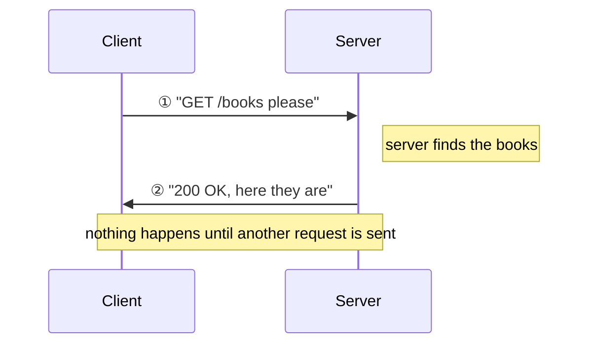

# Chapter 2: Speaking HTTP

> ⏱ Estimated time: 50 minutes

## What You'll Learn

- What HTTP is and why it exists
- The anatomy of an HTTP request and response
- The meaning of HTTP methods (GET, POST, PUT, DELETE)
- What status codes mean (200, 404, 500, etc.)
- How to use `curl` to send real HTTP requests from your terminal

---

## Concepts

### What Is HTTP?

In Chapter 1, we said clients and servers talk to each other. But *how*? They need a shared language — a set of rules about how to format messages, what words to use, and what each word means.

That language is **HTTP** — **HyperText Transfer Protocol**.

Let's break that name down:
- **HyperText** — originally, the web was about documents ("text") that linked to each other ("hyper"). Those links are what made the web a "web."
- **Transfer** — moving something from one place to another. HTTP moves data between a client and a server.
- **Protocol** — a set of rules both sides agree to follow. Just like two people speaking the same language, the client and server must agree on the format of their messages, or they can't understand each other.

So HTTP is literally: *the rules for transferring data on the web*.

**Analogy**: Imagine you're writing a formal letter. There are conventions: you put the date at the top, then the recipient's address, then "Dear [Name]," then the body, then "Sincerely, [Your Name]." You don't *have* to follow these conventions, but if you don't, the post office might not deliver it, or the recipient might not understand it. HTTP is the same — it's the agreed-upon format for web communication.

#### Why Does HTTP Exist?

Before HTTP, there was no standard way for computers to request web pages from each other. Imagine if every website spoke a different language — your browser would need a translator for every site. HTTP solved this by defining **one universal format** that every web client and every web server speaks.

This is why it works everywhere: a browser on your phone, a `curl` command on your laptop, a Python script on a server — they can all talk to the same web server because they all speak HTTP.

#### HTTP vs HTTPS — What's the "S"?

You've probably noticed some URLs start with `http://` and others with `https://`. The "S" stands for **Secure**.

- **HTTP**: Messages are sent as plain text. Anyone sitting between the client and server (like someone on the same Wi-Fi network) could potentially read them.
- **HTTPS**: Messages are **encrypted** using TLS (Transport Layer Security). Even if someone intercepts the data, they can't read it — it looks like random gibberish.

```mermaid
flowchart LR
    subgraph HTTP
        A1[Client] -- "\"password=secret123\"" --> B1[Server]
    end
    subgraph HTTPS
        A2[Client] -- "\"a7f2x9k3m...\" (encrypted)" --> B2[Server]
    end

    style HTTP fill:#fee,stroke:#c00
    style HTTPS fill:#efe,stroke:#0a0
```

Today, virtually all websites use HTTPS. When you build your Spring Boot app, you'll start with HTTP on `localhost` (which is fine — you're talking to yourself), but any real deployment should use HTTPS.

> HTTP was invented in 1991 by Tim Berners-Lee at CERN. It's been upgraded several times (HTTP/1.0, HTTP/1.1, HTTP/2, HTTP/3), but the core concepts haven't changed. Every version still follows the same request-response pattern you'll learn in this chapter.

### The Request-Response Pattern

HTTP is built entirely on **request-response**:

1. The client sends an **HTTP request** — a structured message that says "I want something"
2. The server reads the request, does some work, and sends back an **HTTP response**
3. Done. The conversation is over. Connection can close.



The server **never sends a message first**. It always waits for a request. This is a fundamental rule. Even if the server has exciting new data to share, it keeps quiet until a client asks.

> **Why this matters**: When you write your Spring Boot application, you'll write code that handles *incoming* requests. You never write code that reaches out to a client unprompted. Your code sits there waiting, a request arrives, your code runs, it sends a response, and it goes back to waiting.

### Anatomy of an HTTP Request

Every HTTP request has this structure:

```
[METHOD] [PATH] HTTP/[VERSION]
[Header-1]: [Value-1]
[Header-2]: [Value-2]
...
(empty line)
[Body (optional)]
```

Here's a real example:

```http
GET /books?genre=fiction HTTP/1.1
Host: www.bookshelf.com
Accept: application/json
User-Agent: Mozilla/5.0
```

Let's break down each part:

#### 1. The Request Line

```
GET /books?genre=fiction HTTP/1.1
│    │     │              │
│    │     │              └── Protocol version
│    │     └── Query parameter (filtering)
│    └── Path (which resource)
└── Method (what action)
```

#### 2. Headers

Headers are **metadata** about the request — extra information that helps the server understand what the client wants. They always come in `Name: Value` pairs, one per line.

```
Host: www.bookshelf.com        ← Which server this is for
Accept: application/json       ← "I want JSON back, not HTML"
Content-Type: application/json ← "The data I'm sending is JSON"
Authorization: Bearer abc123   ← "Here are my credentials"
User-Agent: Mozilla/5.0        ← "I'm a browser"
```

Think of headers like the envelope of a letter — they contain routing and handling instructions, not the actual message.

**Common headers explained:**

| Header | What it tells the server | Analogy |
|--------|--------------------------|---------|
| `Host` | Which website you're trying to reach | The "To" address on an envelope |
| `Content-Type` | The format of the data you're *sending* | "This package contains glass — handle accordingly" |
| `Accept` | The format you *want back* | "Please reply in English, not French" |
| `Authorization` | Who you are (your credentials) | Showing your ID at the door |
| `User-Agent` | What kind of client you are | "I'm calling from a cell phone, not a landline" |

You don't need to memorize all headers — there are dozens. These five are the ones you'll encounter most when building APIs.

#### 3. Body (Optional)

The body contains data the client is sending to the server. Not all requests have a body. Notice that the body is separated from the headers by **one empty line** — this is how the server knows where headers end and data begins.

```http
POST /books HTTP/1.1           ← Request line
Host: www.bookshelf.com        ← Header
Content-Type: application/json ← Header
                               ← Empty line (REQUIRED — separates headers from body)
{                              ← Body starts here
    "title": "Clean Code",
    "author": "Robert Martin",
    "pages": 464
}
```

A `GET` request typically has **no body** (you're asking for data, not sending it).  
A `POST` request typically **has a body** (you're sending data to create something).

**Analogy**: Think of it like ordering food vs. sending a gift. When you order food (GET), you just say what you want — no package needed. When you send a gift (POST), you need to include the actual item in the box.

### HTTP Methods: What Do You Want to Do?

HTTP defines several **methods** (also called "verbs") that describe the *intent* of the request:

| Method | Purpose | Analogy | Has Body? |
|--------|---------|---------|-----------|
| `GET` | Retrieve data | "Show me..." | No |
| `POST` | Create something new | "Here's a new..." | Yes |
| `PUT` | Update something (replace entirely) | "Replace this with..." | Yes |
| `PATCH` | Update something (modify partially) | "Change just this field..." | Yes |
| `DELETE` | Remove something | "Delete this..." | Rarely |

Let's look at each one in more detail:

- **GET** — The most common method. It says "give me this data." GET is **safe** — calling it doesn't change anything on the server. You can call `GET /books` a thousand times and nothing changes. It's read-only.

- **POST** — Means "create something new." You send data in the body, and the server creates a new resource from it. Calling `POST /books` ten times creates ten books. Each call has a side effect.

- **PUT** — Means "replace this entirely." You send the *complete* new version. If a book has title, author, and pages, and you PUT with only title and author, pages gets erased. PUT is like rewriting a whole document.

- **PATCH** — Means "change just these specific fields." If you only want to update the title, you send `{"title": "New Title"}` and everything else stays the same. PATCH is like using correction fluid on one word.

- **DELETE** — Means "remove this." Simple. Usually no body needed — the path tells the server what to delete.

> **GET vs POST — The Big Distinction**: GET is for *reading*. POST is for *writing*. If an operation changes data on the server, it should never be a GET. This isn't just a convention — browsers, caches, and proxies all assume GET is safe to repeat or cache.

**This maps perfectly to database operations (CRUD):**

| CRUD Operation | HTTP Method |
|----------------|-------------|
| **C**reate | POST |
| **R**ead | GET |
| **U**pdate | PUT / PATCH |
| **D**elete | DELETE |

#### Examples in Context

Imagine a bookstore API:

```
GET    /books          → Get all books
GET    /books/42       → Get book with ID 42
POST   /books          → Create a new book (data in body)
PUT    /books/42       → Replace book 42 with new data (data in body)
PATCH  /books/42       → Update some fields of book 42 (data in body)
DELETE /books/42       → Delete book 42
```

> 🧠 **Think Like a Backend Engineer**: When you design your API, you're deciding which methods and paths to support. `GET /books` means something different from `POST /books` even though the path is the same — the method changes the meaning entirely.

### Anatomy of an HTTP Response

The server's response has a similar structure:

```
HTTP/[VERSION] [STATUS CODE] [STATUS TEXT]
[Header-1]: [Value-1]
[Header-2]: [Value-2]
...
(empty line)
[Body]
```

Real example:

```http
HTTP/1.1 200 OK
Content-Type: application/json
Content-Length: 82

{
    "id": 42,
    "title": "Clean Code",
    "author": "Robert Martin",
    "pages": 464
}
```

### Status Codes: How Did It Go?

The status code is a three-digit number that tells the client what happened. You don't need to memorize all of them, but understanding the categories is essential:

| Range | Category | Meaning |
|-------|----------|---------|
| **1xx** | Informational | "Hold on, still processing..." (rare, you'll almost never use these) |
| **2xx** | Success | "It worked!" |
| **3xx** | Redirection | "Go look somewhere else" |
| **4xx** | Client Error | "You did something wrong" |
| **5xx** | Server Error | "I (the server) broke" |

#### The Ones You'll Use Daily

| Code | Name | When to Use |
|------|------|-------------|
| **200** | OK | Request succeeded. Here's the data. |
| **201** | Created | A new resource was created successfully. |
| **204** | No Content | Success, but nothing to send back (common for DELETE). |
| **400** | Bad Request | The client sent invalid data (missing fields, wrong format). |
| **401** | Unauthorized | "Who are you? Please log in." |
| **403** | Forbidden | "I know who you are, but you're not allowed to do this." |
| **404** | Not Found | "That resource doesn't exist." |
| **405** | Method Not Allowed | "This endpoint exists, but not for that HTTP method." |
| **500** | Internal Server Error | "Something broke on my end. Not your fault." |

**Analogy**: Status codes are like the response you get at a restaurant:
- 200: "Here's your food" ✅
- 201: "We created a new reservation for you" ✅
- 400: "We can't make that — you ordered something that doesn't exist on the menu" ❌
- 401: "Can I see your reservation?" (you need to identify yourself) ❌
- 403: "That table is reserved for VIPs only" ❌
- 404: "That table number doesn't exist in this restaurant" ❌
- 500: "Sorry, the kitchen is on fire" 🔥

> 🧠 **Think Like a Backend Engineer**: Every endpoint in your API should return the *right* status code. Don't return 200 when something failed. Don't return 404 when the request was just malformed (that's 400). The status code is part of your API's contract.

### URLs, URIs, and Paths

You've seen URLs your whole life, but let's break one down:

```
https://www.bookshelf.com:443/books/42?format=summary#reviews
│       │                  │   │       │              │
│       │                  │   │       │              └── Fragment (browser-only)
│       │                  │   │       └── Query string (parameters)
│       │                  │   └── Path (which resource)
│       │                  └── Port (443 is default for HTTPS)
│       └── Host (domain name)
└── Scheme/Protocol (HTTP or HTTPS)
```

As a backend developer, you care most about:
- **Path**: `/books/42` — which resource is being requested
- **Query parameters**: `?format=summary` — additional options/filters
- **Method**: combined with the path, this defines the operation

The scheme, host, and port are handled by the infrastructure — you just write the code that responds to paths.

### HTTP Is Stateless

This is a crucial concept: **HTTP has no memory**.

Each request is completely independent. The server doesn't remember your previous request. Every request must contain *all* the information the server needs to process it.

**Analogy**: Imagine a restaurant where the waiter has amnesia. Every time you call them over, you have to re-introduce yourself and re-state your entire order history. "Hi, I'm table 5, I already ordered a salad, and now I'd like a coffee."

```
Request 1: "GET /cart"  +  "I am user Alice (token: abc123)"
  → Server looks up Alice's cart, returns it

Request 2: "POST /cart/add"  +  "I am user Alice (token: abc123)"
  → Server has NO memory of Request 1
  → It reads the token, recognizes Alice, and processes the request

Without the token in Request 2, the server would say:
  "401 Unauthorized — who are you?"
```

This seems inefficient, but it's actually powerful — it means any server can handle any request. You don't need to go back to the *same* server every time. This is how websites handle millions of users: they have many servers, and it doesn't matter which one handles your request.

> **How do websites "remember" you then?** Through tokens or cookies — small pieces of data the client sends with every request that say "I am user X, I already logged in." The client is responsible for storing and re-sending this token. The server just validates it. We'll cover this in Chapter 18 (Security).

### Putting It All Together — A Complete HTTP Conversation

Let's trace a full HTTP conversation to make sure everything clicks. You want to add a book to a bookshelf API:

```
1. You (the client) construct a request:

   POST /books HTTP/1.1                    ← Method + Path + Version
   Host: www.bookshelf.com                 ← Header: which server
   Content-Type: application/json          ← Header: I'm sending JSON
   Authorization: Bearer my-token-123      ← Header: who I am
                                           ← Empty line: end of headers
   {"title": "Clean Code", "pages": 464}   ← Body: the actual data

2. This request travels over the internet to the server.

3. The server reads it and understands:
   - Method is POST → client wants to CREATE something
   - Path is /books → the "books" resource
   - Content-Type is JSON → parse the body as JSON
   - Authorization token is valid → this user is allowed

4. The server creates the book in its database and responds:

   HTTP/1.1 201 Created                    ← Status: it worked, something was created
   Content-Type: application/json          ← Header: I'm sending JSON back
   Location: /books/43                     ← Header: here's where the new book lives
                                           ← Empty line
   {"id": 43, "title": "Clean Code", "pages": 464}  ← Body: the created book with its new ID

5. Your client receives this and knows:
   - 201 = success, a new resource was created
   - The new book has ID 43
   - Done. Connection can close.
```

This is the conversation your Spring Boot code will participate in. You'll write the code for step 3 — receiving the request, doing the work, and constructing the response.

---

## Code Examples

### Seeing Real HTTP with curl

`curl` is a command-line tool for sending HTTP requests. It lets you act as a client and talk to any server, right from your terminal — no browser needed.

#### Installing / Finding curl on Your System

| OS | Status | How to Open a Terminal |
|----|--------|-----------------------|
| **macOS** | ✅ Pre-installed | Open **Terminal** (search for it in Spotlight with `Cmd + Space`) |
| **Linux** | ✅ Pre-installed on most distributions | Open your distro's terminal application |
| **Windows 10/11** | ✅ Pre-installed (ships with Windows since 2018) | Open **PowerShell** or **Command Prompt** (search for "PowerShell" in the Start menu) |
| **Older Windows** | ❌ Not included | Install [Git for Windows](https://gitforwindows.org/) — it includes `curl` and a "Git Bash" terminal |

Verify it works by typing:

```bash
curl --version
```

You should see output like `curl 7.x.x` or `curl 8.x.x` with a list of supported protocols. If you see an error, curl isn't installed — follow the table above.

> ⚠️ **Windows users — important differences:**
>
> Windows PowerShell and Command Prompt handle quotes differently from macOS/Linux terminals. Throughout this guide, code examples use **single quotes** (`'...'`) around JSON data, which works on macOS and Linux. On Windows, you have two options:
>
> **Option A — Use Git Bash (Recommended):** Install [Git for Windows](https://gitforwindows.org/) and use the included "Git Bash" terminal. All examples in this guide will work exactly as written.
>
> **Option B — Use PowerShell with double quotes:** Replace single quotes with double quotes and escape the inner double quotes with backslashes:
>
> ```powershell
> # macOS / Linux / Git Bash:
> curl -X POST https://example.com/api -d '{"title": "My Book"}'
>
> # Windows PowerShell:
> curl -X POST https://example.com/api -d "{\"title\": \"My Book\"}"
> ```
>
> **Option C — Use PowerShell with a file:** Put the JSON in a file and reference it:
>
> ```powershell
> # Save JSON to a file
> echo '{"title": "My Book"}' > data.json
>
> # Reference the file with @
> curl -X POST https://example.com/api -H "Content-Type: application/json" -d @data.json
> ```
>
> We recommend **Git Bash** for following this guide. It gives you a Linux-like terminal on Windows, so every example works without modification.

Open your terminal and try these:

#### 1. Simple GET request

```bash
curl https://jsonplaceholder.typicode.com/posts/1
```

This sends a `GET` request and shows the response body. You'll see JSON data about a blog post.

#### 2. See the full HTTP conversation

```bash
curl -v https://jsonplaceholder.typicode.com/posts/1
```

The `-v` flag (verbose) shows everything — the request headers, the response headers, the status code. Look for:
- `> GET /posts/1 HTTP/2` — the request line
- `< HTTP/2 200` — the status code
- The JSON body at the bottom

#### 3. Send a POST request with data

```bash
curl -X POST https://jsonplaceholder.typicode.com/posts \
  -H "Content-Type: application/json" \
  -d '{"title": "My Post", "body": "Hello world", "userId": 1}'
```

Breaking this down:
- `-X POST` — use the POST method
- `-H "Content-Type: application/json"` — set a header telling the server we're sending JSON
- `-d '{...}'` — the request body (the data we're sending)

The server will respond with `201 Created` and echo back the data with an assigned ID.

#### 4. See only the response headers

```bash
curl -I https://jsonplaceholder.typicode.com/posts/1
```

The `-I` flag shows just the headers, not the body. Notice `Content-Type`, `Content-Length`, etc.

#### 5. Try a 404

```bash
curl -v https://jsonplaceholder.typicode.com/posts/99999
```

This asks for a post that doesn't exist. Look for `404` in the response.

### Reading curl Output

When you use `-v`, curl marks lines with:
- `>` — data your computer **sent** (the request)
- `<` — data the server **sent back** (the response)
- `*` — curl's own informational messages

```
* Connecting to jsonplaceholder.typicode.com...
> GET /posts/1 HTTP/2          ← YOUR REQUEST
> Host: jsonplaceholder.typicode.com
> Accept: */*
>
< HTTP/2 200                   ← SERVER'S RESPONSE
< content-type: application/json
< content-length: 292
<
{                              ← RESPONSE BODY
  "userId": 1,
  "id": 1,
  "title": "sunt aut facere...",
  "body": "quia et suscipit..."
}
```

---

## Exercise: Explore HTTP in the Wild

**Goal**: Build intuition for HTTP by sending real requests and examining the responses.

### Part 1: Reading Responses

Using `curl -v`, send GET requests to these URLs and answer the questions:

1. `https://jsonplaceholder.typicode.com/users` — What status code do you get? What kind of data comes back?

2. `https://jsonplaceholder.typicode.com/users/1` — How is this response different from the previous one? (Hint: list vs. single item)

3. `https://jsonplaceholder.typicode.com/users/9999` — What status code do you get? What's in the body?

### Part 2: Sending Data

4. Send a POST request to create a new user:

**macOS / Linux / Git Bash:**
```bash
curl -X POST https://jsonplaceholder.typicode.com/posts \
  -H "Content-Type: application/json" \
  -d '{"title": "Learning HTTP", "body": "This is my first POST request!", "userId": 1}'
```

**Windows PowerShell:**
```powershell
curl -X POST https://jsonplaceholder.typicode.com/posts `
  -H "Content-Type: application/json" `
  -d "{`\"title`\": `\"Learning HTTP`\", `\"body`\": `\"This is my first POST request!`\", `\"userId`\": 1}"
```

What status code do you get? What's different about a 201 vs a 200?

### Part 3: Other Methods

5. Send a PUT request to update post #1:

**macOS / Linux / Git Bash:**
```bash
curl -X PUT https://jsonplaceholder.typicode.com/posts/1 \
  -H "Content-Type: application/json" \
  -d '{"id": 1, "title": "Updated Title", "body": "Updated body", "userId": 1}'
```

**Windows PowerShell:**
```powershell
curl -X PUT https://jsonplaceholder.typicode.com/posts/1 `
  -H "Content-Type: application/json" `
  -d "{`\"id`\": 1, `\"title`\": `\"Updated Title`\", `\"body`\": `\"Updated body`\", `\"userId`\": 1}"
```

6. Send a DELETE request:
```bash
curl -X DELETE https://jsonplaceholder.typicode.com/posts/1
```

(This command works the same on all platforms — no quotes needed.)

What status code does DELETE return? Is there a response body?

### Part 4: Reflection

Write down (in your own words):
- What is the difference between GET and POST?
- Why does POST need a body but GET doesn't?
- What's the difference between a 400 error and a 500 error?

---

## Common Mistakes

| Mistake | Reality |
|---------|---------|
| "GET and POST are basically the same" | They have fundamentally different purposes. GET retrieves data (read-only, safe, cacheable). POST creates data (has side effects, not cacheable). |
| "Status codes don't matter, I'll just return 200 for everything" | Status codes are part of your API contract. Clients rely on them to handle responses correctly. A mobile app needs to know if it got a 401 (show login screen) vs 500 (show error message). |
| "Headers are optional fluff" | Headers carry critical information. `Content-Type` tells the server how to parse the body. `Authorization` carries credentials. Without headers, the server can't understand your request. |
| "HTTP keeps a connection open between requests" | HTTP is stateless. Each request is independent. (HTTP/1.1 does reuse TCP connections for performance, but logically each request is self-contained.) |

---

### 📝 Practice Exercises

Ready to test your understanding? These exercises from [Appendix E](../appendices/E-coding-exercises.md) directly apply what you learned in this chapter:

| Exercise | Topic | Difficulty |
|----------|-------|------------|
| [Exercise 1](../appendices/E-coding-exercises.md#exercise-1) | Exploring HTTP with curl | ⭐ |
| [Exercise 4](../appendices/E-coding-exercises.md#exercise-4) | Match HTTP Methods to CRUD | ⭐ |
| [Exercise 6](../appendices/E-coding-exercises.md#exercise-6) | Decode a curl Command | ⭐ |

Solutions are in [Appendix F](../appendices/F-exercise-solutions.md).

---

## Key Takeaways

- [ ] I understand that HTTP is the protocol (shared language) that clients and servers use
- [ ] I can identify the parts of an HTTP request: method, path, headers, body
- [ ] I know the main HTTP methods: GET (read), POST (create), PUT (update), DELETE (remove)
- [ ] I understand status code categories: 2xx (success), 4xx (client error), 5xx (server error)
- [ ] I can use `curl` to send HTTP requests and read the responses
- [ ] I understand that HTTP is stateless — each request is independent

---

## Quick Quiz

1. You want to fetch a user's profile. Which HTTP method do you use?
2. You want to create a new blog post. Which method? Does the request need a body?
3. Your request gets back a `403`. What went wrong? Is it your fault or the server's?
4. What's the difference between `404` and `400`?
5. Why does the `Content-Type: application/json` header matter when sending a POST request?

---

*Next: `03-what-is-a-backend.md` — Now that you know how the web works, let's understand where your code fits in →*
