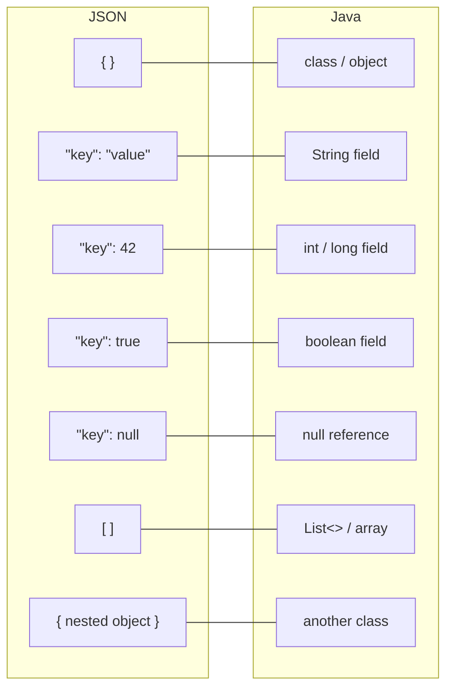
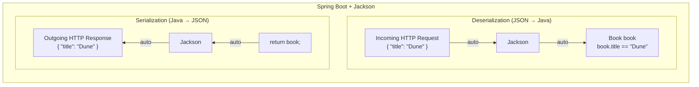

# Chapter 4: JSON and REST APIs

> ⏱ Estimated time: 70 minutes

## What You'll Learn

- What JSON is and why it's the universal data format for APIs
- JSON syntax rules and how it maps to Java objects
- What REST means and its core principles
- How to design clean API endpoints
- The difference between an API and a website

---

## Concepts

### The Problem: How Do You Send Data Over the Internet?

In Java, you work with objects:

```java
Book book = new Book("Dune", "Frank Herbert", 412);
```

But HTTP only transmits **text**. You can't send a Java object over the wire. You need a text format that both the sender and receiver understand.

That format is **JSON**.

### What Is JSON?

> **Quick Summary — JSON**
> JSON is a lightweight text format for transmitting data. It uses curly braces for
> objects, square brackets for arrays, and double-quoted strings for keys. Every
> modern language can read and write it, and Spring Boot converts between JSON and
> Java objects automatically via a library called Jackson.

**JSON** stands for **JavaScript Object Notation**. Despite the name, it has nothing to do with JavaScript for our purposes — it's just a text format that every programming language can read and write.

#### Why Not XML or Plain Text?

Before JSON became the standard, people used other formats. Here's the same book data represented three ways so you can see why JSON won:

**Plain text (no structure):**
```
Dune, Frank Herbert, 412 pages, available
```
Problems: How do you know which field is which? What if a title contains a comma? There's no standard way to parse this — every developer invents their own format.

**XML (verbose, structured):**
```xml
<book>
    <title>Dune</title>
    <author>Frank Herbert</author>
    <pages>412</pages>
    <available>true</available>
</book>
```
Problems: Every value needs an opening and closing tag. The same data is almost twice as many characters. Reading and writing XML parsers is painful. Attributes vs elements is a never-ending debate.

**JSON (compact, structured):**
```json
{
    "title": "Dune",
    "author": "Frank Herbert",
    "pages": 412,
    "available": true
}
```
JSON hits the sweet spot: it has clear structure (so machines can parse it), it's compact (less bandwidth over the network), and it's easy for humans to read and write. That's why virtually every modern API uses JSON.

JSON represents data as key-value pairs:

```json
{
    "title": "Dune",
    "author": "Frank Herbert",
    "pages": 412,
    "available": true
}
```

That's it. Curly braces, keys in quotes, values after colons, commas between pairs.

### JSON Syntax Rules

#### Data Types

JSON supports exactly these types:

| Type | Example | Java Equivalent |
|------|---------|-----------------|
| String | `"hello"` | `String` |
| Number | `42`, `3.14` | `int`, `double` |
| Boolean | `true`, `false` | `boolean` |
| Null | `null` | `null` |
| Object | `{ "key": "value" }` | A class/object |
| Array | `[1, 2, 3]` | `List` / array |

#### Objects (Curly Braces)

An object is a collection of key-value pairs:

```json
{
    "name": "Alice",
    "age": 30,
    "isStudent": false
}
```

Rules:
- Keys **must** be strings (in double quotes)
- Use double quotes `"`, not single quotes `'`
- No trailing comma after the last pair

#### Arrays (Square Brackets)

An array is an ordered list:

```json
["fiction", "science", "history"]
```

Arrays can contain any type, including other objects:

```json
[
    { "title": "Dune", "pages": 412 },
    { "title": "1984", "pages": 328 }
]
```

#### Nesting

Objects and arrays can nest inside each other:

```json
{
    "name": "Frank Herbert",
    "born": 1920,
    "books": [
        {
            "title": "Dune",
            "year": 1965,
            "genres": ["science fiction", "adventure"]
        },
        {
            "title": "Dune Messiah",
            "year": 1969,
            "genres": ["science fiction"]
        }
    ],
    "awards": {
        "hugo": true,
        "nebula": true
    }
}
```

#### Common JSON Mistakes

These are the errors that trip up every beginner. Learn to spot them now and you'll save yourself hours of debugging later.

**1. Trailing comma after the last item:**

```
INVALID                              VALID
─────────────────────────────────    ─────────────────────────────────
{                                    {
    "name": "Alice",                     "name": "Alice",
    "age": 30,   ← trailing comma       "age": 30     ← no comma
}                                    }
```

**2. Single quotes instead of double quotes:**

```
INVALID                              VALID
─────────────────────────────────    ─────────────────────────────────
{                                    {
    'name': 'Alice'                      "name": "Alice"
}                                    }
```
JSON requires double quotes `"` everywhere. Single quotes `'` are not valid JSON, even though they work in JavaScript and Python.

**3. Unquoted keys:**

```
INVALID                              VALID
─────────────────────────────────    ─────────────────────────────────
{                                    {
    name: "Alice",                       "name": "Alice",
    age: 30                              "age": 30
}                                    }
```
Every key must be a double-quoted string. This looks like JavaScript shorthand, but JSON does not allow it.

**4. Comments in JSON:**

```
INVALID                              VALID
─────────────────────────────────    ─────────────────────────────────
{                                    {
    // user's name                       "name": "Alice"
    "name": "Alice"                  }
}
```
JSON has no comment syntax at all — no `//`, no `/* */`, no `#`. If you need to annotate your data, use a descriptive key name or keep notes in a separate file.

**5. Using undefined or NaN:**

```
INVALID                              VALID
─────────────────────────────────    ─────────────────────────────────
{                                    {
    "name": undefined,                   "name": null,
    "score": NaN                         "score": 0
}                                    }
```
JSON only supports `null` for missing values. There is no `undefined`, `NaN`, or `Infinity` — those are JavaScript concepts, not JSON.

### JSON ↔ Java Mapping

This is the mental model that will save you hours:



Spring Boot converts between JSON and Java objects **automatically**. You write Java classes, and Spring Boot handles the translation. This is called **serialization** (Java → JSON) and **deserialization** (JSON → Java).

#### How Spring Boot Converts Automatically

Under the hood, Spring Boot uses a library called **Jackson** to handle all JSON conversion. When a request comes in with a JSON body, Jackson reads the JSON text and creates a Java object from it (deserialization). When your code returns a Java object, Jackson converts it to JSON text for the HTTP response (serialization).

The key point: **you never call a parse method yourself.** If you've used other languages, you might expect to write something like `JSON.parse(text)` or `objectMapper.readValue(...)`. With Spring Boot, you don't. You just write a normal Java class with fields that match the JSON keys, and Spring Boot + Jackson handle the rest. You'll see this in action when you build your first controller in Day 3.



### What Is an API?

**API** stands for **Application Programming Interface**. It's a contract that says:

> "If you send me a request in *this* format, I'll send you a response in *that* format."

Think of it as a menu at a restaurant:
- The menu lists what you can order (endpoints)
- Each item has a name and description (path and method)
- You order using the menu's format (request body)
- You get back what's described (response body)

An API is NOT a visual interface. There's no HTML, no web page, no buttons. It's data in, data out.

### REST: A Way to Design APIs

> **Quick Summary — REST**
> REST is a set of conventions, not a technology. Resources (nouns) get URLs, HTTP
> methods (GET, POST, PUT, DELETE) express actions, and standard status codes tell
> the client what happened. Responses are JSON. The server is stateless — each
> request stands on its own.

**REST** stands for **Representational State Transfer**. It's a set of conventions for designing APIs that make them predictable and easy to use.

REST isn't a technology or a library — it's a style. An opinion on how things should be organized.

#### What Does a Non-REST API Look Like?

Before learning the REST rules, it helps to see what a *bad* API looks like so you understand what REST is fixing. Here's an RPC-style API where every endpoint is a POST and the action is stuffed into the URL:

```
Non-REST (RPC-style) API:
─────────────────────────────────────────────────────────────
POST /api/createUser         body: { "name": "Alice" }
POST /api/getUserById        body: { "id": 42 }
POST /api/updateUserEmail    body: { "id": 42, "email": "a@b.com" }
POST /api/deleteUser         body: { "id": 42 }
POST /api/getAllUsers         body: (empty)
POST /api/searchUsersByName  body: { "name": "Ali" }
```

Problems with this approach:
- Everything is POST, so you can't tell at a glance if a request reads or writes data
- The action is a verb in the URL, so every new operation needs a new URL
- There's no consistency — is it `getUser` or `fetchUser` or `retrieveUser`?
- Caching doesn't work (caches only cache GET requests)

Now here's the same API redesigned as REST:

```
REST API (same functionality):
─────────────────────────────────────────────────────────────
POST   /api/users            body: { "name": "Alice" }
GET    /api/users/42         (no body needed)
PUT    /api/users/42         body: { "email": "a@b.com" }
DELETE /api/users/42         (no body needed)
GET    /api/users            (no body needed)
GET    /api/users?name=Ali   (no body needed)
```

Same six operations, but now the URL is always a noun (the resource) and the HTTP method is the verb (the action). Much cleaner.

#### The Core Ideas of REST

**1. Everything is a Resource**

A "resource" is any thing your API manages: a book, a user, an order, a comment.

Each resource has a URL:
```
/api/books       → the collection of all books
/api/books/42    → a specific book (ID 42)
/api/authors     → the collection of all authors
/api/authors/7   → a specific author (ID 7)
```

**2. Use HTTP Methods for Actions**

Don't put verbs in your URLs. Use HTTP methods instead:

```
WRONG (verb in URL):
  GET  /api/getBooks
  POST /api/createBook
  POST /api/deleteBook/42

RIGHT (HTTP methods express the action):
  GET    /api/books          → get all books
  POST   /api/books          → create a book
  GET    /api/books/42       → get one book
  PUT    /api/books/42       → update a book
  DELETE /api/books/42       → delete a book
```

**3. Use Standard Status Codes**

```
200 OK         → successful GET/PUT
201 Created    → successful POST (something was created)
204 No Content → successful DELETE
400 Bad Request → client sent invalid data
404 Not Found   → resource doesn't exist
500 Internal Server Error → server broke
```

**4. Stateless**

Each request contains all the information needed. The server doesn't remember previous requests.

**5. Use JSON for Data**

Request and response bodies are JSON.

#### A Complete REST API Design

Here's a full REST API for books:

| Action | Method | Path | Request Body | Response Body | Status |
|--------|--------|------|-------------|---------------|--------|
| List all books | GET | `/api/books` | — | Array of books | 200 |
| Get one book | GET | `/api/books/{id}` | — | One book | 200 / 404 |
| Create a book | POST | `/api/books` | Book data | Created book (with ID) | 201 |
| Update a book | PUT | `/api/books/{id}` | Full book data | Updated book | 200 / 404 |
| Delete a book | DELETE | `/api/books/{id}` | — | — | 204 / 404 |
| Search books | GET | `/api/books?title=dune` | — | Filtered array | 200 |

> 🧠 **Think Like a Backend Engineer**: Notice the pattern. Two URLs (`/api/books` and `/api/books/{id}`) handle five different operations by using different HTTP methods. The method tells you *what* to do, the path tells you *what to do it to*.

#### Path Parameters vs Query Parameters

You'll notice two different ways to pass information in a URL. Understanding when to use each one is important for clean API design.

**Path parameters** identify a specific resource. They are part of the URL path itself:

```
/api/books/42         → "Give me book number 42"
/api/authors/7        → "Give me author number 7"
/api/authors/7/books  → "Give me all books by author 7"
```

**Query parameters** filter, sort, or modify the results. They come after a `?` in the URL:

```
/api/books?genre=fiction          → "Give me books filtered by genre"
/api/books?author=Herbert&sort=title  → "Filter by author, sort by title"
/api/books?page=2&size=20        → "Give me the second page of 20 results"
```

Here's the rule of thumb:

| Use this        | When you need to...                     | Example                          |
|-----------------|-----------------------------------------|----------------------------------|
| Path parameter  | Identify a specific resource            | `/api/books/42`                  |
| Path parameter  | Navigate a resource hierarchy           | `/api/authors/7/books`           |
| Query parameter | Filter a collection                     | `/api/books?genre=fiction`       |
| Query parameter | Sort results                            | `/api/books?sort=title`          |
| Query parameter | Paginate results                        | `/api/books?page=2&size=20`      |

Think of it this way: if removing the parameter would give you a *different* resource, it's a path parameter. If removing it would give you the *same* resource but with less filtering, it's a query parameter.

#### Versioning Your API

As your API evolves, you may need to make breaking changes. A common convention is to include a version number in the URL path: `/api/v1/books`. This way, older clients can keep using `/api/v1/` while newer clients use `/api/v2/`. You don't need to worry about this for learning projects, but it's good to know the convention exists.

### API vs Website

| Aspect | Website | API |
|--------|---------|-----|
| Returns | HTML (visual) | JSON (data) |
| Consumer | Humans via browsers | Programs (apps, other services) |
| Rendering | Server generates the page | Client decides how to display |
| Example response | `<h1>Books</h1><ul>...` | `[{"title":"Dune"},...]` |

Modern architecture: the backend is an API that returns JSON, and the frontend (React, mobile app, etc.) calls that API and handles the visual display.

---

## Code Examples

### Writing JSON by Hand

Practice reading and writing JSON. No tools needed — just a text editor.

#### A single book:
```json
{
    "id": 1,
    "title": "Clean Code",
    "author": "Robert C. Martin",
    "isbn": "978-0132350884",
    "pages": 464,
    "available": true,
    "genres": ["programming", "software engineering"]
}
```

#### A list of books:
```json
[
    {
        "id": 1,
        "title": "Clean Code",
        "pages": 464
    },
    {
        "id": 2,
        "title": "Dune",
        "pages": 412
    }
]
```

#### An author with nested books:
```json
{
    "id": 1,
    "name": "Frank Herbert",
    "nationality": "American",
    "books": [
        { "id": 10, "title": "Dune", "year": 1965 },
        { "id": 11, "title": "Dune Messiah", "year": 1969 }
    ]
}
```

#### An error response:
```json
{
    "status": 400,
    "error": "Bad Request",
    "message": "Title must not be empty",
    "timestamp": "2025-01-15T10:30:00"
}
```

### Calling a REST API with curl

```bash
# GET all posts (read a collection)
curl https://jsonplaceholder.typicode.com/posts

# GET one post (read a specific resource)
curl https://jsonplaceholder.typicode.com/posts/1

# GET with query parameter (filter)
curl "https://jsonplaceholder.typicode.com/posts?userId=1"

# POST (create a new resource)
curl -X POST https://jsonplaceholder.typicode.com/posts \
  -H "Content-Type: application/json" \
  -d '{
    "title": "My New Post",
    "body": "This is the content",
    "userId": 1
  }'

# PUT (update/replace a resource)
curl -X PUT https://jsonplaceholder.typicode.com/posts/1 \
  -H "Content-Type: application/json" \
  -d '{
    "id": 1,
    "title": "Updated Title",
    "body": "Updated content",
    "userId": 1
  }'

# DELETE (remove a resource)
curl -X DELETE https://jsonplaceholder.typicode.com/posts/1
```

---

## Exercise: Design the BookShelf API

**Goal**: Design the REST API for the BookShelf application you'll build this week.

### Task

On paper or in a text file, design the complete API for a book library system. Include:

#### Part 1: Resource Design

List all the resources (things) your API will manage:
- Books (what fields?)
- Authors (what fields?)
- Anything else?

Write the JSON shape for each resource.

#### Part 2: Endpoint Design

Create a table like this:

```
| Action | Method | Path | Request Body | Response | Status |
```

Design at least 8 endpoints covering:
- CRUD for books
- CRUD for authors
- At least one relationship endpoint (e.g., "get all books by author")
- At least one search/filter endpoint

#### Part 3: Write Sample JSON

Write the complete JSON for:

1. A request body to create a new book
2. A response body for "get all books" (array with 3 books)
3. An error response for "book not found"
4. A request body to create an author with their books nested

#### Part 4: Identify Bad API Design

What's wrong with each of these endpoints?

```
1. GET    /api/getAllBooks
2. POST   /api/books/delete/42
3. GET    /api/books/42   → returns 200 with body: { "error": "not found" }
4. POST   /api/books      → returns 200 when creating a book
5. DELETE /api/books/42   → returns the deleted book's full data
```

#### Part 5: Validate JSON

Each of the following JSON snippets has a problem (or is perfectly valid). For each one, decide: **valid or invalid?** If invalid, identify the error and write the corrected version.

**Snippet 1:**
```json
{
    "name": "Alice",
    "age": 30,
    "active": true,
}
```

**Snippet 2:**
```json
{
    "title": "Dune",
    "author": "Frank Herbert",
    "year": 1965
}
```

**Snippet 3:**
```json
{
    name: "Bob",
    age: 25
}
```

**Snippet 4:**
```json
{
    "items": [1, 2, 3],
    // total count of items
    "count": 3
}
```

**Snippet 5:**
```json
{
    'color': 'red',
    'size': 'large'
}
```

<details>
<summary><strong>Answers (click to reveal)</strong></summary>

**Snippet 1: INVALID** — Trailing comma after `true`.
```json
{
    "name": "Alice",
    "age": 30,
    "active": true
}
```

**Snippet 2: VALID** — This is perfectly correct JSON. All keys are double-quoted strings, values use correct types, and there is no trailing comma.

**Snippet 3: INVALID** — Keys are not quoted. JSON requires all keys to be double-quoted strings.
```json
{
    "name": "Bob",
    "age": 25
}
```

**Snippet 4: INVALID** — JSON does not support comments. The `// total count of items` line is not valid.
```json
{
    "items": [1, 2, 3],
    "count": 3
}
```

**Snippet 5: INVALID** — Single quotes are not valid in JSON. Both keys and string values must use double quotes.
```json
{
    "color": "red",
    "size": "large"
}
```

</details>

---

## Common Mistakes

| Mistake | Reality |
|---------|---------|
| Using single quotes in JSON | JSON requires double quotes `"`. `{'key': 'value'}` is invalid JSON. |
| Putting verbs in REST URLs | Use HTTP methods for actions. `/api/books` + `DELETE` method, not `/api/deleteBook`. |
| Returning 200 for errors | Use proper status codes. 404 for not found, 400 for bad input, 500 for server errors. |
| Making everything a POST | Use GET for reading, POST for creating, PUT for updating, DELETE for deleting. Each method has semantic meaning. |
| Forgetting that JSON is text | JSON looks like code, but it's plain text sent over HTTP. It's just a format — a way to structure text so both sides can parse it. |

---

## Key Takeaways

- [ ] I can read and write JSON fluently (objects, arrays, nesting)
- [ ] I understand how JSON maps to Java classes (object → class, array → List)
- [ ] I know what REST means: resources with URLs, HTTP methods for actions, JSON for data
- [ ] I can design a REST API for a given application
- [ ] I know the difference between a website (returns HTML) and an API (returns JSON)
- [ ] Spring Boot automatically converts between Java objects and JSON

---

## Quick Quiz

1. Convert this Java class to its JSON representation: `class User { String name; int age; List<String> hobbies; }`
2. Is this valid JSON? `{ name: "Alice", 'age': 30, }` — If not, why?
3. You have a `User` resource. What are the 5 standard REST endpoints?
4. Why is `POST /api/users/create` not RESTful?
5. An API returns status 200 with body `{"error": "User not found"}`. What's wrong with this approach?

---

*Next: `05-why-frameworks-exist.md` — Why you don't want to build a server from scratch →*
