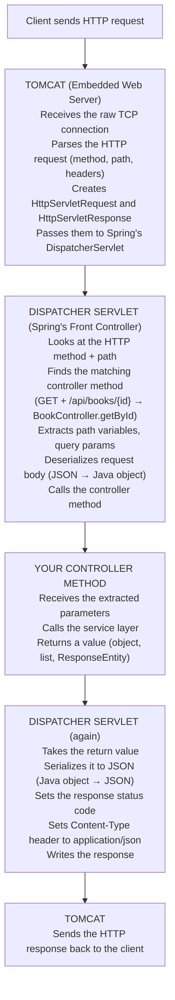

# Chapter 9: The Request-Response Lifecycle

> ⏱ Estimated time: 50 minutes

## What You'll Learn

- The complete journey of an HTTP request through Spring Boot
- What the DispatcherServlet does
- How to use `ResponseEntity` to control status codes and headers
- How to return proper HTTP status codes (201, 204, 404)
- How to think about error cases

---

## Concepts

### The Full Journey of a Request

When a client sends `GET /api/books/42` to your Spring Boot application, here's what happens:



### The DispatcherServlet

The **DispatcherServlet** is the central hub of Spring MVC. Think of it as a receptionist:

- A request arrives → the receptionist looks up who should handle it
- Finds the right handler (controller method) → passes the request along
- Gets the result back → formats it and sends the response

You never interact with the DispatcherServlet directly. It works behind the scenes. But understanding its existence helps you debug when things go wrong (e.g., "Why isn't my endpoint being found?").

### The Problem with Plain Return Types

In Chapter 7, our controller returned objects directly:

```java
@GetMapping("/{id}")
public Book getBookById(@PathVariable Long id) {
    return bookService.getBookById(id).orElse(null);
}
```

Problems:
1. When the book is found → returns 200. ✅
2. When the book is NOT found → returns `null`, which Spring serializes as... nothing. Empty 200 response. ❌ Should be 404!
3. When creating a book → returns 200. ❌ Should be 201 Created!
4. When deleting a book → returns 200 with empty body. Should be 204 No Content!

We need more control over the HTTP response.

### ResponseEntity: Full Control

`ResponseEntity<T>` lets you control:
- The **status code** (200, 201, 204, 404, etc.)
- The **headers**
- The **body** (the data)

```java
// Basic ResponseEntity usage
ResponseEntity.ok(book)                          // 200 with body
ResponseEntity.status(HttpStatus.CREATED).body(book)  // 201 with body
ResponseEntity.noContent().build()               // 204 with no body
ResponseEntity.notFound().build()                // 404 with no body
ResponseEntity.badRequest().body(errorMessage)   // 400 with error message
```

### Status Code Patterns

Here are the correct status codes for each operation:

| Operation | Success Code | Failure Code |
|-----------|-------------|--------------|
| GET (one item) | 200 OK | 404 Not Found |
| GET (list) | 200 OK (empty list is still 200!) | — |
| POST (create) | **201 Created** | 400 Bad Request |
| PUT (update) | 200 OK | 404 Not Found |
| DELETE | **204 No Content** | 404 Not Found |

> 🧠 **Think Like a Backend Engineer**: An empty list is NOT a 404. `GET /api/books` returning `[]` means "there are no books" — the resource (the collection) exists, it's just empty. 404 means the resource itself doesn't exist.

---

## Code Examples

### BookShelf v1 Improved: Proper Status Codes

Update your `BookController.java`:

```java
package com.bookshelf;

import org.springframework.http.HttpStatus;
import org.springframework.http.ResponseEntity;
import org.springframework.web.bind.annotation.*;
import java.util.List;

@RestController
@RequestMapping("/api/books")
public class BookController {

    private final BookService bookService;

    public BookController(BookService bookService) {
        this.bookService = bookService;
    }

    // GET /api/books → 200 OK (always, even if empty list)
    @GetMapping
    public ResponseEntity<List<Book>> getAllBooks() {
        return ResponseEntity.ok(bookService.getAllBooks());
    }

    // GET /api/books/{id} → 200 OK or 404 Not Found
    @GetMapping("/{id}")
    public ResponseEntity<Book> getBookById(@PathVariable Long id) {
        return bookService.getBookById(id)
                .map(ResponseEntity::ok)                    // Found → 200 with book
                .orElse(ResponseEntity.notFound().build());  // Not found → 404
    }

    // POST /api/books → 201 Created
    @PostMapping
    public ResponseEntity<Book> createBook(@RequestBody Book book) {
        Book created = bookService.createBook(book);
        return ResponseEntity.status(HttpStatus.CREATED).body(created);
    }

    // PUT /api/books/{id} → 200 OK or 404 Not Found
    @PutMapping("/{id}")
    public ResponseEntity<Book> updateBook(
            @PathVariable Long id,
            @RequestBody Book updatedBook
    ) {
        return bookService.updateBook(id, updatedBook)
                .map(ResponseEntity::ok)                    // Found & updated → 200
                .orElse(ResponseEntity.notFound().build());  // Not found → 404
    }

    // DELETE /api/books/{id} → 204 No Content or 404 Not Found
    @DeleteMapping("/{id}")
    public ResponseEntity<Void> deleteBook(@PathVariable Long id) {
        if (bookService.deleteBook(id)) {
            return ResponseEntity.noContent().build();       // Deleted → 204
        }
        return ResponseEntity.notFound().build();            // Not found → 404
    }

    // GET /api/books/search?title=... → 200 OK (always)
    @GetMapping("/search")
    public ResponseEntity<List<Book>> searchBooks(@RequestParam String title) {
        return ResponseEntity.ok(bookService.searchByTitle(title));
    }
}
```

### Testing the Improved Status Codes

```bash
# Create a book → should return 201
curl -v -X POST http://localhost:8080/api/books \
  -H "Content-Type: application/json" \
  -d '{"title": "Dune", "author": "Frank Herbert", "pages": 412}'
# Look for: < HTTP/1.1 201

# Get existing book → should return 200
curl -v http://localhost:8080/api/books/1
# Look for: < HTTP/1.1 200

# Get non-existent book → should return 404
curl -v http://localhost:8080/api/books/999
# Look for: < HTTP/1.1 404

# Delete existing book → should return 204
curl -v -X DELETE http://localhost:8080/api/books/1
# Look for: < HTTP/1.1 204

# Delete again (already gone) → should return 404
curl -v -X DELETE http://localhost:8080/api/books/1
# Look for: < HTTP/1.1 404
```

### Understanding the Optional Pattern

Notice how `getBookById` uses `Optional`:

```java
return bookService.getBookById(id)        // Returns Optional<Book>
        .map(ResponseEntity::ok)           // If present → wrap in 200 OK
        .orElse(ResponseEntity.notFound().build());  // If empty → 404
```

This is a clean pattern you'll use constantly:
- Service returns `Optional<T>`
- Controller maps it to the appropriate ResponseEntity
- No null checks, no if-else blocks

### Adding Custom Headers

Sometimes you need to set custom response headers:

```java
@PostMapping
public ResponseEntity<Book> createBook(@RequestBody Book book) {
    Book created = bookService.createBook(book);
    return ResponseEntity
            .status(HttpStatus.CREATED)
            .header("X-Book-Id", String.valueOf(created.getId()))  // Custom header
            .body(created);
}
```

The `Location` header is commonly set after creating a resource — it tells the client where to find the new resource:

```java
@PostMapping
public ResponseEntity<Book> createBook(@RequestBody Book book) {
    Book created = bookService.createBook(book);
    URI location = URI.create("/api/books/" + created.getId());
    return ResponseEntity.created(location).body(created);
    // Sets status 201 AND Location header automatically
}
```

---

## Exercise: Upgrade BookShelf with ResponseEntity

**Goal**: Update all BookShelf endpoints to return proper HTTP status codes.

### Tasks

1. Update every controller method to return `ResponseEntity<T>`
2. Return `201 Created` for successful POST
3. Return `204 No Content` for successful DELETE
4. Return `404 Not Found` when a book doesn't exist (GET, PUT, DELETE)
5. Test every endpoint with `curl -v` to verify the status codes

### Checklist

Test these scenarios and verify the status code:

| Scenario | Expected Status |
|----------|----------------|
| `GET /api/books` (empty) | 200 with `[]` |
| `POST /api/books` (valid data) | 201 with created book |
| `GET /api/books/1` (exists) | 200 with book |
| `GET /api/books/999` (doesn't exist) | 404 |
| `PUT /api/books/1` (exists) | 200 with updated book |
| `PUT /api/books/999` (doesn't exist) | 404 |
| `DELETE /api/books/1` (exists) | 204 (no body) |
| `DELETE /api/books/1` (already deleted) | 404 |

---

## Common Mistakes

| Mistake | Reality |
|---------|---------|
| Returning 200 for everything | Different operations deserve different status codes. Clients depend on these to decide what to do next. |
| Returning 404 for an empty list | An empty list is a valid response (200). 404 means the resource doesn't exist — but `/api/books` exists, it just has no items. |
| Forgetting `.build()` on no-body responses | `ResponseEntity.notFound()` returns a builder. You need `.build()` to get the actual ResponseEntity. |
| Returning the deleted object on DELETE | Convention is 204 (No Content) — the thing is gone, there's nothing to return. |
| Not using `-v` flag when testing | Without `-v`, curl only shows the body. You can't see the status code. Always use `curl -v` when debugging. |

---

### 📝 Practice Exercises

Ready to test your understanding? These exercises from [Appendix E](../appendices/E-coding-exercises.md) directly apply what you learned in this chapter:

| Exercise | Topic | Difficulty |
|----------|-------|------------|
| [Exercise 18](../appendices/E-coding-exercises.md#exercise-18) | Complete Notes API | ⭐⭐⭐ |

Solutions are in [Appendix F](../appendices/F-exercise-solutions.md).

---

## Key Takeaways

- [ ] I understand the full request lifecycle: Client → Tomcat → DispatcherServlet → Controller → Service → back
- [ ] I know what the DispatcherServlet does (routing, parameter extraction, serialization)
- [ ] I can use `ResponseEntity` to control status codes, headers, and body
- [ ] I know the correct status codes: 200 (OK), 201 (Created), 204 (No Content), 404 (Not Found)
- [ ] I can test status codes using `curl -v`

---

## Quick Quiz

1. What does the DispatcherServlet do?
2. What's wrong with returning `null` from a controller method when a resource isn't found?
3. Write the code for a DELETE endpoint that returns 204 on success and 404 if the item doesn't exist.
4. Should `GET /api/books` return 404 if there are no books in the database? Why or why not?
5. What does `ResponseEntity.created(location).body(book)` do?

---

## Day 3 Summary

```
✓ Controllers receive requests and send responses using @RestController
✓ @GetMapping, @PostMapping, @PutMapping, @DeleteMapping map HTTP methods
✓ @PathVariable, @RequestParam, @RequestBody extract data from requests
✓ Dependency Injection means receiving dependencies, not creating them
✓ Constructor injection with final fields is the right way
✓ @Service, @Repository, @RestController register beans with Spring
✓ ResponseEntity gives full control over status codes and headers
✓ The DispatcherServlet routes requests to the right controller method
```

Tomorrow, you'll learn the layered architecture pattern, create proper DTOs, and connect to a real database!

---

*Next: `day-4/10-thinking-in-layers.md` — Clean architecture for your backend application →*
