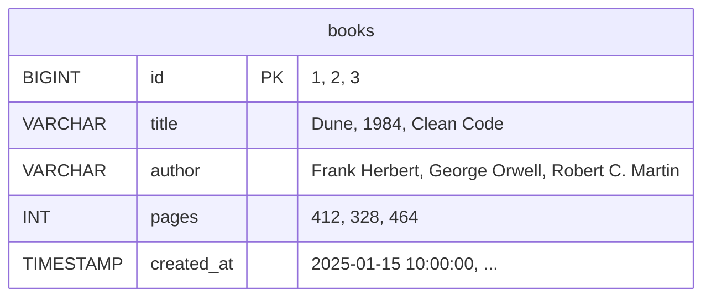

# Chapter 12: Databases with Spring Data JPA

> ⏱ Estimated time: 80 minutes

## What You'll Learn

- What a database is and why your backend needs one
- SQL basics — enough to understand what JPA does for you
- What JPA and Hibernate are
- How to set up H2 (an in-memory database for learning)
- JPA annotations: `@Entity`, `@Id`, `@GeneratedValue`, `@Column`
- How `JpaRepository` eliminates hand-written data access code
- How to build BookShelf v3 with real database persistence

---

## Concepts

### What Is a Database?

A database is a program that stores data in an organized, queryable way. Think of it as a super-powered spreadsheet:



Key differences from a spreadsheet:
- **Structured**: Each column has a type (text, number, date). You can't put text in a number column.
- **Enforced rules**: Unique IDs, required fields, references between tables.
- **Queryable**: "Give me all books by Frank Herbert with more than 300 pages."
- **Concurrent**: Handles thousands of simultaneous reads/writes safely.
- **Persistent**: Data survives application restarts, crashes, and server reboots.

### SQL: The Language of Databases

Databases use **SQL** (Structured Query Language) to manage data. You don't need to master SQL — JPA writes it for you — but understanding the basics helps.

```sql
-- Create a table
CREATE TABLE books (
    id BIGINT PRIMARY KEY AUTO_INCREMENT,
    title VARCHAR(255) NOT NULL,
    author VARCHAR(255),
    pages INT,
    created_at TIMESTAMP
);

-- Insert a row
INSERT INTO books (title, author, pages, created_at)
VALUES ('Dune', 'Frank Herbert', 412, CURRENT_TIMESTAMP);

-- Read all rows
SELECT * FROM books;

-- Read with a filter
SELECT * FROM books WHERE author = 'Frank Herbert';

-- Update a row
UPDATE books SET pages = 420 WHERE id = 1;

-- Delete a row
DELETE FROM books WHERE id = 1;
```

Notice the pattern: SQL operations map directly to our HTTP methods:

| SQL | HTTP | CRUD |
|-----|------|------|
| INSERT | POST | Create |
| SELECT | GET | Read |
| UPDATE | PUT/PATCH | Update |
| DELETE | DELETE | Delete |

### What Is JPA?

**JPA** (Java Persistence API) is a specification that lets you work with databases using Java objects instead of writing SQL.

Without JPA:
```java
String sql = "INSERT INTO books (title, author, pages) VALUES (?, ?, ?)";
PreparedStatement stmt = connection.prepareStatement(sql);
stmt.setString(1, book.getTitle());
stmt.setString(2, book.getAuthor());
stmt.setInt(3, book.getPages());
stmt.executeUpdate();
```

With JPA:
```java
bookRepository.save(book);  // That's it. JPA generates the SQL.
```

**Hibernate** is the most popular *implementation* of JPA. When you use JPA in Spring Boot, Hibernate does the actual work under the hood.

**Analogy**: JPA is like a universal remote control specification. Hibernate is the actual remote that follows that specification. You program the specification, Hibernate operates the TV (database).

### ORM: Objects ↔ Tables

JPA is an **ORM** (Object-Relational Mapping). It maps:

```
Java class   ←→  Database table
Java field   ←→  Table column
Java object  ←→  Table row

@Entity
public class Book {         ←→  Table: books
    private Long id;        ←→  Column: id (BIGINT)
    private String title;   ←→  Column: title (VARCHAR)
    private int pages;      ←→  Column: pages (INT)
}
```

### H2: A Database for Learning

**H2** is an in-memory database written in Java. It runs inside your application — no installation needed.

- **In-memory mode**: Data exists only while the app runs (good for learning and testing)
- **Zero setup**: Just add the dependency and configure two lines
- **SQL compatible**: Works like MySQL/PostgreSQL for basic operations
- **Built-in console**: A web UI to see your data

We'll use H2 for this guide. In production, you'd use PostgreSQL, MySQL, or another external database. The JPA code stays the same — you just change the configuration.

---

## Code Examples

### Step 1: Add Dependencies

Add these to your `pom.xml` inside `<dependencies>`:

```xml
<!-- Spring Data JPA — handles all database interaction -->
<dependency>
    <groupId>org.springframework.boot</groupId>
    <artifactId>spring-boot-starter-data-jpa</artifactId>
</dependency>

<!-- H2 Database — in-memory database for development -->
<dependency>
    <groupId>com.h2database</groupId>
    <artifactId>h2</artifactId>
    <scope>runtime</scope>
</dependency>
```

After adding these, run `mvn clean compile` (or let your IDE refresh the project).

### Step 2: Configure the Database

Update `src/main/resources/application.properties`:

```properties
# H2 Database Configuration
spring.datasource.url=jdbc:h2:mem:bookshelf
spring.datasource.driver-class-name=org.h2.Driver
spring.datasource.username=sa
spring.datasource.password=

# JPA / Hibernate
spring.jpa.database-platform=org.hibernate.dialect.H2Dialect
spring.jpa.hibernate.ddl-auto=create-drop
spring.jpa.show-sql=true

# Enable H2 Console (web UI to see your data)
spring.h2-console.enabled=true
spring.h2-console.path=/h2-console
```

**What these mean:**
- `datasource.url`: Connect to an in-memory database named "bookshelf"
- `ddl-auto=create-drop`: Create tables on startup, drop them on shutdown (great for development)
- `show-sql=true`: Print every SQL query to the console (great for learning — you can see what JPA generates)
- `h2-console`: Lets you visit `http://localhost:8080/h2-console` to see your data

### Step 3: Turn Book into a JPA Entity

Update `src/main/java/com/bookshelf/model/Book.java`:

```java
package com.bookshelf.model;

import jakarta.persistence.*;
import java.time.LocalDateTime;

@Entity                         // This class maps to a database table
@Table(name = "books")          // The table is called "books"
public class Book {

    @Id                         // This field is the primary key
    @GeneratedValue(strategy = GenerationType.IDENTITY)  // Database auto-generates the ID
    private Long id;

    @Column(nullable = false)   // This column cannot be NULL in the database
    private String title;

    @Column                     // Optional — defaults work fine for most columns
    private String author;

    @Column
    private int pages;

    @Column(name = "created_at")
    private LocalDateTime createdAt;

    // JPA requires a no-arg constructor
    public Book() {}

    public Book(String title, String author, int pages) {
        this.title = title;
        this.author = author;
        this.pages = pages;
        this.createdAt = LocalDateTime.now();
    }

    // Lifecycle callback — runs before saving a new entity
    @PrePersist
    protected void onCreate() {
        this.createdAt = LocalDateTime.now();
    }

    // Getters and setters
    public Long getId() { return id; }
    public void setId(Long id) { this.id = id; }
    public String getTitle() { return title; }
    public void setTitle(String title) { this.title = title; }
    public String getAuthor() { return author; }
    public void setAuthor(String author) { this.author = author; }
    public int getPages() { return pages; }
    public void setPages(int pages) { this.pages = pages; }
    public LocalDateTime getCreatedAt() { return createdAt; }
    public void setCreatedAt(LocalDateTime createdAt) { this.createdAt = createdAt; }
}
```

**Annotation breakdown:**

| Annotation | Purpose |
|-----------|---------|
| `@Entity` | Marks this class as a JPA entity (maps to a table) |
| `@Table(name = "books")` | Specifies the table name |
| `@Id` | Marks the primary key field |
| `@GeneratedValue(strategy = IDENTITY)` | Database auto-generates IDs (1, 2, 3...) |
| `@Column(nullable = false)` | This column must have a value |
| `@Column(name = "created_at")` | Maps the Java field to a differently-named column |
| `@PrePersist` | Run this method before saving a new entity |

### Step 4: Replace the Repository with JpaRepository

**Delete** your existing `BookRepository.java` (the one with ArrayList) and replace it:

```java
package com.bookshelf.repository;

import com.bookshelf.model.Book;
import org.springframework.data.jpa.repository.JpaRepository;
import java.util.List;

public interface BookRepository extends JpaRepository<Book, Long> {
    
    // Spring Data JPA generates these queries automatically from the method name!
    List<Book> findByTitleContainingIgnoreCase(String title);
    
    List<Book> findByAuthorContainingIgnoreCase(String author);
}
```

**That's it.** Notice:
- It's an **interface**, not a class — Spring generates the implementation
- `extends JpaRepository<Book, Long>` — Book is the entity type, Long is the ID type
- You get these methods for FREE (no code needed):
  - `findAll()` — get all books
  - `findById(Long id)` — get one book
  - `save(Book book)` — create or update
  - `deleteById(Long id)` — delete
  - `count()` — count total records
  - `existsById(Long id)` — check if exists

**Custom queries** are generated from method names:
- `findByTitleContainingIgnoreCase("dune")` → `SELECT * FROM books WHERE LOWER(title) LIKE '%dune%'`
- `findByAuthorContainingIgnoreCase("herbert")` → `SELECT * FROM books WHERE LOWER(author) LIKE '%herbert%'`

Spring Data reads the method name and builds the SQL. No SQL needed.

### Step 5: Update the Service

```java
package com.bookshelf.service;

import com.bookshelf.dto.BookRequest;
import com.bookshelf.dto.BookResponse;
import com.bookshelf.model.Book;
import com.bookshelf.repository.BookRepository;
import org.springframework.stereotype.Service;
import java.util.List;
import java.util.Optional;

@Service
public class BookService {

    private final BookRepository bookRepository;

    public BookService(BookRepository bookRepository) {
        this.bookRepository = bookRepository;
    }

    public List<BookResponse> getAllBooks() {
        return bookRepository.findAll().stream()
                .map(this::toResponse)
                .toList();
    }

    public Optional<BookResponse> getBookById(Long id) {
        return bookRepository.findById(id)
                .map(this::toResponse);
    }

    public BookResponse createBook(BookRequest request) {
        Book book = toEntity(request);
        Book saved = bookRepository.save(book);
        return toResponse(saved);
    }

    public Optional<BookResponse> updateBook(Long id, BookRequest request) {
        return bookRepository.findById(id)
                .map(existingBook -> {
                    existingBook.setTitle(request.title());
                    existingBook.setAuthor(request.author());
                    existingBook.setPages(request.pages());
                    return toResponse(bookRepository.save(existingBook));
                });
    }

    public boolean deleteBook(Long id) {
        if (bookRepository.existsById(id)) {
            bookRepository.deleteById(id);
            return true;
        }
        return false;
    }

    public List<BookResponse> searchByTitle(String title) {
        return bookRepository.findByTitleContainingIgnoreCase(title).stream()
                .map(this::toResponse)
                .toList();
    }

    // ---- Mapping methods ----

    private Book toEntity(BookRequest request) {
        return new Book(request.title(), request.author(), request.pages());
    }

    private BookResponse toResponse(Book book) {
        return new BookResponse(
                book.getId(),
                book.getTitle(),
                book.getAuthor(),
                book.getPages(),
                book.getCreatedAt()
        );
    }
}
```

### Step 6: Run and Test

```bash
mvn spring-boot:run
```

Watch the console — you'll see the SQL that JPA generates:

```sql
Hibernate: create table books (id bigint generated by default as identity, 
           author varchar(255), created_at timestamp(6), pages integer not null, 
           title varchar(255) not null, primary key (id))
```

Test the full CRUD:

```bash
# Create
curl -X POST http://localhost:8080/api/books \
  -H "Content-Type: application/json" \
  -d '{"title": "Dune", "author": "Frank Herbert", "pages": 412}'

# Read all
curl http://localhost:8080/api/books

# Read one
curl http://localhost:8080/api/books/1

# Update
curl -X PUT http://localhost:8080/api/books/1 \
  -H "Content-Type: application/json" \
  -d '{"title": "Dune (Revised)", "author": "Frank Herbert", "pages": 420}'

# Delete
curl -X DELETE http://localhost:8080/api/books/1

# Search
curl "http://localhost:8080/api/books/search?title=dune"
```

### Step 7: Explore with H2 Console

Open your browser and go to: `http://localhost:8080/h2-console`

Settings:
- JDBC URL: `jdbc:h2:mem:bookshelf`
- User: `sa`
- Password: (leave empty)

Click Connect. You can now run SQL queries directly:

```sql
SELECT * FROM books;
```

This is incredibly useful for debugging — you can see exactly what's in your database.

---

## Exercise: Build BookShelf v3

**Goal**: Replace the in-memory ArrayList with a real database.

### Tasks

1. Add `spring-boot-starter-data-jpa` and `h2` dependencies to `pom.xml`
2. Configure the database in `application.properties`
3. Add JPA annotations to your `Book` entity
4. Replace your `BookRepository` class with a `JpaRepository` interface
5. Update `BookService` if needed (the interface methods are similar)
6. Run and test all CRUD operations
7. Open the H2 console and view your data

### Verification

The big difference from before: **restart your app and verify that data is gone** (because H2 is in-memory). In production, you'd use a persistent database like PostgreSQL where data survives restarts.

### Stretch Goal

Add a method to your repository:

```java
List<Book> findByPagesGreaterThan(int minPages);
```

Then add an endpoint to use it:
```java
@GetMapping("/long-books")
public ResponseEntity<List<BookResponse>> getLongBooks(@RequestParam(defaultValue = "400") int minPages) {
    return ResponseEntity.ok(bookService.getLongBooks(minPages));
}
```

---

## Common Mistakes

| Mistake | Reality |
|---------|---------|
| Forgetting the no-arg constructor on entities | JPA needs it to create objects via reflection. Add `public Book() {}` even if you have other constructors. |
| Missing `@Entity` annotation | Without it, JPA doesn't know this class maps to a table. You'll get errors about unmapped entities. |
| Using `@GeneratedValue` without `@Id` | `@GeneratedValue` only works on the `@Id` field. |
| Calling `deleteById()` without checking existence | It throws `EmptyResultDataAccessException` if the ID doesn't exist. Check with `existsById()` first. |
| Confusing `save()` for create-only | `save()` does both create (if no ID) and update (if ID exists). It's an "upsert" operation. |
| Setting `ddl-auto=create-drop` in production | This DELETES ALL DATA on restart! Use `validate` or `none` in production. `create-drop` is only for development. |

---

## Key Takeaways

- [ ] A database stores data persistently in tables with typed columns
- [ ] JPA maps Java classes to database tables, fields to columns, objects to rows
- [ ] `@Entity`, `@Id`, `@GeneratedValue`, `@Column` annotate your entity class
- [ ] `JpaRepository` provides free CRUD methods — just extend the interface
- [ ] Custom queries are generated from method names (`findByTitleContaining`)
- [ ] H2 is a great in-memory database for development and learning
- [ ] `spring.jpa.show-sql=true` lets you see the generated SQL

---

## Quick Quiz

1. What does `@GeneratedValue(strategy = GenerationType.IDENTITY)` do?
2. How does `JpaRepository.save()` know whether to INSERT or UPDATE?
3. Write a repository method name that finds all books by a specific author (exact match).
4. Why is `ddl-auto=create-drop` dangerous in production?
5. What's the SQL equivalent of `bookRepository.findByPagesGreaterThan(300)`?

---

## Day 4 Summary

```
✓ Three-layer architecture: Controller → Service → Repository
✓ Each layer has a single responsibility — don't mix concerns
✓ Entities represent database tables; DTOs represent API data
✓ Java records make DTOs concise and immutable
✓ JPA maps Java objects to database rows — no manual SQL
✓ JpaRepository provides free CRUD operations
✓ Custom queries are generated from method names
✓ H2 is perfect for development — zero setup, runs in memory
```

Tomorrow, you'll add validation, handle errors properly, add relationships between entities, and manage configuration!

---

*Next: `day-5/13-validation-and-error-handling.md` — Never trust the client →*
