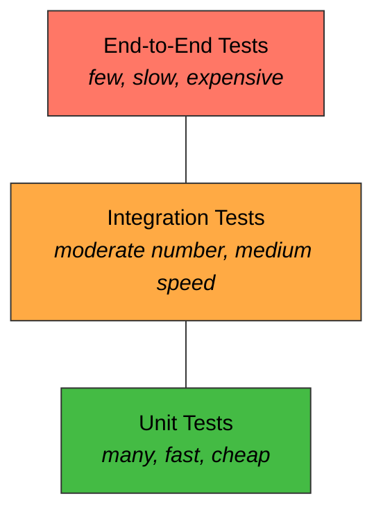

# Chapter 16: Testing Your Application

> ⏱ Estimated time: 70 minutes

## What You'll Learn

- Why testing matters (beyond "it works on my machine")
- The test pyramid: unit tests, integration tests, end-to-end tests
- JUnit 5 basics and assertions
- How to unit test services with mocks (`@MockBean`)
- How to integration test controllers with `MockMvc`
- How to write tests that verify behavior, not implementation

---

## Concepts

### Why Test?

You already test manually — you run the app, use curl, and check the output. Automated tests do this for you, every time, in seconds.

**Without automated tests:**
- You change code → manually test 15 endpoints → miss one → bug in production
- New team member changes code → doesn't know what to test → breaks something
- Refactoring is terrifying — you don't know what you'll break

**With automated tests:**
- You change code → run tests → all pass → confident it works
- Run tests before every deploy → catch bugs before they reach users
- Refactor fearlessly — tests tell you if anything broke

### The Test Pyramid



| Type | What It Tests | Speed | Quantity |
|------|---------------|-------|----------|
| **Unit** | One class in isolation (service, utility) | Milliseconds | Many |
| **Integration** | Multiple components together (controller + service + database) | Seconds | Moderate |
| **End-to-End** | The entire application from the outside | Slow | Few |

For backend applications, focus on **unit tests for services** and **integration tests for controllers**.

### What Makes a Good Test?

A good test answers: **"What business behavior would break if this test fails?"**

**Good tests verify behavior:**
```java
@Test
void createBook_withValidData_returnsCreatedBook() {
    BookRequest request = new BookRequest("Dune", 1L, 412);
    BookResponse result = bookService.createBook(request);
    
    assertEquals("Dune", result.title());        // Meaningful: the book was created correctly
    assertNotNull(result.id());                   // Meaningful: an ID was assigned
    assertEquals(412, result.pages());            // Meaningful: pages were saved
}
```

**Bad tests verify nothing useful:**
```java
@Test
void createBook_callsRepository() {
    bookService.createBook(request);
    verify(bookRepository).save(any());  // So what? This tells us nothing about correctness
}
```

### JUnit 5 Basics

JUnit 5 is Java's standard testing framework. It comes with `spring-boot-starter-test`.

```java
import org.junit.jupiter.api.Test;
import static org.junit.jupiter.api.Assertions.*;

class CalculatorTest {

    @Test
    void addsTwoNumbers() {
        Calculator calc = new Calculator();
        int result = calc.add(2, 3);
        assertEquals(5, result);
    }

    @Test
    void divisionByZeroThrowsException() {
        Calculator calc = new Calculator();
        assertThrows(ArithmeticException.class, () -> calc.divide(10, 0));
    }
}
```

**Key annotations:**
| Annotation | Purpose |
|-----------|---------|
| `@Test` | Marks a method as a test |
| `@BeforeEach` | Runs before EACH test method |
| `@AfterEach` | Runs after EACH test method |
| `@DisplayName("...")` | Human-readable test name |

**Key assertions:**
| Assertion | Checks |
|-----------|--------|
| `assertEquals(expected, actual)` | Values are equal |
| `assertNotNull(value)` | Value is not null |
| `assertTrue(condition)` | Condition is true |
| `assertThrows(Exception.class, () -> ...)` | Code throws expected exception |
| `assertFalse(condition)` | Condition is false |

### Mocking with Mockito

When unit testing a service, you don't want to use a real database. You **mock** the repository — create a fake version that returns whatever you tell it to.

```java
// Real repository → hits the database
// Mock repository → returns predefined answers, no database needed

BookRepository mockRepo = mock(BookRepository.class);
when(mockRepo.findById(1L)).thenReturn(Optional.of(sampleBook));  // "If someone calls findById(1), return sampleBook"

BookService service = new BookService(mockRepo);
// Now the service uses the mock — no database involved
```

---

## Code Examples

### Unit Testing the BookService

Create `src/test/java/com/bookshelf/service/BookServiceTest.java`:

```java
package com.bookshelf.service;

import com.bookshelf.dto.BookRequest;
import com.bookshelf.dto.BookResponse;
import com.bookshelf.exception.BookNotFoundException;
import com.bookshelf.model.Author;
import com.bookshelf.model.Book;
import com.bookshelf.repository.AuthorRepository;
import com.bookshelf.repository.BookRepository;
import org.junit.jupiter.api.BeforeEach;
import org.junit.jupiter.api.DisplayName;
import org.junit.jupiter.api.Test;
import org.junit.jupiter.api.extension.ExtendWith;
import org.mockito.InjectMocks;
import org.mockito.Mock;
import org.mockito.junit.jupiter.MockitoExtension;

import java.time.LocalDateTime;
import java.util.List;
import java.util.Optional;

import static org.junit.jupiter.api.Assertions.*;
import static org.mockito.ArgumentMatchers.any;
import static org.mockito.Mockito.*;

@ExtendWith(MockitoExtension.class)  // Enable Mockito
class BookServiceTest {

    @Mock
    private BookRepository bookRepository;

    @Mock
    private AuthorRepository authorRepository;

    @InjectMocks  // Creates BookService with the mocks injected
    private BookService bookService;

    private Author sampleAuthor;
    private Book sampleBook;

    @BeforeEach
    void setUp() {
        sampleAuthor = new Author("Frank Herbert", "American");
        sampleAuthor.setId(1L);

        sampleBook = new Book();
        sampleBook.setId(1L);
        sampleBook.setTitle("Dune");
        sampleBook.setAuthor(sampleAuthor);
        sampleBook.setPages(412);
        sampleBook.setCreatedAt(LocalDateTime.now());
    }

    @Test
    @DisplayName("getAllBooks returns all books as responses")
    void getAllBooks_returnsAllBooks() {
        when(bookRepository.findAll()).thenReturn(List.of(sampleBook));

        List<BookResponse> result = bookService.getAllBooks();

        assertEquals(1, result.size());
        assertEquals("Dune", result.get(0).title());
        assertEquals("Frank Herbert", result.get(0).author().name());
    }

    @Test
    @DisplayName("getBookById returns book when it exists")
    void getBookById_existingId_returnsBook() {
        when(bookRepository.findById(1L)).thenReturn(Optional.of(sampleBook));

        BookResponse result = bookService.getBookById(1L);

        assertEquals("Dune", result.title());
        assertEquals(412, result.pages());
    }

    @Test
    @DisplayName("getBookById throws exception when book doesn't exist")
    void getBookById_nonExistingId_throwsException() {
        when(bookRepository.findById(999L)).thenReturn(Optional.empty());

        assertThrows(BookNotFoundException.class, () -> bookService.getBookById(999L));
    }

    @Test
    @DisplayName("createBook saves and returns new book")
    void createBook_validRequest_returnsCreatedBook() {
        BookRequest request = new BookRequest("Dune", 1L, 412);

        when(authorRepository.findById(1L)).thenReturn(Optional.of(sampleAuthor));
        when(bookRepository.save(any(Book.class))).thenReturn(sampleBook);

        BookResponse result = bookService.createBook(request);

        assertEquals("Dune", result.title());
        assertEquals(412, result.pages());
        assertNotNull(result.author());
    }

    @Test
    @DisplayName("deleteBook throws exception when book doesn't exist")
    void deleteBook_nonExistingId_throwsException() {
        when(bookRepository.existsById(999L)).thenReturn(false);

        assertThrows(BookNotFoundException.class, () -> bookService.deleteBook(999L));
    }
}
```

### Integration Testing the BookController

Create `src/test/java/com/bookshelf/controller/BookControllerIntegrationTest.java`:

```java
package com.bookshelf.controller;

import com.bookshelf.model.Author;
import com.bookshelf.model.Book;
import com.bookshelf.repository.AuthorRepository;
import com.bookshelf.repository.BookRepository;
import org.junit.jupiter.api.BeforeEach;
import org.junit.jupiter.api.DisplayName;
import org.junit.jupiter.api.Test;
import org.springframework.beans.factory.annotation.Autowired;
import org.springframework.boot.test.autoconfigure.web.servlet.AutoConfigureMockMvc;
import org.springframework.boot.test.context.SpringBootTest;
import org.springframework.http.MediaType;
import org.springframework.test.web.servlet.MockMvc;

import static org.hamcrest.Matchers.*;
import static org.springframework.test.web.servlet.request.MockMvcRequestBuilders.*;
import static org.springframework.test.web.servlet.result.MockMvcResultMatchers.*;

@SpringBootTest                // Load the full Spring application context
@AutoConfigureMockMvc          // Set up MockMvc
class BookControllerIntegrationTest {

    @Autowired
    private MockMvc mockMvc;   // Simulates HTTP requests without a real server

    @Autowired
    private BookRepository bookRepository;

    @Autowired
    private AuthorRepository authorRepository;

    private Author savedAuthor;

    @BeforeEach
    void setUp() {
        bookRepository.deleteAll();
        authorRepository.deleteAll();
        savedAuthor = authorRepository.save(new Author("Frank Herbert", "American"));
    }

    @Test
    @DisplayName("GET /api/books returns empty list when no books exist")
    void getAllBooks_empty_returns200WithEmptyList() throws Exception {
        mockMvc.perform(get("/api/books"))
                .andExpect(status().isOk())
                .andExpect(jsonPath("$", hasSize(0)));
    }

    @Test
    @DisplayName("POST /api/books creates a book and returns 201")
    void createBook_validData_returns201() throws Exception {
        String requestBody = """
                {
                    "title": "Dune",
                    "authorId": %d,
                    "pages": 412
                }
                """.formatted(savedAuthor.getId());

        mockMvc.perform(post("/api/books")
                        .contentType(MediaType.APPLICATION_JSON)
                        .content(requestBody))
                .andExpect(status().isCreated())
                .andExpect(jsonPath("$.title").value("Dune"))
                .andExpect(jsonPath("$.pages").value(412))
                .andExpect(jsonPath("$.id").isNotEmpty())
                .andExpect(jsonPath("$.author.name").value("Frank Herbert"));
    }

    @Test
    @DisplayName("POST /api/books with empty title returns 400")
    void createBook_emptyTitle_returns400() throws Exception {
        String requestBody = """
                {
                    "title": "",
                    "authorId": %d,
                    "pages": 412
                }
                """.formatted(savedAuthor.getId());

        mockMvc.perform(post("/api/books")
                        .contentType(MediaType.APPLICATION_JSON)
                        .content(requestBody))
                .andExpect(status().isBadRequest())
                .andExpect(jsonPath("$.error").value("Validation Failed"));
    }

    @Test
    @DisplayName("GET /api/books/{id} returns 404 for non-existent book")
    void getBookById_nonExistent_returns404() throws Exception {
        mockMvc.perform(get("/api/books/999"))
                .andExpect(status().isNotFound());
    }

    @Test
    @DisplayName("DELETE /api/books/{id} returns 204 for existing book")
    void deleteBook_existing_returns204() throws Exception {
        // Create a book first
        Book book = new Book();
        book.setTitle("Dune");
        book.setAuthor(savedAuthor);
        book.setPages(412);
        Book saved = bookRepository.save(book);

        mockMvc.perform(delete("/api/books/" + saved.getId()))
                .andExpect(status().isNoContent());
    }
}
```

### Running Tests

```bash
# Run all tests
mvn test

# Run a specific test class
mvn test -Dtest=BookServiceTest

# Run with verbose output
mvn test -X
```

### Understanding MockMvc

`MockMvc` simulates HTTP requests without starting a real server:

```java
mockMvc.perform(                                     // Send a request
    post("/api/books")                               // POST to /api/books
        .contentType(MediaType.APPLICATION_JSON)      // Set Content-Type header
        .content("{\"title\": \"Dune\", ...}")       // Set request body
)
.andExpect(status().isCreated())                     // Assert status = 201
.andExpect(jsonPath("$.title").value("Dune"))        // Assert response body field
.andExpect(jsonPath("$.id").isNotEmpty());            // Assert ID was generated
```

`jsonPath` uses the JSONPath syntax:
- `$` — the root object
- `$.title` — the "title" field
- `$[0]` — first element of an array
- `$[0].title` — title of the first element

---

## Exercise: Write Tests for BookShelf

**Goal**: Add automated tests for your BookShelf service and controller.

### Tasks

1. Create `BookServiceTest` with at least 5 tests:
   - Get all books
   - Get book by ID (found)
   - Get book by ID (not found → exception)
   - Create book (valid data)
   - Delete non-existent book (→ exception)

2. Create `BookControllerIntegrationTest` with at least 5 tests:
   - GET /api/books returns 200 with list
   - POST /api/books with valid data returns 201
   - POST /api/books with invalid data returns 400
   - GET /api/books/{id} with non-existent ID returns 404
   - DELETE /api/books/{id} returns 204

3. Run all tests: `mvn test`

### Test Naming Convention

Use this pattern: `methodName_scenario_expectedResult`

```java
createBook_validRequest_returnsCreatedBook()
getBookById_nonExistingId_throwsBookNotFoundException()
deleteBook_existingBook_returns204NoContent()
```

---

## Common Mistakes

| Mistake | Reality |
|---------|---------|
| Testing that a mock was called instead of checking the result | `verify(repo).save(any())` proves nothing about correctness. Check the returned value instead. |
| Not cleaning up test data between tests | Use `@BeforeEach` to delete all data. Tests must be independent — the order they run shouldn't matter. |
| Testing private methods | Test through the public API. If a private method is complex enough to test directly, it should probably be in its own class. |
| Writing tests after the code is "done" | Write tests alongside your code. If testing is hard, your design might need improvement. |
| Only testing the happy path | Always test: valid input, invalid input, missing data, edge cases (empty lists, null values, boundary values). |

---

## Key Takeaways

- [ ] Unit tests verify one class in isolation using mocks
- [ ] Integration tests verify multiple components working together
- [ ] `@Mock` creates a fake dependency; `@InjectMocks` injects them into the class under test
- [ ] `MockMvc` simulates HTTP requests without starting a real server
- [ ] Good tests verify **behavior** (output, state, exceptions), not **implementation** (method calls)
- [ ] Each test should be independent — order doesn't matter

---

## Quick Quiz

1. What's the difference between a unit test and an integration test?
2. Why do we mock the repository when testing the service?
3. What does `when(repo.findById(1L)).thenReturn(Optional.of(book))` do?
4. Write a MockMvc assertion that checks if the response has status 404 and a "Not Found" error message.
5. A test verifies `verify(service, times(1)).createBook(any())`. Is this a good test? Why or why not?

---

*Next: `17-logging-and-documentation.md` — Make your API observable and discoverable →*
