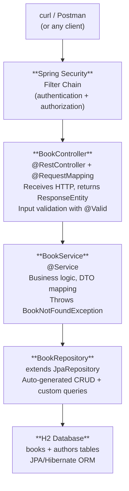

# Chapter 20: What's Next

> ⏱ Estimated time: 30 minutes

## What You've Accomplished

Take a moment to appreciate how far you've come in 7 days:

```
Day 1: "What's HTTP?"
Day 7: You built a fully functional, tested, documented, secured REST API
       with database persistence, layered architecture, and deployment packaging.
```

Here's your BookShelf application architecture:



Supporting infrastructure:
- GlobalExceptionHandler — consistent error responses
- Logging (SLF4J) — operational visibility
- Actuator — health monitoring
- Swagger/OpenAPI — API documentation
- Profiles — dev/prod configuration
- Tests — unit + integration

Compare this to Chapter 1's exercise where you sketched a basic client-server diagram. You now understand every box in this architecture.

---

## Concepts You've Mastered

| Concept | Chapter | What You Know |
|---------|---------|---------------|
| Client-Server | 1 | How computers talk over the internet |
| HTTP | 2 | The protocol (methods, status codes, headers) |
| Backend Role | 3 | The three jobs: receive, process, store |
| JSON & REST | 4 | Data format and API design conventions |
| Frameworks | 5 | Why they exist, IoC, Spring vs Spring Boot |
| Project Setup | 6 | Spring Initializr, Maven, project structure |
| Controllers | 7 | Request handling, routing, annotations |
| DI | 8 | Constructor injection, Spring container, beans |
| Request Lifecycle | 9 | Tomcat → DispatcherServlet → Controller → Response |
| Layered Architecture | 10 | Controller → Service → Repository |
| DTOs | 11 | Separating API and database representations |
| JPA | 12 | ORM, entities, JpaRepository, H2 |
| Validation | 13 | Bean Validation, @ControllerAdvice |
| Relationships | 14 | @ManyToOne, @OneToMany, foreign keys |
| Configuration | 15 | Properties, profiles, environment variables |
| Testing | 16 | JUnit, Mockito, MockMvc |
| Logging & Docs | 17 | SLF4J, Actuator, Swagger |
| Security | 18 | Authentication, authorization, Spring Security |
| Deployment | 19 | Fat JAR, running standalone |

---

## Where to Go from Here

### Immediate Next Steps (Week 2-3)

#### 1. Real Database — PostgreSQL
Replace H2 with a persistent database. The JPA code stays the same — you just change `application.properties`:

```properties
spring.datasource.url=jdbc:postgresql://localhost:5432/bookshelf
spring.datasource.driver-class-name=org.postgresql.Driver
```

Add the PostgreSQL driver to `pom.xml` and remove H2. That's it — your entire application works with a real database.

#### 2. Database Migrations — Flyway or Liquibase
`ddl-auto=create-drop` is for learning. In production, use **Flyway** to manage database schema changes with version-controlled SQL scripts.

#### 3. Docker
Containerize your application. Learn the basics:
- Write a `Dockerfile`
- Build an image: `docker build -t bookshelf .`
- Run a container: `docker run -p 8080:8080 bookshelf`
- Use Docker Compose to run your app + PostgreSQL together

#### 4. JWT Authentication
Replace Basic Auth with JSON Web Tokens (JWT). The flow:
1. Client sends username/password to `/auth/login`
2. Server returns a JWT token
3. Client includes the token in every subsequent request's `Authorization: Bearer <token>` header
4. Server validates the token without a database lookup

### Medium-Term (Month 2-3)

#### 5. Pagination and Sorting
Your `GET /api/books` returns ALL books. With 10,000 books, that's a problem. Learn Spring Data's built-in pagination:

```java
Page<Book> findAll(Pageable pageable);

// Usage: GET /api/books?page=0&size=20&sort=title,asc
```

#### 6. File Uploads
Handle file uploads (book covers, user avatars) with `MultipartFile`.

#### 7. Caching
Cache frequently accessed data (like "all books" or "book by ID") with Spring Cache + Redis. Dramatically reduces database load.

#### 8. Asynchronous Processing
Not everything needs to happen during the request. Send an email? Process a large file? Use `@Async` or a message queue.

#### 9. Message Queues — Kafka / RabbitMQ
Instead of services calling each other directly, they send messages through a queue. This decouples services and handles traffic spikes.

### Long-Term (Month 3-6)

#### 10. Microservices Architecture
Instead of one big application, split into smaller services:
- Book Service
- Author Service
- User Service
- Notification Service

Each runs independently, communicates via REST or messaging. Spring Cloud provides tools for service discovery, configuration, and circuit breakers.

#### 11. Reactive Programming — WebFlux
For high-concurrency scenarios (chat apps, streaming), Spring WebFlux uses non-blocking I/O. Instead of one thread per request, a small number of threads handle many requests.

#### 12. Cloud Deployment
Deploy to a real cloud provider:
- **Kubernetes** — container orchestration
- **AWS / Azure / GCP** — managed services
- **CI/CD** — automated build and deploy pipelines

---

## Learning Resources

### Official Documentation
- **Spring Boot Reference**: https://docs.spring.io/spring-boot/docs/current/reference/html/
- **Spring Data JPA**: https://docs.spring.io/spring-data/jpa/docs/current/reference/html/
- **Spring Security**: https://docs.spring.io/spring-security/reference/

### Tutorials
- **Baeldung** (https://www.baeldung.com) — the best Spring Boot tutorial site. Covers every topic you'll encounter.
- **Spring Guides** (https://spring.io/guides) — official step-by-step guides for specific features.

### Books
- *Spring Boot in Action* by Craig Walls
- *Spring in Action* by Craig Walls (deeper into the Spring ecosystem)

### Practice Projects

Build these to solidify your skills:

| Project | What You'll Practice |
|---------|---------------------|
| **Todo API** | CRUD basics, validation |
| **Blog API** | Relationships (posts, comments, users), pagination |
| **E-commerce API** | Complex relationships, transactions, business rules |
| **Chat API** | WebSockets, real-time messaging |
| **URL Shortener** | Unique ID generation, redirects, click tracking |

Complete all 50 exercises in [Appendix E](../appendices/E-coding-exercises.md) to solidify your skills.

---

## Final Exercise: Review Your Journey

### Task

1. Open your BookShelf project and trace a complete request flow:
   - Pick `POST /api/books` with a valid body
   - Trace it from the curl command through Security → Controller → Service → Repository → Database → back

2. Draw the architecture diagram from memory. Compare with the one at the top of this chapter.

3. List three things in your code that you'd change for a real production application. (Examples: switch to PostgreSQL, add JWT auth, add pagination)

4. Pick one project from the "Practice Projects" table above and sketch its API design (endpoints, entities, relationships) on paper.

---

## Key Takeaways

- [ ] I built a complete Spring Boot REST API from scratch
- [ ] I understand client-server architecture, HTTP, and REST
- [ ] I can create controllers, services, and repositories with proper layering
- [ ] I can model entities, relationships, and DTOs
- [ ] I can validate input, handle errors, and return meaningful responses
- [ ] I can test my code with unit and integration tests
- [ ] I can configure my application for different environments
- [ ] I can secure endpoints with Spring Security
- [ ] I can package and run my application as a standalone JAR
- [ ] I know what to learn next and have a roadmap

---

## Day 7 Summary — and the Entire Week

```
Week 1 Complete!

Day 1: Internet fundamentals — HTTP, DNS, client-server
Day 2: JSON, REST API design, first Spring Boot app running
Day 3: Controllers, DI, request lifecycle — BookShelf v1
Day 4: Layered architecture, DTOs, database with JPA — BookShelf v3
Day 5: Validation, error handling, relationships, config — BookShelf v4
Day 6: Testing, logging, Swagger, Spring Security — BookShelf v5
Day 7: Deployment, packaging, and roadmap for the future

You're no longer a beginner. You're a backend developer who knows the fundamentals.
Everything from here builds on what you've learned this week.
```

---

*Congratulations. Now go build something.*
