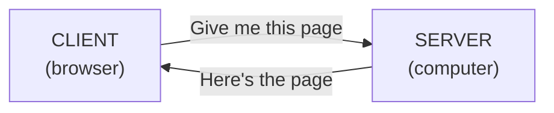
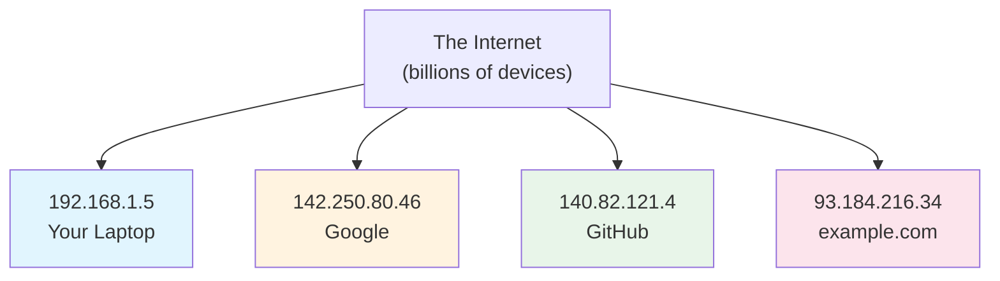
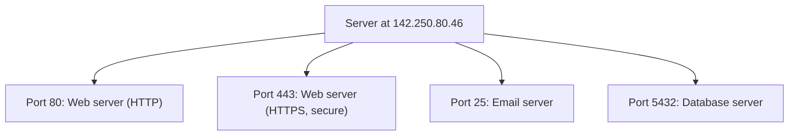
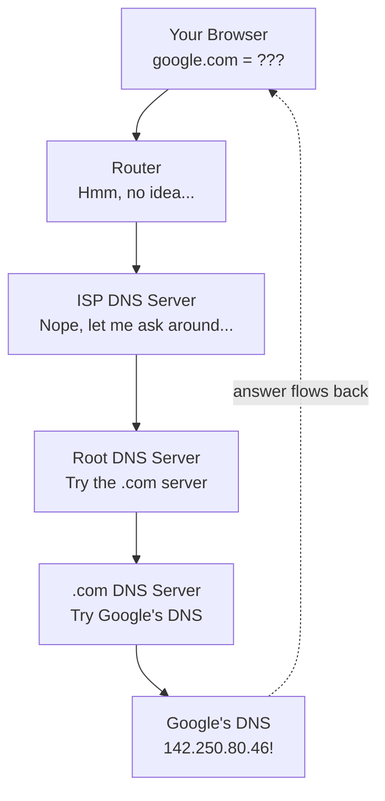
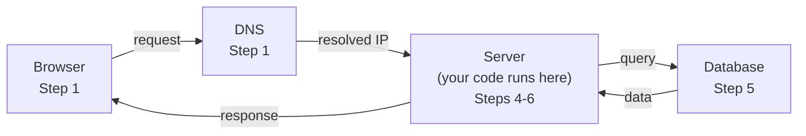

# Chapter 1: How the Internet Actually Works

> :clock1: Estimated time: 45 minutes

## What You'll Learn

- What "client" and "server" mean and how they talk to each other
- What IP addresses and ports are (and why they matter)
- What DNS does (the internet's phone book)
- Exactly what happens when you type a URL in your browser

---

## Concepts

### The Big Picture: Client and Server

Okay, here's the deal. Every single time you do *anything* on the internet -- loading a website, checking your email, doom-scrolling through videos at 2 AM -- the same thing is happening behind the scenes. Two computers are having a conversation.

That's it. Seriously. The entire internet is basically two computers passing notes back and forth.

Let's give them names:

- **Client**: The one doing the asking. That's you. Well, your browser, your phone, your laptop. The thing that says "Hey, I want something."
- **Server**: The one that has the goods and sends them back. It's sitting there, waiting patiently, like a really dedicated librarian who never takes a bathroom break.

The entire internet is built on this one pattern: **ask and answer**.



Think of a restaurant. You (the client) sit down and order a meal. The kitchen (the server) cooks it and sends it out. You don't barge into the kitchen and start rummaging through the fridge. The kitchen doesn't randomly launch a plate of spaghetti at your face. There's a polite, orderly ask-and-answer pattern.

> **:brain: Brain Power:** Before you read on, think about your last five minutes on the internet. Can you identify who was the client and who was the server in each interaction? Spotify streaming a song? YouTube loading a thumbnail? Your email refreshing?

> **:dart: Key Point:** The server doesn't do anything until someone asks. It just sits there. Waiting. Patiently. Like a golden retriever staring at the treat jar. When a request comes in, it processes it and sends a response. Then it goes right back to waiting.

### What Is a Server, Really?

Here's where people get tripped up. They hear "server" and they picture some massive, glowing rack of machines humming in a climate-controlled bunker, possibly guarded by laser beams.

Nope.

A **server** is just a regular computer running a program that listens for requests. That's the whole secret. There's nothing magical about it. Your laptop could be a server *right now* -- all it needs is a program that says "I'm listening, send me requests."

When you write a Spring Boot application later in this guide, your laptop will literally become a server. You. A server operator. Put that on your resume.

> **:speaking_head: Overheard at the coffee shop:**
>
> *"Dude, I just turned my MacBook into a server."*
>
> *"Did you buy new hardware?"*
>
> *"No, I just ran a Java program."*
>
> *"...that's it?"*
>
> *"That's it."*

---

#### An Interview with: The Server

**Interviewer:** Thanks for joining us. So, Server... what exactly do you *do* all day?

**Server:** Honestly? Mostly I wait around. I sit here with my port open, staring into the void, until somebody sends me a request.

**Interviewer:** That sounds... boring?

**Server:** It's not glamorous, I'll admit. But when a request comes in -- oh, that's when I come alive. I read it, figure out what they want, maybe check my database, compose a beautiful response, and send it back. Then I go back to waiting.

**Interviewer:** So you're like a firefighter. Long stretches of nothing, then sudden bursts of action?

**Server:** Exactly. Except I can handle thousands of "fires" at the same time. Try doing THAT with a fire hose.

**Interviewer:** Any pet peeves?

**Server:** People who think I'm special hardware. I'm just software running on a regular computer! Your laptop, a Raspberry Pi, a toaster with a chip in it -- anything can be me if it runs the right program.

---

### IP Addresses: Finding the Right Computer

Alright, so we've got clients asking questions and servers answering them. But the internet has *billions* of devices. How does your request find the RIGHT server out of all those billions?

Enter the **IP address**.

Every device connected to the internet has an IP address -- a unique number that identifies it, like a street address for a house. Your house has an address so the mail carrier can find it. Your computer has an IP address so the internet can find it.

```
Your laptop:     192.168.1.5
Google's server:  142.250.80.46
GitHub's server:  140.82.121.4
```

**IPv4** addresses look like `192.168.1.5` -- four numbers separated by dots (each 0-255). It's the format you'll see most often.

**IPv6** addresses look like `2001:0db8:85a3:0000:0000:8a2e:0370:7334` -- we're running out of IPv4 addresses (turns out 4.3 billion isn't enough when every toaster, thermostat, and refrigerator wants to be online), so this longer format exists. You don't need to memorize this. Honestly, nobody memorizes these.

Here's another way to think about it: imagine every house in the world needed a unique phone number. At first, 10-digit phone numbers worked fine. But then we gave phones to dogs, cars, and light bulbs, and we ran out. So we made longer phone numbers. That's IPv4 vs IPv6.



> **:bulb: There are no Dumb Questions:**
>
> **Q: Does my IP address ever change?**
>
> A: Yep! Most home internet connections give you a *dynamic* IP address that changes periodically. Servers, on the other hand, usually have *static* IP addresses that stay the same -- otherwise nobody could find them. Imagine if your favorite restaurant changed its street address every Tuesday. Chaos.
>
> **Q: What's `localhost` and `127.0.0.1`?**
>
> A: That's your computer referring to *itself*. It's like looking in a mirror and saying "that's me." When you run a Spring Boot app on your laptop and visit `localhost:8080`, you're telling your browser "connect to the server running on THIS computer." You'll use this a LOT.

### Ports: Finding the Right Program

Okay, so IP addresses get us to the right *computer*. But here's the thing -- one computer can run LOTS of programs at the same time. Your server machine might be running a web server, an email server, AND a database, all at once.

So how does the request know which program to talk to?

**Ports.**

A **port** number tells the request *which program* on that computer should handle it. If the IP address is a building's street address, the port is the apartment number. The mail carrier needs *both* to deliver to the right place.



A full network address looks like: `142.250.80.46:443`
- `142.250.80.46` = which computer
- `443` = which program on that computer

See that colon in the middle? That's the separator. Everything before it: the building. Everything after it: the apartment.

> **:brain: Brain Power:** Think of your computer right now. You might have Spotify, a browser, Slack, and VS Code all using the internet at the same time. Each one is communicating on different ports. Can you see why ports are necessary?

Here are the common ports you'll bump into:

| Port | Used For |
|------|----------|
| 80   | HTTP (web traffic, unencrypted) |
| 443  | HTTPS (web traffic, encrypted) |
| 8080 | Common for development servers (including Spring Boot!) |
| 3306 | MySQL database |
| 5432 | PostgreSQL database |

> **:warning: Watch it!** Port 80 often requires administrator privileges on your machine. That's why development servers use port **8080** instead -- it's the convention for "I'm a web server running in development mode, no admin rights needed." When you run your Spring Boot app, it will default to port 8080. If you see `localhost:8080` in your browser, that's your app!

---

#### An Interview with: Port 8080

**Interviewer:** Port 8080, you're kind of a big deal in the development world. How does that feel?

**Port 8080:** Honestly, I'm just Port 80's less formal sibling. Port 80 is the one wearing the suit and tie, handling production traffic. I'm the one in sweatpants, helping developers test stuff on their laptops.

**Interviewer:** Why do developers love you so much?

**Port 8080:** Because I don't require admin privileges! Port 80 is like a VIP club -- you need special access. I'm the dive bar next door. Everyone's welcome. Spring Boot chose me as the default, and after that, my popularity just exploded.

**Interviewer:** Any words for the other 65,533 ports out there?

**Port 8080:** Keep your heads up. Your time will come.

---

### DNS: The Internet's Phone Book

Here's a question for you. When was the last time you typed `142.250.80.46` into your browser?

Never? Yeah, that's what I thought.

We type `google.com`. We type `github.com`. We type things that make *sense to humans*. But computers don't care about human-readable names. They need IP addresses. Numbers. Cold, hard numbers.

So something has to translate "google.com" into "142.250.80.46."

That something is **DNS** -- the **Domain Name System**. And it's basically the internet's phone book.

```
You type:  google.com
DNS says:  "That's 142.250.80.46"
Your browser: connects to 142.250.80.46
```

DNS is like that friend who knows everyone's phone number. You just say "call Sarah" and they dial for you. You never need to memorize the number yourself.

The DNS lookup happens automatically -- you never see it. But it happens *every single time* you visit a website. It's one of those invisible heroes, doing critical work while getting zero credit. Like a bass player.

> **:speaking_head: Overheard at the coffee shop:**
>
> *"How does my browser know where google.com is?"*
>
> *"It asks DNS."*
>
> *"What's DNS?"*
>
> *"Imagine a phone book, but instead of people's names and phone numbers, it has website names and IP addresses."*
>
> *"People still know what phone books are?"*
>
> *"...fair point. Imagine the Contacts app on your phone, but for the entire internet."*

**How DNS resolution works (simplified):**

This is the part that sounds complicated but is actually pretty elegant. Let's walk through it step by step:

```
1. You type "google.com" in your browser
2. Your computer asks your router: "What's the IP for google.com?"
3. Router doesn't know -> asks your ISP's DNS server
4. ISP's DNS doesn't know -> asks a root DNS server
5. Root server says: "Ask the .com DNS server"
6. .com server says: "Ask Google's DNS server"
7. Google's DNS says: "142.250.80.46"
8. Answer flows back to your browser
9. Your computer caches it so it doesn't ask again for a while
```

It's like asking for directions in a small town. You ask one person, they don't know, but they know who might. That person sends you to someone else, who sends you to the *actual* person who knows the answer. The answer travels back through the chain to you.

This entire process takes about 20-100 milliseconds. Blink. You missed it.



> **:bulb: There are no Dumb Questions:**
>
> **Q: Does this lookup happen EVERY time I visit a website?**
>
> A: Not always! Your computer, your browser, and your router all *cache* (save) DNS results for a while. So the first time you visit google.com, the full lookup happens. The next 47 times, your computer says "Oh, I already know this one" and skips the whole chain. But the cache eventually expires, and the lookup happens again.
>
> **Q: What if a DNS server goes down?**
>
> A: Then you can't resolve domain names, and suddenly the internet feels "broken" even though the servers you're trying to reach are perfectly fine. This has actually caused major internet outages. DNS is one of those things you never think about until it stops working.

### What Happens When You Type a URL

This is the big one. The whole enchilada. Let's trace the *complete* journey when you type `https://www.example.com/books` in your browser.

Buckle up.

> **:brain: Brain Power:** Before reading the steps below, try to write down what YOU think happens. How many steps can you get? Don't peek! Then compare your list to the one below.

```
Step 1: DNS Resolution
  Browser -> DNS -> "www.example.com = 93.184.216.34"

Step 2: TCP Connection
  Your computer establishes a connection to 93.184.216.34:443
  (443 because it's HTTPS)

Step 3: TLS Handshake (the "S" in HTTPS)
  Your browser and the server agree on encryption
  (So nobody can read the data in transit)

Step 4: HTTP Request
  Your browser sends:
  "GET /books HTTP/1.1
   Host: www.example.com"
  (We'll learn exactly what this means in Chapter 2)

Step 5: Server Processing
  The server receives the request
  Runs some code to figure out what to respond with
  Maybe queries a database for book data

Step 6: HTTP Response
  The server sends back:
  "HTTP/1.1 200 OK
   Content-Type: text/html
   
   <html>...the page content...</html>"

Step 7: Rendering
  Your browser receives the HTML and draws the page on screen
```

You just had an aha moment, didn't you? All seven of those steps happen *every time you click a link*. Every Google search, every Instagram post, every Netflix stream. The same pattern, billions of times per second, all over the world.



Now here's the part where it clicks:

> **:dart: Key Point:** Your job, as a backend developer, is **Step 5**. That's it. That's your domain. You write the code that receives the request, figures out what to do with it, and sends back the response. Everything else -- DNS, TCP, TLS, browser rendering -- is handled for you. You get to focus on the interesting part: the logic.

If you're confused right now, that's NORMAL. This is a lot of moving pieces. But here's the beautiful thing: you only need to deeply understand the part YOU control. Spring Boot handles the rest. You just write the "what should I respond with?" logic.

---

#### A Fireside Chat: Browser and Server discuss the request lifecycle

**Browser:** You know, Server, people don't appreciate how much work we do every time they click a link.

**Server:** Tell me about it. They click one button and expect magic. Meanwhile, I'm parsing headers, querying databases, serializing JSON...

**Browser:** And before you even get involved, I've done DNS lookup, established a TCP connection, completed a TLS handshake, formatted the HTTP request...

**Server:** Seven steps! Seven! And they complain if it takes more than 200 milliseconds.

**Browser:** The worst part? They think the "internet is slow." It's not slow, Karen! You're on airplane WiFi!

**Server:** At least we have each other.

**Browser:** Send me a 200 OK and I'll always render you beautifully.

---

## Code Examples

You don't need to write code for this chapter -- just read and absorb. But here's something cool: we can actually PROVE that a server is just a program. You've used Java, right? Here's what a barebones server looks like. Don't worry about understanding every line -- just notice the *pattern*.

```java
// DON'T TYPE THIS — it's just to show that a server is "just a Java program"
import java.net.ServerSocket;
import java.net.Socket;
import java.io.*;

public class TinyServer {
    public static void main(String[] args) throws Exception {
        // Listen on port 8080
        ServerSocket server = new ServerSocket(8080);
        System.out.println("Server is waiting on port 8080...");
        
        while (true) {
            // Wait for a client to connect (blocks here until someone connects)
            Socket client = server.accept();
            
            // Read what the client sent
            BufferedReader in = new BufferedReader(
                new InputStreamReader(client.getInputStream())
            );
            String request = in.readLine();
            System.out.println("Received: " + request);
            
            // Send a response
            PrintWriter out = new PrintWriter(client.getOutputStream(), true);
            out.println("HTTP/1.1 200 OK");
            out.println("Content-Type: text/plain");
            out.println();
            out.println("Hello from my tiny server!");
            
            client.close();
        }
    }
}
```

See the pattern? It's the same ask-and-answer dance we've been talking about:

1. **Listen** on a port (`new ServerSocket(8080)`) -- "I'm open for business!"
2. **Wait** for a request (`server.accept()`) -- *crickets...*
3. **Read** the request (`in.readLine()`) -- "Oh, someone's here! What do they want?"
4. **Send** a response (`out.println(...)`) -- "Here you go!"
5. **Go back to waiting** (`while(true)`) -- *crickets again...*

This is what every web server does. Apache does it. Nginx does it. Spring Boot does it. They ALL follow this same five-step loop. Spring Boot just wraps it up with a lot more power, a lot more features, and a LOT less boilerplate so you can focus on writing the fun parts instead of plumbing.

> **:warning: Watch it!** Don't actually run the TinyServer code above unless you want to experiment. It's intentionally minimal and doesn't handle errors, multiple connections, or anything fancy. Real servers (like Spring Boot) handle all of that for you. This is just to prove the concept: a server is just a program.

---

## Exercise: Draw the Request Flow

**Goal**: Internalize the client-server model by tracing a real scenario.

> **:brain: Brain Power:** This is the kind of exercise that separates "I kinda get it" from "I REALLY get it." Don't skip it! Grab a piece of paper, a whiteboard, or a drawing app. Spending 10 minutes on this will save you hours of confusion later.

### Task

On paper (or a drawing app), draw the complete journey for this scenario:

> You open your phone's weather app. It shows the weather for your city.

Draw and label:
1. Who is the **client**? (Be specific -- is it the phone? The app?)
2. Who is the **server**?
3. What **request** does the client send? (What is it asking for?)
4. What does the server need to do to **process** this request?
5. What **response** does the server send back?
6. Where does **DNS** fit in?
7. What **port** might the server be listening on?

### Bonus Questions

These will stretch your thinking:

- What happens if the server is down? What does the client see? (You've probably experienced this IRL -- "Unable to load weather data.")
- What if your phone has no internet connection? Where does the process break?
- Could the weather server also be a *client* to some other server? (Hint: where does it get the actual weather data? Weather stations? Satellites? Another API? This is the part where you realize servers can be clients too, and your mind explodes a little.)

> **:dart: Key Point:** In the real world, a single request often triggers a *chain* of requests. Your weather app asks a server, which asks another server, which queries a database, which... you get the idea. It's clients and servers all the way down.

---

## Common Mistakes

> **:warning: Watch it!** These are the misconceptions that trip up almost everyone. If you catch yourself thinking any of these, gently correct your brain.

| Mistake | Reality |
|---------|---------|
| "A server is a special kind of computer" | A server is a regular computer running server software. Your laptop is a server right now if you run server code on it. No special hardware required. No blinking lights necessary (though they do look cool). |
| "The internet is one big thing" | The internet is millions of independent computers agreeing to talk using the same rules (protocols). There's no central "internet computer." It's more like a giant potluck where everyone agreed to bring dishes that go together. |
| "Only browsers are clients" | Mobile apps, desktop apps, command-line tools, even other servers can be clients. Anything that sends a request is a client. Your phone's weather app? Client. A cURL command in your terminal? Client. One server asking another for data? Client! |
| "DNS happens once" | DNS results are *cached*, but they expire. Your computer periodically re-checks, like refreshing your contacts list to make sure nobody changed their number. |

> **:bulb: There are no Dumb Questions:**
>
> **Q: Can something be BOTH a client and a server?**
>
> A: Absolutely! And this happens ALL the time. When your browser sends a request to Server A, that server might need to ask Server B for some data. In the first interaction, Server A is the server. In the second interaction, Server A is the client. It's not about what you ARE, it's about what you're DOING in that moment.
>
> **Q: Do I need to understand all seven steps of the URL journey to write Spring Boot code?**
>
> A: Not deeply! You need to understand the concept, but Spring Boot handles most of the plumbing. You'll spend 90% of your time on Step 5 (processing the request and creating the response). The rest is good-to-know background that makes you a more informed developer.

---

## Key Takeaways

How did you do? Check off the ones you're confident about. Be honest with yourself -- if you're shaky on any of them, go back and re-read that section. There's no rush.

- [ ] I can explain the client-server model in my own words
- [ ] I know that an IP address identifies a computer and a port identifies a program on that computer
- [ ] I understand that DNS translates domain names (google.com) to IP addresses
- [ ] I can trace the full journey of a web request from browser to server and back
- [ ] I understand that a server is just a program that listens for requests -- and I'll be writing one

> **:dart: Key Point:** If you only remember ONE thing from this chapter, make it this: the internet is just computers asking each other questions and getting answers back. That's the whole thing. Everything else is details.

---

## Quick Quiz

Don't just read these -- actually try to answer them before moving on. Your brain learns by *retrieving* information, not just by *reading* it. So pause. Think. Then check your mental answer.

1. Your friend says "I need to set up a server." What do they actually need to do?

2. Why can't two programs on the same computer both listen on port 8080?

3. What would happen if DNS didn't exist? Could the internet still work?

4. In the URL `http://localhost:8080/books`, what is `localhost`? What is `8080`? What is `/books`?

5. When your Spring Boot app runs on your laptop, is your laptop a client or a server? (Trick question -- think carefully.)

> **:brain: Brain Power:** For question 5, remember our interview with Port 8080 and the fireside chat between Browser and Server. Your laptop can be BOTH. When your browser sends a request, it's acting as the client. When your Spring Boot app receives that request, it's acting as the server. Same machine, two roles. Mind. Blown.

---

*Next: `02-speaking-http.md` -- We'll learn the exact language that clients and servers use to talk to each other. Spoiler: it's surprisingly readable for a "computer language."* ->
