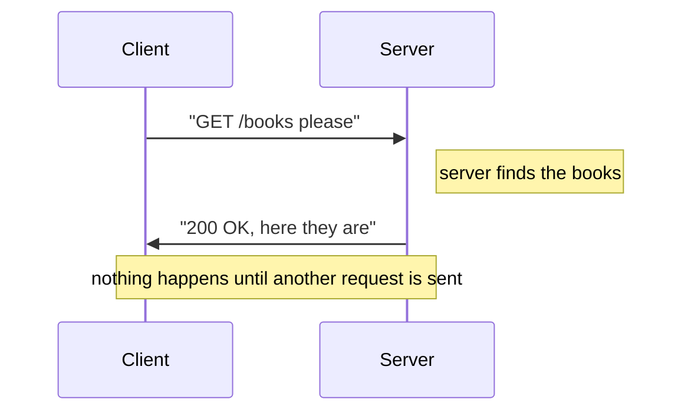

# Chapter 2: Speaking HTTP

> **Estimated time: 50 minutes**

## What You'll Learn

- What HTTP is and why it exists
- The anatomy of an HTTP request and response
- The meaning of HTTP methods (GET, POST, PUT, DELETE)
- What status codes mean (200, 404, 500, etc.)
- How to use `curl` to send real HTTP requests from your terminal

---

## Concepts

### What Is HTTP?

Okay, so in Chapter 1 we said clients and servers talk to each other. Great. But *how*? Like, what language are they speaking? Is there grammar? Punctuation? A secret handshake?

Yes. Yes there is. And it's called **HTTP** -- **HyperText Transfer Protocol**.

Let's rip that name apart word by word, because every piece actually means something:

- **HyperText** -- Back in the day, the web was just documents ("text") that linked to other documents ("hyper"). Those clickable links are what turned it into a "web" instead of a "pile."
- **Transfer** -- Moving stuff from here to there. HTTP moves data between a client and a server.
- **Protocol** -- A fancy word for "rules both sides agree on." Just like two people need to speak the same language to have a conversation, a client and server need to agree on message format. Otherwise? Total gibberish.

So HTTP is literally: *the rules for transferring data on the web*. That's it. No magic.

**Think of it this way.** Imagine you're writing a formal letter. There are conventions: date at the top, recipient's address, "Dear So-and-So," body text, "Sincerely, Your Name." You *could* scribble everything sideways in crayon, but the post office would look at you funny, and the recipient wouldn't know what to do with it. HTTP is exactly this -- it's the agreed-upon format so that web messages actually get understood.

> **Brain Power:** Before you read on, try to answer this: If HTTP didn't exist, what would happen when your browser tried to load a website? What problem would arise?

#### Why Does HTTP Exist?

Before HTTP, there was no standard way for computers to request web pages from each other. Imagine if every website spoke a completely different language -- French for Google, Mandarin for Amazon, Klingon for Wikipedia. Your browser would need a separate translator for *every single site*. That sounds exhausting.

HTTP solved this by defining **one universal format** that every web client and every web server speaks. One language to rule them all.

This is why it works *everywhere*: a browser on your phone, a `curl` command on your laptop, a Python script on a server -- they can all talk to the same web server because they all speak HTTP. You just learned one of the most important ideas in web development, and we're only on page two.

> **Key Point:** HTTP is a universal language. Every client, every server, every platform speaks it. That's why the web works.

#### HTTP vs HTTPS -- What's the "S"?

You've probably noticed some URLs start with `http://` and others with `https://`. The "S" stands for **Secure**. And yes, it matters. A lot.

- **HTTP**: Messages are sent as plain text. Anyone sitting between the client and server (like that sketchy person on the coffee shop Wi-Fi) could potentially read everything. Your password, your credit card, your embarrassing search history -- all in the open.
- **HTTPS**: Messages are **encrypted** using TLS (Transport Layer Security). Even if someone intercepts the data, all they see is random gibberish. Like trying to read a letter that's been put through a shredder.

```mermaid
flowchart LR
    subgraph HTTP
        A1[Client] -- "\"password=secret123\"" --> B1[Server]
    end
    subgraph HTTPS
        A2[Client] -- "\"a7f2x9k3m...\" (encrypted)" --> B2[Server]
    end

    style HTTP fill:#fee,stroke:#c00
    style HTTPS fill:#efe,stroke:#0a0
```

Today, virtually all websites use HTTPS. When you build your Spring Boot app, you'll start with HTTP on `localhost` (which is totally fine -- you're talking to yourself, so who's eavesdropping?), but any real deployment should use HTTPS.

> **There are no Dumb Questions:**
>
> **Q: Do I need to understand encryption to use HTTPS?**
>
> A: Nope. Not at all. HTTPS is handled by the infrastructure -- web servers, load balancers, cloud providers. You just flip a switch (or add a certificate), and it works. You need to *know* it exists and *why* it matters, but the math? Leave that to the cryptographers.
>
> **Q: If HTTPS is better, why does HTTP even exist anymore?**
>
> A: Historical reasons. HTTP came first (1991), and HTTPS came later. These days, browsers literally warn you if a site uses plain HTTP. It's like sending a postcard vs. a sealed envelope -- postcards still exist, but you wouldn't write your bank password on one.

> HTTP was invented in 1991 by Tim Berners-Lee at CERN. It's been upgraded several times (HTTP/1.0, HTTP/1.1, HTTP/2, HTTP/3), but the core concepts haven't changed. Every version still follows the same request-response pattern you'll learn in this chapter.

### The Request-Response Pattern

Here's the big idea. The one that everything else is built on. Ready?

HTTP is built entirely on **request-response**:

1. The client sends an **HTTP request** -- a structured message that says "I want something"
2. The server reads the request, does some work, and sends back an **HTTP response**
3. Done. The conversation is over. Connection can close.

That's it. No small talk. No "how's the weather?" No ongoing dialogue. Just ask, answer, done.



The server **never sends a message first**. It always waits for a request. This is a fundamental rule. Even if the server has exciting new data to share -- a breaking news alert, a new message from your friend -- it keeps quiet until a client asks. The server is like that friend who never texts first.

> **Key Point:** When you write your Spring Boot application, you'll write code that handles *incoming* requests. You never write code that reaches out to a client unprompted. Your code sits there waiting, a request arrives, your code runs, it sends a response, and it goes back to waiting. Think of it like being a barista -- you don't chase people down the street offering coffee. You stand behind the counter and wait for someone to order.

> **Overheard at the coffee shop:**
>
> *Developer 1:* "I want my server to push updates to the client whenever data changes."
>
> *Developer 2:* "That's not how HTTP works. The client has to ask."
>
> *Developer 1:* "So the client has to keep asking over and over?"
>
> *Developer 2:* "With plain HTTP, yeah. There are other technologies like WebSockets for real-time stuff, but basic HTTP is always ask-then-answer."

### Anatomy of an HTTP Request

Every HTTP request has this structure:

```
[METHOD] [PATH] HTTP/[VERSION]
[Header-1]: [Value-1]
[Header-2]: [Value-2]
...
(empty line)
[Body (optional)]
```

Looks a bit intimidating? Don't worry. Let's look at a real one and tear it apart piece by piece:

```http
GET /books?genre=fiction HTTP/1.1
Host: www.bookshelf.com
Accept: application/json
User-Agent: Mozilla/5.0
```

See? Four lines. That's a complete HTTP request. Your browser sends something just like this every time you visit a webpage. Let's break down each part.

#### 1. The Request Line

The first line is the most important. It tells the server three things at once:

```
GET /books?genre=fiction HTTP/1.1
|    |     |              |
|    |     |              +-- Protocol version
|    |     +-- Query parameter (filtering)
|    +-- Path (which resource)
+-- Method (what action)
```

Think of this like walking up to a library desk and saying: "I'd like to *read* the *fiction books*, please, and I'm speaking *English*." Method, path, language version -- all in one sentence.

#### 2. Headers

**Headers** are **metadata** about the request -- extra information that helps the server understand what the client wants. They always come in `Name: Value` pairs, one per line.

```
Host: www.bookshelf.com        <-- Which server this is for
Accept: application/json       <-- "I want JSON back, not HTML"
Content-Type: application/json <-- "The data I'm sending is JSON"
Authorization: Bearer abc123   <-- "Here are my credentials"
User-Agent: Mozilla/5.0        <-- "I'm a browser"
```

Think of headers like the envelope of a letter -- they contain routing and handling instructions, not the actual message. The postal worker reads the envelope. The recipient reads the letter inside.

**Common headers explained:**

| Header | What it tells the server | Analogy |
|--------|--------------------------|---------|
| `Host` | Which website you're trying to reach | The "To" address on an envelope |
| `Content-Type` | The format of the data you're *sending* | "This package contains glass -- handle accordingly" |
| `Accept` | The format you *want back* | "Please reply in English, not French" |
| `Authorization` | Who you are (your credentials) | Showing your ID at the door |
| `User-Agent` | What kind of client you are | "I'm calling from a cell phone, not a landline" |

You don't need to memorize all headers -- there are dozens. These five are the ones you'll encounter most when building APIs.

> **Brain Power:** Look at the `Accept` and `Content-Type` headers. One describes what you're *sending*, the other describes what you want to *receive*. Can you figure out which is which without looking back? (Hint: think about the words "accept" and "content.")

#### 3. Body (Optional)

The body contains data the client is sending to the server. Not all requests have a body -- if you're just *asking* for something, what would you put in the box?

Notice that the body is separated from the headers by **one empty line** -- this is how the server knows where headers end and data begins. That blank line isn't just whitespace. It's load-bearing whitespace.

```http
POST /books HTTP/1.1           <-- Request line
Host: www.bookshelf.com        <-- Header
Content-Type: application/json <-- Header
                               <-- Empty line (REQUIRED -- separates headers from body)
{                              <-- Body starts here
    "title": "Clean Code",
    "author": "Robert Martin",
    "pages": 464
}
```

A `GET` request typically has **no body** (you're asking for data, not sending it).
A `POST` request typically **has a body** (you're sending data to create something).

**Here's another way to think about it.** Ordering food vs. sending a gift. When you order food (GET), you just say what you want -- no package needed. When you send a gift (POST), you need to include the actual item in the box. You wouldn't hand someone an empty Amazon box and expect them to figure out what you meant.

> **Watch it!** That empty line between headers and body isn't optional. If you forget it, the server will try to parse your JSON as headers and get very confused. It's like forgetting to put a stamp on a letter -- technically a small thing, but it breaks everything.

### HTTP Methods: What Do You Want to Do?

HTTP defines several **methods** (also called "verbs") that describe the *intent* of the request. Same path, different method, completely different meaning.

| Method | Purpose | Analogy | Has Body? |
|--------|---------|---------|-----------|
| `GET` | Retrieve data | "Show me..." | No |
| `POST` | Create something new | "Here's a new..." | Yes |
| `PUT` | Update something (replace entirely) | "Replace this with..." | Yes |
| `PATCH` | Update something (modify partially) | "Change just this field..." | Yes |
| `DELETE` | Remove something | "Delete this..." | Rarely |

That table is nice, but let's make this really stick. Time for something different.

---

#### An Exclusive Interview with the HTTP Methods

*We sat down with the five HTTP methods to hear, in their own words, what they do and why they matter. Things got... interesting.*

---

**Interviewer:** Welcome, everyone. Let's start with you, GET. You're the most popular HTTP method on the planet. How does that feel?

**GET:** Honestly? It's a lot of pressure. I handle something like 90% of all web traffic. Every time someone loads a webpage, clicks a link, or searches for something -- that's me. My whole job is simple: *give me that data*. I don't change anything. I don't create anything. I just fetch and deliver.

**Interviewer:** So you're read-only?

**GET:** Completely. You can call me a thousand times and nothing changes on the server. I'm **safe**. I'm **idempotent**. I'm basically the librarian of HTTP -- you ask me for a book, I hand it to you, the library stays exactly the same.

**Interviewer:** Interesting. POST, you're next. How would you describe your role?

**POST:** I'm the *creator*. When someone wants to add something new to the world -- a new user account, a new blog post, a new order -- they come to me. They hand me data in a body, and I make something that didn't exist before. Every time you call me, I create something *new*. Call me ten times? Ten new things.

**Interviewer:** That sounds like it could cause problems.

**POST:** (shrugs) That's why you don't call me by accident. Browsers actually warn users before resending a POST request. You know that "Are you sure you want to resubmit this form?" dialog? That's because of me. I have *side effects*, baby.

**Interviewer:** PUT, you and PATCH seem similar. What's the difference?

**PUT:** I'm the *replacer*. You give me the complete new version of something, and I swap it in wholesale. If a book record has a title, author, and page count, and you PUT with just title and author? The page count is *gone*. I replace the entire thing. Think of me as tearing out a page and taping in a brand-new one.

**PATCH:** And I'm the *tweaker*. I only change the specific fields you mention. Want to update just the title? Send me `{"title": "New Title"}` and everything else stays untouched. I'm like using correction fluid on one word instead of retyping the whole page.

**Interviewer:** DELETE, you've been quiet.

**DELETE:** Not much to say. You point me at something, I remove it. No body needed -- the path tells me what to get rid of. I'm simple. I'm efficient. And I'm permanent. Don't call me unless you mean it.

**Interviewer:** Any final words?

**GET:** Use the right method for the job. If you use me to delete things, you'll have a very bad day.

---

> **Key Point: GET vs POST -- The Big Distinction.** GET is for *reading*. POST is for *writing*. If an operation changes data on the server, it should never be a GET. This isn't just a convention -- browsers, caches, and proxies all assume GET is safe to repeat or cache. If your GET request deletes data, a cache might "helpfully" replay it. Yikes.

**This maps perfectly to database operations (CRUD):**

| CRUD Operation | HTTP Method |
|----------------|-------------|
| **C**reate | POST |
| **R**ead | GET |
| **U**pdate | PUT / PATCH |
| **D**elete | DELETE |

See that? The web and databases are speaking the same language. **C**reate, **R**ead, **U**pdate, **D**elete. Four operations. Four methods. This is the part where it clicks.

#### Examples in Context

Imagine a bookstore API:

```
GET    /books          -> Get all books
GET    /books/42       -> Get book with ID 42
POST   /books          -> Create a new book (data in body)
PUT    /books/42       -> Replace book 42 with new data (data in body)
PATCH  /books/42       -> Update some fields of book 42 (data in body)
DELETE /books/42       -> Delete book 42
```

> **Brain Power:** Notice that `GET /books` and `POST /books` use the *same path* but do completely different things. The method changes the meaning entirely. Before reading on, sketch out what `GET /users/7` and `DELETE /users/7` would do. Same path, different method -- what happens in each case?

### Anatomy of an HTTP Response

The server's response has a similar structure to the request. If you understood the request, you're already 80% of the way there:

```
HTTP/[VERSION] [STATUS CODE] [STATUS TEXT]
[Header-1]: [Value-1]
[Header-2]: [Value-2]
...
(empty line)
[Body]
```

Real example:

```http
HTTP/1.1 200 OK
Content-Type: application/json
Content-Length: 82

{
    "id": 42,
    "title": "Clean Code",
    "author": "Robert Martin",
    "pages": 464
}
```

Notice the first line? Instead of a method and path, it has a **status code** and **status text**. That three-digit number is the server's way of telling you how things went. And oh boy, does it have stories to tell.

### Status Codes: How Did It Go?

The **status code** is a three-digit number that tells the client what happened. You don't need to memorize all of them (there are dozens), but understanding the categories is essential.

Here's the big picture:

| Range | Category | Meaning |
|-------|----------|---------|
| **1xx** | Informational | "Hold on, still processing..." (rare, you'll almost never use these) |
| **2xx** | Success | "It worked!" |
| **3xx** | Redirection | "Go look somewhere else" |
| **4xx** | Client Error | "You did something wrong" |
| **5xx** | Server Error | "I (the server) broke" |

> **Key Point:** The first digit tells you the *category*. 2 = good. 4 = your fault. 5 = server's fault. Even if you see a status code you've never encountered before, you can figure out the general meaning from that first digit. A 418? You've never seen it, but you know it's a 4xx -- so the client did something wrong. (Actually, 418 is "I'm a teapot." Yes, really. It's a joke from an April Fools' RFC. The internet is a beautiful place.)

#### The Ones You'll Use Daily -- A Restaurant Analogy

Let's imagine status codes as things that happen at a restaurant. You walk in, sit down, and try to order. Here's what the waiter might tell you:

| Code | Name | The Restaurant Version |
|------|------|----------------------|
| **200** | OK | "Here's your food, exactly what you ordered." |
| **201** | Created | "Great news -- we've created a new reservation for you! Table 43 is yours." |
| **204** | No Content | "Done! Your reservation has been cancelled. Nothing else to tell you." |
| **400** | Bad Request | "Sir, you ordered a 'hamburger pizza taco.' That's not... a thing. Please order something that makes sense." |
| **401** | Unauthorized | "Do you have a reservation? I need to see some ID before I can seat you." |
| **403** | Forbidden | "I *know* who you are, Mr. Smith. But that table is in the VIP section, and you're not on the list." |
| **404** | Not Found | "Table 9999? We don't have a table 9999. This restaurant only has 50 tables." |
| **405** | Method Not Allowed | "You can *look at* the dessert menu, but you can't *delete* it. That's not how this works." |
| **500** | Internal Server Error | "I'm so sorry -- the kitchen is on fire. This is entirely our fault. Please don't blame yourself." |

> **There are no Dumb Questions:**
>
> **Q: What's the difference between 401 and 403? They both mean "no access," right?**
>
> A: Close, but there's an important distinction. **401** means "I don't know who you are -- please identify yourself." It's a bouncer saying "show me your ID." **403** means "I know *exactly* who you are, and the answer is still no." It's a bouncer saying "You're not on the list, Dave."
>
> **Q: What's the difference between 400 and 404?**
>
> A: **404** means the *resource* doesn't exist -- you asked for something that isn't there. **400** means your *request itself* is malformed -- you asked in a way that doesn't make sense. It's the difference between asking for a book that doesn't exist in the library (404) and speaking to the librarian in a language they don't understand (400).
>
> **Q: If the server crashes, does the client get a 500?**
>
> A: Usually yes, but it depends. If the server crashes *gracefully* (catches the error), it can send back a proper 500 response. If it crashes *hard* (totally dies), the client might get no response at all -- just a timeout. That's even worse than a 500, because the client doesn't know what happened.

> **Brain Power:** A user submits a form to create an account, but they leave the "email" field blank. What status code should your API return? What if the email is filled in but their account already exists? (Hint: these are two different codes.)

### URLs, URIs, and Paths

You've seen URLs your whole life. You've typed them, clicked them, bookmarked them. But have you ever really *looked* at one? Let's break one down like a mechanic taking apart an engine:

```
https://www.bookshelf.com:443/books/42?format=summary#reviews
|       |                  |   |       |              |
|       |                  |   |       |              +-- Fragment (browser-only)
|       |                  |   |       +-- Query string (parameters)
|       |                  |   +-- Path (which resource)
|       |                  +-- Port (443 is default for HTTPS)
|       +-- Host (domain name)
+-- Scheme/Protocol (HTTP or HTTPS)
```

As a backend developer, you care most about:
- **Path**: `/books/42` -- which resource is being requested
- **Query parameters**: `?format=summary` -- additional options/filters
- **Method**: combined with the path, this defines the operation

The scheme, host, and port? Those are handled by the infrastructure. You just write the code that responds to paths. It's like being a restaurant chef -- you don't worry about how customers find the restaurant (that's the address, the sign out front, the Google Maps listing). You just focus on what happens when an order ticket comes through the kitchen window.

### HTTP Is Stateless

Okay, this next concept trips people up, so pay attention. Ready?

**HTTP has no memory.**

Each request is completely independent. The server doesn't remember your previous request. It doesn't remember your name. It doesn't remember what you ordered five seconds ago. Every single request must contain *all* the information the server needs to process it. Every. Single. Time.

**Analogy**: Imagine a restaurant where the waiter has amnesia. Not the fun movie kind -- the real, "I genuinely don't know who you are" kind. Every time you call them over, you have to re-introduce yourself, re-state your entire order history, and explain everything from scratch. "Hi, I'm table 5, my name is Alice, I already ordered a salad and the check hasn't come yet, and now I'd like a coffee."

Sounds absurd? That's HTTP.

```
Request 1: "GET /cart"  +  "I am user Alice (token: abc123)"
  -> Server looks up Alice's cart, returns it

Request 2: "POST /cart/add"  +  "I am user Alice (token: abc123)"
  -> Server has NO memory of Request 1
  -> It reads the token, recognizes Alice, and processes the request

Without the token in Request 2, the server would say:
  "401 Unauthorized -- who are you?"
```

"But wait," you're thinking. "That seems *terrible*. Why would anyone design it this way?"

Here's the twist: it's actually *brilliant*. Because the server has no memory, it means *any* server can handle *any* request. You don't need to go back to the same server every time. This is how websites handle millions of users -- they have dozens or hundreds of servers, and it doesn't matter which one handles your request. Any of them can do it, because they're all equally clueless about your history.

You just had an aha moment, didn't you?

> **There are no Dumb Questions:**
>
> **Q: If HTTP is stateless, how do websites "remember" that I'm logged in?**
>
> A: Through **tokens** or **cookies** -- small pieces of data the client sends with *every* request that say "I am user X, I already logged in." The *client* is responsible for storing and re-sending this token. The server just validates it. It's like wearing a wristband at a music festival -- the security guard doesn't remember your face, but they check the wristband every time you walk through a gate. We'll cover this in Chapter 18 (Security).
>
> **Q: So every request has to send credentials?**
>
> A: Yep. Every single one. That's why tokens are usually sent in headers automatically -- the client (browser, mobile app, etc.) handles it so you don't have to think about it. But under the hood, every request is a self-contained package with everything the server needs.

> **Key Point:** HTTP being stateless is not a bug -- it's a feature. It's the reason the web can scale to billions of users. Any server can handle any request, because no server needs to "remember" anything.

### Putting It All Together -- A Complete HTTP Conversation

Let's trace a full HTTP conversation step by step. This is where all the pieces click into place. You want to add a book to a bookshelf API:

```
1. You (the client) construct a request:

   POST /books HTTP/1.1                    <-- Method + Path + Version
   Host: www.bookshelf.com                 <-- Header: which server
   Content-Type: application/json          <-- Header: I'm sending JSON
   Authorization: Bearer my-token-123      <-- Header: who I am
                                           <-- Empty line: end of headers
   {"title": "Clean Code", "pages": 464}   <-- Body: the actual data

2. This request travels over the internet to the server.

3. The server reads it and understands:
   - Method is POST -> client wants to CREATE something
   - Path is /books -> the "books" resource
   - Content-Type is JSON -> parse the body as JSON
   - Authorization token is valid -> this user is allowed

4. The server creates the book in its database and responds:

   HTTP/1.1 201 Created                    <-- Status: it worked, something was created
   Content-Type: application/json          <-- Header: I'm sending JSON back
   Location: /books/43                     <-- Header: here's where the new book lives
                                           <-- Empty line
   {"id": 43, "title": "Clean Code", "pages": 464}  <-- Body: the created book with its new ID

5. Your client receives this and knows:
   - 201 = success, a new resource was created
   - The new book has ID 43
   - Done. Connection can close.
```

Look at that. A complete conversation in five steps. The client asked, the server answered, and now it's over. No lingering. No "let's stay in touch." Just clean, professional, transactional communication.

**This is the conversation your Spring Boot code will participate in.** You'll write the code for step 3 -- receiving the request, doing the work, and constructing the response. Everything you learned in this chapter is the *language* your code will speak.

> **Overheard at the coffee shop:**
>
> *Junior dev:* "So my Spring Boot controller... it's basically the waiter?"
>
> *Senior dev:* "More like the chef. The framework is the waiter -- it receives the order, hands it to your code, and delivers the response. Your code is the part that actually *does the work*."
>
> *Junior dev:* "And the HTTP request is the order ticket?"
>
> *Senior dev:* "Now you're getting it."

---

## Code Examples

### Seeing Real HTTP with curl

Enough theory. Time to actually *do* something.

`curl` is a command-line tool for sending HTTP requests. It lets you act as a client and talk to any server, right from your terminal -- no browser needed. Think of it as a telephone where you can call any web server and have a conversation in HTTP.

Why should you care? Because when you're building APIs, you need to test them. You need to send requests and see what comes back. Sure, there are fancy GUI tools (Postman, Insomnia), but `curl` is everywhere, it's fast, and knowing it makes you look like a wizard.

#### Installing / Finding curl on Your System

| OS | Status | How to Open a Terminal |
|----|--------|-----------------------|
| **macOS** | Pre-installed | Open **Terminal** (search for it in Spotlight with `Cmd + Space`) |
| **Linux** | Pre-installed on most distributions | Open your distro's terminal application |
| **Windows 10/11** | Pre-installed (ships with Windows since 2018) | Open **PowerShell** or **Command Prompt** (search for "PowerShell" in the Start menu) |
| **Older Windows** | Not included | Install [Git for Windows](https://gitforwindows.org/) -- it includes `curl` and a "Git Bash" terminal |

Verify it works by typing:

```bash
curl --version
```

You should see output like `curl 7.x.x` or `curl 8.x.x` with a list of supported protocols. If you see an error, curl isn't installed -- follow the table above.

> **Windows users -- important differences:**
>
> Windows PowerShell and Command Prompt handle quotes differently from macOS/Linux terminals. Throughout this guide, code examples use **single quotes** (`'...'`) around JSON data, which works on macOS and Linux. On Windows, you have two options:
>
> **Option A -- Use Git Bash (Recommended):** Install [Git for Windows](https://gitforwindows.org/) and use the included "Git Bash" terminal. All examples in this guide will work exactly as written.
>
> **Option B -- Use PowerShell with double quotes:** Replace single quotes with double quotes and escape the inner double quotes with backslashes:
>
> ```powershell
> # macOS / Linux / Git Bash:
> curl -X POST https://example.com/api -d '{"title": "My Book"}'
>
> # Windows PowerShell:
> curl -X POST https://example.com/api -d "{\"title\": \"My Book\"}"
> ```
>
> **Option C -- Use PowerShell with a file:** Put the JSON in a file and reference it:
>
> ```powershell
> # Save JSON to a file
> echo '{"title": "My Book"}' > data.json
>
> # Reference the file with @
> curl -X POST https://example.com/api -H "Content-Type: application/json" -d @data.json
> ```
>
> We recommend **Git Bash** for following this guide. It gives you a Linux-like terminal on Windows, so every example works without modification.

Alright, open your terminal. It's time to talk to a real server. For real. Right now.

#### 1. Simple GET request

```bash
curl https://jsonplaceholder.typicode.com/posts/1
```

This sends a `GET` request and shows the response body. You'll see JSON data about a blog post.

You just talked to a real server! Seriously -- that server is sitting in a data center somewhere, and your computer just had a conversation with it using HTTP. How cool is that?

#### 2. See the full HTTP conversation

```bash
curl -v https://jsonplaceholder.typicode.com/posts/1
```

The `-v` flag (verbose) shows *everything* -- the request headers, the response headers, the status code. It's like wiretapping your own HTTP conversation. Look for:
- `> GET /posts/1 HTTP/2` -- the request line (what YOU sent)
- `< HTTP/2 200` -- the status code (what the server said back)
- The JSON body at the bottom

> **Brain Power:** Before running this command, predict what headers you'll see in the request. Will there be a `Host` header? An `Accept` header? Run it and check -- were you right?

#### 3. Send a POST request with data

```bash
curl -X POST https://jsonplaceholder.typicode.com/posts \
  -H "Content-Type: application/json" \
  -d '{"title": "My Post", "body": "Hello world", "userId": 1}'
```

Breaking this down:
- `-X POST` -- use the POST method (instead of the default GET)
- `-H "Content-Type: application/json"` -- set a header telling the server we're sending JSON
- `-d '{...}'` -- the request body (the data we're sending)

The server will respond with `201 Created` and echo back the data with an assigned ID. You just *created* something on a remote server. From your terminal. With one command.

> **Watch it!** If you forget the `-H "Content-Type: application/json"` header, the server might not know how to parse your data. Remember those headers we talked about? They're not optional fluff -- they're instructions. It's like mailing a package without writing "FRAGILE" on it and then being surprised when it arrives broken.

#### 4. See only the response headers

```bash
curl -I https://jsonplaceholder.typicode.com/posts/1
```

The `-I` flag shows just the headers, not the body. This is useful when you want to peek at the metadata without downloading the whole response. Notice `Content-Type`, `Content-Length`, etc. -- all that metadata we talked about earlier.

#### 5. Try a 404

```bash
curl -v https://jsonplaceholder.typicode.com/posts/99999
```

This asks for a post that doesn't exist. Look for `404` in the response. The server is basically saying "Never heard of her." You asked for post 99999, and the server has no idea what you're talking about.

> **Key Point:** Every `curl` command you just ran followed the exact same pattern we learned earlier: client sends request, server sends response. The `-v` flag just lets you see the full conversation instead of only the response body. When you're debugging your own APIs later, `-v` will be your best friend.

### Reading curl Output

When you use `-v`, curl marks lines with special symbols so you can tell who said what:
- `>` -- data your computer **sent** (the request)
- `<` -- data the server **sent back** (the response)
- `*` -- curl's own informational messages (not part of the HTTP conversation)

```
* Connecting to jsonplaceholder.typicode.com...
> GET /posts/1 HTTP/2          <-- YOUR REQUEST
> Host: jsonplaceholder.typicode.com
> Accept: */*
>
< HTTP/2 200                   <-- SERVER'S RESPONSE
< content-type: application/json
< content-length: 292
<
{                              <-- RESPONSE BODY
  "userId": 1,
  "id": 1,
  "title": "sunt aut facere...",
  "body": "quia et suscipit..."
}
```

Think of `>` as an arrow pointing *away* from you (outgoing) and `<` as an arrow pointing *toward* you (incoming). Once you see it that way, reading verbose curl output becomes second nature.

---

## Exercise: Explore HTTP in the Wild

**Goal**: Build intuition for HTTP by sending real requests and examining the responses. No more theory -- you're going hands-on.

### Part 1: Reading Responses

Using `curl -v`, send GET requests to these URLs and answer the questions:

1. `https://jsonplaceholder.typicode.com/users` -- What status code do you get? What kind of data comes back?

2. `https://jsonplaceholder.typicode.com/users/1` -- How is this response different from the previous one? (Hint: list vs. single item)

3. `https://jsonplaceholder.typicode.com/users/9999` -- What status code do you get? What's in the body?

> **Brain Power:** For question 3, predict the status code *before* you run the command. You already know enough to get this right.

### Part 2: Sending Data

4. Send a POST request to create a new user:

**macOS / Linux / Git Bash:**
```bash
curl -X POST https://jsonplaceholder.typicode.com/posts \
  -H "Content-Type: application/json" \
  -d '{"title": "Learning HTTP", "body": "This is my first POST request!", "userId": 1}'
```

**Windows PowerShell:**
```powershell
curl -X POST https://jsonplaceholder.typicode.com/posts `
  -H "Content-Type: application/json" `
  -d "{`\"title`\": `\"Learning HTTP`\", `\"body`\": `\"This is my first POST request!`\", `\"userId`\": 1}"
```

What status code do you get? What's different about a 201 vs a 200? (Think back to the restaurant analogy -- 200 is "here's your food" and 201 is "we *created* a new reservation for you.")

### Part 3: Other Methods

5. Send a PUT request to update post #1:

**macOS / Linux / Git Bash:**
```bash
curl -X PUT https://jsonplaceholder.typicode.com/posts/1 \
  -H "Content-Type: application/json" \
  -d '{"id": 1, "title": "Updated Title", "body": "Updated body", "userId": 1}'
```

**Windows PowerShell:**
```powershell
curl -X PUT https://jsonplaceholder.typicode.com/posts/1 `
  -H "Content-Type: application/json" `
  -d "{`\"id`\": 1, `\"title`\": `\"Updated Title`\", `\"body`\": `\"Updated body`\", `\"userId`\": 1}"
```

6. Send a DELETE request:
```bash
curl -X DELETE https://jsonplaceholder.typicode.com/posts/1
```

(This command works the same on all platforms -- no quotes needed.)

What status code does DELETE return? Is there a response body?

> **Brain Power:** You've now used GET, POST, PUT, and DELETE. Map each one to a CRUD operation without looking at the table above. Write it down. Then check. Did you get all four?

### Part 4: Reflection

Write down (in your own words):
- What is the difference between GET and POST?
- Why does POST need a body but GET doesn't?
- What's the difference between a 400 error and a 500 error?

Don't skip this part. Seriously. The act of writing things in your own words is what moves knowledge from "I kinda get it" to "I *own* this." Your brain needs to wrestle with the concepts, not just read them.

---

## Common Mistakes

> **Watch it!** These are the mistakes everyone makes. Yes, everyone. Even experienced developers. Don't feel bad if you've thought any of these -- just don't *keep* thinking them.

| Mistake | Reality |
|---------|---------|
| "GET and POST are basically the same" | They have fundamentally different purposes. GET retrieves data (read-only, safe, cacheable). POST creates data (has side effects, not cacheable). Using GET to change data is like using a screwdriver as a hammer -- it might work once, but it's going to cause problems. |
| "Status codes don't matter, I'll just return 200 for everything" | Status codes are part of your API contract. Clients rely on them to handle responses correctly. A mobile app needs to know if it got a 401 (show login screen) vs 500 (show error message). Returning 200 for errors is like a doctor saying "you're fine" when you clearly have a broken arm. |
| "Headers are optional fluff" | Headers carry critical information. `Content-Type` tells the server how to parse the body. `Authorization` carries credentials. Without headers, the server can't understand your request. They're the envelope on your letter -- without them, it's just a loose piece of paper blowing in the wind. |
| "HTTP keeps a connection open between requests" | HTTP is stateless. Each request is independent. (HTTP/1.1 does reuse TCP connections for performance, but logically each request is self-contained. The waiter still has amnesia.) |

---

### Practice Exercises

Ready to test your understanding? These exercises from [Appendix E](../../appendices/E-coding-exercises.md) directly apply what you learned in this chapter:

| Exercise | Topic | Difficulty |
|----------|-------|------------|
| [Exercise 1](../../appendices/E-coding-exercises.md#exercise-1) | Exploring HTTP with curl | star |
| [Exercise 4](../../appendices/E-coding-exercises.md#exercise-4) | Match HTTP Methods to CRUD | star |
| [Exercise 6](../../appendices/E-coding-exercises.md#exercise-6) | Decode a curl Command | star |

Solutions are in [Appendix F](../../appendices/F-exercise-solutions.md).

---

## Key Takeaways

Let's make sure everything stuck. Check off each item you feel confident about:

- [ ] I understand that HTTP is the protocol (shared language) that clients and servers use
- [ ] I can identify the parts of an HTTP request: method, path, headers, body
- [ ] I know the main HTTP methods: GET (read), POST (create), PUT (update), DELETE (remove)
- [ ] I understand status code categories: 2xx (success), 4xx (client error), 5xx (server error)
- [ ] I can use `curl` to send HTTP requests and read the responses
- [ ] I understand that HTTP is stateless -- each request is independent

If you checked all six boxes, congratulations -- you now speak HTTP. Not fluently yet, but you can hold a conversation. And that's exactly what your Spring Boot code is going to do.

---

## Quick Quiz

> **Brain Power:** Try answering these without scrolling back up. If you get stuck, that's fine -- it just means you know which section to revisit.

1. You want to fetch a user's profile. Which HTTP method do you use?
2. You want to create a new blog post. Which method? Does the request need a body?
3. Your request gets back a `403`. What went wrong? Is it your fault or the server's?
4. What's the difference between `404` and `400`?
5. Why does the `Content-Type: application/json` header matter when sending a POST request?

> **There are no Dumb Questions:**
>
> **Q: I got all five right. Am I ready to build an API?**
>
> A: Almost! You understand the *language* -- now you need to learn the *framework* that helps you write server-side code. That's Spring Boot, and it's coming up very soon.
>
> **Q: I got some wrong. Should I re-read this chapter?**
>
> A: Yes, but only the sections you got wrong on. Don't re-read the whole thing -- target your weak spots. That's how efficient learners work.

---

*Next: `03-what-is-a-backend.md` -- Now that you know how the web works, let's understand where your code fits in ->*
