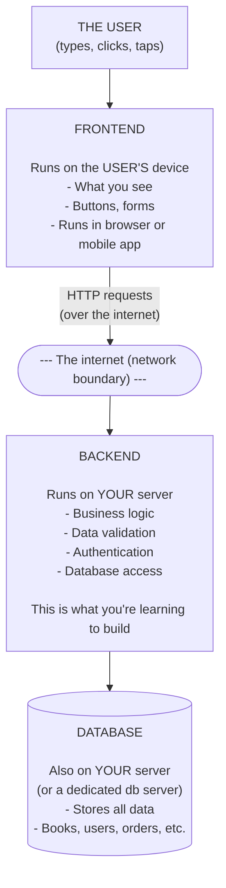
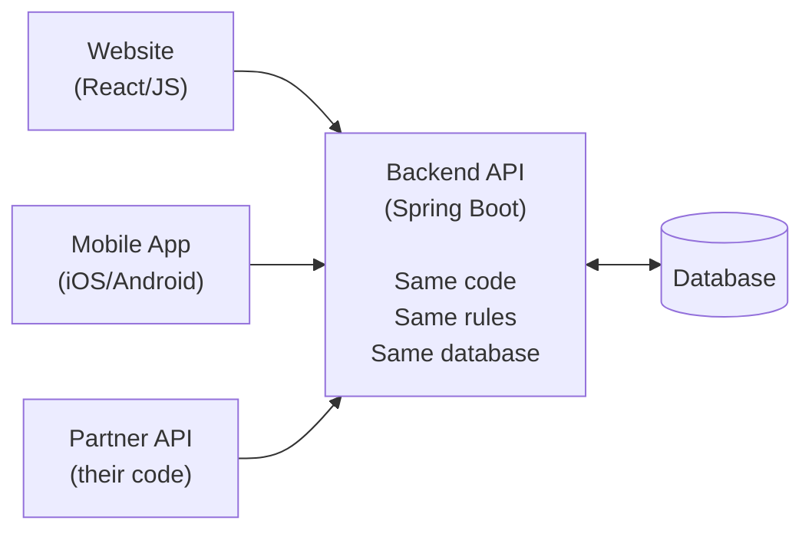
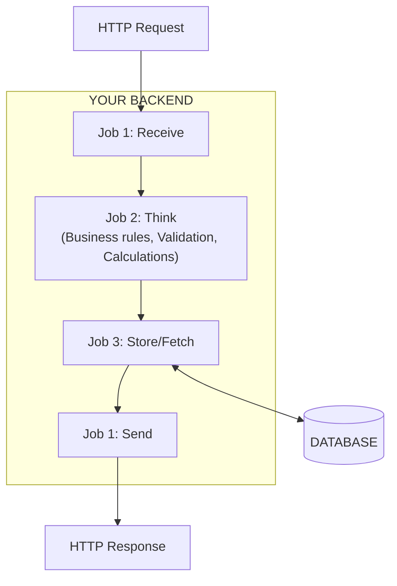
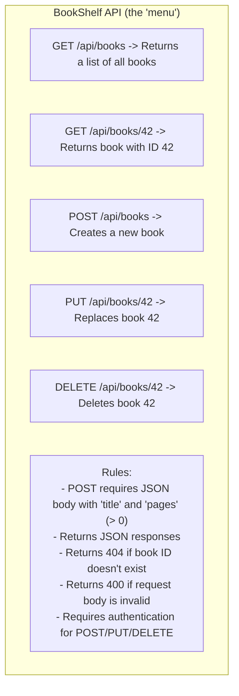
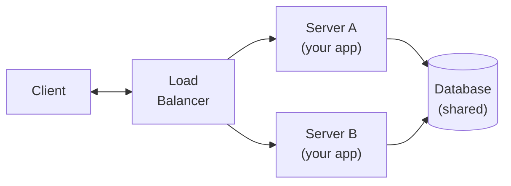
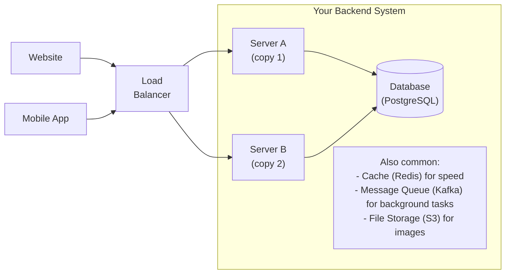
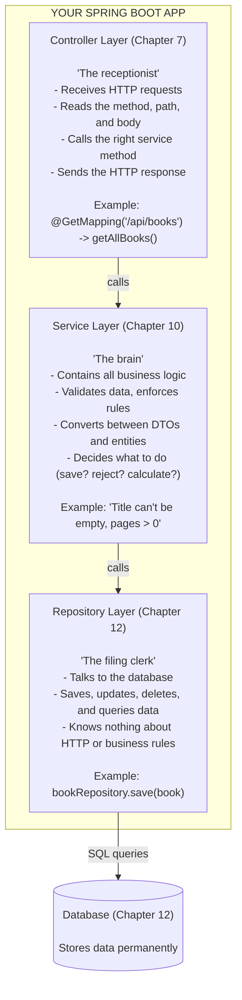

# Chapter 3: What Is a Backend Application?

> :hourglass_flowing_sand: Estimated time: 60 minutes

## What You'll Learn

- What "frontend" and "backend" actually mean --- and why they're separated
- The three jobs every backend application does (receive, think, store)
- What an API is and why it's the backend's public contract
- Why the backend is stateless (and what breaks when it isn't)
- How real-world backends are structured beyond just "one server"
- Where your Spring Boot code fits in the bigger picture

> **Quick Summary**: A backend is a program that sits on a server, waits for HTTP requests, runs business logic, talks to a database, and sends responses. It never draws buttons or renders pages --- it deals in *data* and *rules*. The frontend handles everything the user sees; the backend handles everything the user doesn't.

---

## Concepts

### Frontend vs. Backend

Alright, you know HTTP. You know how clients and servers talk to each other. Now it's time to zoom in on the *server side* of that conversation --- the thing you're going to spend the rest of this guide actually building.

When someone builds a web application, there are two halves. And they are *very* different creatures.

**Frontend (Client-Side)**
- What the user **sees and interacts with**
- HTML, CSS, JavaScript in a browser --- or a mobile app on a phone
- Handles layout, buttons, animations, user input
- Runs on the *user's* device (their phone, their laptop, their tablet)

**Backend (Server-Side)**
- What the user **never sees**
- The logic, rules, and data behind the application
- Handles business rules, data storage, authentication, security
- Runs on a *server* (a computer **you** control)

Here's the key insight --- the one that makes everything else in this chapter click: **the frontend and backend are completely separate programs running on different computers**. The frontend runs on the user's device. The backend runs on your server. They communicate over the internet using HTTP --- the protocol you learned in Chapter 2.

Read that again. *Separate programs. Different computers.* This isn't just an organizational choice. It's a fundamental architectural boundary.



**Analogy --- The Restaurant**:
- **Frontend** = the dining room. Menus, tables, plates, the waiter. Everything the customer sees.
- **Backend** = the kitchen. Recipes, cooking, food prep, inventory management. The customer never sees this.
- **Database** = the pantry/fridge. Where all the ingredients are stored.

The waiter (HTTP) carries orders (requests) from the dining room to the kitchen, and food (responses) from the kitchen to the dining room.

We're going to milk this restaurant analogy *hard* in this chapter, by the way. Get comfortable with it.

---

> :brain: **Brain Power:** Before reading on, try this: open your phone and use any app (Instagram, a banking app, a weather app). For every screen you see, ask yourself: "What part of this is the frontend showing me, and what did the backend have to *calculate* or *look up* to make this screen possible?" You'll start seeing the seam between them everywhere.

---

#### The Frontend-Backend Interview

*We sat Frontend and Backend down in the same room and asked them to explain their jobs. Things got... spirited.*

**Interviewer:** So, Frontend, what do you do all day?

**Frontend:** I'm the face of the operation. I'm the one the user actually *sees*. I handle buttons, animations, layouts, colors --- all the stuff that makes people go "ooh, pretty." I run right there on the user's phone or laptop, in their browser. I'm *local*.

**Backend:** And I'm the one doing the actual *work*.

**Frontend:** Excuse me?

**Backend:** I said what I said. You're a pretty face. I'm the brain. When someone clicks "Place Order," you just... send me a message. *I'm* the one who checks if the item is in stock, calculates the total, charges the credit card, and updates the inventory. You just show a spinner and wait for me to finish.

**Frontend:** That spinner is *beautifully animated*, I'll have you know. And someone has to make sure the button is the right shade of blue and the layout doesn't fall apart on a tiny phone screen. Do you know how many screen sizes there are?

**Backend:** I literally don't care about screen sizes. I don't even know what a pixel is. I deal in *data*. JSON in, JSON out. You send me `{ "item": "Dune", "quantity": 1 }` and I send you back `{ "orderId": 42, "status": "confirmed" }`. What you do with that data is your business.

**Frontend:** And that's exactly why we're separated! I can be a website today and a mobile app tomorrow. As long as you keep speaking the same HTTP language, I can look however I want.

**Backend:** Finally, something we agree on.

**Interviewer:** So you two don't actually need to know how the other one works?

**Frontend:** Nope. I just need to know the *menu* --- what endpoints to call and what data format to use.

**Backend:** And I don't care who's calling me. Could be a website, a mobile app, or some partner company's system. Same request, same response. I'm an equal-opportunity data provider.

---

**What does this look like in practice?**

Think about Amazon.com:

| What you see (Frontend) | What you don't see (Backend) |
|-------------------------|------------------------------|
| The product page with images and a price | The code that looks up the product in a database of millions of items |
| The "Add to Cart" button | The code that checks inventory, calculates tax, applies discounts |
| The "Place Order" button | The code that charges your card, reserves stock, triggers shipping |
| A spinning loading indicator | The backend is doing work --- the frontend is just waiting |
| "Sorry, out of stock" message | The backend checked inventory and found 0 available |

The frontend only knows how to *display* things. All decisions about what to display, whether to allow a purchase, and how to process payments happen in the backend.

> :dart: **Key Point:** The frontend is the *messenger*. The backend is the *decision-maker*. The frontend says "the user wants to do X." The backend says "here's whether they're allowed to, and here's the result."

### Why Separate Them?

You might be thinking: "Okay, but why not just put everything in one place? Wouldn't that be simpler?"

Great question. And the answer is: it *would* be simpler... right up until it isn't. Here are four reasons why separation is worth it --- and why basically every modern application does it this way.

**Separation gives you flexibility:**

#### 1. Multiple frontends, one backend

Your bookstore can have a website, a mobile app, and a tablet app --- all talking to the *same* backend. You write the logic once.



Without this separation, you'd write the same "add a book" logic three times --- once in the website, once in the mobile app, once for the partner. When a rule changes ("max 500 pages"), you'd have to update all three. With a backend, you update the rule once. Done. Every client gets the new behavior automatically.

> :speech_balloon: **Overheard at the coffee shop:** "We changed the discount calculation and only updated the website. The mobile app was giving people the old prices for two weeks before anyone noticed. That's when we decided to move all the logic to the backend."

#### 2. Independent updates

You can completely redesign the website (new colors, new layout, new framework) without changing a single line of backend code. You can rewrite the backend in a different language without the mobile app noticing --- as long as the HTTP API stays the same.

This is *huge*. It means your frontend team and backend team can work at different speeds, make different technology choices, and deploy independently. Nobody's waiting on anybody.

#### 3. Security

Sensitive logic (payments, passwords, authorization) stays on the server where users **can't tamper with it**. This is critical. This is *the* reason you can't skip this.

```
:x: BAD: Business logic in the frontend (JavaScript in the browser)

  User opens browser DevTools -> sees JavaScript code -> changes
  "if (user.hasDiscount)" to "if (true)" -> gets free stuff

:white_check_mark: GOOD: Business logic in the backend

  User sends request -> backend checks discount rules on the server ->
  user can't see or modify the code -> rules are enforced
```

If authorization logic ("only admins can delete books") runs in the browser, anyone can bypass it by modifying the JavaScript. If it runs on the server, the user never sees the code and can't tamper with it.

> :warning: **Watch it!** This isn't hypothetical. Every web developer has a story about a company that put price validation in the frontend JavaScript. Someone changed `price = 499.99` to `price = 0.01` in their browser console and bought a laptop for a penny. Don't be that company.

#### 4. Scalability

If your app gets popular, you can add more backend servers without changing anything about the frontend. We'll see this in the Statelessness section below --- it's one of the most important concepts in this chapter.

### The Three Jobs of a Backend

Every backend application, regardless of language or framework, does three things. Whether it's Netflix handling 200 million users or your BookShelf app on localhost --- the same three jobs, every time.

> **Quick Summary**: 1. Receive the request -> 2. Think (apply rules and logic) -> 3. Store/fetch data -> send the response back.

Let's meet the three jobs. And yes, they each have a personality.

#### Job 1: Receive Requests and Send Responses --- "The Receptionist"

*Job 1 is the friendly one. It stands at the front door, greets every incoming request, and makes sure the response gets sent back out. It doesn't make decisions --- it just handles the handoff.*

The backend is an HTTP server. It listens on a port, receives HTTP requests, and sends HTTP responses. This is the "plumbing" --- the mechanism by which the outside world communicates with your application.

```
Client sends:    POST /books  { "title": "Clean Code" }
Backend does:    (Job 2 and 3)
Backend sends:   201 Created  { "id": 1, "title": "Clean Code" }
```

In Spring Boot, this job is handled by the **Controller** layer. You write methods that say "when a GET request comes to `/books`, run this code." Spring Boot handles all the low-level HTTP parsing --- reading bytes off the network, parsing headers, converting JSON to Java objects --- so you don't have to.

Think of the Controller as the receptionist at a doctor's office. The receptionist doesn't diagnose you. They just check you in, point you to the right room, and hand you your paperwork when you leave.

#### Job 2: Execute Business Logic --- "The Brain"

*Job 2 is the opinionated one. It has rules about everything. "That title is too short." "You can't borrow more than 5 books." "The page count has to be positive." It's the reason the backend exists.*

This is the *brain* of your application --- the rules, calculations, validations, and decisions. Business logic is what makes **your** application different from every other application.

Examples for a bookshelf app:
- "A book must have a title and at least one page"
- "Only admin users can delete books"
- "When a book is borrowed, decrease available copies by 1"
- "If copies reach 0, mark the book as unavailable"
- "Calculate late fees: $0.50 per day past the due date"

Examples for other apps:
- Uber: "Find the nearest available driver within 5 km"
- Twitter/X: "A tweet can't exceed 280 characters"
- Banking: "Don't allow a transfer if the account balance would go negative"

Business logic is the *reason* the backend exists. Without it, you'd just be a database with a door --- anyone could read, write, or delete anything. The business logic is the **gatekeeper** that decides what's allowed and what isn't.

In Spring Boot, business logic lives in the **Service** layer.

> :brain: **Brain Power:** Think about your bank's mobile app. What are three business rules that the backend *must* enforce? (Hint: what should the system *prevent* you from doing, even if the app's buttons let you try?)

#### Job 3: Store and Retrieve Data --- "The Filing Clerk"

*Job 3 is the quiet, reliable one. It doesn't have opinions. It doesn't make decisions. You tell it "save this" and it saves it. You ask "find me all books by Frank Herbert" and it finds them. It's the memory of your entire application.*

Most backend applications need to **persist** data --- save it so it survives server restarts. If your book data only lived in your Java program's memory, it would vanish every time the server restarted. That's useless.

This is done through a **database** --- a program designed specifically for storing, organizing, and quickly retrieving data.

- User signs up -> backend stores their name, email, hashed password
- User adds a book -> backend stores the book data
- User searches for books -> backend queries the database and returns results

```
Without a database:
  Server starts -> data is empty -> users add books -> server restarts -> ALL DATA GONE

With a database:
  Server starts -> connects to database -> data is still there from yesterday
```

In Spring Boot, data access lives in the **Repository** layer. You'll learn about JPA (Java Persistence API), which lets you write Java code instead of raw SQL queries.

> :speech_balloon: **Overheard at the coffee shop:** "We demoed the app to the CEO on Thursday. She loved it. Added a bunch of test data. Friday morning the server restarted and everything was gone. We were storing data in a HashMap. In production. Don't be us."

Now let's see all three jobs working together:



> :dart: **Key Point:** Every request to your backend follows this exact path: Receive -> Think -> Store/Fetch -> Respond. Every. Single. Time. Whether it's a tiny todo app or Netflix. The scale changes; the pattern doesn't.

---

> :bulb: **There are no Dumb Questions:**
>
> **Q: Does every request hit all three jobs? What if I just want to read data, not store it?**
>
> A: Great catch. A GET request that just fetches a list of books still touches all three jobs --- it's just that Job 3 is "fetch" instead of "store." The request comes in (Job 1), maybe some filtering or permission checks happen (Job 2), data is retrieved from the database (Job 3), and the response goes out (Job 1 again). The three-job pattern holds.
>
> **Q: What if I don't need a database? My app is simple.**
>
> A: Then you might skip Job 3 for now. A "calculator" API that adds two numbers doesn't need a database. But *most* useful applications store data, so you'll encounter Job 3 almost immediately in real-world work.
>
> **Q: Is the Controller/Service/Repository pattern a Spring Boot thing or a general thing?**
>
> A: It's a general pattern! Spring Boot makes it easy, but you'll find the same layered architecture in Django (Python), Express (Node.js), Rails (Ruby), and almost every other web framework. Learn it once, recognize it everywhere.

---

### What Is an API?

You'll hear the term **API** constantly. Like, *constantly*. In job descriptions, in documentation, in conversations with other developers. Let's make sure it's crystal clear.

**API** stands for **Application Programming Interface**. It's the set of rules and endpoints that your backend exposes to the outside world. Think of it as a **menu** at a restaurant.



The API is a **contract**: "If you send me a request in *this* format, I'll send you a response in *that* format." The client doesn't need to know how the backend works internally --- it just needs to know the menu.

This is *exactly* like a restaurant menu. You don't need to know the chef's recipe for pad thai. You don't need to know what brand of soy sauce they use or what temperature the wok is set to. You just need to know: "I can order pad thai, it costs $14, and it comes with a side of rice." That's the contract.

This is why you can have multiple frontends talking to the same backend. They all read the same menu. A website, a mobile app, and a partner company's system all send the same `GET /api/books` request and get the same JSON response.

> **API vs Website**: A traditional website returns **HTML** (visual pages for humans to read). An API returns **data** (usually JSON) for programs to consume. When you build a Spring Boot backend in this guide, you're building an **API**, not a website. You'll use `curl` to talk to it, not a browser.

> :brain: **Brain Power:** You've been *using* APIs all day without realizing it. When your weather app shows you the forecast, it called a weather API. When you logged into a site with Google, that site called Google's authentication API. Can you think of three more APIs you've interacted with today (even indirectly)?

### A Concrete Example: Tracing a Full Request

Okay, this is the part where it all comes together. We're going to trace what happens when someone uses a bookstore app to add a new book. Follow every step --- this is the *exact* flow you'll be building with your own hands in a few chapters.

Don't skim this. Read each step. Imagine the data moving. This is your future code.

```
1. USER ACTION
   +-------------------------------------+
   |  Add a Book                         |
   |                                     |
   |  Title:  [ Dune                  ]  |
   |  Author: [ Frank Herbert         ]  |
   |  Pages:  [ 412                   ]  |
   |                                     |
   |           [ Add Book ]              |
   +-------------------------------------+
   User fills out the form and clicks "Add Book"

2. FRONTEND (runs in the user's browser)
   The browser JavaScript:
   a) Reads the form fields
   b) Converts them to a JSON object
   c) Sends an HTTP request to the backend:

   POST /api/books HTTP/1.1
   Host: www.bookshelf.com
   Content-Type: application/json
   Authorization: Bearer user-token-abc

   { "title": "Dune", "author": "Frank Herbert", "pages": 412 }

   --- Request travels over the internet to the server --->

3. BACKEND (Job 1 --- Receive)
   Spring Boot receives the request on port 8080
   DispatcherServlet reads the HTTP method (POST) and path (/api/books)
   Finds the matching handler: BookController.createBook()
   Parses the JSON body into a Java object (BookRequest)
   Validates the Authorization token -> user is authenticated

4. BACKEND (Job 2 --- Business Logic)
   The BookService runs the business rules:
   |-- Is the title non-empty?                    -> "Dune"
   |-- Is the title under 200 characters?          -> (4 chars)
   |-- Are pages > 0?                              -> (412)
   |-- Does this book already exist in database?   -> Queries DB -> No
   +-- All checks pass -> proceed to save

5. BACKEND (Job 3 --- Store)
   The BookRepository saves to the database:
   INSERT INTO books (id, title, author, pages)
   VALUES (42, 'Dune', 'Frank Herbert', 412)
   Database confirms: row inserted

6. BACKEND (Job 1 --- Send Response)
   Constructs the HTTP response:

   HTTP/1.1 201 Created
   Content-Type: application/json
   Location: /api/books/42

   { "id": 42, "title": "Dune", "author": "Frank Herbert", "pages": 412 }

   <--- Response travels back over the internet ---

7. FRONTEND (runs in the user's browser)
   The browser JavaScript:
   a) Receives the response
   b) Sees status 201 -> success!
   c) Reads the response body -> gets the new book's ID (42)
   d) Shows a success message: "Book added!"
   e) Navigates to the book detail page: /books/42
```

See that? Seven steps. Data flowing from the user's fingertips through the frontend, across the internet, into your backend, through three layers, into the database, and all the way back. *That's* what you're building.

**But what would happen at step 4 if the title were empty?**

This is where it gets interesting --- and where your backend earns its paycheck:

```
4. BACKEND (Job 2 --- Business Logic)
   |-- Is the title non-empty?  -> FAIL!
   +-- Stop processing. Don't touch the database.

6. BACKEND (Job 1 --- Send Error Response)
   HTTP/1.1 400 Bad Request
   { "error": "Title must not be empty" }

7. FRONTEND
   Sees status 400 -> something was wrong with the data
   Shows error: "Title must not be empty"
```

Notice: the backend **never reached the database**. The business logic caught the problem early and returned an error. This is a pattern you'll implement in Chapter 13 (Validation). The Brain (Job 2) stopped the Filing Clerk (Job 3) from wasting time on bad data.

> :dart: **Key Point:** The backend is a *gatekeeper*. It doesn't just blindly save everything it receives. It *validates*, *checks*, and *decides* before touching the database. That's the whole point.

### Statelessness: The Backend Has Amnesia

This is the part where a lot of beginners trip up. If you're confused by the end of this section, that's NORMAL. Read it twice. It'll click.

Remember from Chapter 2: HTTP is stateless. Your backend should be too.

**Stateless** means the server does not remember anything between requests. Each request must contain *everything* the server needs to process it. The server processes the request, sends the response, and then... *poof*. Complete amnesia. It's like that movie *Memento*, except instead of tattoos, we use databases.

**Why?** Because in production, you often have multiple copies of your server running behind a **load balancer** --- a traffic cop that distributes incoming requests across servers to share the workload:



```
Request 1 -> might go to Server A
Request 2 -> might go to Server B
Request 3 -> might go to Server A again
(Client has no control over which server handles its request)
```

The client doesn't get to choose. The load balancer decides. And if your servers are keeping private notes about each user's session... well, you're about to have a very bad day.

#### What Goes Wrong Without Statelessness

Okay, buckle up. This is a BUG. A sneaky, horrible, only-shows-up-in-production bug. The kind that works perfectly on your laptop (because you only have *one* server) and then explodes spectacularly when you deploy to the real world.

Here's the code that causes it:

```java
// :x: BAD --- Storing state in a Java field
@RestController
public class CartController {

    // This list lives in THIS server's memory only
    private List<String> cartItems = new ArrayList<>();

    @PostMapping("/cart/add")
    public String addItem(@RequestBody String item) {
        cartItems.add(item);  // Saved in Server A's memory
        return "Added! Cart has " + cartItems.size() + " items";
    }

    @GetMapping("/cart")
    public List<String> getCart() {
        return cartItems;  // Returns whatever THIS server remembers
    }
}
```

Look innocent? It sure does. It'll pass every test on your laptop. Your code review might not catch it. Your QA team might miss it because they're testing against a single server.

And then you deploy to production, where there are two servers behind a load balancer, and this happens:

```
Request 1: POST /cart/add "Dune"    -> goes to Server A
  Server A's cartItems: ["Dune"]
  Response: "Added! Cart has 1 items"     <-- looks correct

Request 2: POST /cart/add "1984"    -> goes to Server B
  Server B's cartItems: ["1984"]          <-- Server B has never seen "Dune"!
  Response: "Added! Cart has 1 items"     <-- WRONG! Should be 2

Request 3: GET /cart                -> goes to Server A
  Response: ["Dune"]                      <-- WHERE DID "1984" GO?!
```

The user added two books but only sees one. *The data is split across two servers' memory*, and neither has the full picture. The user is confused. They try adding "1984" again. Now Server A has ["Dune", "1984"] and Server B has ["1984", "1984"]. It's chaos. And it only gets worse as you add more servers.

Here's the fix. It's almost embarrassingly simple:

```java
// :white_check_mark: GOOD --- Using the database (shared between all servers)
@RestController
public class CartController {

    private final CartRepository cartRepository;  // Talks to the database

    @PostMapping("/cart/add")
    public String addItem(@RequestBody String item, @RequestHeader("User-Id") Long userId) {
        cartRepository.addItem(userId, item);  // Saved in the DATABASE
        int count = cartRepository.countItems(userId);
        return "Added! Cart has " + count + " items";
    }
}
```

Now every server reads from and writes to the **same** database. Request 1 goes to Server A, which writes "Dune" to the database. Request 2 goes to Server B, which also writes to the same database and correctly counts 2 items. It doesn't matter which server handles which request. The database is the single source of truth.

*This is the moment where it clicks.* The database isn't just for long-term storage. It's the shared memory that makes statelessness possible.

> :warning: **Watch it!** This bug is especially evil because it's *intermittent*. If the load balancer happens to send all your requests to the same server (which it might, especially under low traffic), everything works perfectly. It only breaks under load, or after a deployment, or on Tuesdays when Mercury is in retrograde. These are the worst kinds of bugs.

#### The Statelessness Checklist

| Store in the database | DON'T store in Java fields |
|----------------------|---------------------------|
| User accounts | Shopping cart items |
| Books, products, orders | "Logged in" status |
| Session data | Request counters |
| Any data a user expects to see next time | Anything that must survive a restart |

**What does this mean for you?**
- Don't store user data in Java variables that persist between requests
- Use a database for anything that needs to survive longer than a single request
- Use tokens (like JWTs) for authentication --- the client sends the token with *every* request

> :brain: **Think Like a Backend Engineer**: Whenever you're about to store something in a regular Java field in your controller or service, ask yourself: "Will this break if the next request is handled by a different server instance?" If yes, put it in the database instead. Tape this question to your monitor. Seriously.

---

> :bulb: **There are no Dumb Questions:**
>
> **Q: But when I'm developing on my laptop, I only have one server. So stateful code works fine, right?**
>
> A: Yes, and that's exactly the trap. It works on your laptop, it works in your tests, and it works in staging if staging only has one server. It breaks the day you go to production with multiple servers. Build stateless from day one and you'll never have to debug this.
>
> **Q: What about things like "how many requests has this server handled"? Can I store that in a Java field?**
>
> A: That's a great edge case. Server-level metrics (like a request counter) are *about* that specific server instance, not about a user's data. Those are fine as in-memory fields because you *want* them to be per-server. The rule is: if it's *user data* or *application state*, it goes in the database.
>
> **Q: You mentioned JWTs for authentication. Does that mean the server doesn't store login sessions at all?**
>
> A: Correct! With JWTs, the client holds the token (like a stamped wristband at a concert). The server just verifies the token on each request. It doesn't need to "remember" that you logged in. We'll cover this in Chapter 15 (Security).

---

### What a Real-World Backend Looks Like

So far we've described a simple setup: one backend server, one database. In reality, production backends are more complex. You don't need to understand all of this yet --- but seeing the big picture now will help concepts click faster later.



Look at all that stuff. Cache layers, message queues, file storage...

**Don't panic.** For this guide, your setup is much simpler:

```
  curl (you) --> Your Spring Boot app (localhost:8080) --> H2 Database (in-memory)
```

One client (you, using curl), one server (your laptop), one database (built into your app). That's all you need to learn the concepts. Everything in the big diagram above is just the same three jobs (receive, think, store) --- scaled up. Netflix's backend does the same three things yours does. Theirs just does it a few hundred million times a day.

> :speech_balloon: **Overheard at the coffee shop:** "I spent a week trying to learn Kubernetes, Docker, Redis, and Kafka before I could even write a REST endpoint. Don't do what I did. Learn the fundamentals first. All that infrastructure stuff is just *plumbing* around the same three jobs."

### What a Backend Is NOT

Let's clear up some misconceptions that trip up beginners. You might have some of these floating around in your head right now:

| Myth | Reality |
|------|---------|
| "The backend generates HTML pages" | It *can*, but modern backends usually return **data** (JSON). The frontend handles the visuals. |
| "The backend is one giant program" | It's often split into **layers** (controller, service, repository) for organization. We'll cover this in Chapter 10. |
| "The backend directly connects to users" | Usually a **web server** or **load balancer** sits in front. But for learning, your app connects directly. |
| "You need a separate frontend" | You can test your backend with `curl` or Postman. No frontend needed. |

### Where Your Spring Boot Code Lives

Alright, let's bring it home. Here's the architecture of what you'll build in this guide. Each layer has one job, and they stack on top of each other like floors in a building --- or, sticking with our analogy, like roles in a restaurant.



Let's meet the staff at Restaurant Spring Boot:

#### The Three Layers as Restaurant Staff --- A Fireside Chat

*It's after hours. The Receptionist (Controller), the Chef (Service), and the Pantry Worker (Repository) are sitting around the kitchen table, talking about their day.*

**Receptionist (Controller):** Customer came in today. Wanted to add a new book. I took down all the details --- title, author, page count --- and passed it right to you, Chef.

**Chef (Service):** Yep. And I checked everything. Title wasn't empty, page count was positive, the book didn't already exist. All good, so I told Pantry to file it away.

**Pantry Worker (Repository):** And I did. Put it right in the database. Row 42. Done.

**Receptionist:** Then I told the customer: "Your book has been added, here's the ID: 42." Sent them on their way with a 201 Created.

**Pantry Worker:** What I love about this setup is I don't have to deal with customers at all. I don't know what HTTP is. I don't care what JSON looks like. I just get told "save this" or "find that" and I do it.

**Chef:** And I don't care about the database. I don't write SQL. I just ask Pantry to store things and fetch things. My job is the *rules*. Is this data valid? Is this user allowed to do this? That's what I think about.

**Receptionist:** And I don't know any rules. If someone sends me a request, I hand it to Chef and wait. When Chef gives me back an answer, I wrap it in a nice HTTP response and send it out the door. I'm just the middleman.

**Chef:** Exactly. And if the restaurant decides to switch from a walk-up counter to drive-through? Only Receptionist changes. My recipes stay the same.

**Pantry Worker:** And if we move from a fridge to a walk-in freezer? Only I change. Your recipes still work.

**Receptionist:** *That's* why we're separated. Each of us can change without affecting the others.

---

**Why three layers?** For the same reason restaurants separate the dining room, kitchen, and pantry. Each has a clear responsibility:

| Layer | Knows About | Does NOT Know About |
|-------|-------------|---------------------|
| Controller | HTTP, JSON, request/response | Database queries, SQL |
| Service | Business rules, validation | HTTP, how data is stored |
| Repository | Database, SQL, tables | HTTP, business rules |

This separation means you can change *how* you store data (switch databases) without touching the business logic. Or change *which* HTTP endpoints you support without touching the database code. Each layer is independent.

Don't worry about understanding every layer yet. Just note that your Spring Boot application has clear sections, and each chapter will teach you one.

---

## Code Examples

No code to write in this chapter --- it's the last theory chapter before we start building. But here's a preview of what your BookShelf backend will look like by the end of this guide:

```java
// This is what you'll write in Chapter 7 --- a real HTTP endpoint in Spring Boot
@RestController
@RequestMapping("/api/books")
public class BookController {

    private final BookService bookService;

    public BookController(BookService bookService) {
        this.bookService = bookService;
    }

    @GetMapping
    public List<BookResponse> getAllBooks() {
        return bookService.getAllBooks();    // Job 2 & 3: logic + data access
    }

    @PostMapping
    public ResponseEntity<BookResponse> createBook(@Valid @RequestBody BookRequest request) {
        BookResponse created = bookService.createBook(request);  // Job 2 & 3
        return ResponseEntity.status(HttpStatus.CREATED).body(created);  // Job 1: respond
    }
}
```

This might look intimidating right now. There are annotations everywhere. `ResponseEntity`? `@Valid`? `@RequestBody`? What even is a `BookResponse`?

Relax. By Day 3, you'll understand every single line. And more importantly, you'll have *written* code like this yourself. Right now, just notice the pattern: the Controller receives the request and delegates to the Service. That's Job 1 handing off to Job 2. That's the Receptionist passing the order to the Chef.

---

## Exercise: Architect an Application

**Goal**: Practice thinking about what a backend does --- before writing any code. This is the most important skill in backend development: knowing *what* to build before you build it.

### Task

Pick **one** of these applications and answer the questions below:

- **A** --- A social media app (like Twitter/X)
- **B** --- An online food ordering app (like DoorDash)
- **C** --- A music streaming app (like Spotify)

For your chosen app:

1. **List the data** the backend needs to store. (Example for a bookstore: books, authors, users, borrowing records)

   > Hint: Think about *nouns*. What "things" exist in this app? Users, posts, songs, orders --- these become your database tables.

2. **List 5 API endpoints** the backend should have. For each, specify:
   - HTTP method (GET, POST, PUT, DELETE)
   - Path (e.g., `/api/songs`)
   - What it does
   - What status code it returns on success

   > Hint: Think about *verbs*. What can users *do*? Each action maps to an endpoint with a method + path.

3. **Describe 3 business rules** the backend must enforce. (Example: "A user can't borrow more than 5 books at once")

   > Hint: Think about *constraints*. What should the system prevent? What limits exist? What happens in edge cases?

4. **Draw the architecture**: Client -> Backend -> Database. Label what data flows in each direction for one specific request.

5. **Identify what should NOT be in the backend**: What parts of this application belong to the frontend?

   > Hint: If it involves pixels, colors, animations, or layout --- it's frontend. If it involves rules, data, or decisions --- it's backend.

### Example Answer (for a Bookstore)

```
Data: books, authors, users, borrow_records

Endpoints:
  GET    /api/books          -> List all books         -> 200
  POST   /api/books          -> Add a new book         -> 201
  GET    /api/books/42       -> Get book by ID         -> 200 (or 404)
  DELETE /api/books/42       -> Remove a book          -> 204
  POST   /api/borrow         -> Borrow a book          -> 201

Business Rules:
  1. A book must have a title (non-empty)
  2. Can't borrow a book with 0 available copies
  3. Maximum 5 active borrows per user

Not backend:
  - Displaying the book cover image layout
  - Animating the "add to cart" button
  - The color scheme of the app
```

---

## Common Mistakes

| Mistake | Reality |
|---------|---------|
| "The backend does everything" | The backend handles data and logic. The frontend handles user interface. Drawing buttons, animations, and page layouts are NOT the backend's job. |
| "I need a frontend to test my backend" | No! You can test entirely with `curl` or Postman. This is how professional backend developers work daily. |
| "Each request is tied to a specific server" | In stateless architectures, any server instance can handle any request. This is a feature, not a limitation. |
| "The backend stores state in memory" | For anything that needs to persist, use a database. In-memory state disappears when the server restarts and doesn't work with multiple server instances. |

---

### :memo: Practice Exercises

Ready to test your understanding? These exercises from [Appendix E](../../appendices/E-coding-exercises.md) directly apply what you learned in this chapter:

| Exercise | Topic | Difficulty |
|----------|-------|------------|
| [Exercise 2](../../appendices/E-coding-exercises.md#exercise-2) | Design a Todo REST API | :star: |
| [Exercise 5](../../appendices/E-coding-exercises.md#exercise-5) | Design an E-Commerce Cart API | :star::star: |

Solutions are in [Appendix F](../../appendices/F-exercise-solutions.md).

---

## Key Takeaways

- [ ] I can explain the difference between frontend and backend
- [ ] I know the three jobs of a backend: receive/send HTTP, business logic, data storage
- [ ] I understand why backends are stateless and what that means for my code
- [ ] I can look at a real application and identify what the backend is responsible for
- [ ] I understand the high-level architecture: Client -> Backend (Controller -> Service -> Repository) -> Database

---

## Quick Quiz

1. A designer says "make the book list page look nicer." Is this a frontend or backend task?
2. A product manager says "users should only be able to borrow 3 books at a time." Where does this rule live?
3. Why is it dangerous to put business logic (like "only admins can delete books") in the frontend?
4. Your app has 10,000 simultaneous users. What architectural strategy lets the backend handle the load?
5. Why can't you just use a Java `ArrayList` in your controller to store books permanently?

---

## Day 1 Summary

You've completed Day 1! Here's what you now understand:

```
done: The internet is clients talking to servers using IP addresses and ports
done: DNS translates domain names to IP addresses
done: HTTP is the language of the web (methods, status codes, headers, bodies)
done: Frontend = what users see (browser/app). Backend = logic + data (server)
done: A backend does three jobs: receive HTTP, apply business logic, store/retrieve data
done: An API is the backend's public "menu" --- the contract clients use
done: Backends are stateless --- each request is independent, use a database for persistence
done: You'll build a Controller -> Service -> Repository layered application
```

```
Day 1 Concepts Map:

  Chapter 1           Chapter 2              Chapter 3
  ---------           ---------              ---------
  Client/Server  -->  HTTP Protocol  -->     Backend Architecture
  IP + Ports          Methods (GET/POST)     Three Jobs (receive/think/store)
  DNS                 Status Codes           API as a Contract
                      Headers + Body         Statelessness
                      curl                   Controller -> Service -> Repository
```

Tomorrow, you'll learn about JSON data format, REST API design principles, and set up your very first Spring Boot project. Day 1 was all theory --- Day 2 is where you start building.

---

*Next: `day-2/04-json-and-apis.md` --- Time to learn the data format that every modern API speaks ->*
