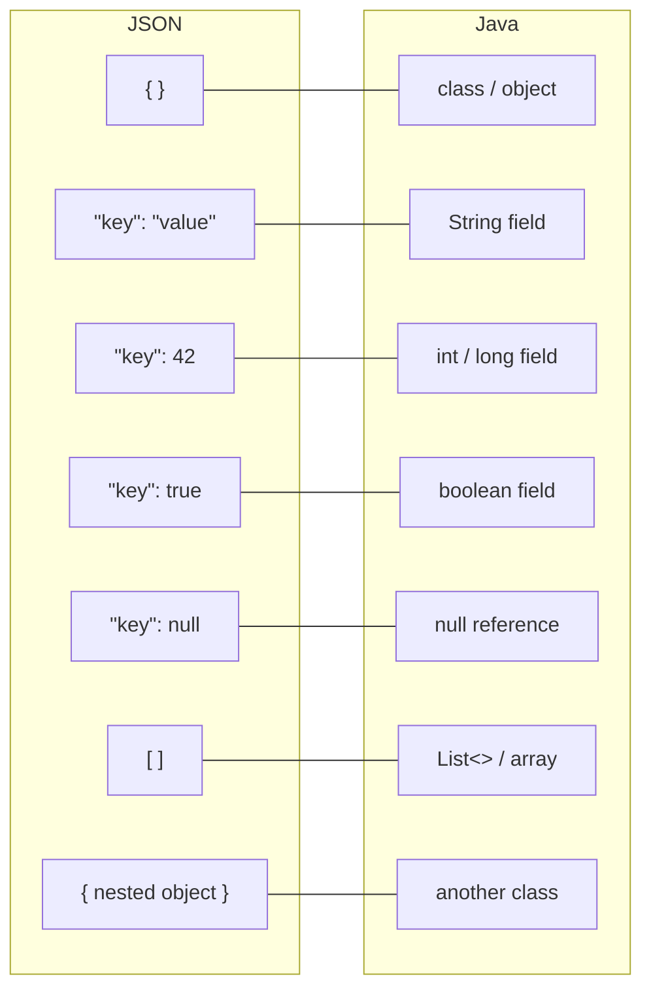
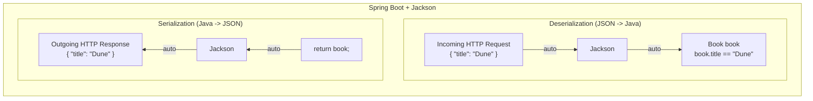

# Chapter 4: JSON and REST APIs

> :clock1: Estimated time: 70 minutes

## What You'll Learn

- What JSON is and why it's the universal data format for APIs
- JSON syntax rules and how it maps to Java objects
- What REST means and its core principles
- How to design clean API endpoints
- The difference between an API and a website

---

## Concepts

### The Problem: How Do You Send Data Over the Internet?

So you've got a beautiful Java object sitting in memory:

```java
Book book = new Book("Dune", "Frank Herbert", 412);
```

Now you want to send it to someone across the internet. Maybe a React app. Maybe an Android phone. Maybe another server in a different country. There's just one problem...

HTTP only transmits **text**. You can't shove a Java object down a wire. You can't email someone a chunk of memory. You need some way to turn your object into text that both sides agree on.

> **:brain: Brain Power:**
> Think about this for a second. If you had to invent a text format to represent an object with a title, author, and page count, what would you come up with? Seriously, grab a napkin and try it. We'll wait.

That format you need? It's called **JSON**. And once you understand it, you'll see it *everywhere*.

### What Is JSON?

> **Quick Summary -- JSON**
> JSON is a lightweight text format for transmitting data. It uses curly braces for
> objects, square brackets for arrays, and double-quoted strings for keys. Every
> modern language can read and write it, and Spring Boot converts between JSON and
> Java objects automatically via a library called Jackson.

**JSON** stands for **JavaScript Object Notation**. And before you say it -- no, you don't need to know JavaScript. Despite the name, JSON has nothing to do with JavaScript for our purposes. It's just a text format that *every* programming language can read and write. Think of JSON as the Esperanto of data -- except people actually use it.

#### Why Not XML or Plain Text?

Before JSON took over the world, developers tried other formats. Let's look at the same book data three different ways, and you'll immediately see why JSON won.

**Plain text (no structure):**
```
Dune, Frank Herbert, 412 pages, available
```
Problems: How do you know which field is which? What if a title contains a comma? There's no standard way to parse this -- every developer invents their own format. It's like everyone speaking their own made-up language and hoping the other person understands.

**XML (verbose, structured):**
```xml
<book>
    <title>Dune</title>
    <author>Frank Herbert</author>
    <pages>412</pages>
    <available>true</available>
</book>
```
Problems: Every value needs an opening *and* closing tag. The same data is almost twice as many characters. Reading and writing XML parsers is painful. And don't even get developers started on the attributes-vs-elements debate -- that argument has been going on since 1998 and it's still not settled.

**JSON (compact, structured):**
```json
{
    "title": "Dune",
    "author": "Frank Herbert",
    "pages": 412,
    "available": true
}
```
JSON hits the sweet spot: it has clear structure (so machines can parse it), it's compact (less bandwidth over the network), and it's easy for humans to read and write. That's why virtually every modern API uses JSON.

> **:speech_balloon: Overheard at the coffee shop:**
> "I used to write XML for a living. My closing tags had closing tags. Now I use JSON and I actually have time for lunch."

JSON represents data as key-value pairs:

```json
{
    "title": "Dune",
    "author": "Frank Herbert",
    "pages": 412,
    "available": true
}
```

That's it. Curly braces, keys in quotes, values after colons, commas between pairs. If you can read a restaurant menu, you can read JSON.

---

### :microphone: Fireside Chat: Tonight's Guests -- JSON Object and XML Element

**Moderator:** Welcome, welcome. Tonight we're settling the great data format debate. JSON, you've been called "the universal language of APIs." How does that feel?

**JSON Object:** Honestly? I'm flattered but it's also kind of weird. I'm just text! Everyone thinks I'm code, but I'm literally just formatted text. I don't execute. I don't compile. I sit there, looking pretty between curly braces, and wait for someone to read me.

**XML Element:** *[adjusts monocle]* I was here first, you know. Enterprise systems. SOAP. Configuration files. I built the internet before you were even a gleam in Douglas Crockford's eye.

**JSON Object:** Sure, and I respect the history. But let's be honest -- do you really need a closing tag for everything? `<name>Alice</name>`? That's the same word *twice*. I just do `"name": "Alice"` and move on with my life.

**XML Element:** That's called *self-documenting structure*. It's a feature, not a bug.

**JSON Object:** It's a feature that doubles your bandwidth bill.

**Moderator:** Shots fired! XML, any response?

**XML Element:** I have attributes. I have namespaces. I have schemas. I have XSLT transformations. What do you have?

**JSON Object:** Friends. I have friends. Every language on earth has a JSON parser built in. Python, Java, JavaScript, Go, Rust -- they all read me natively. Can you say the same?

**XML Element:** *[long pause]* ...I'm still very popular in banking.

**JSON Object:** And I'm popular everywhere else. No hard feelings?

**XML Element:** *[sighs]* No hard feelings.

---

### JSON Syntax Rules

Alright, let's get precise. JSON has rules, and they're strict. Mess up even one character and the whole thing blows up. But the good news? There are only a few rules to learn.

#### Data Types

JSON supports exactly these types -- no more, no less:

| Type | Example | Java Equivalent |
|------|---------|-----------------|
| String | `"hello"` | `String` |
| Number | `42`, `3.14` | `int`, `double` |
| Boolean | `true`, `false` | `boolean` |
| Null | `null` | `null` |
| Object | `{ "key": "value" }` | A class/object |
| Array | `[1, 2, 3]` | `List` / array |

> **:dart: Key Point:**
> That's the entire type system. Six types. You could fit it on a sticky note. Compare that to Java's type system and you'll understand why JSON is so easy to learn.

#### Objects (Curly Braces)

An **object** is a collection of key-value pairs:

```json
{
    "name": "Alice",
    "age": 30,
    "isStudent": false
}
```

Rules:
- Keys **must** be strings (in double quotes)
- Use double quotes `"`, not single quotes `'`
- No trailing comma after the last pair

> **:warning: Watch it!**
> That last rule trips up *everyone*. In Java, Python, and JavaScript, a trailing comma is usually fine. In JSON? It's a showstopper. Your parser will choke. Your API will return a 400. Your Friday afternoon will be ruined. Don't do it.

#### Arrays (Square Brackets)

An **array** is an ordered list:

```json
["fiction", "science", "history"]
```

Arrays can contain any type, including other objects:

```json
[
    { "title": "Dune", "pages": 412 },
    { "title": "1984", "pages": 328 }
]
```

> **:bulb: There are no Dumb Questions:**
>
> **Q: Can an array hold mixed types, like a string and a number?**
> A: Technically yes -- `["hello", 42, true]` is valid JSON. But in practice, you almost never do this because it's a pain to deserialize into a strongly-typed language like Java. Stick to arrays of one type.
>
> **Q: Can I have an empty object or empty array?**
> A: Absolutely. `{}` and `[]` are both perfectly valid JSON. You'll see them all the time in API responses that have no results.
>
> **Q: Does the order of keys in an object matter?**
> A: Nope. `{"name": "Alice", "age": 30}` and `{"age": 30, "name": "Alice"}` are semantically identical. JSON objects are unordered. Arrays, on the other hand, *are* ordered.

#### Nesting

Objects and arrays can nest inside each other. This is where JSON gets its real power -- you can represent complex, hierarchical data:

```json
{
    "name": "Frank Herbert",
    "born": 1920,
    "books": [
        {
            "title": "Dune",
            "year": 1965,
            "genres": ["science fiction", "adventure"]
        },
        {
            "title": "Dune Messiah",
            "year": 1969,
            "genres": ["science fiction"]
        }
    ],
    "awards": {
        "hugo": true,
        "nebula": true
    }
}
```

See what's happening? An object contains an array of objects, and each of *those* objects contains an array of strings. It's objects and arrays all the way down. Once you see the pattern, you can read any JSON -- no matter how deeply nested.

#### Common JSON Mistakes

> **:warning: Watch it!**
> These are the errors that trip up every beginner. Burn them into your memory now and you'll save yourself hours of staring at cryptic parser errors later. We're serious. Bookmark this section.

**1. Trailing comma after the last item:**

```
INVALID                              VALID
---------------------------------    ---------------------------------
{                                    {
    "name": "Alice",                     "name": "Alice",
    "age": 30,   <-- trailing comma      "age": 30     <-- no comma
}                                    }
```

> **:warning: Watch it!**
> This is the number one JSON mistake in the known universe. Your fingers will *want* to put that comma there because every other language lets you. JSON says no. Accept it and move on.

**2. Single quotes instead of double quotes:**

```
INVALID                              VALID
---------------------------------    ---------------------------------
{                                    {
    'name': 'Alice'                      "name": "Alice"
}                                    }
```
JSON requires double quotes `"` everywhere. Single quotes `'` are not valid JSON, even though they work in JavaScript and Python.

> **:warning: Watch it!**
> If you're coming from Python, this one will bite you. Python dicts look almost identical to JSON, but Python is happy with single quotes. JSON is not. Double quotes only. Always. No exceptions. Ever.

**3. Unquoted keys:**

```
INVALID                              VALID
---------------------------------    ---------------------------------
{                                    {
    name: "Alice",                       "name": "Alice",
    age: 30                              "age": 30
}                                    }
```
Every key must be a double-quoted string. This looks like JavaScript shorthand, but JSON does not allow it.

**4. Comments in JSON:**

```
INVALID                              VALID
---------------------------------    ---------------------------------
{                                    {
    // user's name                       "name": "Alice"
    "name": "Alice"                  }
}
```
JSON has no comment syntax at all -- no `//`, no `/* */`, no `#`. If you need to annotate your data, use a descriptive key name or keep notes in a separate file.

> **:warning: Watch it!**
> This one catches people who are used to JSON config files (like `tsconfig.json` or VS Code's `settings.json`). Those files actually use "JSON with Comments" (JSONC), which is a non-standard extension. Real JSON? No comments. None. Zero.

**5. Using undefined or NaN:**

```
INVALID                              VALID
---------------------------------    ---------------------------------
{                                    {
    "name": undefined,                   "name": null,
    "score": NaN                         "score": 0
}                                    }
```
JSON only supports `null` for missing values. There is no `undefined`, `NaN`, or `Infinity` -- those are JavaScript concepts, not JSON.

### JSON <-> Java Mapping

This is the mental model that will save you hours. Seriously, tape this to your monitor:



> **:dart: Key Point:**
> Every JSON object maps to a Java class. Every JSON array maps to a `List`. Every key maps to a field name. That's the whole translation. Once you internalize this, reading JSON will feel like reading Java with a different accent.

Spring Boot converts between JSON and Java objects **automatically**. You write Java classes, and Spring Boot handles the translation. This is called **serialization** (Java to JSON) and **deserialization** (JSON to Java).

#### How Spring Boot Converts Automatically

Under the hood, Spring Boot uses a library called **Jackson** to handle all JSON conversion. When a request comes in with a JSON body, Jackson reads the JSON text and creates a Java object from it (deserialization). When your code returns a Java object, Jackson converts it to JSON text for the HTTP response (serialization).

Here's the part that blows people's minds: **you never call a parse method yourself.** If you've used other languages, you might expect to write something like `JSON.parse(text)` or `objectMapper.readValue(...)`. With Spring Boot, you don't. You just write a normal Java class with fields that match the JSON keys, and Spring Boot + Jackson handle the rest. You'll see this in action when you build your first controller in Day 3.

> **:brain: Brain Power:**
> Take a moment and think about what Jackson must be doing behind the scenes. It receives a string like `{"title": "Dune"}`, and somehow it creates a `Book` object with `book.title == "Dune"`. How? It uses reflection to find a field called `title`, matches the types, and sets the value. You don't need to understand reflection right now, but it's good to know there's no magic -- just clever code.



### What Is an API?

**API** stands for **Application Programming Interface**. Sounds intimidating. It's not. Here's the deal:

> "If you send me a request in *this* format, I'll send you a response in *that* format."

That's it. An API is a contract. A promise. A handshake agreement between two pieces of software.

Think of it as a menu at a restaurant:
- The menu lists what you can order (**endpoints**)
- Each item has a name and description (path and method)
- You order using the menu's format (request body)
- You get back what's described (response body)

You don't walk into the kitchen and cook it yourself. You don't need to know *how* they make it. You just need to know what's on the menu and how to order.

> **:dart: Key Point:**
> An API is NOT a visual interface. There's no HTML, no web page, no buttons. It's data in, data out. If you're picturing a webpage right now, stop. Picture a vending machine instead: put in a specific request, get back a specific response.

### REST: A Way to Design APIs

> **Quick Summary -- REST**
> REST is a set of conventions, not a technology. Resources (nouns) get URLs, HTTP
> methods (GET, POST, PUT, DELETE) express actions, and standard status codes tell
> the client what happened. Responses are JSON. The server is stateless -- each
> request stands on its own.

**REST** stands for **Representational State Transfer**. Don't worry about what that phrase means literally -- nobody actually says those words in conversation. What matters is that REST is a set of conventions for designing APIs that make them predictable and easy to use.

REST isn't a technology or a library -- it's a *style*. An opinion on how things should be organized. Think of it like the difference between a messy closet and a well-organized one. Both hold clothes. But only one lets you find your socks in the morning.

> **:speech_balloon: Overheard at the coffee shop:**
> "REST isn't a framework. It's not something you install. It's more like... table manners for APIs."

#### The Great API Makeover: Before and After REST

Before learning the REST rules, you need to see what a *bad* API looks like so you understand what REST is fixing. Brace yourself. This is going to be ugly.

**BEFORE: The Non-REST API (RPC-style)**

```
Non-REST (RPC-style) API:
-------------------------------------------------------------
POST /api/createUser         body: { "name": "Alice" }
POST /api/getUserById        body: { "id": 42 }
POST /api/updateUserEmail    body: { "id": 42, "email": "a@b.com" }
POST /api/deleteUser         body: { "id": 42 }
POST /api/getAllUsers         body: (empty)
POST /api/searchUsersByName  body: { "name": "Ali" }
```

*[record scratch]*

Everything is POST. The action is a verb crammed into the URL. Is it `getUser` or `fetchUser` or `retrieveUser`? Who knows! Every developer picks their own naming convention. Caching? Forget it -- caches only cache GET requests, and you don't have any GETs.

This API is like a closet where everything is in one giant pile on the floor. Sure, all your stuff is *in there*... but good luck finding anything.

**AFTER: The Same API, But REST**

```
REST API (same functionality):
-------------------------------------------------------------
POST   /api/users            body: { "name": "Alice" }
GET    /api/users/42         (no body needed)
PUT    /api/users/42         body: { "email": "a@b.com" }
DELETE /api/users/42         (no body needed)
GET    /api/users            (no body needed)
GET    /api/users?name=Ali   (no body needed)
```

Same six operations. But now the URL is always a noun (the **resource**) and the HTTP method is the verb (the **action**). The URL tells you *what* you're working with. The method tells you *what you're doing to it*. Beautiful.

> **:dart: Key Point:**
> REST's big idea in one sentence: **URLs are nouns, HTTP methods are verbs.** That's the whole philosophy. Everything else flows from there.

#### The Core Ideas of REST

**1. Everything is a Resource**

A **"resource"** is any thing your API manages: a book, a user, an order, a comment. Not an action. Not a verb. A *thing*.

Each resource has a URL:
```
/api/books       -> the collection of all books
/api/books/42    -> a specific book (ID 42)
/api/authors     -> the collection of all authors
/api/authors/7   -> a specific author (ID 7)
```

> **:bulb: There are no Dumb Questions:**
>
> **Q: Why plural? Why `/api/books` instead of `/api/book`?**
> A: Convention. The URL `/api/books` represents the *collection* of all books. `/api/books/42` reaches into that collection and grabs one. Plurals make this mental model work consistently.
>
> **Q: What about resources that don't feel like "things"? Like "login" or "search"?**
> A: Great question. These are the tricky cases. Login might become `POST /api/sessions` (you're *creating* a session). Search is usually `GET /api/books?query=dune` (you're *reading* a filtered collection). It's not always obvious, and that's okay.

**2. Use HTTP Methods for Actions**

Don't put verbs in your URLs. Use HTTP methods instead:

```
WRONG (verb in URL):
  GET  /api/getBooks
  POST /api/createBook
  POST /api/deleteBook/42

RIGHT (HTTP methods express the action):
  GET    /api/books          -> get all books
  POST   /api/books          -> create a book
  GET    /api/books/42       -> get one book
  PUT    /api/books/42       -> update a book
  DELETE /api/books/42       -> delete a book
```

> **:warning: Watch it!**
> If you ever catch yourself typing `/api/getBooks` or `/api/deleteUser`, stop immediately. The verb belongs in the HTTP method, not the URL. This is probably the most common REST mistake beginners make.

**3. Use Standard Status Codes**

```
200 OK         -> successful GET/PUT
201 Created    -> successful POST (something was created)
204 No Content -> successful DELETE
400 Bad Request -> client sent invalid data
404 Not Found   -> resource doesn't exist
500 Internal Server Error -> server broke
```

---

### :microphone: Interview with a Status Code

**Interviewer:** Status Code 404, thanks for joining us. You're probably the most famous status code in the world.

**404 Not Found:** Yeah, I get around. People see me more than they'd like. But honestly, I'm just doing my job. Someone asks for `/api/books/99999` and that book doesn't exist? That's me. I show up and say, "Sorry, nothing here."

**Interviewer:** Some APIs return you as a 200 with an error message in the body. How does that make you feel?

**404 Not Found:** *[visibly upset]* Don't get me started. That's like a doctor saying "You're perfectly healthy!" and then whispering "...except for the broken leg." The status code exists for a reason! Use it!

**Interviewer:** And Status Code 201, you're the optimist of the group?

**201 Created:** That's right! I only show up when something new enters the world. A new user? A new book? A new order? I'm there, celebrating. I even bring the Location header so you know where to find the new resource.

**Interviewer:** Any advice for developers?

**201 Created:** Please don't use 200 when you create something. 200 means "yep, worked." I mean "yep, worked, AND something new exists now." There's a difference!

---

**4. Stateless**

Each request contains all the information needed. The server doesn't remember previous requests. You can't say "get me the next page" -- you have to say "get me page 2 of the books collection." Every request stands completely on its own.

**5. Use JSON for Data**

Request and response bodies are JSON. (You saw that coming, right?)

#### A Complete REST API Design

Here's a full REST API for books. Study this table -- it's the blueprint for what you'll build later this week:

| Action | Method | Path | Request Body | Response Body | Status |
|--------|--------|------|-------------|---------------|--------|
| List all books | GET | `/api/books` | -- | Array of books | 200 |
| Get one book | GET | `/api/books/{id}` | -- | One book | 200 / 404 |
| Create a book | POST | `/api/books` | Book data | Created book (with ID) | 201 |
| Update a book | PUT | `/api/books/{id}` | Full book data | Updated book | 200 / 404 |
| Delete a book | DELETE | `/api/books/{id}` | -- | -- | 204 / 404 |
| Search books | GET | `/api/books?title=dune` | -- | Filtered array | 200 |

> **:brain: Brain Power:**
> Notice the pattern. Two URLs (`/api/books` and `/api/books/{id}`) handle five different operations by using different HTTP methods. The method tells you *what* to do, the path tells you *what to do it to*. This is the elegance of REST -- a small number of URLs, combined with a small number of methods, gives you everything you need.

#### Path Parameters vs Query Parameters

You've probably noticed two different ways to pass information in a URL. Understanding when to use each one is important for clean API design, so let's break it down.

**Path parameters** identify a specific resource. They're part of the URL path itself:

```
/api/books/42         -> "Give me book number 42"
/api/authors/7        -> "Give me author number 7"
/api/authors/7/books  -> "Give me all books by author 7"
```

**Query parameters** filter, sort, or modify the results. They come after a `?` in the URL:

```
/api/books?genre=fiction          -> "Give me books filtered by genre"
/api/books?author=Herbert&sort=title  -> "Filter by author, sort by title"
/api/books?page=2&size=20        -> "Give me the second page of 20 results"
```

Here's the rule of thumb:

| Use this        | When you need to...                     | Example                          |
|-----------------|-----------------------------------------|----------------------------------|
| Path parameter  | Identify a specific resource            | `/api/books/42`                  |
| Path parameter  | Navigate a resource hierarchy           | `/api/authors/7/books`           |
| Query parameter | Filter a collection                     | `/api/books?genre=fiction`       |
| Query parameter | Sort results                            | `/api/books?sort=title`          |
| Query parameter | Paginate results                        | `/api/books?page=2&size=20`      |

> **:bulb: There are no Dumb Questions:**
>
> **Q: How do I know if something should be a path parameter or a query parameter?**
> A: Here's a great mental test. If removing the parameter would give you a *different* resource, it's a path parameter. If removing it would give you the *same* resource but with less filtering, it's a query parameter. Removing `/42` from `/api/books/42` gives you a completely different thing (all books vs one book). Removing `?genre=fiction` from `/api/books?genre=fiction` gives you the same thing (books) just without the filter.
>
> **Q: Can I use both at the same time?**
> A: Absolutely! `/api/authors/7/books?sort=year` uses a path parameter (author 7) AND a query parameter (sort by year). Totally normal.

#### Versioning Your API

As your API evolves, you may need to make breaking changes. A common convention is to include a version number in the URL path: `/api/v1/books`. This way, older clients can keep using `/api/v1/` while newer clients use `/api/v2/`. You don't need to worry about this for learning projects, but it's good to know the convention exists.

### API vs Website

| Aspect | Website | API |
|--------|---------|-----|
| Returns | HTML (visual) | JSON (data) |
| Consumer | Humans via browsers | Programs (apps, other services) |
| Rendering | Server generates the page | Client decides how to display |
| Example response | `<h1>Books</h1><ul>...` | `[{"title":"Dune"},...]` |

> **:speech_balloon: Overheard at the coffee shop:**
> "So the backend is *just* an API now? It doesn't make web pages?"
>
> "Nope. The backend returns JSON. The frontend -- React, Angular, a mobile app, whatever -- calls the API and decides how to display it. That's the modern architecture. Separation of concerns."
>
> "So the same API can serve a website AND a mobile app?"
>
> "Exactly. One API, many clients. That's the whole point."

---

## Code Examples

### Writing JSON by Hand

Time to get your hands dirty. Practice reading and writing JSON. No tools needed -- just a text editor and your eyeballs.

#### A single book:
```json
{
    "id": 1,
    "title": "Clean Code",
    "author": "Robert C. Martin",
    "isbn": "978-0132350884",
    "pages": 464,
    "available": true,
    "genres": ["programming", "software engineering"]
}
```

#### A list of books:
```json
[
    {
        "id": 1,
        "title": "Clean Code",
        "pages": 464
    },
    {
        "id": 2,
        "title": "Dune",
        "pages": 412
    }
]
```

#### An author with nested books:
```json
{
    "id": 1,
    "name": "Frank Herbert",
    "nationality": "American",
    "books": [
        { "id": 10, "title": "Dune", "year": 1965 },
        { "id": 11, "title": "Dune Messiah", "year": 1969 }
    ]
}
```

#### An error response:
```json
{
    "status": 400,
    "error": "Bad Request",
    "message": "Title must not be empty",
    "timestamp": "2025-01-15T10:30:00"
}
```

> **:brain: Brain Power:**
> Look at the error response above. Why does it have a `status` field when the HTTP response *already* has a status code? Because it's a convenience for the client. Some HTTP libraries make it easier to read the response body than the status code. Including the status in the body is a common pattern -- belt and suspenders.

### Calling a REST API with curl

Here's your chance to actually *talk* to a real API. These commands use JSONPlaceholder, a free fake API for testing. Open your terminal and try each one:

```bash
# GET all posts (read a collection)
curl https://jsonplaceholder.typicode.com/posts

# GET one post (read a specific resource)
curl https://jsonplaceholder.typicode.com/posts/1

# GET with query parameter (filter)
curl "https://jsonplaceholder.typicode.com/posts?userId=1"

# POST (create a new resource)
curl -X POST https://jsonplaceholder.typicode.com/posts \
  -H "Content-Type: application/json" \
  -d '{
    "title": "My New Post",
    "body": "This is the content",
    "userId": 1
  }'

# PUT (update/replace a resource)
curl -X PUT https://jsonplaceholder.typicode.com/posts/1 \
  -H "Content-Type: application/json" \
  -d '{
    "id": 1,
    "title": "Updated Title",
    "body": "Updated content",
    "userId": 1
  }'

# DELETE (remove a resource)
curl -X DELETE https://jsonplaceholder.typicode.com/posts/1
```

> **:dart: Key Point:**
> Notice how the curl commands mirror the REST table from earlier? GET reads, POST creates, PUT updates, DELETE deletes. Same URL pattern, different methods. This isn't a coincidence -- it's the entire point of REST.

---

## Exercise: Design the BookShelf API

**Goal**: Design the REST API for the BookShelf application you'll build this week. This is where you put everything together -- JSON syntax, REST conventions, clean URL design. No code required. Just thinking.

### Task

On paper or in a text file, design the complete API for a book library system. Include:

#### Part 1: Resource Design

List all the resources (things) your API will manage:
- Books (what fields?)
- Authors (what fields?)
- Anything else?

Write the JSON shape for each resource.

#### Part 2: Endpoint Design

Create a table like this:

```
| Action | Method | Path | Request Body | Response | Status |
```

Design at least 8 endpoints covering:
- CRUD for books
- CRUD for authors
- At least one relationship endpoint (e.g., "get all books by author")
- At least one search/filter endpoint

#### Part 3: Write Sample JSON

Write the complete JSON for:

1. A request body to create a new book
2. A response body for "get all books" (array with 3 books)
3. An error response for "book not found"
4. A request body to create an author with their books nested

#### Part 4: Identify Bad API Design

What's wrong with each of these endpoints?

```
1. GET    /api/getAllBooks
2. POST   /api/books/delete/42
3. GET    /api/books/42   -> returns 200 with body: { "error": "not found" }
4. POST   /api/books      -> returns 200 when creating a book
5. DELETE /api/books/42   -> returns the deleted book's full data
```

#### Part 5: Validate JSON

Each of the following JSON snippets has a problem (or is perfectly valid). For each one, decide: **valid or invalid?** If invalid, identify the error and write the corrected version.

**Snippet 1:**
```json
{
    "name": "Alice",
    "age": 30,
    "active": true,
}
```

**Snippet 2:**
```json
{
    "title": "Dune",
    "author": "Frank Herbert",
    "year": 1965
}
```

**Snippet 3:**
```json
{
    name: "Bob",
    age: 25
}
```

**Snippet 4:**
```json
{
    "items": [1, 2, 3],
    // total count of items
    "count": 3
}
```

**Snippet 5:**
```json
{
    'color': 'red',
    'size': 'large'
}
```

<details>
<summary><strong>Answers (click to reveal)</strong></summary>

**Snippet 1: INVALID** -- Trailing comma after `true`.
```json
{
    "name": "Alice",
    "age": 30,
    "active": true
}
```

**Snippet 2: VALID** -- This is perfectly correct JSON. All keys are double-quoted strings, values use correct types, and there is no trailing comma.

**Snippet 3: INVALID** -- Keys are not quoted. JSON requires all keys to be double-quoted strings.
```json
{
    "name": "Bob",
    "age": 25
}
```

**Snippet 4: INVALID** -- JSON does not support comments. The `// total count of items` line is not valid.
```json
{
    "items": [1, 2, 3],
    "count": 3
}
```

**Snippet 5: INVALID** -- Single quotes are not valid in JSON. Both keys and string values must use double quotes.
```json
{
    "color": "red",
    "size": "large"
}
```

</details>

---

## Common Mistakes

| Mistake | Reality |
|---------|---------|
| Using single quotes in JSON | JSON requires double quotes `"`. `{'key': 'value'}` is invalid JSON. |
| Putting verbs in REST URLs | Use HTTP methods for actions. `/api/books` + `DELETE` method, not `/api/deleteBook`. |
| Returning 200 for errors | Use proper status codes. 404 for not found, 400 for bad input, 500 for server errors. |
| Making everything a POST | Use GET for reading, POST for creating, PUT for updating, DELETE for deleting. Each method has semantic meaning. |
| Forgetting that JSON is text | JSON looks like code, but it's plain text sent over HTTP. It's just a format -- a way to structure text so both sides can parse it. |

---

### :memo: Practice Exercises

Ready to test your understanding? These exercises from [Appendix E](../../appendices/E-coding-exercises.md) directly apply what you learned in this chapter:

| Exercise | Topic | Difficulty |
|----------|-------|------------|
| [Exercise 3](../../appendices/E-coding-exercises.md#exercise-3) | Fix Non-RESTful Endpoints | :star::star: |
| [Exercise 7](../../appendices/E-coding-exercises.md#exercise-7) | Java <-> JSON Conversion | :star: |
| [Exercise 8](../../appendices/E-coding-exercises.md#exercise-8) | Fix Broken JSON | :star: |
| [Exercise 9](../../appendices/E-coding-exercises.md#exercise-9) | Model a Complex Nested Object | :star::star: |
| [Exercise 10](../../appendices/E-coding-exercises.md#exercise-10) | JSON Response to Java Classes | :star::star: |

Solutions are in [Appendix F](../../appendices/F-exercise-solutions.md).

---

## Key Takeaways

- [ ] I can read and write JSON fluently (objects, arrays, nesting)
- [ ] I understand how JSON maps to Java classes (object -> class, array -> List)
- [ ] I know what REST means: resources with URLs, HTTP methods for actions, JSON for data
- [ ] I can design a REST API for a given application
- [ ] I know the difference between a website (returns HTML) and an API (returns JSON)
- [ ] Spring Boot automatically converts between Java objects and JSON

---

## Quick Quiz

1. Convert this Java class to its JSON representation: `class User { String name; int age; List<String> hobbies; }`
2. Is this valid JSON? `{ name: "Alice", 'age': 30, }` -- If not, why?
3. You have a `User` resource. What are the 5 standard REST endpoints?
4. Why is `POST /api/users/create` not RESTful?
5. An API returns status 200 with body `{"error": "User not found"}`. What's wrong with this approach?

---

*Next: `05-why-frameworks-exist.md` -- Why you don't want to build a server from scratch ->*
