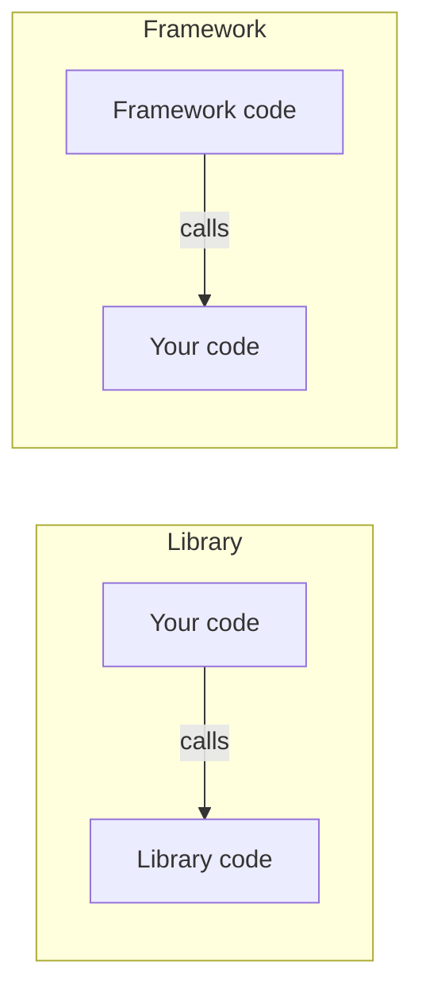
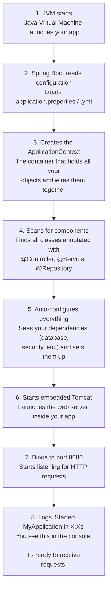

# Chapter 5: Why Frameworks Exist

> :alarm_clock: Estimated time: 50 minutes

## What You'll Learn

- What a framework is and why you'd use one
- The problem that Spring solves
- The difference between Spring and Spring Boot
- What "Inversion of Control" and "Dependency Injection" mean (preview)
- Why Spring Boot is the standard for Java backend development

---

## Concepts

### The Boilerplate Problem

> **:dart: Key Point:** Building a web server from scratch in Java requires thousands of lines of infrastructure code. Frameworks exist so you don't have to reinvent the wheel every time.

Remember that tiny Java server from Chapter 1? Let's take another look at it. Go on, read it. Really *feel* it.

```java
import java.net.ServerSocket;
import java.net.Socket;
import java.io.*;

public class TinyServer {
    public static void main(String[] args) throws Exception {
        ServerSocket server = new ServerSocket(8080);
        while (true) {
            Socket client = server.accept();
            BufferedReader in = new BufferedReader(
                new InputStreamReader(client.getInputStream()));
            String request = in.readLine();
            
            PrintWriter out = new PrintWriter(client.getOutputStream(), true);
            out.println("HTTP/1.1 200 OK");
            out.println("Content-Type: text/plain");
            out.println();
            out.println("Hello!");
            client.close();
        }
    }
}
```

Cute, right? Like a little toy boat you built in the bathtub. Now try to sail it across the Atlantic.

Here's the thing -- this "works," but it's *terrible*:
- It handles one request at a time (everyone else waits in line like it's the DMV)
- It doesn't parse the HTTP method or path properly
- It doesn't handle JSON
- It can't route different URLs to different code
- It doesn't handle errors (one exception crashes *everything*)
- No security, no logging, no configuration
- No way to organize code as the app grows

> **:brain: Brain Power:** Before you read the next section, grab a piece of paper. How many things can you think of that you'd need to build to turn this toy server into something production-ready? Write down as many as you can. Then compare your list with ours below.

**So what would you actually need to build?**

If you wanted to turn that toy server into something real -- something your boss wouldn't fire you for deploying -- here's what you'd need to implement yourself, from scratch:

1. **Thread pool** -- A system that handles multiple requests at the same time so one slow request doesn't block everyone else.
2. **HTTP parser** -- Code that reads raw text like `POST /api/books HTTP/1.1` and breaks it into method, path, headers, and body.
3. **Request router** -- A mapping system that says "when someone hits `/books`, run this code; when they hit `/authors`, run that code."
4. **JSON serializer/deserializer** -- Code that converts Java objects to JSON text for responses, and parses incoming JSON text into Java objects.
5. **Error handler** -- A safety net that catches exceptions, logs them, and returns a proper HTTP error response instead of crashing the whole server.
6. **Logging system** -- Infrastructure to record what's happening (requests received, errors thrown, performance timings) so you can debug problems in production.
7. **Configuration reader** -- A way to load settings (database URL, port number, feature flags) from files or environment variables without hardcoding them.
8. **Database connection pool** -- A manager that keeps a set of reusable database connections open, because creating a new connection for every request is too slow.
9. **Graceful shutdown** -- Logic that stops accepting new requests, waits for in-flight requests to finish, closes database connections cleanly, and then exits without losing data.
10. **Security layer** -- Authentication (who is this user?) and authorization (are they allowed to do this?) checks on every incoming request.

That's **months of work** before you write line 1 of business logic. Months! And here's the kicker -- every backend developer in the world would be writing the *same* infrastructure code, solving the *same* problems, making the *same* mistakes.

That's the **boilerplate problem**: code you have to write before you can write the code you actually care about.

> **:speech_balloon: Overheard at the coffee shop:** "I spent six weeks writing a thread-safe HTTP parser and another three on database connection pooling. My manager asked how the book catalog feature was going. I said I hadn't started it yet."

### What Is a Framework?

> **:dart: Key Point:** A framework is pre-built infrastructure. You plug your code into it, and it handles the rest. Think of it as a house with the plumbing and wiring already done -- you just furnish the rooms.

So you've got a problem. You need all that infrastructure, but you don't want to spend months building it. What if somebody already built it for you?

That's exactly what a **framework** is: **pre-built infrastructure** that handles the common stuff so you can focus on your application's unique logic.

**Think of it this way:**
- Without a framework = building a house from *trees*. You cut the lumber, make the nails, lay the foundation, frame the walls, run the plumbing...
- With a framework = a house with the foundation, framing, plumbing, and electrical already done. You just design the rooms and pick the furniture.

Which one sounds more fun? (If you said "cutting lumber," you might be in the wrong career. Or you might just really like lumber.)

**What the framework provides** (so you don't have to):
- HTTP server (receiving and sending requests) :white_check_mark:
- Request routing (which code handles which URL) :white_check_mark:
- JSON parsing (converting between text and objects) :white_check_mark:
- Database connection management :white_check_mark:
- Error handling infrastructure :white_check_mark:
- Security infrastructure :white_check_mark:
- Configuration management :white_check_mark:
- Logging :white_check_mark:
- Testing support :white_check_mark:

**What YOU provide** (the stuff only you know):
- Your data models (Book, Author, User)
- Your business rules ("max 5 books per user")
- Your API endpoints ("GET /api/books returns all books")

See the split? The framework does the *generic* stuff. You do the *specific* stuff. Beautiful.

### Framework vs. Library

> **:dart: Key Point:** A library is a tool you pick up and use when you want. A framework is a system that runs your code for you. The key question: who's in the driver's seat?

This distinction matters more than you might think. Let's let them explain it in their own words.

---

> **:microphone: Fireside Chat: Library vs. Framework**
>
> *Tonight's guests: Gson (a popular Java library) and Spring Boot (a popular Java framework). They've been asked to explain, in their own words, what makes them different.*
>
> **Moderator:** Thanks for joining us tonight. Gson, let's start with you. What do you do, exactly?
>
> **Gson:** I convert Java objects to JSON and back. That's it. You call me when you need me, I do my thing, and I go away. No drama.
>
> **Spring Boot:** *leans forward* And that's the difference right there. Gson sits on a shelf until you pick it up. Me? I *run the show*. I start the server, I listen for requests, I decide when to call your code. You just tell me what to do when a request arrives.
>
> **Gson:** *shrugs* You make it sound like I'm lazy. I'm *respectful*. I let the developer stay in control.
>
> **Spring Boot:** And I let the developer stay *productive*. They don't have to wire everything together themselves. They just annotate a method, and I handle the rest -- routing, parsing, error handling, the works.
>
> **Moderator:** So the core difference is...?
>
> **Gson:** Who calls whom. When you use me, *you* call *me*. Your code is in charge.
>
> **Spring Boot:** When you use me, *I* call *you*. My code is in charge. But honestly? That's a good thing. You don't *want* to manage all that plumbing yourself.
>
> **Gson:** Fair point. I wouldn't want to manage HTTP connections either. I just want to parse JSON and go home.

---

Let's see this play out in real code.

**Concrete Java example -- Library (Gson):**

```java
// YOU decide when to call Gson. You are in control.
Gson gson = new Gson();
Book book = new Book("Dune", "Frank Herbert");
String json = gson.toJson(book);       // You call the library
System.out.println(json);              // You decide what to do with the result
```

You created the object, you called the method, you decided when and where to use it. Gson has no idea what your application does -- it just converts objects when you ask.

**Concrete Java example -- Framework (Spring Boot):**

```java
// SPRING decides when to call your method. The framework is in control.
@RestController
public class BookController {

    @GetMapping("/books/{id}")
    public Book getBook(@PathVariable Long id) {  // Spring calls THIS when a request arrives
        return bookService.findById(id);
    }
}
```

You never call `getBook()` yourself. You never write `new BookController()`. Spring Boot starts the server, listens for requests, sees that `GET /books/42` matches your `@GetMapping`, and calls your method -- passing in `42` as the `id`. You just wrote the logic; the framework handled everything else.



> **:loudspeaker: The Hollywood Principle**: "Don't call us, we'll call you." Just like a casting director calls actors when there's a role, a framework calls your code when there's work to do. You register your methods (with annotations like `@GetMapping`), and the framework invokes them at the right time. This is the core mental shift from library thinking to framework thinking.

You've probably heard casting directors say this in movies. Well, frameworks took it literally. You don't chase the framework around saying "Hey! I've got a method for GET requests! Want to use it?" No. You slap a `@GetMapping` annotation on your method and walk away. When a GET request arrives, the framework *finds you* and calls you.

This is called **Inversion of Control (IoC)** -- the framework controls the flow, and your code plugs into it.

> **:bulb: There are no Dumb Questions:**
>
> **Q: If the framework is calling my code, how does it know what methods I have?**
>
> A: Great question! The framework scans your code at startup and finds all the methods you've annotated (like `@GetMapping`, `@PostMapping`, etc.). It builds an internal map of "this URL pattern -> this method" and uses it when requests come in. You'll see exactly how this works when you create your first Spring Boot app in the next chapter.
>
> **Q: Does IoC mean I've lost control of my application?**
>
> A: Not at all! You've given up control of the *plumbing* (HTTP parsing, routing, connection management) so you can focus on the *business logic*. You still control what your methods do, what data they return, and what rules they enforce. You've delegated the boring parts, not abdicated responsibility.
>
> **Q: Can I use libraries inside a framework?**
>
> A: Absolutely! In fact, Spring Boot *uses* libraries internally (like Jackson for JSON parsing). And you can add your own libraries too. A framework doesn't replace libraries -- it orchestrates them.

### The Spring Ecosystem

> **:dart: Key Point:** Spring is a family of projects, not a single tool. Spring Boot is the one you'll use most -- it makes Spring easy. Think of Spring as the engine and Spring Boot as the car built around it.

Let's talk about **Spring** -- the framework you're going to be living with for the rest of this guide (and probably your career, if you're doing Java backend work).

**Spring** is a massive Java framework that's been around since 2003. It provides everything you need to build enterprise applications. But it had a problem: too much configuration.

In the early days, you had to write long XML files to tell Spring how to wire your application together. A simple web app needed dozens of configuration lines before it did anything useful. Developers spent more time configuring Spring than actually using it.

> **:speech_balloon: Overheard at the coffee shop:** "It's 2008 and I just wrote 200 lines of XML so that Spring knows my BookService exists. The BookService itself is 15 lines."

**Spring Boot** (released 2014) solved this. It's Spring with sensible defaults and auto-configuration. Instead of configuring everything by hand, Spring Boot says: "I'll assume you want the standard setup. If you need something different, you can override it."

```
Spring (2003)
+-- Powerful but verbose
+-- Manual configuration (XML, hundreds of lines)
+-- You set up the server yourself
+-- "Here are all the Lego pieces. Assemble them."

Spring Boot (2014)
+-- Same power, minimal setup
+-- Auto-configuration (it guesses what you need)
+-- Embedded server (just run it)
+-- "Here's a pre-built car. Customize what you want."
```

> **:warning: Watch it!** Don't confuse Spring and Spring Boot. Spring Boot IS Spring -- it's not a different framework. It's a layer on top of Spring that handles the configuration for you. When someone says "I'm using Spring Boot," they're using Spring. They're just not suffering through the XML.

#### The Spring Universe

Spring isn't just one project -- it's an ecosystem of projects that work together. Here are the key ones you should know about:

- **Spring Framework** -- The core foundation that provides Dependency Injection (DI) and the MVC web layer; everything else in the ecosystem builds on top of this.
- **Spring Boot** -- An opinionated layer on top of Spring Framework that auto-configures everything and bundles an embedded server so you can just run your app.
- **Spring Data** -- Eliminates boilerplate database code by letting you define a Java interface and having Spring automatically generate the SQL queries for you.
- **Spring Security** -- Handles authentication (login) and authorization (permissions) with sensible defaults that protect your app out of the box.
- **Spring Cloud** -- A toolkit for building microservices with features like service discovery, configuration servers, circuit breakers, and API gateways.

> :books: **For this guide**: You'll use **Spring Boot** + **Spring Data** + **Spring Security** over the 7 days. Spring Boot is your starting point (Day 2-3), Spring Data comes in when we connect a database (Day 4), and Spring Security appears when we add authentication (Day 6).

### What Spring Boot Gives You

> **:dart: Key Point:** Spring Boot gives you an embedded server, auto-configuration, dependency management, and production-ready features. You write business logic; it handles everything else.

When you create a Spring Boot project, you get:

1. **Embedded web server** (Tomcat) -- no need to install one separately
2. **Auto-configuration** -- it detects your dependencies and configures them
3. **Dependency management** -- compatible library versions, pre-selected
4. **Production-ready features** -- health checks, metrics, externalized configuration
5. **No boilerplate** -- write your logic, the rest is handled

That's a *lot* of stuff you didn't have to build. Let's see it in action.

#### What Happens When You Run `mvn spring-boot:run`

Ever wonder what actually happens in those 2-3 seconds between hitting Enter and seeing "Started"? Your computer does a *remarkable* amount of work in that blink of an eye. Here's the startup sequence:



All of this happens automatically. You didn't write a single line of startup code. You just typed `mvn spring-boot:run` and Spring Boot did the rest. Eight steps, zero effort from you.

> **:brain: Brain Power:** Look at that diagram again. Steps 3 and 4 are where the "magic" happens -- Spring scans your code and builds a map of all your components. Can you imagine having to do that yourself? Writing code that reads other code, finds the right annotations, and wires everything together? That's what the framework saves you from.

### The Raw Java vs. Spring Boot Comparison

> **:dart: Key Point:** Side-by-side, raw Java needs 50+ lines of messy infrastructure code to handle a single endpoint. Spring Boot does the same in 6 lines. The difference gets even bigger with POST requests and JSON bodies.

All right, it's time for the main event. In this corner, wearing plain `java.net` sockets and hand-rolled HTTP parsing: **Raw Java**. And in the other corner, wearing `@RestController` annotations and an embedded Tomcat server: **Spring Boot**.

Let's see them each handle the same task. *Ding ding.*

---

> **:microphone: Interview with Raw Java Server**
>
> **Interviewer:** So, Raw Java Server... tell us about your day. What's it like handling a simple GET request?
>
> **Raw Java Server:** *sighs heavily* Well, first I have to open a ServerSocket. Then I sit there in a while loop, waiting. When a connection comes in, I read the raw bytes from the input stream, parse the HTTP request line myself, figure out the method and path by splitting strings...
>
> **Interviewer:** That sounds exhausting.
>
> **Raw Java Server:** I haven't even gotten to the response yet. I have to manually write "HTTP/1.1 200 OK" as a *string*, add the Content-Type header, print a blank line, THEN send the body. And if anything goes wrong? I just... crash. Nobody catches my exceptions. Nobody cares.
>
> **Interviewer:** ... are you okay?
>
> **Raw Java Server:** *voice cracking* I handle ONE request at a time. While I'm talking to one client, everyone else just... waits. Do you know what that's like?

---

**Handling a GET request in raw Java** (simplified, still incomplete):

```java
// ~50 lines of boilerplate to handle ONE endpoint
ServerSocket server = new ServerSocket(8080);
while (true) {
    Socket client = server.accept();
    BufferedReader reader = new BufferedReader(
        new InputStreamReader(client.getInputStream()));
    String requestLine = reader.readLine();
    
    // Parse the HTTP method and path manually
    String[] parts = requestLine.split(" ");
    String method = parts[0];
    String path = parts[1];
    
    PrintWriter writer = new PrintWriter(client.getOutputStream(), true);
    
    if (method.equals("GET") && path.equals("/books")) {
        // Manually convert your data to JSON string
        String json = "[{\"title\":\"Dune\"},{\"title\":\"1984\"}]";
        writer.println("HTTP/1.1 200 OK");
        writer.println("Content-Type: application/json");
        writer.println();
        writer.println(json);
    } else {
        writer.println("HTTP/1.1 404 Not Found");
        writer.println();
    }
    client.close();
}
```

Now take a deep breath. Ready? Here's the same thing in Spring Boot:

**The same thing in Spring Boot:**

```java
@RestController
public class BookController {

    @GetMapping("/books")
    public List<Book> getBooks() {
        return List.of(
            new Book("Dune"),
            new Book("1984")
        );
    }
}
```

That's it. **Six lines.** No sockets. No string splitting. No manually writing HTTP headers. You just said "when someone GETs /books, return this list" and Spring Boot handled:
- Starting the server
- Listening on port 8080
- Parsing the HTTP request
- Routing `/books` GET requests to this method
- Converting the `List<Book>` to JSON
- Sending the HTTP response with proper headers
- Handling concurrent requests
- Error handling

> **:speech_balloon: Overheard at the coffee shop:** "Wait, so you're telling me both of those code blocks do the same thing?" "Well, one of them does it *well*."

---

**Now let's try something harder: handling a POST request with a JSON body.**

This is where the difference becomes *dramatic*. Imagine a client sends this request to create a new book:

```
POST /api/books
Content-Type: application/json

{"title": "Dune", "author": "Frank Herbert", "pages": 412}
```

**In raw Java** (simplified -- a real version would be even longer):

```java
// Read the Content-Length header to know how much body to read
int contentLength = 0;
String line;
while (!(line = reader.readLine()).isEmpty()) {
    if (line.startsWith("Content-Length:")) {
        contentLength = Integer.parseInt(line.split(":")[1].trim());
    }
}

// Read the raw JSON body from the input stream
char[] body = new char[contentLength];
reader.read(body, 0, contentLength);
String jsonBody = new String(body);

// Parse the JSON manually (using a library like Gson/Jackson)
Gson gson = new Gson();
Book book = gson.fromJson(jsonBody, Book.class);

// Validate the fields yourself
if (book.getTitle() == null || book.getTitle().isEmpty()) {
    writer.println("HTTP/1.1 400 Bad Request");
    writer.println("Content-Type: application/json");
    writer.println();
    writer.println("{\"error\": \"Title is required\"}");
    client.close();
    return;
}

// Save to database (connection management, SQL, error handling...)
// ... dozens more lines ...

// Build the response manually
writer.println("HTTP/1.1 201 Created");
writer.println("Content-Type: application/json");
writer.println();
writer.println(gson.toJson(book));
client.close();
```

*Feel the pain.* Now feel the relief:

**The same thing in Spring Boot:**

```java
@PostMapping("/api/books")
public ResponseEntity<Book> createBook(@RequestBody @Valid Book book) {
    Book saved = bookService.save(book);
    return ResponseEntity.status(HttpStatus.CREATED).body(saved);
}
```

**Five lines.** Spring Boot automatically:
- Reads the request body from the input stream
- Parses the JSON into a `Book` object (`@RequestBody`)
- Validates the fields based on your annotations (`@Valid`)
- Returns a `400 Bad Request` if validation fails
- Converts the saved book back to JSON for the response
- Sets the `201 Created` status code and proper headers

> **:brain: Brain Power:** Look at the raw Java POST example one more time. Count the number of things that could go wrong: What if Content-Length is missing? What if the JSON is malformed? What if the body is bigger than expected? What if two requests come in at the same time? Spring Boot handles ALL of those edge cases for you. How many of them did you spot?

> **:dart: Key Point:** Your job isn't to build web servers -- it's to build business logic. A framework handles the plumbing so you can focus on what makes your application unique. Stop laying pipes. Start designing rooms.

### Dependency Injection Preview

One of Spring's most important features is **Dependency Injection (DI)**. We'll cover it in detail in Chapter 8, but here's a sneak peek to get your brain warmed up.

In plain Java, you normally create objects yourself:

```java
public class BookController {
    private BookService service = new BookService();  // YOU create it
}
```

This looks fine, right? But there's a hidden problem. Your `BookController` is now *permanently married* to that specific `BookService`. What if you want to swap in a test version? What if `BookService` needs a database connection that needs a configuration file that needs... you see where this is going.

With Spring's DI, you flip the script:

```java
public class BookController {
    private final BookService service;

    public BookController(BookService service) {  // SPRING creates it and gives it to you
        this.service = service;
    }
}
```

Why is this better? Because:
- Your controller doesn't need to know *how* to create a BookService
- You can easily swap implementations (real database vs. test database)
- Spring manages the lifecycle (creates once, shares where needed)

> **:bulb: There are no Dumb Questions:**
>
> **Q: Wait, if I don't create the BookService, who does?**
>
> A: Spring does! At startup, it scans your project, finds all the classes it needs to manage, creates instances of them, and "injects" them wherever they're needed. It's like having a really organized personal assistant who sets up your desk before you arrive at work.
>
> **Q: This sounds like that "IoC" thing from earlier...**
>
> A: Exactly right! Dependency Injection is *one specific form* of Inversion of Control. Instead of your code controlling which objects get created (you calling `new`), the framework controls it (Spring creating and injecting them). IoC is the principle; DI is how Spring implements it.

Don't worry if this doesn't fully click yet. Chapter 8 will make it crystal clear. For now, just know that Spring doesn't just run your code -- it also *assembles* your code, wiring all the pieces together so you don't have to.

### What About Other Frameworks?

Spring Boot isn't the only backend framework in town. Every major programming language has at least one. Before you commit to Spring Boot, it's fair to ask: "What else is out there?"

Here's the landscape -- and don't worry, we're not going to tell you Spring Boot is "the best" and everything else is garbage. Each of these frameworks is a legitimate, battle-tested tool used by some of the biggest companies in the world.

| Framework | Language | Learning Curve | Best For | Used By |
|-----------|----------|----------------|----------|---------|
| **Spring Boot** | Java | Moderate -- many concepts, but excellent docs | Large enterprise apps, microservices, systems that need to scale and last years | Netflix, Amazon, LinkedIn, most Fortune 500 |
| **Express.js** | JavaScript | Low -- minimal structure, few opinions | Quick APIs, prototypes, real-time apps (chat, streaming) | Uber, PayPal, IBM |
| **Django** | Python | Moderate -- "batteries included," lots of built-in features | Full-stack web apps, admin panels, data-heavy apps | Instagram, Spotify, Mozilla |
| **Flask** | Python | Low -- lightweight, you pick your own libraries | Small APIs, microservices, ML model serving | Pinterest, Twilio, Samsung |
| **ASP.NET Core** | C# | Moderate -- similar to Spring Boot in philosophy | Enterprise apps in the Microsoft ecosystem | Microsoft, Stack Overflow, GoDaddy |

> **:bulb: There are no Dumb Questions:**
>
> **Q: If Express.js has a lower learning curve, why not just use that?**
>
> A: Different tools for different jobs. Express.js is great for quick APIs in JavaScript, but it gives you very little structure -- which is fine for small apps but can become chaos for large ones. Spring Boot's "moderate" learning curve buys you a *lot* of built-in structure, safety, and scalability. It's the difference between a go-kart and a tank -- both get you from A to B, but you want the tank when the road gets rough.
>
> **Q: Do I need to learn all of these?**
>
> A: Nope. Learn the one that matches your language and your job. If you're doing Java backend work, Spring Boot is it. Period. If you ever switch to Python, you'll pick up Django or Flask. The concepts transfer -- once you understand IoC, routing, and DI in one framework, you'll recognize them in every other framework too.

We use **Spring Boot** because this guide teaches Java, and Spring Boot is the industry standard for Java backends. If you're writing Java for the backend, Spring Boot is what you'll encounter in virtually every job and every company.

---

## Code Examples

No code to write in this chapter. The examples above show the contrast between raw Java and Spring Boot. In the next chapter, you'll create your first real Spring Boot project -- and you'll see all of this come to life.

---

## Exercise: Understanding the Framework's Role

**Goal**: Build intuition for what the framework does vs. what you do.

> **:brain: Brain Power:** For each row below, ask yourself: "Is this *generic* infrastructure that every web app needs? Or is it *specific* logic that only MY app knows about?" That's the dividing line between framework territory and your territory.

### Task

For each of the following tasks, mark whether it's the **framework's job** or **your job**:

| Task | Framework or You? |
|------|-------------------|
| Listening on port 8080 for incoming connections | |
| Deciding what status code to return for a "book not found" | |
| Converting a Java `Book` object to JSON text | |
| Defining the rule "a book must have at least 1 page" | |
| Parsing `POST /api/books` to know it's a POST request to `/api/books` | |
| Deciding which method handles `GET /api/books` vs `GET /api/authors` | |
| Writing the logic to calculate late fees | |
| Managing database connection pooling | |
| Defining what fields a `Book` has | |
| Handling 500 errors when your code throws an exception | |

> **:warning: Watch it!** Some of these are tricky. "Deciding which method handles GET /api/books" -- is that the framework or you? Well... you *define* the mapping with `@GetMapping("/api/books")`, but the framework *executes* it. Think about who's doing the heavy lifting at runtime. (Hint: it's the framework. You just stuck a label on a method.)

### Reflection Questions

1. If Spring Boot handles so much automatically, is there a downside? (Hint: what happens when the "magic" doesn't do what you want?)

2. Why would someone use Spring Boot over a lighter framework like Express.js (JavaScript) or Flask (Python)?

3. Could you build a production application without a framework? What would you gain? What would you lose?

> **:bulb: There are no Dumb Questions:**
>
> **Q: For question 1 -- are you saying Spring Boot's auto-configuration can go wrong?**
>
> A: Not "wrong" exactly, but sometimes it makes assumptions that don't match your needs. For example, it might auto-configure a database connection pool with default sizes that are too small for your traffic. The "magic" is great until you need to override it -- and then you need to understand what it was doing in the first place. This is why we don't just teach you to use Spring Boot; we teach you to *understand* it.

---

## Common Mistakes

| Mistake | Reality |
|---------|---------|
| "A framework and a library are the same thing" | A library is code you call. A framework is code that calls you. The key difference is who controls the flow. |
| "Spring and Spring Boot are different frameworks" | Spring Boot IS Spring, with auto-configuration and embedded servers. It's a layer on top of Spring that reduces setup. |
| "Spring Boot is slow/heavy" | Spring Boot starts in ~2 seconds for a simple app. The embedded Tomcat server handles thousands of concurrent requests. It's used by Netflix, Amazon, and most Fortune 500 companies. |
| "I should understand all of Spring before using Spring Boot" | No. Start with Spring Boot. Learn Spring concepts (DI, AOP, etc.) as you need them. Spring Boot is designed to get you productive first. |

> **:speech_balloon: Overheard at the coffee shop:** "Dude, Spring Boot is basically training wheels for Spring." "No, it's more like power steering. You don't WANT to steer without it."

---

## Key Takeaways

- [ ] I understand what a framework is: pre-built infrastructure so I can focus on business logic
- [ ] I know the difference between a library (I call it) and a framework (it calls me)
- [ ] I understand Inversion of Control (IoC): the framework controls the flow
- [ ] I know that Spring Boot = Spring + auto-configuration + embedded server
- [ ] I'm ready to create my first Spring Boot project

---

## Quick Quiz

1. What is the "boilerplate problem"?
2. In the house analogy, if the framework is the pre-built house with plumbing and wiring, what do you (the developer) bring?
3. Name three things Spring Boot does automatically that you'd have to code manually without a framework.
4. What does "convention over configuration" mean? (Hint: Spring Boot assumes defaults so you don't have to specify everything.)
5. What's the advantage of a framework calling your code (IoC) vs. you calling a library?

> **:dart: Key Point:** If you can answer all five quiz questions, you're ready for the next chapter. If not, skim back through -- this stuff is foundational. Everything we build from here rests on understanding why the framework exists and what it does for you.

---

*Next: `06-your-first-spring-boot-app.md` -- Time to create and run a real Spring Boot application! You've seen the theory. Now let's get your hands dirty. -->*
