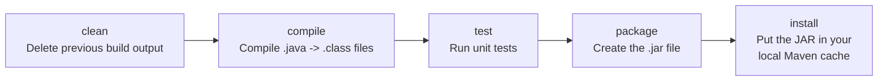

# Chapter 6: Your First Spring Boot Application

> **Estimated time: 75 minutes**

You've learned what REST is, what JSON looks like, and why frameworks exist. Now it's time to stop reading and start *building*. By the end of this chapter, you'll have a real, running web server on your machine -- one you wrote yourself -- responding to HTTP requests with actual data.

Ready? Let's go.

## What You'll Learn

- How to generate a Spring Boot project using Spring Initializr
- What every file and folder in a Spring Boot project does
- What `@SpringBootApplication` means
- How Maven works (just enough to be productive)
- How to run your application and verify it works

---

## Concepts

### Spring Initializr: Time to Go Shopping!

> **Key Point:** Spring Initializr is a website that generates a ready-to-run Spring Boot project. You pick your settings and dependencies, click Generate, and get a `.zip` file with everything configured.

You don't create a Spring Boot project from scratch. Nobody does. That would be like building a car engine just to drive to the grocery store. Instead, you use **Spring Initializr** -- a web tool that lets you pick exactly what you want, click a button, and walk away with a fully configured project.

Think of it like ordering from a restaurant menu. You pick your base (Maven or Gradle), your flavor (Java or Kotlin), your toppings (dependencies like Spring Web), and the kitchen assembles it all into a neat little `.zip` file ready to unpack and run.

Go to: **https://start.spring.io**

**Here's what the menu looks like:**

```
+---------------------------------------------------------------------+
|  Spring Initializr                                                  |
|                                                                     |
|  Project          Language         Spring Boot                      |
|  * Maven  o Gradle   * Java  o Kotlin   * 3.3.x  o 3.2.x          |
|                                                                     |
|  Project Metadata                                                   |
|  +------------------------------------------------------+          |
|  | Group:        com.bookshelf                           |          |
|  | Artifact:     bookshelf                               |          |
|  | Name:         bookshelf                               |          |
|  | Description:  BookShelf - A book library mgmt API     |          |
|  | Package name: com.bookshelf                           |          |
|  | Packaging:    * Jar  o War                             |          |
|  | Java:         * 17  o 21                               |          |
|  +------------------------------------------------------+          |
|                                                                     |
|  Dependencies                        [ ADD DEPENDENCIES... ]        |
|  +----------------------+                                           |
|  | Spring Web           |                                           |
|  +----------------------+                                           |
|                                                                     |
|               [ GENERATE ]    [ EXPLORE ]    [ SHARE ]              |
+---------------------------------------------------------------------+
```

The left side has your project settings. The right side has a search box for adding dependencies. The "EXPLORE" button lets you preview the generated files before downloading -- like peeking into the kitchen before your order comes out.

**But what do all these settings actually mean?**

| Setting | What It Means |
|---------|---------------|
| **Group** | Your organization's reversed domain name, just like Java packages. `com.bookshelf` means "bookshelf project at com." If you work at `example.com`, you'd use `com.example`. |
| **Artifact** | Your project's name. This becomes the folder name and the name of the built `.jar` file. |
| **Packaging: Jar vs War** | **Jar** = standalone app with an embedded server (just run it). **War** = deploy to an external server like standalone Tomcat. We use Jar. |
| **Java version: 17** | Java 17 is an **LTS (Long-Term Support)** release, meaning it receives security updates for years. It's the most widely supported version for Spring Boot 3.x. |

> **There are no Dumb Questions:**
>
> **Q: Why Maven and not Gradle?**
> A: Both work great. Maven is more common in enterprise Java, has more tutorials online, and uses XML which -- while verbose -- is extremely explicit about what it's doing. If you already know Gradle, feel free to use it. Everything in this guide translates directly.
>
> **Q: Why Jar and not War?**
> A: In the old days, you'd build a War file and deploy it into a big, clunky Tomcat server that someone else managed. With Spring Boot, the Tomcat server lives *inside* your Jar. One file, one command, it runs. That's the whole point of Spring Boot.

---

### What Is Maven?

> **Key Point:** Maven manages your project's dependencies (libraries), compiles your code, and packages it into a runnable `.jar` file. Think of it as npm + webpack for Java.

Before we generate the project, you need to understand Maven at a basic level. Don't worry -- we're not going deep. Just deep enough to be dangerous (in a good way).

#### What Problem Does Maven Solve?

Before Maven existed, Java developers had to:
- **Download `.jar` files manually** from websites and put them in a `lib/` folder
- **Track versions themselves** -- "Did I download Spring 5.3.2 or 5.3.3?"
- **Resolve conflicts by hand** -- Library A needs Guava 30, Library B needs Guava 31... which one do you use?
- **Write custom build scripts** for every project to compile and package the code

Maven solves all of this. You declare what you need in one file (`pom.xml`), and Maven downloads it, resolves conflicts, and builds your project.

> **Overheard at the coffee shop:**
>
> "Remember when we used to download JARs from random websites and hope they were the right version?"
>
> "I try not to. I still have nightmares about ClassNotFoundException at 2 AM."

**Maven** is a **build tool** for Java. It does three things:

1. **Manages dependencies** -- downloads libraries your project needs (like Spring Boot itself)
2. **Compiles your code** -- turns `.java` files into runnable code
3. **Packages your app** -- creates a `.jar` file you can run anywhere

Maven uses a file called `pom.xml` (Project Object Model) to know what your project needs. You don't write most of it by hand -- Spring Initializr generates it for you.

#### Maven Lifecycle (Quick Overview)

Maven has a build lifecycle -- a sequence of steps that run in order, like an assembly line:



Here's the neat part: when you run a later phase, all earlier phases run automatically. So `mvn package` will compile, then test, then package. You don't have to chain them together yourself.

**You only need one command for now**: `mvn spring-boot:run` (this compiles and runs your app in one step).

**The only Maven commands you need right now:**

```bash
mvn spring-boot:run     # Run the application
mvn clean package       # Build a runnable JAR file
mvn test                # Run tests
```

> **Watch it!**
>
> **Windows users**: If you don't have Maven installed globally, use the Maven Wrapper that comes with your project. Instead of `mvn spring-boot:run`, run `mvnw.cmd spring-boot:run`. On macOS/Linux, use `./mvnw spring-boot:run`.

Don't overthink Maven. It's a tool, like a dishwasher. You load it (declare dependencies), press a button (run a command), and it does its job. Appendix C has a detailed cheat sheet if you need it later.

---

## Code Examples

### Step 1: Generate the Project

Alright, time to place your order. Go to **https://start.spring.io** and fill in the form:

| Setting | Value |
|---------|-------|
| Project | Maven |
| Language | Java |
| Spring Boot | 3.3.x (latest 3.x) |
| Group | `com.bookshelf` |
| Artifact | `bookshelf` |
| Name | `bookshelf` |
| Description | `BookShelf - A book library management API` |
| Package name | `com.bookshelf` |
| Packaging | Jar |
| Java | 17 |

**Dependencies to add** (click "Add Dependencies"):
- **Spring Web** -- for building REST APIs

That's it. Just one dependency. We're keeping it lean. We'll add more ingredients as we need them.

Click **"Generate"** -- and a `.zip` file downloads. That's your project. The whole thing.

> **Watch it!**
>
> **Windows users**: The `.zip` file will download to your `Downloads` folder. Right-click it -> "Extract All" -> choose a location like `C:\Users\YourName\Projects\`. Avoid paths with spaces or special characters -- they can cause issues with Maven.

### Step 2: Unzip and Open

```bash
# Unzip the downloaded file
unzip bookshelf.zip

# Move into the project directory
cd bookshelf

# If using IntelliJ: File -> Open -> select the bookshelf folder
# If using VS Code: code .
```

### Step 3: Understand the Project Structure

> **Key Point:** Spring Boot follows a standard directory layout. Your Java code goes in `src/main/java`, configuration files go in `src/main/resources`, and tests go in `src/test/java`. All your code must live inside the base package (`com.bookshelf`) or Spring won't find it.

Let's look at what Spring Initializr cooked up for you:

```
bookshelf/
+-- pom.xml                          <-- Maven configuration (dependencies, build settings)
+-- src/
|   +-- main/
|   |   +-- java/
|   |   |   +-- com/
|   |   |       +-- bookshelf/
|   |   |           +-- BookshelfApplication.java    <-- Entry point (main method)
|   |   +-- resources/
|   |       +-- application.properties               <-- App configuration
|   |       +-- static/                              <-- Static files (ignore for APIs)
|   |       +-- templates/                           <-- HTML templates (ignore for APIs)
|   +-- test/
|       +-- java/
|           +-- com/
|               +-- bookshelf/
|                   +-- BookshelfApplicationTests.java  <-- Test file
+-- mvnw                             <-- Maven wrapper (run Maven without installing it)
+-- mvnw.cmd                         <-- Maven wrapper for Windows
+-- .gitignore                       <-- Files Git should ignore
```

That might look like a lot of folders, but most of them are just Java's package-to-folder convention. Let's zoom in on the files that actually matter right now:

| File | Purpose |
|------|---------|
| `pom.xml` | Lists your dependencies and build configuration |
| `BookshelfApplication.java` | The main class -- starts the application |
| `application.properties` | Configuration (port, database URL, etc.) |
| `src/main/java/com/bookshelf/` | Where ALL your Java code goes |
| `src/test/java/com/bookshelf/` | Where ALL your test code goes |

**Files you can ignore for now:** `static/`, `templates/` (used for server-side rendering, not REST APIs), `mvnw`/`mvnw.cmd` (Maven wrapper scripts).

#### Why This Structure?

This directory layout isn't arbitrary -- it's the **Maven Standard Directory Layout** that every Java project follows. Once you learn it here, you'll recognize it everywhere.

| Directory | Purpose |
|-----------|---------|
| `src/main/java` | Your **production code** -- all the Java classes that run in your application |
| `src/main/resources` | **Configuration files**, NOT code. Properties, YAML, XML config, static assets. These get bundled into your JAR but aren't compiled as Java. |
| `src/test/java` | Your **test code**. Mirrors the `main` structure. Test classes for `com.bookshelf.HelloController` go in `src/test/java/com/bookshelf/HelloControllerTest.java`. |

**Understanding the package-to-folder mapping:**

The package name `com.bookshelf` maps directly to the folder structure `com/bookshelf/`. This is a Java requirement -- if your class declares `package com.bookshelf;`, the file must be in a `com/bookshelf/` directory.

```
Package name:           com.bookshelf.controller
Maps to folder:         com/bookshelf/controller/
Full path in project:   src/main/java/com/bookshelf/controller/
```

> **Watch it!**
>
> All your code **MUST** be in `com.bookshelf` or its sub-packages (like `com.bookshelf.controller`, `com.bookshelf.service`, `com.bookshelf.model`). Code placed outside this package -- for example, in `com.other` or `org.example` -- **will not be found by Spring**. This is because `@ComponentScan` (part of `@SpringBootApplication`) only scans the package where the main class lives and everything below it.
>
> This trips up beginners *constantly*. You'll write a beautiful controller, everything looks perfect, and then... nothing. No errors, no warnings, just silence. Spring never found it because it was in the wrong package.

### Step 4: Examine the Main Class

Open `src/main/java/com/bookshelf/BookshelfApplication.java`:

```java
package com.bookshelf;

import org.springframework.boot.SpringApplication;
import org.springframework.boot.autoconfigure.SpringBootApplication;

@SpringBootApplication
public class BookshelfApplication {

    public static void main(String[] args) {
        SpringApplication.run(BookshelfApplication.class, args);
    }
}
```

Wait -- that's it? That's the *entire* starting point of your application? Yep. Let's break it down.

---

#### Fireside Chat: An Interview with @SpringBootApplication

> **Interviewer:** Thanks for coming in, `@SpringBootApplication`. You seem like a pretty important annotation. Can you tell our readers what you actually *do*?
>
> **@SpringBootApplication:** Sure! I'm actually three annotations wearing a trench coat. Under this coat, I'm really `@Configuration`, `@EnableAutoConfiguration`, and `@ComponentScan` all rolled into one.
>
> **Interviewer:** Three annotations? That sounds like cheating.
>
> **@SpringBootApplication:** I prefer "convenience." Look, nobody wants to type three annotations on every main class. So the Spring Boot team combined them into me. Here's what each one does:
>
> 1. `@Configuration` -- "This class can define beans (objects Spring manages)"
> 2. `@EnableAutoConfiguration` -- "Spring Boot, please auto-configure everything based on my dependencies"
> 3. `@ComponentScan` -- "Scan this package and all sub-packages for Spring components"
>
> **Interviewer:** So when someone writes `@SpringBootApplication`, they're really telling Spring to do all three of those things at once?
>
> **@SpringBootApplication:** Exactly. I'm the Swiss Army knife of Spring Boot annotations. One annotation to rule them all.
>
> **Interviewer:** And what about your friend on the next line, `SpringApplication.run()`?
>
> **@SpringBootApplication:** Oh, that's the ignition key. That single line does everything:
> - Creates the Spring application context (the container that manages all your objects)
> - Starts the embedded Tomcat web server
> - Auto-configures everything based on your dependencies
> - Scans for your controllers, services, and repositories
> - Makes the application ready to receive HTTP requests
>
> **Interviewer:** That's... a lot for one line of code.
>
> **@SpringBootApplication:** That's the beauty of Spring Boot. You get a lot for free.

> **Brain Power:**
>
> You will almost never modify this file. It's the ignition key -- you turn it once, and the engine runs. Your actual code goes in other classes. So why is this file important? Because it determines *where* Spring looks for your code. The package this class lives in (`com.bookshelf`) is the root of everything Spring will scan.

### Step 5: Examine pom.xml

> **Key Point:** `pom.xml` is Maven's configuration file. It declares your project's identity, the Java version, what libraries (dependencies) you need, and how to build the project. Spring Initializr generates it for you.

Time to look under the hood. Open `pom.xml` -- and don't panic. You don't need to understand every line. We'll walk through the important parts together.

```xml
<?xml version="1.0" encoding="UTF-8"?>
<project xmlns="http://maven.apache.org/POM/4.0.0"
         xmlns:xsi="http://www.w3.org/2001/XMLSchema-instance"
         xsi:schemaLocation="http://maven.apache.org/POM/4.0.0
         https://maven.apache.org/xsd/maven-4.0.0.xsd">
    <modelVersion>4.0.0</modelVersion>

    <!-- This project inherits from Spring Boot's parent POM -->
    <parent>
        <groupId>org.springframework.boot</groupId>
        <artifactId>spring-boot-starter-parent</artifactId>
        <version>3.3.0</version>
    </parent>

    <!-- Your project's identity -->
    <groupId>com.bookshelf</groupId>
    <artifactId>bookshelf</artifactId>
    <version>0.0.1-SNAPSHOT</version>
    <name>bookshelf</name>
    <description>BookShelf - A book library management API</description>

    <properties>
        <java.version>17</java.version>
    </properties>

    <!-- Dependencies: libraries your project uses -->
    <dependencies>
        <!-- Spring Web: everything needed for REST APIs -->
        <dependency>
            <groupId>org.springframework.boot</groupId>
            <artifactId>spring-boot-starter-web</artifactId>
        </dependency>

        <!-- Testing support -->
        <dependency>
            <groupId>org.springframework.boot</groupId>
            <artifactId>spring-boot-starter-test</artifactId>
            <scope>test</scope>
        </dependency>
    </dependencies>

    <!-- Build plugin: creates a runnable JAR -->
    <build>
        <plugins>
            <plugin>
                <groupId>org.springframework.boot</groupId>
                <artifactId>spring-boot-maven-plugin</artifactId>
            </plugin>
        </plugins>
    </build>
</project>
```

---

#### Fireside Chat: An Interview with pom.xml

> **Interviewer:** So, `pom.xml`, a lot of beginners find you... intimidating. All that XML. All those angle brackets. What do you say to that?
>
> **pom.xml:** I get it. I'm verbose. But here's the thing -- I'm *readable*. Every section has a clear purpose, and once you know the five main sections, you can skim me in seconds.
>
> **Interviewer:** Five sections? Walk us through them.
>
> **pom.xml:** Gladly.
>
> **Section 1: `<parent>`** -- This says "my project inherits from Spring Boot's parent." The parent POM pre-defines compatible versions for hundreds of libraries. That's why you don't see `<version>` tags on individual dependencies below -- the parent already knows which versions work together. I'm saving you from version conflict nightmares.
>
> **Section 2: `<groupId>`, `<artifactId>`, `<version>`** -- This is my project's identity card. Together, these three values uniquely identify your project in the Maven ecosystem. `SNAPSHOT` means "this is a development version, not a release." When you eventually deploy, you'd change it to `1.0.0`.
>
> **Section 3: `<properties>`** -- Project-wide settings. Right now it's just the Java version. If you switch to Java 21 later, you only change it here.
>
> **Section 4: `<dependencies>`** -- This is the big one. Each `<dependency>` block declares a library you need. Maven downloads it (and all *its* sub-dependencies) automatically. No manual JAR downloading. The `<scope>test</scope>` on the test dependency means it's only available during testing, not in production.
>
> **Section 5: `<build>`** -- This plugin gives you the `mvn spring-boot:run` command and packages your app as an executable JAR (with an embedded Tomcat server inside it).
>
> **Interviewer:** So the key takeaway is...
>
> **pom.xml:** You mostly just care about `<dependencies>`. When you need a new library, you add a dependency block. Maven does the rest.

**Key parts (the short version):**
- `<parent>` -- inherits Spring Boot's managed dependency versions
- `<dependencies>` -- the libraries you're using. `spring-boot-starter-web` includes Tomcat, Spring MVC, Jackson (JSON parser), and everything else you need for REST APIs
- `<build>` -- the plugin that packages your app as a runnable JAR

**"Starters"** are Spring Boot's bundled dependency packages. Think of them as combo meals:

| Starter | What It Includes |
|---------|-----------------|
| `spring-boot-starter-web` | Tomcat, Spring MVC, Jackson (JSON), validation |
| `spring-boot-starter-data-jpa` | Hibernate, JPA, database tools (added in Chapter 12) |
| `spring-boot-starter-security` | Authentication, authorization (added in Chapter 18) |
| `spring-boot-starter-test` | JUnit, Mockito, Spring Test |

> **There are no Dumb Questions:**
>
> **Q: Why don't the dependencies have version numbers?**
> A: Because the `<parent>` section points to `spring-boot-starter-parent`, which already defines the right version for every Spring Boot dependency. It's like a curated playlist -- the parent POM has already tested which versions play well together.
>
> **Q: What if I need a library that ISN'T part of Spring Boot?**
> A: You add it the same way, but you *will* need to include a `<version>` tag since the parent POM doesn't know about third-party libraries.

### Step 6: Run the Application

This is the moment of truth. Open your terminal, navigate to the project directory, and type:

```bash
mvn spring-boot:run
```

Take a deep breath. Hit Enter. And watch this happen:

```
  .   ____          _            __ _ _
 /\\ / ___'_ __ _ _(_)_ __  __ _ \ \ \ \
( ( )\___ | '_ | '_| | '_ \/ _` | \ \ \ \
 \\/  ___)| |_)| | | | | || (_| |  ) ) ) )
  '  |____| .__|_| |_|_| |_\__, | / / / /
 =========|_|==============|___/=/_/_/_/
 :: Spring Boot ::                (v3.3.0)

2025-01-15 10:30:00 INFO  Starting BookshelfApplication...
2025-01-15 10:30:01 INFO  Tomcat initialized with port 8080 (http)
2025-01-15 10:30:02 INFO  Started BookshelfApplication in 1.8 seconds
```

See that ASCII art? That's the Spring Boot banner. That means **you're IN**. Your server has booted, Tomcat is running, and your application is alive and listening on port 8080.

> **Key Point:**
>
> If you see "Started BookshelfApplication in X.X seconds," congratulations -- your server is running. You didn't install Tomcat. You didn't write a web.xml. You didn't configure a server. Spring Boot did all of that for you.

### Step 7: Test It

Your server is running. Let's talk to it. Open a **new** terminal window (keep the server running in the first one) and try:

```bash
curl http://localhost:8080
```

You'll get:

```json
{"timestamp":"2025-01-15T10:30:05.000+00:00","status":404,"error":"Not Found","path":"/"}
```

Wait -- a 404? Did something go wrong?

Nope. Not even a little.

That 404 isn't an error. It's your server saying *"I'm alive, but you haven't taught me anything yet."* Think about it: you never told your application what to do when someone visits `/`. So Spring Boot's default error handler politely returned a structured JSON response saying "I don't know what you want."

The important thing is that your server *received the request*, *processed it*, and *responded*. That's a working web server right there.

**You have a running web server.** Take a second to appreciate that.

To stop the server, press `Ctrl+C` in the terminal where it's running.

### Step 7.5: Understanding application.properties

The file `src/main/resources/application.properties` is where you configure your Spring Boot application. Right now it's empty -- a blank canvas waiting for your instructions.

Here are common properties you'll use throughout this guide:

```properties
# Server Configuration
server.port=8080                                  # Which port to run on (default: 8080)
server.servlet.context-path=/api                  # Prefix all URLs with /api (e.g., /api/hello)

# Application Info
spring.application.name=bookshelf                 # Name your app (shows in logs and monitoring)

# Logging
logging.level.root=INFO                           # Log level: ERROR < WARN < INFO < DEBUG < TRACE

# JSON Formatting (makes API responses human-readable during development)
spring.jackson.serialization.indent-output=true   # Pretty-print JSON responses
```

> **Watch it!**
>
> **Don't add all of these right now.** We'll add properties as we need them throughout the guide. For now, just know that this file exists and that Spring Boot reads it automatically at startup. We'll add database properties in Chapter 12 and security properties in Chapter 18.

**Quick rules about this file:**
- One property per line, in `key=value` format
- Lines starting with `#` are comments
- No quotes around values (unlike JSON or YAML)
- Changes require a restart to take effect

### Step 8: Add a Quick Hello Endpoint

Now let's teach your server its first trick. Create a new file at `src/main/java/com/bookshelf/HelloController.java`:

```java
package com.bookshelf;

import org.springframework.web.bind.annotation.GetMapping;
import org.springframework.web.bind.annotation.RestController;

@RestController
public class HelloController {

    @GetMapping("/hello")
    public String hello() {
        return "Hello from BookShelf!";
    }
}
```

Now restart the server (`Ctrl+C`, then `mvn spring-boot:run`) and try:

```bash
curl http://localhost:8080/hello
```

Response:
```
Hello from BookShelf!
```

You just built your first API endpoint. Take a moment. That's HUGE.

You wrote a Java class. You added two annotations. And now there's a web server on your machine that responds to HTTP requests with data *you* chose. This is the foundation of every REST API you'll ever build.

Let's break down what just happened:

1. **`@RestController`** -- This annotation tells Spring two things: (a) "this class handles HTTP requests" (it's a controller), and (b) "every method's return value should be written directly to the HTTP response body" (not interpreted as a template name). It combines `@Controller` and `@ResponseBody` into one annotation.

2. **`@GetMapping("/hello")`** -- "When someone sends an HTTP **GET** request to the path `/hello`, call this method." The method name (`hello`) doesn't matter to Spring -- only the path in the annotation matters. You could name the method `foo()` and it would still respond to `/hello`.

3. **The method returns a `String`** -- Spring Boot takes that string and sends it as the HTTP response body with status code `200 OK` and Content-Type `text/plain`.

4. **Spring Boot automatically sets HTTP headers** -- You didn't write any HTTP response code. Spring Boot handled the status code, Content-Type header, and response formatting for you.

> **Brain Power:**
>
> Look at your `HelloController` class again. There's no `main` method. No code that creates an HTTP server. No code that parses the URL. No code that formats the response. You just said "when someone GETs /hello, return this string." Where does all the other work happen? That's Spring Boot's auto-configuration at work -- it wired everything together behind the scenes based on the `spring-boot-starter-web` dependency you added.

#### Returning JSON (Automatic Conversion)

Returning a string is fine, but real APIs return **JSON**. Let's add a second endpoint that returns a Java object. Add this method inside `HelloController`:

```java
import java.util.HashMap;
import java.util.Map;

// ... inside the HelloController class:

@GetMapping("/info")
public Map<String, Object> info() {
    Map<String, Object> data = new HashMap<>();
    data.put("app", "BookShelf");
    data.put("version", "1.0");
    data.put("ready", true);
    return data;
}
```

Restart the server and try:

```bash
curl http://localhost:8080/info
```

Response:
```json
{
  "app": "BookShelf",
  "version": "1.0",
  "ready": true
}
```

Wait a second. You returned a Java `Map`, but the HTTP response is **JSON**. You didn't write any JSON conversion code. You didn't import a JSON library. You didn't call `objectMapper.writeValueAsString()`. So how did that happen?

Spring Boot (via a library called **Jackson**) automatically converted your Java object to JSON. This works with Maps, Lists, custom classes, records -- any Java object. This automatic conversion is one of the reasons Spring Boot is so productive. You focus on your data; Spring Boot handles the serialization.

We'll dive deep into controllers in Chapter 7.

---

## Exercise: Set Up Your BookShelf Project

**Goal**: Get a running Spring Boot application on your machine.

### Tasks

1. **Generate the project** at https://start.spring.io with the settings from Step 1
2. **Open it** in your IDE
3. **Run it** with `mvn spring-boot:run`
4. **Verify** the 404 response: `curl http://localhost:8080`
5. **Create the HelloController** from Step 8
6. **Verify** hello works: `curl http://localhost:8080/hello`
7. **Experiment** -- add two more endpoints:

```java
@GetMapping("/goodbye")
public String goodbye() {
    return "Goodbye from BookShelf!";
}

@GetMapping("/time")
public String time() {
    return "Current time: " + java.time.LocalDateTime.now();
}
```

8. **Try to break it** -- what happens if you:
   - Create two methods with the same `@GetMapping("/hello")`?
   - Send a POST request to `/hello`? (`curl -X POST http://localhost:8080/hello`)
   - Access a path that doesn't exist?

### Important Configuration

Add this line to `src/main/resources/application.properties`:

```properties
server.port=8080
```

This is the default, but now you know where to change it. Try changing it to `9090` and accessing `http://localhost:9090/hello`.

---

## Troubleshooting

If something went wrong, you're not alone. These are the most common issues beginners hit, and every single one of them has a straightforward fix.

### "Port 8080 already in use"

This means another process is already using port 8080. You need to find and stop it.

**macOS / Linux:**
```bash
# Find what's using port 8080
lsof -i :8080

# You'll see output like:
# COMMAND   PID   USER   FD   TYPE  DEVICE  SIZE/OFF NODE NAME
# java    12345  youruser  ...

# Kill the process using its PID
kill 12345
```

**Windows:**
```cmd
# Find what's using port 8080
netstat -ano | findstr :8080

# You'll see output with a PID at the end, e.g., 12345
# Kill the process
taskkill /PID 12345 /F
```

**Alternative**: Instead of killing the process, change your app's port in `application.properties`:
```properties
server.port=9090
```

### "JAVA_HOME not set" or "java: command not found"

Spring Boot needs Java installed and the `JAVA_HOME` environment variable set.

```bash
# Check if Java is installed
java -version

# Check if JAVA_HOME is set
echo $JAVA_HOME          # macOS/Linux
echo %JAVA_HOME%         # Windows
```

If `JAVA_HOME` is not set, add it to your shell profile:
- **macOS/Linux**: Add `export JAVA_HOME=$(/usr/libexec/java_home)` to `~/.bashrc` or `~/.zshrc`
- **Windows**: System Properties -> Environment Variables -> New -> `JAVA_HOME` = path to your JDK (e.g., `C:\Program Files\Java\jdk-17`)

### "mvn: command not found"

Maven isn't installed globally on your system. No problem -- use the **Maven Wrapper** that comes with your project:

```bash
# macOS / Linux
./mvnw spring-boot:run

# Windows
mvnw.cmd spring-boot:run
```

The wrapper (`mvnw` / `mvnw.cmd`) downloads the correct Maven version automatically. You don't need to install Maven separately.

### "Application starts but immediately exits"

If you see the Spring Boot banner but the application shuts down right away (no "Started BookshelfApplication" message), you're probably **missing the `spring-boot-starter-web` dependency**.

Open `pom.xml` and make sure this dependency is present:
```xml
<dependency>
    <groupId>org.springframework.boot</groupId>
    <artifactId>spring-boot-starter-web</artifactId>
</dependency>
```

Without `spring-boot-starter-web`, there's no embedded Tomcat server, so Spring Boot has nothing to keep running. It starts, finds no web server to launch, and exits. Add the dependency, save the file, and try again.

---

## Common Mistakes

| Mistake | Reality |
|---------|---------|
| "I need to install Tomcat" | No. Spring Boot includes an embedded Tomcat. Just run your app. |
| Putting Java files outside the main package | `@ComponentScan` only scans `com.bookshelf` and its sub-packages. If you put a controller in `com.other`, Spring won't find it. |
| Forgetting to restart after changes | Unlike some languages, Java needs a restart to pick up changes. (`Ctrl+C` then `mvn spring-boot:run`). Later you can add Spring DevTools for auto-restart. |
| Trying to run two apps on the same port | You'll get "Port 8080 already in use." Stop the first instance or change the port in `application.properties`. |
| Panicking at the Whitelabel Error Page | That's not a bug -- it's Spring Boot telling you "I'm running but you haven't told me what to do at this URL." |

> **Overheard at the coffee shop:**
>
> "I spent an hour debugging why my controller wasn't working. Turns out I put it in `com.controllers` instead of `com.bookshelf.controllers`. Spring never even saw it."
>
> "Been there. The worst part is there's no error message. It just... silently ignores you."

---

### Practice Exercises

Ready to test your understanding? These exercises from [Appendix E](../../appendices/E-coding-exercises.md) directly apply what you learned in this chapter:

| Exercise | Topic | Difficulty |
|----------|-------|------------|
| [Exercise 11](../../appendices/E-coding-exercises.md#exercise-11) | Your First GET Endpoint | * |
| [Exercise 12](../../appendices/E-coding-exercises.md#exercise-12) | Return an Object as JSON | * |

Solutions are in [Appendix F](../../appendices/F-exercise-solutions.md).

---

## Key Takeaways

- [ ] I can generate a Spring Boot project using Spring Initializr
- [ ] I understand the project structure (src/main/java, resources, pom.xml)
- [ ] I know what `@SpringBootApplication` does (auto-config, component scan, config)
- [ ] I can run the application with `mvn spring-boot:run`
- [ ] I created my first endpoint using `@RestController` and `@GetMapping`
- [ ] I can test my endpoint with `curl`

---

## Quick Quiz

> **Brain Power:**
>
> Try to answer these without scrolling back up. If you can get 4 out of 5, you're ready for Chapter 7.

1. What does `spring-boot-starter-web` include?
2. Where does your Java code go in the project structure?
3. What happens when you run `SpringApplication.run(BookshelfApplication.class, args)`?
4. Why does `curl http://localhost:8080` return a 404 for a fresh project?
5. What's the difference between `mvn spring-boot:run` and `mvn clean package`?

---

## Day 2 Summary

```
You made it through Day 2. Here's everything you accomplished:

  JSON is the universal data format for APIs (key-value pairs, arrays, nesting)
  REST is a convention: resources as URLs, HTTP methods as actions
  Frameworks handle boilerplate so you focus on business logic
  Spring Boot = Spring + auto-configuration + embedded server
  You created and ran your first Spring Boot application!
  You built your first endpoint with @RestController and @GetMapping
```

That last one is worth repeating: *you built your first endpoint*. You have a server running on your machine that responds to HTTP requests. Everything from here builds on this foundation.

Tomorrow, you'll build real API endpoints, learn dependency injection, and understand the full lifecycle of an HTTP request through your application.

---

*Next: `day-3/07-controllers.md` -- Time to build real endpoints for the BookShelf API -->*
