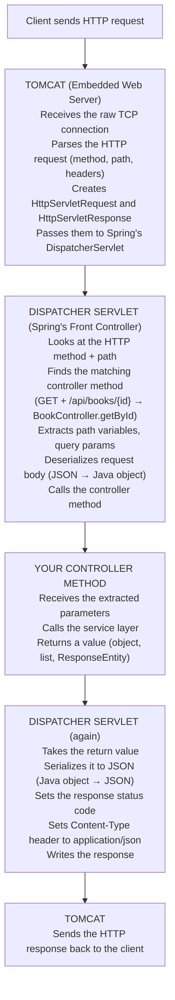

# Chapter 9: The Request-Response Lifecycle

> ⏱ Estimated time: 50 minutes

## What You'll Learn

- The complete journey of an HTTP request through Spring Boot
- What the DispatcherServlet does
- How to use `ResponseEntity` to control status codes and headers
- How to return proper HTTP status codes (201, 204, 404)
- How to think about error cases

---

## The Story of a Request (Or: "Who Touched My HTTP?")

You've been building controllers. You've been writing service classes. You've been wiring things up with dependency injection. But have you ever stopped and wondered...

*What actually happens when someone hits your API?*

Like, **really** happens? Not "Spring handles it" hand-waving. The real, step-by-step, behind-the-curtain truth?

Buckle up. We're about to follow an HTTP request on the most important journey of its short, beautiful life.

---

## Concepts

### Act I: The Arrival — Our Request's Epic Journey

Imagine this. A client somewhere in the world types a URL or fires off a `curl` command:

```
GET /api/books/42
```

Our little HTTP request leaves the client, travels across the network, and arrives at your Spring Boot application. What greets it? **Not** your controller. Not even close.

Let's trace every step.

---

**Scene 1: The Bouncer — Tomcat**

Our request arrives at the gate, and standing there with arms crossed is **Tomcat** — the embedded web server. Tomcat is the bouncer. It doesn't care about Spring, beans, or dependency injection. It cares about TCP connections, raw bytes, and HTTP parsing.

Here's what Tomcat does:
1. Catches the raw TCP connection
2. Parses the HTTP request (method, path, headers, body)
3. Creates two crucial objects: `HttpServletRequest` and `HttpServletResponse`
4. Hands them off to... the star of our show

---

**Scene 2: The Traffic Cop — DispatcherServlet**

This is where it gets interesting. The `DispatcherServlet` takes the baton from Tomcat and says, "I'll take it from here." It looks at the HTTP method and the path, rummages through its internal mapping registry, and figures out *exactly* which controller method should handle this request.

For `GET /api/books/42`, it thinks: "GET method... path matches `/api/books/{id}`... that's `BookController.getById()`!"

But it doesn't just forward the request blindly. Oh no. It:
- Extracts path variables (`42` becomes the `id` parameter)
- Pulls out query parameters
- Deserializes the request body (if there is one) from JSON into a Java object
- **Then** calls your controller method with all the right arguments already unpacked

---

**Scene 3: Your Controller (Finally!)**

Your controller method runs. It calls the service layer, gets a result, and returns it. Simple. You've been writing this part all along.

---

**Scene 4: The Return Trip — DispatcherServlet Again**

After your controller returns, the DispatcherServlet jumps back in for the return trip. It:
- Takes whatever your method returned (an object, a list, a `ResponseEntity`)
- Serializes it to JSON using Jackson
- Sets the status code on the response
- Sets the `Content-Type` header to `application/json`
- Writes everything into the response

---

**Scene 5: Tomcat Sends It Home**

Tomcat picks up the finished HTTP response and ships it back across the network to the client.

*And the crowd goes wild.*

---

Here's the whole journey in one diagram:



> **🧠 Brain Power:** Look at that diagram carefully. Your controller is only one stop on this journey. Everything *before* and *after* your code is handled automatically by Spring and Tomcat. That's the magic you've been taking for granted. How does understanding this change the way you think about debugging?

---

### 🎤 Fake Interview: A Candid Chat with DispatcherServlet

**Interviewer:** So, DispatcherServlet, tell us about yourself. What do you do around here?

**DispatcherServlet:** I'm the traffic cop of Spring Boot. Every single HTTP request that comes into a Spring MVC application goes through me. Every. Single. One. Tomcat catches the request at the door, sure, but I'm the one who figures out what to *do* with it.

**Interviewer:** That sounds like a lot of pressure.

**DispatcherServlet:** You have no idea. I maintain this giant map of URL patterns to controller methods. When a request arrives, I match the HTTP method and path against that map. `GET /api/books/{id}`? I know that's `BookController.getById()`. `POST /api/books`? That's `BookController.createBook()`. I never get it wrong.

**Interviewer:** What happens when you can't find a match?

**DispatcherServlet:** Then you get a 404. And honestly? Nine times out of ten, when a developer comes to me complaining "my endpoint isn't working," it's because they misspelled a path, forgot an annotation, or didn't register their controller as a bean. It's not *my* fault. I can only route to what I know about.

**Interviewer:** Do developers ever interact with you directly?

**DispatcherServlet:** Almost never. I work behind the scenes. But I wish more developers *understood* me. When something goes wrong — an endpoint returns the wrong thing, a parameter isn't being extracted, JSON isn't being parsed — if they understood that I'm the one doing all that work, they'd know where to look.

**Interviewer:** Any final words?

**DispatcherServlet:** Respect your front controller. That's all I ask.

---

### 🎤 Fake Interview: Tomcat's Side of the Story

**Interviewer:** Tomcat, some people call you "just a web server." How does that make you feel?

**Tomcat:** Look, I'm the bouncer at the door. I handle the raw TCP connections. I parse HTTP. I create the `HttpServletRequest` and `HttpServletResponse` objects that the entire servlet ecosystem depends on. Without me, there's no party. But do I get credit? Nah. It's always "Spring this" and "Spring that."

**Interviewer:** Do you know anything about Spring?

**Tomcat:** Honestly? I don't care about Spring. I'm a servlet container. I know about servlets. Spring's `DispatcherServlet` is just another servlet to me. I hand it the request, it does its thing, hands me back a response, and I ship it out. Clean separation of concerns. That's how pros work.

**Interviewer:** Spring Boot embeds you inside the application. How's that feel?

**Tomcat:** Cozy. Back in the old days, developers had to install me separately, deploy WAR files, configure XML... it was a mess. Now I just ride along inside the JAR. Same power, zero hassle.

---

### The Problem with Plain Return Types (Or: "Why 200 for Everything Is a Lie")

Alright, you've seen the journey. Now let's talk about a problem you've been living with and maybe didn't even realize.

Back in Chapter 7, your controller looked like this:

```java
@GetMapping("/{id}")
public Book getBookById(@PathVariable Long id) {
    return bookService.getBookById(id).orElse(null);
}
```

Seems fine, right? *Wrong.* Here's what's actually happening:

1. When the book is found → returns 200. ✅
2. When the book is NOT found → returns `null`, which Spring serializes as... nothing. Empty 200 response. ❌ Should be 404!
3. When creating a book → returns 200. ❌ Should be 201 Created!
4. When deleting a book → returns 200 with empty body. Should be 204 No Content!

You're lying to your clients. You're telling them "everything's fine!" (200 OK) when actually the book doesn't exist. That's like a doctor saying "you're healthy!" to every patient regardless of their symptoms.

> **⚠️ Watch it!** Status codes aren't decoration. They're part of the HTTP contract. Frontend applications, mobile apps, and other services *depend* on the correct status code to decide what to do next. Return 200 when you meant 404, and your client-side code has no idea something went wrong.

---

### ResponseEntity: You Now Control EVERYTHING About the Response 🎉

Meet `ResponseEntity<T>`. This is the moment you go from "Spring decides my status code" to "I AM the one who decides."

`ResponseEntity<T>` lets you control:
- The **status code** (200, 201, 204, 404, etc.)
- The **headers** (Location, custom headers, anything)
- The **body** (the data)

All three. Every aspect of the HTTP response. Full. Absolute. Control.

```java
// Basic ResponseEntity usage
ResponseEntity.ok(book)                          // 200 with body
ResponseEntity.status(HttpStatus.CREATED).body(book)  // 201 with body
ResponseEntity.noContent().build()               // 204 with no body
ResponseEntity.notFound().build()                // 404 with no body
ResponseEntity.badRequest().body(errorMessage)   // 400 with error message
```

> **🗣️ Overheard at the coffee shop:** *"I used to just return objects from my controllers. Then I discovered ResponseEntity and I felt like I'd been driving with the parking brake on for months."*

---

### Status Code Patterns

Here are the correct status codes for each operation:

| Operation | Success Code | Failure Code |
|-----------|-------------|--------------|
| GET (one item) | 200 OK | 404 Not Found |
| GET (list) | 200 OK (empty list is still 200!) | — |
| POST (create) | **201 Created** | 400 Bad Request |
| PUT (update) | 200 OK | 404 Not Found |
| DELETE | **204 No Content** | 404 Not Found |

> **💡 There are no Dumb Questions:**
>
> **Q: Wait, why is an empty list 200 and not 404?**
>
> A: Great question, and people get this wrong all the time. `GET /api/books` returning `[]` means "the collection exists, it just has no items right now." The *resource* (the books collection) is there. It's real. It's just empty. A 404 means the resource *itself* doesn't exist — like `GET /api/unicorns` if you don't have a unicorns endpoint.
>
> **Q: Why 204 for DELETE and not just 200 with an empty body?**
>
> A: Because 204 explicitly means "No Content" — I did the thing, and there's nothing to give you back. The thing you asked me to delete? It's gone. There's nothing to show you. 200 with an empty body is ambiguous — did it work? Did something go wrong? 204 is unambiguous.
>
> **Q: Why 201 for POST and not just 200?**
>
> A: Because 201 tells the client "a new resource was *created*." This matters for caching, for client-side state management, for everything. It's semantically different from "I processed your request" (200).

---

## Code Examples

### BookShelf v1 Improved: Proper Status Codes

Time to upgrade your `BookController.java`. Every endpoint gets the right status code:

```java
package com.bookshelf;

import org.springframework.http.HttpStatus;
import org.springframework.http.ResponseEntity;
import org.springframework.web.bind.annotation.*;
import java.util.List;

@RestController
@RequestMapping("/api/books")
public class BookController {

    private final BookService bookService;

    public BookController(BookService bookService) {
        this.bookService = bookService;
    }

    // GET /api/books → 200 OK (always, even if empty list)
    @GetMapping
    public ResponseEntity<List<Book>> getAllBooks() {
        return ResponseEntity.ok(bookService.getAllBooks());
    }

    // GET /api/books/{id} → 200 OK or 404 Not Found
    @GetMapping("/{id}")
    public ResponseEntity<Book> getBookById(@PathVariable Long id) {
        return bookService.getBookById(id)
                .map(ResponseEntity::ok)                    // Found → 200 with book
                .orElse(ResponseEntity.notFound().build());  // Not found → 404
    }

    // POST /api/books → 201 Created
    @PostMapping
    public ResponseEntity<Book> createBook(@RequestBody Book book) {
        Book created = bookService.createBook(book);
        return ResponseEntity.status(HttpStatus.CREATED).body(created);
    }

    // PUT /api/books/{id} → 200 OK or 404 Not Found
    @PutMapping("/{id}")
    public ResponseEntity<Book> updateBook(
            @PathVariable Long id,
            @RequestBody Book updatedBook
    ) {
        return bookService.updateBook(id, updatedBook)
                .map(ResponseEntity::ok)                    // Found & updated → 200
                .orElse(ResponseEntity.notFound().build());  // Not found → 404
    }

    // DELETE /api/books/{id} → 204 No Content or 404 Not Found
    @DeleteMapping("/{id}")
    public ResponseEntity<Void> deleteBook(@PathVariable Long id) {
        if (bookService.deleteBook(id)) {
            return ResponseEntity.noContent().build();       // Deleted → 204
        }
        return ResponseEntity.notFound().build();            // Not found → 404
    }

    // GET /api/books/search?title=... → 200 OK (always)
    @GetMapping("/search")
    public ResponseEntity<List<Book>> searchBooks(@RequestParam String title) {
        return ResponseEntity.ok(bookService.searchByTitle(title));
    }
}
```

> **🎯 Key Point:** Notice how the return type changed from `Book` to `ResponseEntity<Book>`. That `<Book>` inside the angle brackets is the *body type*. `ResponseEntity<Void>` means "no body" — perfect for DELETE.

---

### Testing the Improved Status Codes

Don't just trust your code — *verify* it. Use `curl -v` (the `-v` is for "verbose" and it shows you the status code):

```bash
# Create a book → should return 201
curl -v -X POST http://localhost:8080/api/books \
  -H "Content-Type: application/json" \
  -d '{"title": "Dune", "author": "Frank Herbert", "pages": 412}'
# Look for: < HTTP/1.1 201

# Get existing book → should return 200
curl -v http://localhost:8080/api/books/1
# Look for: < HTTP/1.1 200

# Get non-existent book → should return 404
curl -v http://localhost:8080/api/books/999
# Look for: < HTTP/1.1 404

# Delete existing book → should return 204
curl -v -X DELETE http://localhost:8080/api/books/1
# Look for: < HTTP/1.1 204

# Delete again (already gone) → should return 404
curl -v -X DELETE http://localhost:8080/api/books/1
# Look for: < HTTP/1.1 404
```

> **⚠️ Watch it!** Without the `-v` flag, curl only shows you the body. You literally *cannot see* the status code. When you're debugging HTTP, always, always, always use `curl -v`.

---

### Understanding the Optional Pattern

Let's zoom in on this beautiful piece of code from `getBookById`:

```java
return bookService.getBookById(id)        // Returns Optional<Book>
        .map(ResponseEntity::ok)           // If present → wrap in 200 OK
        .orElse(ResponseEntity.notFound().build());  // If empty → 404
```

Read that out loud. "Get the book by ID. If you found it, map it into a 200 OK response. Otherwise, give me a 404."

This is a clean pattern you'll use *constantly*:
- Service returns `Optional<T>`
- Controller maps it to the appropriate ResponseEntity
- No null checks, no if-else blocks

> **🧠 Brain Power:** What would this code look like *without* Optional? Write out the if-else version in your head. Which version do you prefer reading six months from now?

---

### Adding Custom Headers

Sometimes you need to set custom response headers. `ResponseEntity`'s builder makes this easy:

```java
@PostMapping
public ResponseEntity<Book> createBook(@RequestBody Book book) {
    Book created = bookService.createBook(book);
    return ResponseEntity
            .status(HttpStatus.CREATED)
            .header("X-Book-Id", String.valueOf(created.getId()))  // Custom header
            .body(created);
}
```

The `Location` header is especially important after creating a resource — it tells the client *where to find* the new resource:

```java
@PostMapping
public ResponseEntity<Book> createBook(@RequestBody Book book) {
    Book created = bookService.createBook(book);
    URI location = URI.create("/api/books/" + created.getId());
    return ResponseEntity.created(location).body(created);
    // Sets status 201 AND Location header automatically
}
```

> **🎯 Key Point:** `ResponseEntity.created(location)` is a shortcut that sets *both* the 201 status code and the `Location` header in one call. It's the idiomatic way to respond to a successful POST in RESTful APIs.

---

## 🔥 Fireside Chat: ResponseEntity vs. Plain Return Types

| | **Plain Return Type** | **ResponseEntity** |
|---|---|---|
| **Ease of use** | Dead simple. Just return the object. | Slightly more verbose, but not by much. |
| **Status code control** | Nope. You get 200 for everything. | Full control. 200, 201, 204, 404 — your call. |
| **Header control** | Nope. Spring sets them for you. | Add any header you want. |
| **Error handling** | Return `null` and hope for the best? | Return the right error code with a clear message. |
| **When to use** | Quick prototypes, internal tools, when you genuinely don't care about status codes. | Production APIs. Which is to say: almost always. |

**The verdict:** Use `ResponseEntity` for any API that other people (or other services) will consume. It's the professional way to build REST APIs.

---

## Exercise: Upgrade BookShelf with ResponseEntity

**Goal**: Update all BookShelf endpoints to return proper HTTP status codes.

### Tasks

1. Update every controller method to return `ResponseEntity<T>`
2. Return `201 Created` for successful POST
3. Return `204 No Content` for successful DELETE
4. Return `404 Not Found` when a book doesn't exist (GET, PUT, DELETE)
5. Test every endpoint with `curl -v` to verify the status codes

### Checklist

Test these scenarios and verify the status code:

| Scenario | Expected Status |
|----------|----------------|
| `GET /api/books` (empty) | 200 with `[]` |
| `POST /api/books` (valid data) | 201 with created book |
| `GET /api/books/1` (exists) | 200 with book |
| `GET /api/books/999` (doesn't exist) | 404 |
| `PUT /api/books/1` (exists) | 200 with updated book |
| `PUT /api/books/999` (doesn't exist) | 404 |
| `DELETE /api/books/1` (exists) | 204 (no body) |
| `DELETE /api/books/1` (already deleted) | 404 |

> **🧠 Brain Power:** Before you run each test, *predict* the status code first. Then run it and check. Did you get them all right? If any surprised you, go back and re-read the status code table.

---

## Common Mistakes

| Mistake | Reality |
|---------|---------|
| Returning 200 for everything | Different operations deserve different status codes. Clients depend on these to decide what to do next. |
| Returning 404 for an empty list | An empty list is a valid response (200). 404 means the resource doesn't exist — but `/api/books` exists, it just has no items. |
| Forgetting `.build()` on no-body responses | `ResponseEntity.notFound()` returns a builder. You need `.build()` to get the actual ResponseEntity. |
| Returning the deleted object on DELETE | Convention is 204 (No Content) — the thing is gone, there's nothing to return. |
| Not using `-v` flag when testing | Without `-v`, curl only shows the body. You can't see the status code. Always use `curl -v` when debugging. |

> **💡 There are no Dumb Questions:**
>
> **Q: I forgot `.build()` and got a weird compiler error. What's going on?**
>
> A: `ResponseEntity.notFound()` and `ResponseEntity.noContent()` don't return a `ResponseEntity` directly. They return a *builder*. Think of it like ordering at a restaurant: you've said what you want, but you haven't confirmed the order yet. `.build()` is you saying "that's my final answer." Without it, you're handing back the menu instead of the meal.
>
> **Q: Can I mix plain return types and ResponseEntity in the same controller?**
>
> A: Technically yes, but please don't. Pick one approach and stick with it. Consistency matters. If one method returns `ResponseEntity<Book>` and another returns `Book`, anyone reading your code will wonder why.

---

### 📝 Practice Exercises

Ready to test your understanding? These exercises from [Appendix E](../../appendices/E-coding-exercises.md) directly apply what you learned in this chapter:

| Exercise | Topic | Difficulty |
|----------|-------|------------|
| [Exercise 18](../../appendices/E-coding-exercises.md#exercise-18) | Complete Notes API | ⭐⭐⭐ |

Solutions are in [Appendix F](../../appendices/F-exercise-solutions.md).

---

## Key Takeaways

- [ ] I understand the full request lifecycle: Client → Tomcat → DispatcherServlet → Controller → Service → back
- [ ] I know what the DispatcherServlet does (routing, parameter extraction, serialization)
- [ ] I can use `ResponseEntity` to control status codes, headers, and body
- [ ] I know the correct status codes: 200 (OK), 201 (Created), 204 (No Content), 404 (Not Found)
- [ ] I can test status codes using `curl -v`

---

## Quick Quiz

1. What does the DispatcherServlet do?
2. What's wrong with returning `null` from a controller method when a resource isn't found?
3. Write the code for a DELETE endpoint that returns 204 on success and 404 if the item doesn't exist.
4. Should `GET /api/books` return 404 if there are no books in the database? Why or why not?
5. What does `ResponseEntity.created(location).body(book)` do?

---

## Day 3: Mission Complete 🏁

Take a moment. Seriously. Look at what you've built over Day 3:

```
✓ Controllers receive requests and send responses using @RestController
✓ @GetMapping, @PostMapping, @PutMapping, @DeleteMapping map HTTP methods
✓ @PathVariable, @RequestParam, @RequestBody extract data from requests
✓ Dependency Injection means receiving dependencies, not creating them
✓ Constructor injection with final fields is the right way
✓ @Service, @Repository, @RestController register beans with Spring
✓ ResponseEntity gives full control over status codes and headers
✓ The DispatcherServlet routes requests to the right controller method
```

At the start of Day 3, you were staring at annotations wondering what they meant. Now? You understand the *entire* journey of an HTTP request — from the moment it leaves the client, through Tomcat, through the DispatcherServlet, into your controller, through your service, and all the way back. You know how to control every aspect of the response. You're building *real* REST APIs with proper status codes.

That's not "following a tutorial." That's *understanding how the framework thinks*.

> **🗣️ Overheard at the coffee shop:** *"Day 3 is where Spring Boot stopped being magic and started being engineering."*

Tomorrow, you'll level up again: layered architecture, DTOs, and connecting to a real database. The BookShelf is about to get serious.

---

*Next: `day-4/10-thinking-in-layers.md` — Clean architecture for your backend application →*
