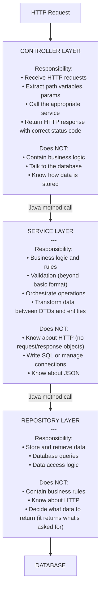
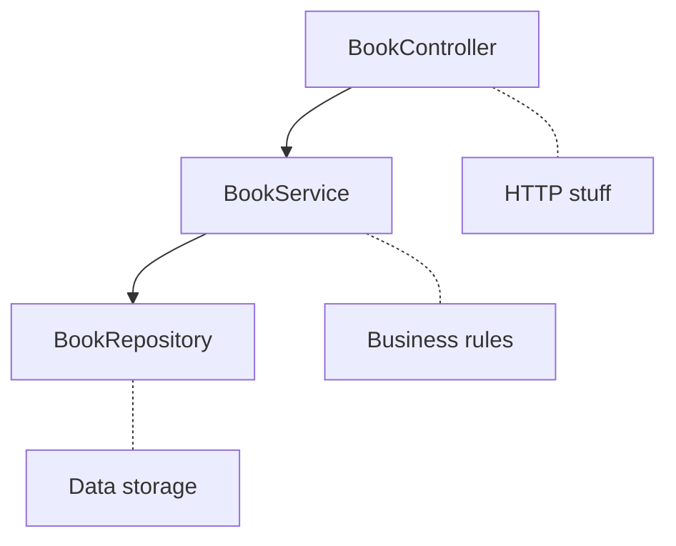

# Chapter 10: Thinking in Layers

> ⏱ Estimated time: 45 minutes

## What You'll Learn

- Why layered architecture exists
- The three layers: Controller, Service, Repository
- What each layer is responsible for (and NOT responsible for)
- How data flows through the layers
- How to organize your code into packages

---

## Why Layers? (Or: "The Restaurant That Caught Fire")

Picture this. You walk into a restaurant. There's one guy. Just... one guy. He greets you at the door, seats you, takes your order, runs to the kitchen, cooks your meal, checks the pantry for ingredients, runs back out, serves your food, processes your credit card, and buses the table after you leave.

How long do you think that restaurant survives?

*About a week. Maybe two if the guy drinks a lot of coffee.*

Now picture a **real** restaurant:
- **Host** — greets customers, seats them
- **Chef** — cooks the food, knows the recipes
- **Pantry manager** — stores and retrieves ingredients

Each person has a clear job. They communicate through defined channels. If the pantry manager switches suppliers, the chef doesn't care. If you hire a new host, the recipes don't change. Nobody is stepping on anyone else's toes.

This is **Separation of Concerns** — and it's not just the most important principle in software architecture. It's the principle that keeps your codebase from turning into that one-man restaurant: a chaotic, unscalable mess that's *one bad day* away from burning down.

So what does this have to do with your Spring Boot code?

**Everything.**

---

## Concepts

### The Three-Layer Architecture

You've been writing controllers. You've been writing services. But have you ever stopped and asked yourself: *why* do we split things up this way? Why can't the controller just... do everything?

Well, you *can* put everything in the controller. Just like that one-person restaurant *can* exist. But it won't scale, it won't be testable, and six months from now, you'll open the file and cry.

Here's the architecture you're going to live and breathe from this point forward:



> **🧠 Brain Power:** Look at the "Does NOT" sections carefully. Each layer is defined as much by what it *refuses to do* as by what it does. Why do you think those boundaries matter? What would happen if you let the Controller talk to the database "just this once"?

---

### 🎤 Fake Interview: The Layers Speak Up

We sat down with the three layers of a Spring Boot application. Things got... heated.

---

**Interviewer:** Controller, let's start with you. What do you do around here?

**Controller:** I'm the front door. I greet every HTTP request that comes in, figure out what they want — a GET, a POST, a DELETE — extract whatever data they brought along, and hand it off to Service. Then when Service gives me a result, I wrap it up in a nice `ResponseEntity` with the right status code and send it back. That's it. Clean and simple.

**Interviewer:** Sounds almost... too simple? Do you ever feel like you're not doing enough?

**Controller:** *[bristles]* Excuse me? "Not doing enough?" Do you know how many junior developers try to stuff business logic into me? "Oh, just check if the title is unique in the controller, it's faster." NO. That's not my job. I am *intentionally* thin. That's a feature, not a bug.

**Service:** *[clears throat]* And yet I keep finding database queries in your methods when I do code reviews...

**Controller:** That was ONE TIME and the deadline was —

**Interviewer:** Moving on! Service, tell us about your role.

**Service:** I'm the brains of the operation. All the business rules? Mine. "A user can't create more than 100 books"? That's me. "Books with zero pages are invalid"? Me again. I don't care *how* the data got here — could be an HTTP request, could be a scheduled job, could be a test. I apply the rules the same way every time.

**Interviewer:** And your relationship with Repository?

**Service:** Repository and I have a clean arrangement. I tell it "save this book" or "find me all books by this author," and it does it. I don't ask *how*. Could be an ArrayList. Could be PostgreSQL. Could be a carrier pigeon with a flash drive for all I care. As long as the data comes back correct, we're good.

**Repository:** *[quietly]* I appreciate that.

**Interviewer:** Repository, you've been quiet. What's your deal?

**Repository:** I store things. I find things. That's it. I don't make decisions about *whether* to store something — Service already decided that. I don't know anything about HTTP — that's Controller's world. I just talk to the data. I'm the introvert of this architecture, and I'm fine with it.

**Controller:** Honestly, Repository is the most reliable one here. Never overreaches. Never complains.

**Service:** For once, we agree.

**Repository:** *[blushes]*

---

### The Rules (Yes, There Are Rules)

Here's the deal. These aren't suggestions. These aren't "best practices you can ignore when you're in a hurry." These are **the rules**:

**Each layer only talks to the layer directly below it:**
- Controller → Service ✅
- Service → Repository ✅
- Controller → Repository ❌ (skip layers = chaos)
- Repository → Controller ❌ (wrong direction)

**Each layer is ignorant of the layers above it:**
- The service doesn't know it's being called by a controller (it could be called by a test, a scheduled job, or another service)
- The repository doesn't know it's being called by a service

> **⚠️ Watch it!** "But it's just a simple pass-through, I'll skip the service layer just this once..." STOP. That's how it starts. You skip the service layer for one "simple" operation, then another, and before you know it, your controller is 500 lines of spaghetti with business logic, database calls, and HTTP handling all tangled together. **Always go through the layers.** Future-you will be grateful.

---

### Why This Matters in Practice

Still not convinced? Let's make it real with two scenarios.

**Scenario 1**: Your boss walks over and says, "We need to add a rule: users can't create more than 100 books."

*With layers:*
- You add the rule in `BookService.createBook()` — **one place**
- The controller doesn't change
- The repository doesn't change
- If you have a scheduled import job that also creates books, it goes through the same service — the rule applies everywhere

*Without layers:*
- The rule might need to be added in the controller, the import job, the admin panel, and anywhere else that creates books
- Miss one? The rule is inconsistently applied. Some users create 500 books through the admin panel while the API stops them at 100. Your boss is not happy.

**Scenario 2**: You need to switch from an in-memory list to a real database.

*With layers:*
- You change the repository implementation
- The service doesn't change (it calls the same repository methods)
- The controller doesn't change
- Total files modified: **one**

*Without layers:*
- Database code is mixed with business logic and HTTP handling
- Changes ripple everywhere
- Total files modified: *all of them, plus your will to live*

> **🗣️ Overheard at the coffee shop:** *"I didn't understand why layers mattered until I had to add a feature to an app without them. Took me three days to make a change that should have been three lines."*

---

### Data Flow Example

Let's trace `POST /api/books` with a body `{"title": "Dune", "pages": 412}` step by step. Watch how each layer does its job and *only* its job:

```
1. CONTROLLER receives the HTTP request
   - Extracts: POST method, /api/books path
   - Deserializes body: JSON → BookRequest object
   - Calls: bookService.createBook(bookRequest)

2. SERVICE receives the BookRequest
   - Validates: title is not empty ✓, pages > 0 ✓
   - Checks: does this book already exist? (asks repository)
   - Transforms: BookRequest → Book entity
   - Calls: bookRepository.save(book)
   - Transforms: Book entity → BookResponse
   - Returns: BookResponse

3. REPOSITORY receives the Book entity
   - Saves it to the database
   - Returns the saved entity (with generated ID)

4. SERVICE returns BookResponse to controller

5. CONTROLLER returns ResponseEntity<BookResponse> with status 201
```

See how clean that is? Each step knows its job. No layer is reaching into another layer's territory. The controller never touches the database. The repository never thinks about HTTP. The service doesn't know or care that JSON was involved.

> **🎯 Key Point:** When you get a new requirement, the first question you should ask yourself is: *"Which layer does this belong to?"*
> - "Show me the data differently" → Controller (change the response format)
> - "Add a business rule" → Service (add validation/logic)
> - "Query the data differently" → Repository (change the query)
>
> If you can answer that question quickly, you've internalized layered architecture. If you can't, re-read this section.

---

## Code Examples

### BookShelf v2: Package Organization

Alright, enough theory. Let's get your hands dirty. You're going to restructure your project into proper packages that reflect the layered architecture. Here's what the end result looks like:

```
src/main/java/com/bookshelf/
├── BookshelfApplication.java
├── controller/
│   └── BookController.java
├── service/
│   └── BookService.java
├── repository/
│   └── BookRepository.java
└── model/
    └── Book.java
```

See how the *folder structure itself* tells you how the application is organized? Anyone who opens this project — even if they've never seen your code before — can immediately tell which layer each class belongs to. That's the power of good organization.

Now let's build each piece.

---

**Create `BookRepository.java`** at `src/main/java/com/bookshelf/repository/BookRepository.java`:

```java
package com.bookshelf.repository;

import com.bookshelf.model.Book;
import org.springframework.stereotype.Repository;
import java.util.ArrayList;
import java.util.List;
import java.util.Optional;
import java.util.concurrent.atomic.AtomicLong;

@Repository
public class BookRepository {

    private final List<Book> books = new ArrayList<>();
    private final AtomicLong idCounter = new AtomicLong(1);

    public List<Book> findAll() {
        return new ArrayList<>(books);  // Return a copy, not the original
    }

    public Optional<Book> findById(Long id) {
        return books.stream()
                .filter(b -> b.getId().equals(id))
                .findFirst();
    }

    public Book save(Book book) {
        if (book.getId() == null) {
            // New book — assign an ID
            book.setId(idCounter.getAndIncrement());
            books.add(book);
        } else {
            // Existing book — update in place
            for (int i = 0; i < books.size(); i++) {
                if (books.get(i).getId().equals(book.getId())) {
                    books.set(i, book);
                    break;
                }
            }
        }
        return book;
    }

    public boolean deleteById(Long id) {
        return books.removeIf(b -> b.getId().equals(id));
    }

    public List<Book> findByTitleContaining(String title) {
        return books.stream()
                .filter(b -> b.getTitle().toLowerCase().contains(title.toLowerCase()))
                .toList();
    }
}
```

> **💡 There are no Dumb Questions:**
>
> **Q: Why does `findAll()` return `new ArrayList<>(books)` instead of just `books`?**
>
> A: Because if you returned the *actual* list, anyone who received it could modify it — adding books, removing books, clearing the whole thing — and those changes would affect the repository's internal data. Returning a copy is a defensive programming technique. It's like giving someone a *photocopy* of a document instead of the original.
>
> **Q: Why `@Repository` and not just `@Component`?**
>
> A: Functionally, `@Repository` *is* a `@Component` — Spring treats them the same way for dependency injection. But `@Repository` signals *intent*: "this class deals with data storage." It's a label for humans, not just for Spring. Plus, Spring can apply special exception translation for database errors on classes marked with `@Repository`.

---

**Move `Book.java`** to `src/main/java/com/bookshelf/model/Book.java`:

```java
package com.bookshelf.model;

// Same Book class as before, just in a new package
public class Book {
    private Long id;
    private String title;
    private String author;
    private int pages;

    public Book() {}

    public Book(Long id, String title, String author, int pages) {
        this.id = id;
        this.title = title;
        this.author = author;
        this.pages = pages;
    }

    public Long getId() { return id; }
    public void setId(Long id) { this.id = id; }
    public String getTitle() { return title; }
    public void setTitle(String title) { this.title = title; }
    public String getAuthor() { return author; }
    public void setAuthor(String author) { this.author = author; }
    public int getPages() { return pages; }
    public void setPages(int pages) { this.pages = pages; }
}
```

Nothing changed here except the `package` line. The model is just data — it doesn't belong to any layer, which is why it gets its own package.

---

**Update `BookService.java`** at `src/main/java/com/bookshelf/service/BookService.java`:

```java
package com.bookshelf.service;

import com.bookshelf.model.Book;
import com.bookshelf.repository.BookRepository;
import org.springframework.stereotype.Service;
import java.util.List;
import java.util.Optional;

@Service
public class BookService {

    private final BookRepository bookRepository;

    public BookService(BookRepository bookRepository) {
        this.bookRepository = bookRepository;
    }

    public List<Book> getAllBooks() {
        return bookRepository.findAll();
    }

    public Optional<Book> getBookById(Long id) {
        return bookRepository.findById(id);
    }

    public Book createBook(Book book) {
        // Business logic could go here:
        // - Validate that the title isn't empty
        // - Check for duplicates
        // - Apply default values
        return bookRepository.save(book);
    }

    public Optional<Book> updateBook(Long id, Book updatedBook) {
        return bookRepository.findById(id)
                .map(existingBook -> {
                    updatedBook.setId(id);
                    return bookRepository.save(updatedBook);
                });
    }

    public boolean deleteBook(Long id) {
        return bookRepository.deleteById(id);
    }

    public List<Book> searchByTitle(String title) {
        return bookRepository.findByTitleContaining(title);
    }
}
```

Notice something? The service doesn't import *anything* from `org.springframework.web`. No `ResponseEntity`. No `HttpStatus`. No `@PathVariable`. It has zero awareness that HTTP exists. It could be called from a controller, from a command-line tool, from a test, from a message queue — it doesn't know, and it doesn't care. That's exactly how it should be.

> **🧠 Brain Power:** Look at `createBook()`. Right now it's a simple pass-through to the repository. Is that wasteful? Or is it setting you up for future success? Think about what happens when your boss asks you to add validation rules next week...

---

**Update `BookController.java`** at `src/main/java/com/bookshelf/controller/BookController.java`:

```java
package com.bookshelf.controller;

import com.bookshelf.model.Book;
import com.bookshelf.service.BookService;
import org.springframework.http.HttpStatus;
import org.springframework.http.ResponseEntity;
import org.springframework.web.bind.annotation.*;
import java.util.List;

@RestController
@RequestMapping("/api/books")
public class BookController {

    private final BookService bookService;

    public BookController(BookService bookService) {
        this.bookService = bookService;
    }

    @GetMapping
    public ResponseEntity<List<Book>> getAllBooks() {
        return ResponseEntity.ok(bookService.getAllBooks());
    }

    @GetMapping("/{id}")
    public ResponseEntity<Book> getBookById(@PathVariable Long id) {
        return bookService.getBookById(id)
                .map(ResponseEntity::ok)
                .orElse(ResponseEntity.notFound().build());
    }

    @PostMapping
    public ResponseEntity<Book> createBook(@RequestBody Book book) {
        Book created = bookService.createBook(book);
        return ResponseEntity.status(HttpStatus.CREATED).body(created);
    }

    @PutMapping("/{id}")
    public ResponseEntity<Book> updateBook(
            @PathVariable Long id,
            @RequestBody Book updatedBook
    ) {
        return bookService.updateBook(id, updatedBook)
                .map(ResponseEntity::ok)
                .orElse(ResponseEntity.notFound().build());
    }

    @DeleteMapping("/{id}")
    public ResponseEntity<Void> deleteBook(@PathVariable Long id) {
        if (bookService.deleteBook(id)) {
            return ResponseEntity.noContent().build();
        }
        return ResponseEntity.notFound().build();
    }

    @GetMapping("/search")
    public ResponseEntity<List<Book>> searchBooks(@RequestParam String title) {
        return ResponseEntity.ok(bookService.searchByTitle(title));
    }
}
```

And look at the controller! It's the mirror image of the service — it knows *everything* about HTTP and *nothing* about business logic. It translates HTTP requests into service calls and service responses into HTTP responses. That's it. That's the whole job.

---

Now look at the clean dependency chain you've built:



> **🎯 Key Point:** Each arrow points in one direction: *down*. Controller depends on Service. Service depends on Repository. Never the other way around. Never skipping a level. This one-directional dependency flow is what makes your application maintainable, testable, and sane.

---

## 🔥 Fireside Chat: "Do I Really Need All Three Layers?"

It's late. You're staring at your `BookService.createBook()` method that literally just calls `bookRepository.save(book)`. One line. A pass-through. And you're thinking: *"Why do I even need this service? The controller could just call the repository directly."*

We get it. Here's the thing though — you're looking at your code *today*. Let's look at it *next month*:

| Today (simple pass-through) | Next Month (real business logic) |
|---|---|
| `return bookRepository.save(book);` | Validate the title isn't empty. Check for duplicates. Enforce the 100-book limit. Send a notification email. Log an audit trail. *Then* save. |

That "useless" service layer? It's a **placeholder for complexity that hasn't arrived yet.** And when it does arrive — and it *will* arrive, it always does — you won't have to restructure your entire application to accommodate it. You'll just add the logic to the service method. Done.

Removing the service layer to save a few lines today is like removing the spare tire from your car because it's "just taking up space." Sure, until you get a flat.

> **🗣️ Overheard at the coffee shop:** *"Every service I've ever removed 'because it was just a pass-through' I've had to re-add within two sprints. Now I just leave them in."*

---

## Exercise: Restructure BookShelf into Layers

**Goal**: Reorganize your existing code into the three-layer architecture.

### Tasks

1. Create the package structure: `controller/`, `service/`, `repository/`, `model/`
2. Move `Book.java` to `model/`
3. Create `BookRepository` with `@Repository` in `repository/`
4. Move data management code from `BookService` to `BookRepository`
5. Update `BookService` to use `BookRepository` via DI
6. Move `BookController` to `controller/`
7. Update imports everywhere
8. Run and test — everything should work exactly the same

### Verification

Run all the same curl commands from Chapter 9. The API behavior should be identical — you've only reorganized the internal structure.

> **⚠️ Watch it!** When you move classes to new packages, you **must** update the `package` declaration at the top of each file. Java is very particular about this — the package declaration must match the directory structure *exactly*. If your file is in `com/bookshelf/repository/`, the first line better be `package com.bookshelf.repository;`. Miss this and you'll get cryptic compilation errors.

---

## Common Mistakes

| Mistake | Reality |
|---------|---------|
| Controller calling Repository directly | Always go through the Service layer. The controller should never know about data storage. |
| Putting business logic in the controller | "A book must have at least 10 pages" belongs in the service, not the controller. |
| Putting HTTP concepts in the service | The service should never import `HttpServletRequest`, `ResponseEntity`, or `@PathVariable`. It knows nothing about HTTP. |
| Having the repository make business decisions | The repository stores and retrieves. It doesn't decide *whether* to store — that's the service's job. |
| Skipping the service layer for "simple" operations | Even simple pass-through services are valuable — they give you a place to add logic later without restructuring. |

> **💡 There are no Dumb Questions:**
>
> **Q: What if my service method literally just calls the repository method with the same arguments? Isn't that wasteful?**
>
> A: Nope. Think of it as *structural investment*. Today it's a pass-through. Tomorrow your boss adds a business rule, and you add it right there in the service — no restructuring needed. The alternative is going back later and inserting a service layer between your controller and repository while refactoring all the tests, all the imports, and all the dependency injection. That's *actually* wasteful.
>
> **Q: Can a service call another service?**
>
> A: Absolutely! Services can call other services. For example, `OrderService` might call `BookService` to check if a book exists before placing an order. What you should NOT do is create circular dependencies where `ServiceA` calls `ServiceB` and `ServiceB` calls `ServiceA` — that's a design smell.
>
> **Q: Where do validation annotations like `@NotNull` or `@Size` go?**
>
> A: Great question. Basic format validation (is this field present? is this string the right length?) typically goes on the model or DTO class using annotations. *Business* validation (does this book already exist? has this user exceeded their limit?) goes in the service. Think of it as: annotations validate the *shape* of data, services validate the *meaning* of data.

---

### 📝 Practice Exercises

Ready to test your understanding? These exercises from [Appendix E](../../appendices/E-coding-exercises.md) directly apply what you learned in this chapter:

| Exercise | Topic | Difficulty |
|----------|-------|------------|
| [Exercise 23](../../appendices/E-coding-exercises.md#exercise-23) | Refactor a Monolithic Controller | ⭐⭐ |
| [Exercise 24](../../appendices/E-coding-exercises.md#exercise-24) | Identify Layer Violations | ⭐⭐ |
| [Exercise 25](../../appendices/E-coding-exercises.md#exercise-25) | Build a 3-Layer Employee API | ⭐⭐ |
| [Exercise 26](../../appendices/E-coding-exercises.md#exercise-26) | Design Layer Responsibilities | ⭐⭐⭐ |

Solutions are in [Appendix F](../../appendices/F-exercise-solutions.md).

---

## Key Takeaways

- [ ] The three layers are Controller (HTTP), Service (logic), Repository (data)
- [ ] Each layer only talks to the layer below it
- [ ] Separation of concerns makes code easier to change, test, and understand
- [ ] The controller is thin — it translates HTTP to method calls
- [ ] The service contains all business rules
- [ ] The repository handles data storage and retrieval
- [ ] Package structure reflects the layered architecture

---

## Quick Quiz

1. A new requirement says "books with more than 1000 pages get a 'tome' badge." Which layer handles this?
2. You need to switch from ArrayList storage to a PostgreSQL database. Which layer(s) change?
3. Why shouldn't the controller call the repository directly, even if the service just passes through?
4. Where do you put the rule "only admin users can delete books"?
5. Your `BookService.createBook()` currently just calls `repository.save()`. Is this okay, or should you remove the service?

---

*Next: `11-entities-and-dtos.md` — Why your API and your database need different classes →*
