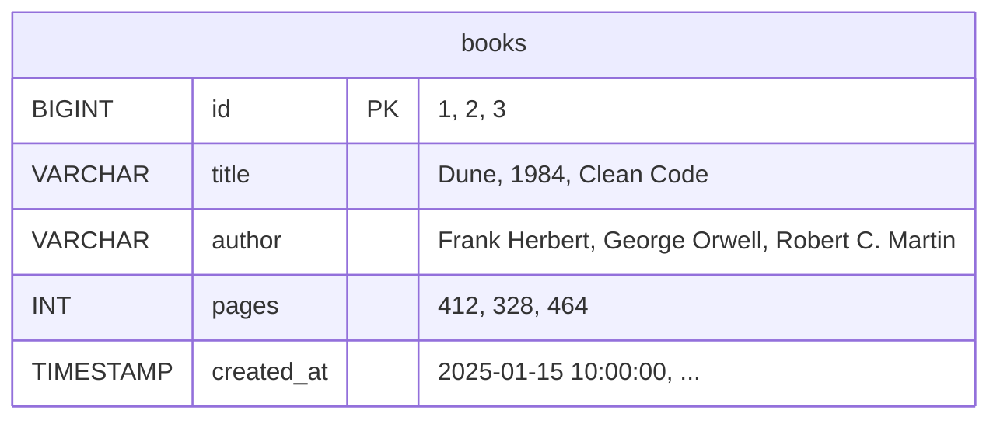

# Chapter 12: Databases with Spring Data JPA

> ⏱ Estimated time: 80 minutes

## What You'll Learn

- What a database is and why your backend needs one
- SQL basics — enough to understand what JPA does for you
- What JPA and Hibernate are
- How to set up H2 (an in-memory database for learning)
- JPA annotations: `@Entity`, `@Id`, `@GeneratedValue`, `@Column`
- How `JpaRepository` eliminates hand-written data access code
- How to build BookShelf v3 with real database persistence

---

## Concepts

### What Is a Database?

So far, your BookShelf app has a *dirty little secret*: the moment you stop the application, every single book vanishes into thin air. Poof. Gone forever. That ArrayList you've been using? It lives in RAM, and RAM has the memory span of a goldfish with amnesia.

You need a **database** — a program whose *entire job* is to remember things. Think of it as a super-powered spreadsheet that never forgets, never sleeps, and can answer really specific questions in milliseconds.



> 🗣️ Overheard at the coffee shop
>
> *"I built this amazing REST API last week. Then I restarted the server and all my data disappeared."*
>
> *"Yeah... you need a database."*
>
> *"I thought the ArrayList WAS my database."*
>
> *"Oh, sweet summer child."*

So what makes a real database different from your spreadsheet or ArrayList?

- **Structured**: Each column has a type (text, number, date). Try to shove text into a number column and it'll slap your hand away.
- **Enforced rules**: Unique IDs, required fields, references between tables. The database is the bouncer at the door — no rule-breakers get in.
- **Queryable**: "Give me all books by Frank Herbert with more than 300 pages." Try doing THAT with an ArrayList without writing a ton of filtering code.
- **Concurrent**: Handles thousands of simultaneous reads/writes safely. Your ArrayList would have a meltdown.
- **Persistent**: Data survives application restarts, crashes, and server reboots. This is the big one.

> 🧠 Brain Power
>
> Think about the apps on your phone — Instagram, Spotify, your banking app. What would happen if their databases were just ArrayLists? Every time the server rebooted, every photo, every playlist, every transaction... gone. Starting to appreciate databases yet?

### SQL: The Language of Databases

Databases speak **SQL** (Structured Query Language). It's been around since the 1970s, which in tech years makes it older than dinosaurs — but unlike dinosaurs, SQL is still very much alive and running the world.

Now here's the good news: **you don't need to master SQL**. JPA writes it for you. But understanding the basics is like knowing enough Italian to order food in Rome — you'll get by much better.

```sql
-- Create a table
CREATE TABLE books (
    id BIGINT PRIMARY KEY AUTO_INCREMENT,
    title VARCHAR(255) NOT NULL,
    author VARCHAR(255),
    pages INT,
    created_at TIMESTAMP
);

-- Insert a row
INSERT INTO books (title, author, pages, created_at)
VALUES ('Dune', 'Frank Herbert', 412, CURRENT_TIMESTAMP);

-- Read all rows
SELECT * FROM books;

-- Read with a filter
SELECT * FROM books WHERE author = 'Frank Herbert';

-- Update a row
UPDATE books SET pages = 420 WHERE id = 1;

-- Delete a row
DELETE FROM books WHERE id = 1;
```

Wait a second... does that look familiar? It should!

| SQL | HTTP | CRUD |
|-----|------|------|
| INSERT | POST | Create |
| SELECT | GET | Read |
| UPDATE | PUT/PATCH | Update |
| DELETE | DELETE | Delete |

> 🎯 Key Point
>
> SQL's four core operations (INSERT, SELECT, UPDATE, DELETE) map *perfectly* to the HTTP methods and CRUD operations you already know. You've been thinking in database patterns this whole time without even knowing it!

### What Is JPA?

Okay, so SQL is great and all, but writing raw SQL in Java is... painful. Really painful. Look at this and try not to wince:

Without JPA:
```java
String sql = "INSERT INTO books (title, author, pages) VALUES (?, ?, ?)";
PreparedStatement stmt = connection.prepareStatement(sql);
stmt.setString(1, book.getTitle());
stmt.setString(2, book.getAuthor());
stmt.setInt(3, book.getPages());
stmt.executeUpdate();
```

Five lines of tedious, error-prone, string-mangling code. And that's just for an INSERT. Imagine doing this for every single database operation in your entire application. No thank you.

With JPA:
```java
bookRepository.save(book);  // That's it. JPA generates the SQL.
```

ONE. LINE.

**JPA** (Java Persistence API) is a specification that lets you work with databases using plain Java objects instead of writing SQL strings. You work with `Book` objects. JPA quietly translates everything into SQL behind the scenes.

**Hibernate** is the most popular *implementation* of JPA. When you use JPA in Spring Boot, Hibernate is the one actually doing all the heavy lifting under the hood.

> 💡 There are no Dumb Questions
>
> **Q: Wait, what's the difference between JPA and Hibernate? They sound like the same thing.**
>
> A: JPA is the *specification* — a set of rules that says "here's how Java should talk to databases." Hibernate is the *implementation* — the actual code that follows those rules. Think of it this way: JPA is the blueprint for a universal remote control. Hibernate is the actual remote that Sony built following that blueprint. You program to the blueprint, Hibernate operates the TV (database).
>
> **Q: So I could swap Hibernate for something else?**
>
> A: Yep! EclipseLink, OpenJPA — there are other implementations. But Hibernate is the default in Spring Boot and by far the most popular. Odds are, you'll use Hibernate for your entire career and never think twice about it.
>
> **Q: If JPA writes SQL for me, do I never need to learn SQL?**
>
> A: Knowing SQL basics helps you debug problems and understand what's happening. When something goes wrong (and it will), you'll look at the generated SQL and need to understand it. But for day-to-day coding? JPA handles the grunt work.

---

#### 🗣️ Fireside Chat: JPA vs. Hibernate

> **Interviewer**: So, JPA. Tell us about yourself.
>
> **JPA**: I'm a *specification*. I define the rules — the annotations, the interfaces, the contracts. I say "this is how you should map a Java class to a database table." But I don't actually *do* anything. I'm ideas on paper.
>
> **Interviewer**: That sounds... kind of useless?
>
> **JPA**: Harsh! But fair. That's where my buddy Hibernate comes in.
>
> **Hibernate**: Hey, I'm the one who does all the real work! When a developer writes `@Entity` on a class, I'm the one who figures out the table name, generates the SQL, manages the connections, handles caching — the whole nine yards.
>
> **JPA**: And you do it according to MY specification.
>
> **Hibernate**: Sure, sure, you get the credit. I just translate Java into SQL so developers don't have to. No big deal. It's only, you know, the backbone of enterprise Java.
>
> **Interviewer**: So Hibernate, would you say you're underappreciated?
>
> **Hibernate**: Let me put it this way: developers write `bookRepository.save(book)` and think magic happened. I generated the INSERT statement, opened a connection, started a transaction, executed the query, committed the transaction, and closed the connection. But sure, JPA gets all the glory.
>
> **JPA**: That's because I'm the one in the import statements! `jakarta.persistence.*` — that's all me, baby.
>
> **Hibernate**: *[mutters]* I do everything and get nothing...

---

### ORM: Objects ↔ Tables

JPA is an **ORM** (Object-Relational Mapping). That's a fancy way of saying: it translates between the Java world and the database world.

```
Java class   ←→  Database table
Java field   ←→  Table column
Java object  ←→  Table row

@Entity
public class Book {         ←→  Table: books
    private Long id;        ←→  Column: id (BIGINT)
    private String title;   ←→  Column: title (VARCHAR)
    private int pages;      ←→  Column: pages (INT)
}
```

See what's happening? Your Java class IS the table definition. Your Java fields ARE the columns. When you create a `new Book(...)` and save it, it becomes a row in the table. The ORM is the Rosetta Stone between two completely different worlds — objects and relational tables.

> 🧠 Brain Power
>
> Look at the Book class above. Without looking ahead, can you guess what SQL table JPA would create from it? What types would each column be? What would the primary key be? (Hint: look for `@Id`.)

### H2: A Database for Learning

Before you panic and start Googling "how to install PostgreSQL" — relax. We're going to use **H2**, a database that's so easy to set up, it barely counts as setup.

**H2** is an in-memory database written in Java. It runs *inside* your application. No downloading, no installing, no configuring a database server. Just add a dependency and you're done.

- **In-memory mode**: Data exists only while the app runs (perfect for learning and testing)
- **Zero setup**: Just add the dependency and configure two lines
- **SQL compatible**: Works like MySQL/PostgreSQL for basic operations
- **Built-in console**: A web UI to see your data — very cool for poking around

---

#### 🗣️ Fireside Chat: H2 Database

> **Interviewer**: H2, some people say you're not a "real" database. How do you respond?
>
> **H2**: Look, I know I'm not PostgreSQL. I'm not going to run your banking system or handle a million users. But that's not my job! I'm the practice dummy. The training wheels. The flight simulator before you get in a real cockpit.
>
> **Interviewer**: So when should developers use you?
>
> **H2**: Learning, prototyping, and testing. When you just want to get a database up and running in two seconds so you can focus on learning JPA — that's my sweet spot. No installation, no configuration headaches, no "wait, what's my PostgreSQL password again?"
>
> **Interviewer**: And what happens when they go to production?
>
> **H2**: They swap me out for PostgreSQL or MySQL. And here's the beautiful part — because they're using JPA, they literally just change a few lines in `application.properties`. ALL their Java code stays exactly the same. I was just the stand-in. The understudy. But I helped them learn their lines.

We'll use H2 for this guide. In production, you'd use PostgreSQL, MySQL, or another external database. The JPA code stays the same — you just change the configuration. That's the magic of coding to an abstraction.

---

## Code Examples

Alright, enough theory. Let's get our hands dirty and make BookShelf actually remember things.

### Step 1: Add Dependencies

Add these to your `pom.xml` inside `<dependencies>`:

```xml
<!-- Spring Data JPA — handles all database interaction -->
<dependency>
    <groupId>org.springframework.boot</groupId>
    <artifactId>spring-boot-starter-data-jpa</artifactId>
</dependency>

<!-- H2 Database — in-memory database for development -->
<dependency>
    <groupId>com.h2database</groupId>
    <artifactId>h2</artifactId>
    <scope>runtime</scope>
</dependency>
```

After adding these, run `mvn clean compile` (or let your IDE refresh the project).

> 💡 There are no Dumb Questions
>
> **Q: What does `<scope>runtime</scope>` mean on the H2 dependency?**
>
> A: It means "I need this at runtime (when the app is running) but not at compile time." Your Java code never directly references H2 classes — JPA talks to the database through standard interfaces. H2 just needs to be present when the app starts so JPA can connect to it.

### Step 2: Configure the Database

Update `src/main/resources/application.properties`:

```properties
# H2 Database Configuration
spring.datasource.url=jdbc:h2:mem:bookshelf
spring.datasource.driver-class-name=org.h2.Driver
spring.datasource.username=sa
spring.datasource.password=

# JPA / Hibernate
spring.jpa.database-platform=org.hibernate.dialect.H2Dialect
spring.jpa.hibernate.ddl-auto=create-drop
spring.jpa.show-sql=true

# Enable H2 Console (web UI to see your data)
spring.h2-console.enabled=true
spring.h2-console.path=/h2-console
```

Okay, let's break this down because these aren't just random key-value pairs — each one is telling Spring Boot something important:

- `datasource.url`: Connect to an in-memory database named "bookshelf". The `mem:` part means it lives in RAM.
- `ddl-auto=create-drop`: Create tables on startup, drop them on shutdown. Great for development — terrible for production (more on that in Common Mistakes).
- `show-sql=true`: Print every SQL query to the console. This is *gold* for learning — you get to see exactly what JPA is generating behind the scenes.
- `h2-console`: Lets you visit `http://localhost:8080/h2-console` to see your data with a nice web UI.

> ⚠️ Watch it!
>
> `ddl-auto=create-drop` means your database is completely **destroyed and rebuilt** every time you restart the app. That's fine for learning, but if you ever use this setting in production, you will have a very bad day. A "my resume is on fire" kind of bad day.

### Step 3: Turn Book into a JPA Entity

Here's where the magic happens. You're about to take a plain old Java class and turn it into something that *maps directly to a database table*. A few annotations and — boom — JPA knows how to store it, retrieve it, update it, and delete it.

Update `src/main/java/com/bookshelf/model/Book.java`:

```java
package com.bookshelf.model;

import jakarta.persistence.*;
import java.time.LocalDateTime;

@Entity                         // This class maps to a database table
@Table(name = "books")          // The table is called "books"
public class Book {

    @Id                         // This field is the primary key
    @GeneratedValue(strategy = GenerationType.IDENTITY)  // Database auto-generates the ID
    private Long id;

    @Column(nullable = false)   // This column cannot be NULL in the database
    private String title;

    @Column                     // Optional — defaults work fine for most columns
    private String author;

    @Column
    private int pages;

    @Column(name = "created_at")
    private LocalDateTime createdAt;

    // JPA requires a no-arg constructor
    public Book() {}

    public Book(String title, String author, int pages) {
        this.title = title;
        this.author = author;
        this.pages = pages;
        this.createdAt = LocalDateTime.now();
    }

    // Lifecycle callback — runs before saving a new entity
    @PrePersist
    protected void onCreate() {
        this.createdAt = LocalDateTime.now();
    }

    // Getters and setters
    public Long getId() { return id; }
    public void setId(Long id) { this.id = id; }
    public String getTitle() { return title; }
    public void setTitle(String title) { this.title = title; }
    public String getAuthor() { return author; }
    public void setAuthor(String author) { this.author = author; }
    public int getPages() { return pages; }
    public void setPages(int pages) { this.pages = pages; }
    public LocalDateTime getCreatedAt() { return createdAt; }
    public void setCreatedAt(LocalDateTime createdAt) { this.createdAt = createdAt; }
}
```

Let's zoom in on those annotations because each one is doing something specific:

| Annotation | Purpose |
|-----------|---------|
| `@Entity` | Marks this class as a JPA entity (maps to a table) |
| `@Table(name = "books")` | Specifies the table name |
| `@Id` | Marks the primary key field |
| `@GeneratedValue(strategy = IDENTITY)` | Database auto-generates IDs (1, 2, 3...) |
| `@Column(nullable = false)` | This column must have a value |
| `@Column(name = "created_at")` | Maps the Java field to a differently-named column |
| `@PrePersist` | Run this method before saving a new entity |

> 💡 There are no Dumb Questions
>
> **Q: Why does JPA need an empty constructor? I already have a constructor that takes arguments.**
>
> A: When JPA loads data from the database, it needs to create a Book object first, then fill in the fields. It does this using *reflection* — a way to create objects without calling a normal constructor. The no-arg constructor (`public Book() {}`) is JPA's doorway in. Without it, JPA looks at your class, shrugs, and throws an error.
>
> **Q: What's `@PrePersist`?**
>
> A: It's a lifecycle hook. "Before you persist (save) this entity for the first time, run this method." We use it to auto-set the `createdAt` timestamp. It's like a "just before saving" trigger. Handy!
>
> **Q: Do I need `@Column` on every field?**
>
> A: Nope! JPA maps fields to columns automatically. `@Column` is only needed when you want to customize something — like making a column non-nullable (`nullable = false`) or giving it a different name (`name = "created_at"`). If the defaults are fine, you can skip it entirely.

### Step 4: Replace the Repository with JpaRepository

Ready for the most satisfying moment in this entire chapter? **Delete** your existing `BookRepository.java` — the one with the ArrayList and all those hand-written methods — and replace it with this:

```java
package com.bookshelf.repository;

import com.bookshelf.model.Book;
import org.springframework.data.jpa.repository.JpaRepository;
import java.util.List;

public interface BookRepository extends JpaRepository<Book, Long> {
    
    // Spring Data JPA generates these queries automatically from the method name!
    List<Book> findByTitleContainingIgnoreCase(String title);
    
    List<Book> findByAuthorContainingIgnoreCase(String author);
}
```

Wait... that's it? An **interface** with two method signatures? Where's the implementation? Where's the SQL? Where's the *code*?

That's the whole point. Spring Data JPA generates *everything* for you. Here's what you get for FREE — no code needed:

- `findAll()` — get all books
- `findById(Long id)` — get one book
- `save(Book book)` — create or update
- `deleteById(Long id)` — delete
- `count()` — count total records
- `existsById(Long id)` — check if exists

And those custom methods? Spring Data reads the method name like a sentence and builds the SQL:

- `findByTitleContainingIgnoreCase("dune")` → `SELECT * FROM books WHERE LOWER(title) LIKE '%dune%'`
- `findByAuthorContainingIgnoreCase("herbert")` → `SELECT * FROM books WHERE LOWER(author) LIKE '%herbert%'`

No SQL. No implementation class. Just a method name, and Spring figures out the rest.

> 🎯 Key Point
>
> You just went from a ~50-line repository class with hand-managed ArrayList operations to a 7-line interface. And the interface version is MORE powerful — it handles database persistence, concurrent access, and complex queries. This is Spring Data JPA's superpower.

> 🧠 Brain Power
>
> Based on the naming pattern you've seen (`findByTitleContainingIgnoreCase`), what method name would you write to find all books with more than 300 pages? What about books by a specific author with an exact match? Try to guess before reading ahead.

### Step 5: Update the Service

Your service layer barely needs to change because `JpaRepository` provides the same kind of methods you were already using. The big difference? Now `save()` writes to a real database, and `findAll()` reads from one.

```java
package com.bookshelf.service;

import com.bookshelf.dto.BookRequest;
import com.bookshelf.dto.BookResponse;
import com.bookshelf.model.Book;
import com.bookshelf.repository.BookRepository;
import org.springframework.stereotype.Service;
import java.util.List;
import java.util.Optional;

@Service
public class BookService {

    private final BookRepository bookRepository;

    public BookService(BookRepository bookRepository) {
        this.bookRepository = bookRepository;
    }

    public List<BookResponse> getAllBooks() {
        return bookRepository.findAll().stream()
                .map(this::toResponse)
                .toList();
    }

    public Optional<BookResponse> getBookById(Long id) {
        return bookRepository.findById(id)
                .map(this::toResponse);
    }

    public BookResponse createBook(BookRequest request) {
        Book book = toEntity(request);
        Book saved = bookRepository.save(book);
        return toResponse(saved);
    }

    public Optional<BookResponse> updateBook(Long id, BookRequest request) {
        return bookRepository.findById(id)
                .map(existingBook -> {
                    existingBook.setTitle(request.title());
                    existingBook.setAuthor(request.author());
                    existingBook.setPages(request.pages());
                    return toResponse(bookRepository.save(existingBook));
                });
    }

    public boolean deleteBook(Long id) {
        if (bookRepository.existsById(id)) {
            bookRepository.deleteById(id);
            return true;
        }
        return false;
    }

    public List<BookResponse> searchByTitle(String title) {
        return bookRepository.findByTitleContainingIgnoreCase(title).stream()
                .map(this::toResponse)
                .toList();
    }

    // ---- Mapping methods ----

    private Book toEntity(BookRequest request) {
        return new Book(request.title(), request.author(), request.pages());
    }

    private BookResponse toResponse(Book book) {
        return new BookResponse(
                book.getId(),
                book.getTitle(),
                book.getAuthor(),
                book.getPages(),
                book.getCreatedAt()
        );
    }
}
```

Look how clean that is. The service doesn't know or care that there's a database behind that repository. It just calls `save()`, `findById()`, `deleteById()` — the same kinds of methods it was calling before. The *implementation* changed from ArrayList to H2 database, but the service code barely noticed.

That's the beauty of the layered architecture you built in the last chapter paying off right now.

### Step 6: Run and Test

The moment of truth. Fire it up:

```bash
mvn spring-boot:run
```

Now watch the console output like a hawk. You'll see something you've never seen before — Hibernate printing the SQL it generated:

```sql
Hibernate: create table books (id bigint generated by default as identity, 
           author varchar(255), created_at timestamp(6), pages integer not null, 
           title varchar(255) not null, primary key (id))
```

That's Hibernate saying "I looked at your `@Entity` class and built this table for you." You didn't write a single line of SQL. It just... happened.

> 🎯 Key Point
>
> That `show-sql=true` setting is your X-ray vision. Every time you call a repository method, Hibernate prints the SQL it generated. Watch the console as you test — you'll see INSERT, SELECT, UPDATE, and DELETE statements flying by. This is the best way to understand what JPA is actually doing.

Now test the full CRUD. **You just saved data to a REAL database.** It's H2 in-memory, sure, but it's a real, SQL-speaking database:

```bash
# Create
curl -X POST http://localhost:8080/api/books \
  -H "Content-Type: application/json" \
  -d '{"title": "Dune", "author": "Frank Herbert", "pages": 412}'

# Read all
curl http://localhost:8080/api/books

# Read one
curl http://localhost:8080/api/books/1

# Update
curl -X PUT http://localhost:8080/api/books/1 \
  -H "Content-Type: application/json" \
  -d '{"title": "Dune (Revised)", "author": "Frank Herbert", "pages": 420}'

# Delete
curl -X DELETE http://localhost:8080/api/books/1

# Search
curl "http://localhost:8080/api/books/search?title=dune"
```

### Step 7: Explore with H2 Console

Here's a bonus: H2 comes with a built-in web UI. You can actually *look inside your database* and poke around. Open your browser and go to: `http://localhost:8080/h2-console`

Settings:
- JDBC URL: `jdbc:h2:mem:bookshelf`
- User: `sa`
- Password: (leave empty)

Click Connect. You can now run SQL queries directly:

```sql
SELECT * FROM books;
```

This is incredibly useful for debugging. "Did my POST actually save the data?" Just pop open the H2 console and look. No guessing, no wondering — you can see exactly what's in your database, right there in your browser.

---

## Exercise: Build BookShelf v3

> 🎯 Key Point
>
> You're about to do something significant: replace a volatile, in-memory ArrayList with a real database. Your data will be managed by SQL, indexed, queryable, and (in production) persistent. This is the leap from "toy project" to "real application."

**Goal**: Replace the in-memory ArrayList with a real database.

### Tasks

1. Add `spring-boot-starter-data-jpa` and `h2` dependencies to `pom.xml`
2. Configure the database in `application.properties`
3. Add JPA annotations to your `Book` entity
4. Replace your `BookRepository` class with a `JpaRepository` interface
5. Update `BookService` if needed (the interface methods are similar)
6. Run and test all CRUD operations
7. Open the H2 console and view your data

### Verification

Here's the acid test, and it's going to feel weird: **restart your app and verify that the data is gone**. Yes, really. Because H2 is in-memory (`create-drop`), restarting the app wipes the database clean. That's expected behavior.

In production, you'd use a persistent database like PostgreSQL where data survives restarts. The *amazing* part? You'd change a few lines in `application.properties`, and all your Java code stays exactly the same. Same entities, same repositories, same service. Just a different database engine underneath.

### Stretch Goal

Want to flex those new Spring Data muscles? Add a method to your repository:

```java
List<Book> findByPagesGreaterThan(int minPages);
```

Then add an endpoint to use it:
```java
@GetMapping("/long-books")
public ResponseEntity<List<BookResponse>> getLongBooks(@RequestParam(defaultValue = "400") int minPages) {
    return ResponseEntity.ok(bookService.getLongBooks(minPages));
}
```

> 🧠 Brain Power
>
> What SQL does `findByPagesGreaterThan(400)` generate? If you said `SELECT * FROM books WHERE pages > 400`, give yourself a pat on the back. Spring Data read the method name — `find` (SELECT), `By` (WHERE), `Pages` (column), `GreaterThan` (>), and the parameter `400` — and built the query. Just from the method name. That's wild.

---

## Common Mistakes

> ⚠️ Watch it!
>
> These are the mistakes that trip up almost everyone the first time they use JPA. Read this table carefully — each one represents a real debugging headache you can skip entirely.

| Mistake | Reality |
|---------|---------|
| Forgetting the no-arg constructor on entities | JPA needs it to create objects via reflection. Add `public Book() {}` even if you have other constructors. |
| Missing `@Entity` annotation | Without it, JPA doesn't know this class maps to a table. You'll get errors about unmapped entities. |
| Using `@GeneratedValue` without `@Id` | `@GeneratedValue` only works on the `@Id` field. |
| Calling `deleteById()` without checking existence | It throws `EmptyResultDataAccessException` if the ID doesn't exist. Check with `existsById()` first. |
| Confusing `save()` for create-only | `save()` does both create (if no ID) and update (if ID exists). It's an "upsert" operation. |
| Setting `ddl-auto=create-drop` in production | This DELETES ALL DATA on restart! Use `validate` or `none` in production. `create-drop` is only for development. |

---

### 📝 Practice Exercises

Ready to test your understanding? These exercises from [Appendix E](../../appendices/E-coding-exercises.md) directly apply what you learned in this chapter:

| Exercise | Topic | Difficulty |
|----------|-------|------------|
| [Exercise 29](../../appendices/E-coding-exercises.md#exercise-29) | Spring Data Repository | ⭐⭐ |
| [Exercise 30](../../appendices/E-coding-exercises.md#exercise-30) | Service Layer with JPA | ⭐⭐ |
| [Exercise 31](../../appendices/E-coding-exercises.md#exercise-31) | Custom Query Methods | ⭐⭐ |
| [Exercise 32](../../appendices/E-coding-exercises.md#exercise-32) | JPQL with @Query | ⭐⭐ |
| [Exercise 33](../../appendices/E-coding-exercises.md#exercise-33) | Complete Task Manager API | ⭐⭐⭐ |
| [Exercise 34](../../appendices/E-coding-exercises.md#exercise-34) | Configure H2 Database | ⭐⭐ |

Solutions are in [Appendix F](../../appendices/F-exercise-solutions.md).

---

## Key Takeaways

- [ ] A database stores data persistently in tables with typed columns
- [ ] JPA maps Java classes to database tables, fields to columns, objects to rows
- [ ] `@Entity`, `@Id`, `@GeneratedValue`, `@Column` annotate your entity class
- [ ] `JpaRepository` provides free CRUD methods — just extend the interface
- [ ] Custom queries are generated from method names (`findByTitleContaining`)
- [ ] H2 is a great in-memory database for development and learning
- [ ] `spring.jpa.show-sql=true` lets you see the generated SQL

---

## Quick Quiz

1. What does `@GeneratedValue(strategy = GenerationType.IDENTITY)` do?
2. How does `JpaRepository.save()` know whether to INSERT or UPDATE?
3. Write a repository method name that finds all books by a specific author (exact match).
4. Why is `ddl-auto=create-drop` dangerous in production?
5. What's the SQL equivalent of `bookRepository.findByPagesGreaterThan(300)`?

---

## Day 4 Summary

```
✓ Three-layer architecture: Controller → Service → Repository
✓ Each layer has a single responsibility — don't mix concerns
✓ Entities represent database tables; DTOs represent API data
✓ Java records make DTOs concise and immutable
✓ JPA maps Java objects to database rows — no manual SQL
✓ JpaRepository provides free CRUD operations
✓ Custom queries are generated from method names
✓ H2 is perfect for development — zero setup, runs in memory
```

Tomorrow, you'll add validation, handle errors properly, add relationships between entities, and manage configuration!

---

*Next: `day-5/13-validation-and-error-handling.md` — Never trust the client →*
