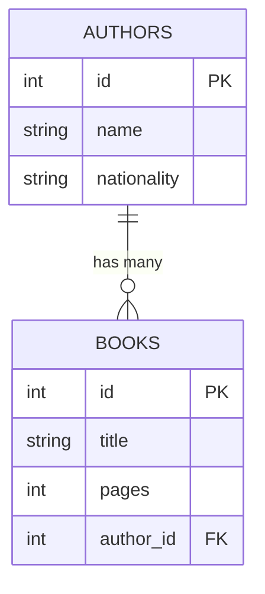

# Chapter 14: Relationships and Queries

> ⏱ Estimated time: 70 minutes

## What You'll Learn

- How database tables relate to each other
- One-to-Many and Many-to-One relationships in JPA
- Lazy vs. eager loading (and the N+1 problem)
- Custom queries with `@Query`
- How to build BookShelf v4 with Authors

---

## Concepts

### Why Relationships?

Picture this. You've got a beautiful little bookshelf app. Books everywhere. Life is good.

Then your product manager walks over and says: *"Hey, can you show me all the books by Frank Herbert?"*

You stare at your `Book` entity. The `author` field is a `String`. Just a plain old `String`. You could search by that string, sure... but what happens when someone types "frank herbert" in lowercase? Or "F. Herbert"? What if you want the author's biography? Their birth year? What if Frank Herbert's estate sends you a legal notice saying his name is now styled differently and you need to update it in 47 places?

A plain `String` won't cut it.

In the real world, data is connected:
- A **book** has an **author**
- An **author** has many **books**
- An **order** has many **items**
- A **student** takes many **courses** and a **course** has many **students**

What you actually need is a separate `Author` entity **linked** to `Book`. A real relationship. The kind your database was *born* to handle.

> 🗣️ **Overheard at the coffee shop**: "I stored author names as strings in three different tables. Updating one author's name took me an entire afternoon and a mass `UPDATE` query that I still have nightmares about."

### Types of Relationships

| Relationship | Example | JPA Annotation |
|-------------|---------|----------------|
| **One-to-Many** | One author has many books | `@OneToMany` |
| **Many-to-One** | Many books belong to one author | `@ManyToOne` |
| **One-to-One** | One user has one profile | `@OneToOne` |
| **Many-to-Many** | Many students in many courses | `@ManyToMany` |

We'll focus on **One-to-Many / Many-to-One** -- the most common relationship you'll encounter in the wild. Master this one, and the others will feel like variations on a theme.

### Database Representation

Okay, so how does a relationship actually *look* inside a database? It's not magic. It's a column. A special column called a **foreign key** -- a column in one table that points to the ID of a row in another table.

Think of it like a hyperlink. The `author_id` column in your `books` table is literally saying: *"Hey, go look at row 1 in the authors table. That's my author."*



**Sample data:**
- **authors**: (1, "Frank Herbert", "American"), (2, "George Orwell", "British")
- **books**: (1, "Dune", 412, **1**), (2, "1984", 328, **2**), (3, "Dune M.", 256, **1**)
- `author_id` is the foreign key -- e.g., books 1 and 3 both point to author 1 (Frank Herbert)

`author_id` in the books table is the **foreign key** -- it creates the link.

> 🧠 **Brain Power**: Look at the sample data above. If you wanted to find all of Frank Herbert's books, what SQL query would you write? Think about it before reading on. (Hint: `WHERE author_id = ?`)

---

### 🎤 Fireside Chat: @ManyToOne meets @OneToMany

*Tonight's guests: two JPA annotations that have been in a long-term relationship. Let's hear each side of the story.*

**Interviewer**: So, `@ManyToOne`, tell us about yourself.

**@ManyToOne**: I live on the Book entity. I'm the one who actually holds the reference -- the foreign key column, `author_id`, that's *my* doing. I point to exactly one Author. I'm the side that says, "I belong to someone." Think of me as the child in a parent-child relationship. Many of us books can point to the same author.

**Interviewer**: And `@OneToMany`, what about you?

**@OneToMany**: I live on the Author entity. I'm the collection side -- I hold a `List<Book>`. But here's the thing people don't realize: *I don't own the relationship.* That's why I have `mappedBy = "author"`. I'm basically saying, "Hey, go look at the `author` field on the Book entity. That's where the real foreign key lives. I'm just the mirror."

**@ManyToOne**: Exactly. I do the heavy lifting. I'm the one with `@JoinColumn`. I'm the one the database actually cares about.

**@OneToMany**: Don't get cocky. Without me, how would you navigate from an Author to their books? You need me for that reverse lookup.

**@ManyToOne**: Fair point. We're a team.

**Interviewer**: Any advice for developers who are just learning about you?

**@ManyToOne**: Put me on the entity that has the foreign key column. That's almost always the "many" side. Many books, one author. The foreign key goes in the books table. I go on the Book class.

**@OneToMany**: And don't forget `mappedBy`! If you leave it off, JPA will create an ugly extra join table that nobody asked for. Trust me, you don't want that.

**@ManyToOne**: Oh, and one more thing -- I default to EAGER loading. That means when someone loads a Book, they get the Author for free. Usually that's fine. One author per book, no big deal.

**@OneToMany**: I default to LAZY. Because if someone loads an Author, they probably don't want me dragging in 500 books. That would be rude.

**Interviewer**: Great chemistry, you two. Thanks for coming on.

---

### JPA: Modeling Relationships

Now let's see how this actually looks in Java. Pay close attention to which annotation goes where -- this is the part that trips up almost everyone on their first try.

**The "One" side (Author):**

```java
@Entity
@Table(name = "authors")
public class Author {
    @Id
    @GeneratedValue(strategy = GenerationType.IDENTITY)
    private Long id;
    
    private String name;
    
    @OneToMany(mappedBy = "author")    // "I have many books. The Book entity owns the relationship."
    private List<Book> books = new ArrayList<>();
}
```

**The "Many" side (Book):**

```java
@Entity
@Table(name = "books")
public class Book {
    @Id
    @GeneratedValue(strategy = GenerationType.IDENTITY)
    private Long id;
    
    private String title;
    
    @ManyToOne                         // "I belong to one author"
    @JoinColumn(name = "author_id")   // "The foreign key column is called author_id"
    private Author author;
}
```

**Key annotations:**
- `@ManyToOne` -- on the field that holds the parent (`Book.author`)
- `@OneToMany(mappedBy = "author")` -- on the collection that holds the children. `mappedBy` says "the `author` field in `Book` is the owner of this relationship"
- `@JoinColumn(name = "author_id")` -- names the foreign key column in the database

> 🎯 **Key Point**: The entity with the foreign key column (`Book`) is always the *owning* side of the relationship. The `mappedBy` side (`Author`) is the *inverse* side. This distinction matters because JPA only tracks changes through the owning side.

### Lazy vs. Eager Loading

Here's a question that seems innocent but has massive implications: when you load a Book from the database, should JPA *also* load its Author? And when you load an Author, should it load *all* their Books?

Your gut reaction might be "sure, load everything!" And that instinct will cost you dearly in production. Let's talk about why.

**Eager loading**: Load everything immediately.
```java
Author author = authorRepo.findById(1);
// author.getBooks() is already loaded — JPA fetched them in the same query
```

**Lazy loading**: Load on demand (when you access the field).
```java
Author author = authorRepo.findById(1);
// author.getBooks() is NOT loaded yet
// JPA only loads the books when you call author.getBooks()
```

**Defaults:**
- `@ManyToOne` -> **EAGER** (loading a book loads its author -- usually fine, one author per book)
- `@OneToMany` -> **LAZY** (loading an author does NOT load their books until you ask -- an author might have hundreds of books)

> 🧠 **Think Like a Backend Engineer**: Lazy loading is usually what you want for collections. Imagine an author with 1000 books -- you don't want to load all 1000 every time you fetch the author's name. That's like opening every drawer in your house just because you walked through the front door.

### The N+1 Problem (Preview)

Okay. Sit down. Buckle up. We need to talk about **the performance killer that lurks in every JPA application**.

It has a name. The **N+1 Problem**. And it is *sneaky*. Your code looks perfectly fine. Your tests pass. Everything works beautifully... with 5 records. Then you deploy to production with 10,000 records, and your database catches fire.

Here's what happens:

```java
List<Book> books = bookRepo.findAll();  // 1 query: SELECT * FROM books

for (Book book : books) {
    System.out.println(book.getAuthor().getName());  
    // Each call triggers ANOTHER query: SELECT * FROM authors WHERE id = ?
    // If you have 100 books → 100 extra queries!
}
```

1 query for books + N queries for authors = **N+1 queries**.

One hundred books? One hundred and one database queries. A thousand books? A thousand and one queries. Your database is screaming. Your response time is measured in *geological epochs*. And the worst part? **The code looks completely normal.** There's no obvious bug. It's just a for loop. That's what makes N+1 so dangerous -- it's invisible until it isn't.

> ⚠️ **Watch it!**: The N+1 problem is the #1 performance issue in JPA applications. It won't show up in your unit tests with 3 records. It will absolutely destroy you in production with 10,000 records. Always be suspicious of loops that access related entities.

**Fix**: Use `JOIN FETCH` in a custom query to load everything in one query. We'll see this below -- and when you see it, you'll breathe a huge sigh of relief.

---

## 💡 There are no Dumb Questions

**Q: Why is it called "N+1" and not "1+N"?**

A: Convention, mostly. The "1" is the initial query (get all books), and the "N" is the number of additional queries (one per book to get each author). People say "N+1" because you start with a manageable number (1) and then get hammered with N more. Either way, the point is: you wanted 1 query, and you got way more than you bargained for.

**Q: If lazy loading causes N+1, why not just make everything eager?**

A: Because then you'd load the *entire database* every time you fetch anything. Load a book, which loads the author, which loads all the author's other books, which each load their own data... it's turtles all the way down. Lazy loading is the right default. You just need to be smart about *when* you need related data and use `JOIN FETCH` for those cases.

**Q: Does `mappedBy` change anything in the database?**

A: No! `mappedBy` is purely a JPA/Java-side concept. It tells JPA: "Don't create another foreign key column or join table for this side. The other entity already handles the database relationship." Your database schema looks exactly the same either way. But *without* `mappedBy`, JPA thinks both sides own the relationship and creates an unnecessary join table. Bad news.

**Q: Can I have a `@ManyToOne` without a corresponding `@OneToMany`?**

A: Absolutely! You only need `@OneToMany` on the Author side if you want to navigate from Author to Books in your Java code. If you never need `author.getBooks()`, you can skip it entirely. The relationship still works in the database -- the foreign key column is there regardless.

---

## Code Examples

### BookShelf v4: Adding Authors

Time to get your hands dirty. We're going to evolve our BookShelf app from "author is a string" to "author is a full-blown entity with a real relationship." This is a big step. By the end, you'll have two linked entities, proper DTOs, and a custom query that solves the N+1 problem.

Let's go step by step.

#### Step 1: Create the Author Entity

This is the "one" side of our one-to-many relationship. One author, many books.

Create `src/main/java/com/bookshelf/model/Author.java`:

```java
package com.bookshelf.model;

import jakarta.persistence.*;
import java.util.ArrayList;
import java.util.List;

@Entity
@Table(name = "authors")
public class Author {

    @Id
    @GeneratedValue(strategy = GenerationType.IDENTITY)
    private Long id;

    @Column(nullable = false)
    private String name;

    @Column
    private String nationality;

    @OneToMany(mappedBy = "author", cascade = CascadeType.ALL)
    private List<Book> books = new ArrayList<>();

    public Author() {}

    public Author(String name, String nationality) {
        this.name = name;
        this.nationality = nationality;
    }

    // Getters and setters
    public Long getId() { return id; }
    public void setId(Long id) { this.id = id; }
    public String getName() { return name; }
    public void setName(String name) { this.name = name; }
    public String getNationality() { return nationality; }
    public void setNationality(String nationality) { this.nationality = nationality; }
    public List<Book> getBooks() { return books; }
    public void setBooks(List<Book> books) { this.books = books; }
}
```

> 🎯 **Key Point**: Notice `cascade = CascadeType.ALL` on the `@OneToMany`. This means if you delete an Author, all their Books get deleted too. Operations cascade down from parent to children. This is powerful and dangerous -- make sure it's what you actually want.

#### Step 2: Update Book Entity

Here's where the transformation happens. We're ripping out that sad little `String author` field and replacing it with a proper `Author` relationship.

Replace the `String author` field with an `Author` relationship:

```java
package com.bookshelf.model;

import jakarta.persistence.*;
import java.time.LocalDateTime;

@Entity
@Table(name = "books")
public class Book {

    @Id
    @GeneratedValue(strategy = GenerationType.IDENTITY)
    private Long id;

    @Column(nullable = false)
    private String title;

    @ManyToOne(fetch = FetchType.LAZY)
    @JoinColumn(name = "author_id")
    private Author author;

    @Column
    private int pages;

    @Column(name = "created_at")
    private LocalDateTime createdAt;

    public Book() {}

    @PrePersist
    protected void onCreate() {
        this.createdAt = LocalDateTime.now();
    }

    // Getters and setters
    public Long getId() { return id; }
    public void setId(Long id) { this.id = id; }
    public String getTitle() { return title; }
    public void setTitle(String title) { this.title = title; }
    public Author getAuthor() { return author; }
    public void setAuthor(Author author) { this.author = author; }
    public int getPages() { return pages; }
    public void setPages(int pages) { this.pages = pages; }
    public LocalDateTime getCreatedAt() { return createdAt; }
    public void setCreatedAt(LocalDateTime createdAt) { this.createdAt = createdAt; }
}
```

> 🧠 **Brain Power**: We explicitly set `fetch = FetchType.LAZY` on `@ManyToOne` here, even though the default is EAGER. Why might you want to do that? Think about a page that shows a list of 100 book titles -- do you really need all 100 authors loaded?

#### Step 3: Create Author DTOs

Remember: **never return your entities directly as JSON**. Always use DTOs. This is especially critical now that we have relationships, because entities can have circular references (Author -> Books -> Author -> Books -> ...) that cause infinite recursion and a spectacular stack overflow.

Create `src/main/java/com/bookshelf/dto/AuthorRequest.java`:

```java
package com.bookshelf.dto;

import jakarta.validation.constraints.NotBlank;
import jakarta.validation.constraints.Size;

public record AuthorRequest(
    @NotBlank(message = "Name is required")
    @Size(max = 255, message = "Name must be at most 255 characters")
    String name,

    String nationality
) {}
```

Create `src/main/java/com/bookshelf/dto/AuthorResponse.java`:

```java
package com.bookshelf.dto;

public record AuthorResponse(
    Long id,
    String name,
    String nationality
) {}
```

Notice how `AuthorResponse` does NOT include a list of books. That's intentional. If it did, and `BookResponse` included an `AuthorResponse`, you'd have a circular reference in your JSON. DTOs break the cycle by only including exactly the data each response needs.

#### Step 4: Update Book DTOs

The request now takes an `authorId` (a number) instead of an author name (a string). The response embeds full author information. This is a very common pattern in REST APIs.

```java
// BookRequest — now takes authorId instead of author name
package com.bookshelf.dto;

import jakarta.validation.constraints.*;

public record BookRequest(
    @NotBlank(message = "Title is required")
    @Size(max = 255, message = "Title must be at most 255 characters")
    String title,

    @NotNull(message = "Author ID is required")
    Long authorId,

    @Min(value = 1, message = "Pages must be at least 1")
    @Max(value = 10000, message = "Pages must be at most 10,000")
    int pages
) {}
```

```java
// BookResponse — includes author info
package com.bookshelf.dto;

import java.time.LocalDateTime;

public record BookResponse(
    Long id,
    String title,
    AuthorResponse author,
    int pages,
    LocalDateTime createdAt
) {}
```

> 🗣️ **Overheard at the coffee shop**: "My API used to accept author names as strings. Then someone sent `'Frank Herbert'` and `'frank herbert'` and we ended up with two different authors. Switching to `authorId` fixed that overnight."

#### Step 5: Create Author Repository and Service

Nothing surprising here -- just standard Spring Data JPA patterns. But notice how clean and minimal the repository is. Spring Data gives you full CRUD for free.

```java
// AuthorRepository.java
package com.bookshelf.repository;

import com.bookshelf.model.Author;
import org.springframework.data.jpa.repository.JpaRepository;

public interface AuthorRepository extends JpaRepository<Author, Long> {}
```

```java
// AuthorService.java
package com.bookshelf.service;

import com.bookshelf.dto.AuthorRequest;
import com.bookshelf.dto.AuthorResponse;
import com.bookshelf.exception.AuthorNotFoundException;
import com.bookshelf.model.Author;
import com.bookshelf.repository.AuthorRepository;
import org.springframework.stereotype.Service;
import java.util.List;

@Service
public class AuthorService {

    private final AuthorRepository authorRepository;

    public AuthorService(AuthorRepository authorRepository) {
        this.authorRepository = authorRepository;
    }

    public List<AuthorResponse> getAllAuthors() {
        return authorRepository.findAll().stream()
                .map(this::toResponse)
                .toList();
    }

    public AuthorResponse getAuthorById(Long id) {
        return authorRepository.findById(id)
                .map(this::toResponse)
                .orElseThrow(() -> new AuthorNotFoundException(id));
    }

    public AuthorResponse createAuthor(AuthorRequest request) {
        Author author = new Author(request.name(), request.nationality());
        return toResponse(authorRepository.save(author));
    }

    private AuthorResponse toResponse(Author author) {
        return new AuthorResponse(author.getId(), author.getName(), author.getNationality());
    }
}
```

#### Step 6: Update BookService

This is where the relationship starts to *matter*. Look at `createBook()` -- before we can save a Book, we have to look up the Author by ID. The Book doesn't store an author name anymore; it stores a *reference* to an Author entity.

```java
package com.bookshelf.service;

import com.bookshelf.dto.*;
import com.bookshelf.exception.BookNotFoundException;
import com.bookshelf.model.Author;
import com.bookshelf.model.Book;
import com.bookshelf.repository.AuthorRepository;
import com.bookshelf.repository.BookRepository;
import org.springframework.stereotype.Service;
import java.util.List;

@Service
public class BookService {

    private final BookRepository bookRepository;
    private final AuthorRepository authorRepository;

    public BookService(BookRepository bookRepository, AuthorRepository authorRepository) {
        this.bookRepository = bookRepository;
        this.authorRepository = authorRepository;
    }

    public List<BookResponse> getAllBooks() {
        return bookRepository.findAll().stream()
                .map(this::toResponse)
                .toList();
    }

    public BookResponse getBookById(Long id) {
        return bookRepository.findById(id)
                .map(this::toResponse)
                .orElseThrow(() -> new BookNotFoundException(id));
    }

    public BookResponse createBook(BookRequest request) {
        Author author = authorRepository.findById(request.authorId())
                .orElseThrow(() -> new RuntimeException("Author not found with id: " + request.authorId()));

        Book book = new Book();
        book.setTitle(request.title());
        book.setAuthor(author);
        book.setPages(request.pages());

        return toResponse(bookRepository.save(book));
    }

    public BookResponse updateBook(Long id, BookRequest request) {
        Book book = bookRepository.findById(id)
                .orElseThrow(() -> new BookNotFoundException(id));

        Author author = authorRepository.findById(request.authorId())
                .orElseThrow(() -> new RuntimeException("Author not found with id: " + request.authorId()));

        book.setTitle(request.title());
        book.setAuthor(author);
        book.setPages(request.pages());

        return toResponse(bookRepository.save(book));
    }

    public void deleteBook(Long id) {
        if (!bookRepository.existsById(id)) {
            throw new BookNotFoundException(id);
        }
        bookRepository.deleteById(id);
    }

    public List<BookResponse> searchByTitle(String title) {
        return bookRepository.findByTitleContainingIgnoreCase(title).stream()
                .map(this::toResponse)
                .toList();
    }

    private BookResponse toResponse(Book book) {
        AuthorResponse authorResponse = book.getAuthor() != null
                ? new AuthorResponse(book.getAuthor().getId(), book.getAuthor().getName(), book.getAuthor().getNationality())
                : null;

        return new BookResponse(
                book.getId(),
                book.getTitle(),
                authorResponse,
                book.getPages(),
                book.getCreatedAt()
        );
    }
}
```

#### Step 7: Add Custom Query

And here it is -- the moment you've been waiting for. The `JOIN FETCH` that slays the N+1 dragon. One query. All the data. No extra round trips to the database.

Update `BookRepository` with a `@Query` for more complex queries:

```java
package com.bookshelf.repository;

import com.bookshelf.model.Book;
import org.springframework.data.jpa.repository.JpaRepository;
import org.springframework.data.jpa.repository.Query;
import org.springframework.data.repository.query.Param;
import java.util.List;

public interface BookRepository extends JpaRepository<Book, Long> {

    List<Book> findByTitleContainingIgnoreCase(String title);

    // Custom query: find all books by author ID
    List<Book> findByAuthorId(Long authorId);

    // JPQL query with JOIN FETCH (avoids N+1 problem)
    @Query("SELECT b FROM Book b JOIN FETCH b.author")
    List<Book> findAllWithAuthors();

    // JPQL query: search by author name
    @Query("SELECT b FROM Book b JOIN b.author a WHERE LOWER(a.name) LIKE LOWER(CONCAT('%', :name, '%'))")
    List<Book> findByAuthorNameContaining(@Param("name") String name);
}
```

> 🎯 **Key Point**: `findAllWithAuthors()` uses `JOIN FETCH` to load books AND their authors in a *single SQL query*. Without it, calling `book.getAuthor()` on each book in a loop would fire a separate query for each one. `JOIN FETCH` is your N+1 antidote. Memorize it. Tattoo it on your forearm.

### Testing

Let's take it for a spin. Notice the workflow: create the author *first*, then create books that reference that author's ID. The order matters because a book needs an author to point to.

```bash
# First create an author
curl -X POST http://localhost:8080/api/authors \
  -H "Content-Type: application/json" \
  -d '{"name": "Frank Herbert", "nationality": "American"}'
# Response: {"id":1,"name":"Frank Herbert","nationality":"American"}

# Create a book with authorId
curl -X POST http://localhost:8080/api/books \
  -H "Content-Type: application/json" \
  -d '{"title": "Dune", "authorId": 1, "pages": 412}'
# Response: {"id":1,"title":"Dune","author":{"id":1,"name":"Frank Herbert","nationality":"American"},"pages":412,...}

# Get all books — author info is embedded
curl http://localhost:8080/api/books
```

Look at that response. The book comes back with the full author object nested inside. That's the power of relationships + DTOs working together. Your API consumer gets everything they need in one call.

---

## Exercise: Build BookShelf v4

**Goal**: Add Authors to your BookShelf with a proper relationship.

> 🧠 **Brain Power**: Before diving in, sketch out the database schema on a piece of paper. Draw the two tables. Draw an arrow from `author_id` in the books table to `id` in the authors table. This mental model will make everything below click faster.

### Tasks

1. Create `Author` entity with `@OneToMany` relationship to Book
2. Update `Book` entity with `@ManyToOne` relationship to Author
3. Create Author DTOs, repository, service, and controller
4. Update Book DTOs to use `authorId` in request and `AuthorResponse` in response
5. Update BookService to look up the author when creating/updating a book
6. Add at least one custom `@Query` method
7. Test the full flow: create author -> create book -> fetch book (with author info)

> ⚠️ **Watch it!**: Don't try to do all 7 steps at once and then run the app. Do them one or two at a time and compile frequently. The error messages JPA gives you when relationships are misconfigured can be... creative.

---

## Common Mistakes

*Everyone makes these. Seriously. Every single developer hits at least one of these on their first relationship implementation. The table below is your cheat sheet for when things go wrong.*

| Mistake | Reality |
|---------|---------|
| Infinite recursion in JSON serialization | `Author` has `books`, each `Book` has `author`, which has `books`... -> stack overflow. Use DTOs (which we do) to break the cycle. Don't return entities directly. |
| Forgetting `mappedBy` on `@OneToMany` | Without it, JPA creates an extra join table instead of using the foreign key. Always specify `mappedBy`. |
| Eager loading `@OneToMany` | Loading an author shouldn't load ALL their books. Keep `@OneToMany` as LAZY (the default). |
| Not using `@JoinColumn` on `@ManyToOne` | JPA can infer it, but being explicit (`name = "author_id"`) makes the database schema clear. |

> 💡 **There are no Dumb Questions**: "But I *did* use DTOs and I'm still getting infinite recursion!" -- Double-check that your controller is returning the DTO, not the entity. It's easy to accidentally return the entity from a service method and forget to convert it. The compiler won't catch this because both are valid Java objects.

---

### 📝 Practice Exercises

Ready to test your understanding? These exercises from [Appendix E](../../appendices/E-coding-exercises.md) directly apply what you learned in this chapter:

| Exercise | Topic | Difficulty |
|----------|-------|------------|
| [Exercise 40](../../appendices/E-coding-exercises.md#exercise-40) | @ManyToOne Relationship | ⭐⭐ |
| [Exercise 41](../../appendices/E-coding-exercises.md#exercise-41) | @OneToMany Relationship | ⭐⭐ |
| [Exercise 42](../../appendices/E-coding-exercises.md#exercise-42) | Complete Blog API | ⭐⭐⭐ |
| [Exercise 43](../../appendices/E-coding-exercises.md#exercise-43) | JOIN FETCH Query | ⭐⭐ |

Solutions are in [Appendix F](../../appendices/F-exercise-solutions.md).

---

## Key Takeaways

- [ ] Relationships connect entities (One-to-Many, Many-to-One, etc.)
- [ ] `@ManyToOne` + `@JoinColumn` goes on the "many" side (Book has one Author)
- [ ] `@OneToMany(mappedBy = "...")` goes on the "one" side (Author has many Books)
- [ ] Lazy loading is the default for collections -- load on demand
- [ ] `@Query` lets you write custom JPQL queries when method names aren't enough
- [ ] Always use DTOs to avoid infinite recursion in JSON serialization

> 🎯 **Key Point**: If you remember only one thing from this chapter, remember this: **the entity with the foreign key is the owning side**, and it gets `@ManyToOne` + `@JoinColumn`. The other side gets `@OneToMany(mappedBy = "...")`. Get this right, and everything else falls into place.

---

## Quick Quiz

1. In a One-to-Many relationship, which entity has the foreign key column?
2. What does `mappedBy = "author"` mean on `@OneToMany`?
3. Explain the N+1 problem in one sentence.
4. Why should `@OneToMany` default to LAZY loading?
5. Write a JPQL query that finds all books with more than 300 pages.

---

*Next: `15-configuration-and-profiles.md` -- Managing settings across environments ->*
