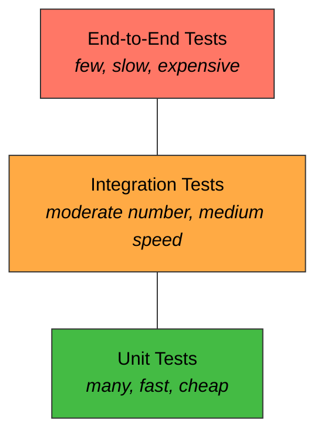

# Chapter 16: Testing Your Application

> ⏱ Estimated time: 70 minutes

## What You'll Learn

- Why testing matters (beyond "it works on my machine")
- The test pyramid: unit tests, integration tests, end-to-end tests
- JUnit 5 basics and assertions
- How to unit test services with mocks (`@MockBean`)
- How to integration test controllers with `MockMvc`
- How to write tests that verify behavior, not implementation

---

## Concepts

### Why Test?

Let's be honest with each other for a second.

You already test your code. You fire up the app, open a terminal, type `curl localhost:8080/api/books`, squint at the JSON, and mutter "looks right." Then you do it again for the next endpoint. And the next one. And the one after that.

Now imagine doing that every single time you change a line of code. *Every. Single. Time.*

Tests are like insurance. Nobody wants to write them, everybody's glad they exist when things break.

**Without automated tests, here's your life:**
- You change code, manually test 15 endpoints, miss one, and a bug hitchhikes its way to production
- A new team member changes code, has no idea what to test, and silently breaks something nobody notices for two weeks
- Refactoring feels like defusing a bomb — you don't know which wire will blow everything up

**With automated tests, your life looks like this:**
- You change code, run tests, they all pass, you go home on time
- Run tests before every deploy and catch bugs before your users do
- Refactor fearlessly — the tests are your safety net, and they'll scream if anything breaks

> 🗣️ Overheard at the coffee shop
>
> *"I don't write tests because my code doesn't have bugs."*
>
> — Every developer, right before deploying a bug to production.

### The Test Pyramid

Not all tests are created equal. Think of them as a pyramid — wide at the base, narrow at the top. You want *lots* of fast, cheap tests at the bottom and just a *few* slow, expensive ones at the top.



| Type | What It Tests | Speed | Quantity |
|------|---------------|-------|----------|
| **Unit** | One class in isolation (service, utility) | Milliseconds | Many |
| **Integration** | Multiple components together (controller + service + database) | Seconds | Moderate |
| **End-to-End** | The entire application from the outside | Slow | Few |

For backend applications, your sweet spot is **unit tests for services** and **integration tests for controllers**. That's where you get the most bang for your testing buck.

> 🎯 Key Point
>
> If your test pyramid looks like an upside-down pyramid (tons of E2E tests, barely any unit tests), you're in trouble. Your CI pipeline will be slow, flaky, and nobody will trust it. Keep the base wide!

---

### Fireside Chat: Unit Test vs. Integration Test

*Tonight's topic: "Who's the REAL MVP of the testing world?"*

**Unit Test:** Look, I'll just say it. I'm fast. Like, *milliseconds* fast. You can run a thousand of me before Integration Test here even finishes booting up the Spring context.

**Integration Test:** Oh, here we go. Mr. Speedy. You know what you *can't* do? Actually prove the system works. You test one little class in a vacuum with fake dependencies. Congrats, your mock returns the right thing. Real shocker.

**Unit Test:** Those "fake dependencies" are called *mocks*, and they let me focus on *logic*. I test that the `BookService` correctly transforms data, handles missing books, validates input — all without needing a database, a server, or your six-second startup time.

**Integration Test:** And when the controller's URL mapping is wrong? When the JSON serialization is broken? When the validation annotations don't fire? *crickets from you.*

**Unit Test:** ...Fair point. But that's why you exist! You handle the wiring — I handle the logic. We're a team!

**Integration Test:** Did... did you just say something nice about me?

**Unit Test:** Don't let it go to your head. You're still slow.

**Integration Test:** And you're still testing in a fantasy world where nothing has real dependencies.

**Moderator:** So it sounds like developers need *both* of you?

**Unit Test & Integration Test (in unison):** Obviously.

---

### What Makes a Good Test?

Here's the golden question every test should answer: **"What business behavior would break if this test fails?"**

If you can't answer that, your test is probably not pulling its weight.

**Good tests verify behavior:**
```java
@Test
void createBook_withValidData_returnsCreatedBook() {
    BookRequest request = new BookRequest("Dune", 1L, 412);
    BookResponse result = bookService.createBook(request);
    
    assertEquals("Dune", result.title());        // Meaningful: the book was created correctly
    assertNotNull(result.id());                   // Meaningful: an ID was assigned
    assertEquals(412, result.pages());            // Meaningful: pages were saved
}
```

**Bad tests verify nothing useful:**
```java
@Test
void createBook_callsRepository() {
    bookService.createBook(request);
    verify(bookRepository).save(any());  // So what? This tells us nothing about correctness
}
```

> ⚠️ Watch it!
>
> The second test only proves that a method was *called*. It doesn't prove anything was saved correctly, returned properly, or actually *works*. That's like checking that you dialed the phone number without caring whether anyone picked up.

### JUnit 5 Basics

JUnit 5 is Java's standard testing framework, and it comes free with `spring-boot-starter-test`. You don't need to add any extra dependencies — Spring Boot has already done the heavy lifting for you.

```java
import org.junit.jupiter.api.Test;
import static org.junit.jupiter.api.Assertions.*;

class CalculatorTest {

    @Test
    void addsTwoNumbers() {
        Calculator calc = new Calculator();
        int result = calc.add(2, 3);
        assertEquals(5, result);
    }

    @Test
    void divisionByZeroThrowsException() {
        Calculator calc = new Calculator();
        assertThrows(ArithmeticException.class, () -> calc.divide(10, 0));
    }
}
```

See how clean that is? Each test reads like a little story: create a thing, do something with it, check the result.

**Key annotations:**
| Annotation | Purpose |
|-----------|---------|
| `@Test` | Marks a method as a test |
| `@BeforeEach` | Runs before EACH test method |
| `@AfterEach` | Runs after EACH test method |
| `@DisplayName("...")` | Human-readable test name |

**Key assertions:**
| Assertion | Checks |
|-----------|--------|
| `assertEquals(expected, actual)` | Values are equal |
| `assertNotNull(value)` | Value is not null |
| `assertTrue(condition)` | Condition is true |
| `assertThrows(Exception.class, () -> ...)` | Code throws expected exception |
| `assertFalse(condition)` | Condition is false |

> 🧠 Brain Power
>
> You're testing a method that should return an empty list when there are no books in the database. Which assertion would you use — `assertEquals`, `assertTrue`, or both? Could you use `assertTrue(result.isEmpty())` *and* `assertEquals(0, result.size())`? Which one communicates your intent more clearly to someone reading the test six months from now?

### Mocking with Mockito

Here's the deal: when you're unit testing a service, you do NOT want to talk to a real database. That would make your test slow, fragile, and dependent on external state. Instead, you **mock** the repository — you create a fake stand-in that returns whatever you tell it to.

Think of it like a movie stunt double. The audience (your service) doesn't know the difference, but behind the scenes, it's not the real actor (database) doing the dangerous work.

```java
// Real repository → hits the database
// Mock repository → returns predefined answers, no database needed

BookRepository mockRepo = mock(BookRepository.class);
when(mockRepo.findById(1L)).thenReturn(Optional.of(sampleBook));  // "If someone calls findById(1), return sampleBook"

BookService service = new BookService(mockRepo);
// Now the service uses the mock — no database involved
```

> 💡 There are no Dumb Questions
>
> **Q: If mocks just return fake data, how do they prove anything?**
>
> A: Great question! Mocks let you control the inputs so you can focus on testing the *logic* of your service. If `findById` returns a book, does the service correctly transform it into a `BookResponse`? If it returns empty, does the service throw the right exception? The mock isolates the "what does my code do" from the "does the database work" question.
>
> **Q: Do I need mocks for integration tests too?**
>
> A: Nope! Integration tests use real beans wired together by Spring. That's the whole point — you're testing that the real pieces fit together. Mocks are for *unit* tests where you want to test one class in isolation.
>
> **Q: What if I mock everything? Isn't that just testing my mocks?**
>
> A: Yes, and that's a trap many developers fall into! Only mock the dependencies of the class you're testing. If you're testing `BookService`, mock `BookRepository` and `AuthorRepository`. Don't mock the class you're actually testing — that defeats the entire purpose.

---

## Code Examples

### Unit Testing the BookService

Alright, let's get our hands dirty. This is the real thing — a complete, working test class for `BookService`. Read through it carefully. Every line is there for a reason.

Create `src/test/java/com/bookshelf/service/BookServiceTest.java`:

```java
package com.bookshelf.service;

import com.bookshelf.dto.BookRequest;
import com.bookshelf.dto.BookResponse;
import com.bookshelf.exception.BookNotFoundException;
import com.bookshelf.model.Author;
import com.bookshelf.model.Book;
import com.bookshelf.repository.AuthorRepository;
import com.bookshelf.repository.BookRepository;
import org.junit.jupiter.api.BeforeEach;
import org.junit.jupiter.api.DisplayName;
import org.junit.jupiter.api.Test;
import org.junit.jupiter.api.extension.ExtendWith;
import org.mockito.InjectMocks;
import org.mockito.Mock;
import org.mockito.junit.jupiter.MockitoExtension;

import java.time.LocalDateTime;
import java.util.List;
import java.util.Optional;

import static org.junit.jupiter.api.Assertions.*;
import static org.mockito.ArgumentMatchers.any;
import static org.mockito.Mockito.*;

@ExtendWith(MockitoExtension.class)  // Enable Mockito
class BookServiceTest {

    @Mock
    private BookRepository bookRepository;

    @Mock
    private AuthorRepository authorRepository;

    @InjectMocks  // Creates BookService with the mocks injected
    private BookService bookService;

    private Author sampleAuthor;
    private Book sampleBook;

    @BeforeEach
    void setUp() {
        sampleAuthor = new Author("Frank Herbert", "American");
        sampleAuthor.setId(1L);

        sampleBook = new Book();
        sampleBook.setId(1L);
        sampleBook.setTitle("Dune");
        sampleBook.setAuthor(sampleAuthor);
        sampleBook.setPages(412);
        sampleBook.setCreatedAt(LocalDateTime.now());
    }

    @Test
    @DisplayName("getAllBooks returns all books as responses")
    void getAllBooks_returnsAllBooks() {
        when(bookRepository.findAll()).thenReturn(List.of(sampleBook));

        List<BookResponse> result = bookService.getAllBooks();

        assertEquals(1, result.size());
        assertEquals("Dune", result.get(0).title());
        assertEquals("Frank Herbert", result.get(0).author().name());
    }

    @Test
    @DisplayName("getBookById returns book when it exists")
    void getBookById_existingId_returnsBook() {
        when(bookRepository.findById(1L)).thenReturn(Optional.of(sampleBook));

        BookResponse result = bookService.getBookById(1L);

        assertEquals("Dune", result.title());
        assertEquals(412, result.pages());
    }

    @Test
    @DisplayName("getBookById throws exception when book doesn't exist")
    void getBookById_nonExistingId_throwsException() {
        when(bookRepository.findById(999L)).thenReturn(Optional.empty());

        assertThrows(BookNotFoundException.class, () -> bookService.getBookById(999L));
    }

    @Test
    @DisplayName("createBook saves and returns new book")
    void createBook_validRequest_returnsCreatedBook() {
        BookRequest request = new BookRequest("Dune", 1L, 412);

        when(authorRepository.findById(1L)).thenReturn(Optional.of(sampleAuthor));
        when(bookRepository.save(any(Book.class))).thenReturn(sampleBook);

        BookResponse result = bookService.createBook(request);

        assertEquals("Dune", result.title());
        assertEquals(412, result.pages());
        assertNotNull(result.author());
    }

    @Test
    @DisplayName("deleteBook throws exception when book doesn't exist")
    void deleteBook_nonExistingId_throwsException() {
        when(bookRepository.existsById(999L)).thenReturn(false);

        assertThrows(BookNotFoundException.class, () -> bookService.deleteBook(999L));
    }
}
```

> 🎯 Key Point
>
> Notice the pattern in every test: **Arrange** (set up mocks and data), **Act** (call the method), **Assert** (check the result). This "AAA" pattern makes tests predictable and easy to read. If you find yourself writing a test that doesn't follow this shape, step back and ask if you're really testing what you think you're testing.

### Integration Testing the BookController

Now we level up. Integration tests load the *real* Spring context — real beans, real database, real serialization. This is where you find out if the pieces actually fit together.

Create `src/test/java/com/bookshelf/controller/BookControllerIntegrationTest.java`:

```java
package com.bookshelf.controller;

import com.bookshelf.model.Author;
import com.bookshelf.model.Book;
import com.bookshelf.repository.AuthorRepository;
import com.bookshelf.repository.BookRepository;
import org.junit.jupiter.api.BeforeEach;
import org.junit.jupiter.api.DisplayName;
import org.junit.jupiter.api.Test;
import org.springframework.beans.factory.annotation.Autowired;
import org.springframework.boot.test.autoconfigure.web.servlet.AutoConfigureMockMvc;
import org.springframework.boot.test.context.SpringBootTest;
import org.springframework.http.MediaType;
import org.springframework.test.web.servlet.MockMvc;

import static org.hamcrest.Matchers.*;
import static org.springframework.test.web.servlet.request.MockMvcRequestBuilders.*;
import static org.springframework.test.web.servlet.result.MockMvcResultMatchers.*;

@SpringBootTest                // Load the full Spring application context
@AutoConfigureMockMvc          // Set up MockMvc
class BookControllerIntegrationTest {

    @Autowired
    private MockMvc mockMvc;   // Simulates HTTP requests without a real server

    @Autowired
    private BookRepository bookRepository;

    @Autowired
    private AuthorRepository authorRepository;

    private Author savedAuthor;

    @BeforeEach
    void setUp() {
        bookRepository.deleteAll();
        authorRepository.deleteAll();
        savedAuthor = authorRepository.save(new Author("Frank Herbert", "American"));
    }

    @Test
    @DisplayName("GET /api/books returns empty list when no books exist")
    void getAllBooks_empty_returns200WithEmptyList() throws Exception {
        mockMvc.perform(get("/api/books"))
                .andExpect(status().isOk())
                .andExpect(jsonPath("$", hasSize(0)));
    }

    @Test
    @DisplayName("POST /api/books creates a book and returns 201")
    void createBook_validData_returns201() throws Exception {
        String requestBody = """
                {
                    "title": "Dune",
                    "authorId": %d,
                    "pages": 412
                }
                """.formatted(savedAuthor.getId());

        mockMvc.perform(post("/api/books")
                        .contentType(MediaType.APPLICATION_JSON)
                        .content(requestBody))
                .andExpect(status().isCreated())
                .andExpect(jsonPath("$.title").value("Dune"))
                .andExpect(jsonPath("$.pages").value(412))
                .andExpect(jsonPath("$.id").isNotEmpty())
                .andExpect(jsonPath("$.author.name").value("Frank Herbert"));
    }

    @Test
    @DisplayName("POST /api/books with empty title returns 400")
    void createBook_emptyTitle_returns400() throws Exception {
        String requestBody = """
                {
                    "title": "",
                    "authorId": %d,
                    "pages": 412
                }
                """.formatted(savedAuthor.getId());

        mockMvc.perform(post("/api/books")
                        .contentType(MediaType.APPLICATION_JSON)
                        .content(requestBody))
                .andExpect(status().isBadRequest())
                .andExpect(jsonPath("$.error").value("Validation Failed"));
    }

    @Test
    @DisplayName("GET /api/books/{id} returns 404 for non-existent book")
    void getBookById_nonExistent_returns404() throws Exception {
        mockMvc.perform(get("/api/books/999"))
                .andExpect(status().isNotFound());
    }

    @Test
    @DisplayName("DELETE /api/books/{id} returns 204 for existing book")
    void deleteBook_existing_returns204() throws Exception {
        // Create a book first
        Book book = new Book();
        book.setTitle("Dune");
        book.setAuthor(savedAuthor);
        book.setPages(412);
        Book saved = bookRepository.save(book);

        mockMvc.perform(delete("/api/books/" + saved.getId()))
                .andExpect(status().isNoContent());
    }
}
```

> 🗣️ Overheard at the coffee shop
>
> *"Why does `@BeforeEach` delete all data? Isn't that wasteful?"*
>
> Because tests should be *independent*. If Test A creates three books and Test B expects an empty database, you've got a test that passes or fails depending on the order they run. That's a nightmare to debug. Clean slate, every time.

### Running Tests

Time to see the magic happen. Fire up your terminal and let it rip:

```bash
# Run all tests
mvn test

# Run a specific test class
mvn test -Dtest=BookServiceTest

# Run with verbose output
mvn test -X
```

If everything is green, take a moment to feel good about yourself. You've just built a safety net that will catch bugs for you *forever* (well, as long as someone keeps the tests updated).

### Understanding MockMvc

`MockMvc` is your best friend for controller tests. It simulates HTTP requests without starting a real server — so your tests run fast, but they still exercise the full Spring MVC pipeline (routing, serialization, validation, exception handling).

Here's what's happening under the hood:

```java
mockMvc.perform(                                     // Send a request
    post("/api/books")                               // POST to /api/books
        .contentType(MediaType.APPLICATION_JSON)      // Set Content-Type header
        .content("{\"title\": \"Dune\", ...}")       // Set request body
)
.andExpect(status().isCreated())                     // Assert status = 201
.andExpect(jsonPath("$.title").value("Dune"))        // Assert response body field
.andExpect(jsonPath("$.id").isNotEmpty());            // Assert ID was generated
```

`jsonPath` uses the JSONPath syntax:
- `$` — the root object
- `$.title` — the "title" field
- `$[0]` — first element of an array
- `$[0].title` — title of the first element

> 💡 There are no Dumb Questions
>
> **Q: Does MockMvc start Tomcat?**
>
> A: No! That's the beauty of it. `MockMvc` simulates the servlet environment in memory. No port is opened, no server is started. But your controllers, filters, exception handlers, and serializers all run for real. You get 90% of the confidence of a full server test at a fraction of the cost.
>
> **Q: Then when would I start the real server?**
>
> A: Use `@SpringBootTest(webEnvironment = WebEnvironment.RANDOM_PORT)` with `TestRestTemplate` when you need to test things like CORS headers, HTTPS redirects, or actual HTTP client behavior. But for most controller tests, `MockMvc` is all you need.

---

## Exercise: Write Tests for BookShelf

**Goal**: Add automated tests for your BookShelf service and controller.

### Tasks

1. Create `BookServiceTest` with at least 5 tests:
   - Get all books
   - Get book by ID (found)
   - Get book by ID (not found → exception)
   - Create book (valid data)
   - Delete non-existent book (→ exception)

2. Create `BookControllerIntegrationTest` with at least 5 tests:
   - GET /api/books returns 200 with list
   - POST /api/books with valid data returns 201
   - POST /api/books with invalid data returns 400
   - GET /api/books/{id} with non-existent ID returns 404
   - DELETE /api/books/{id} returns 204

3. Run all tests: `mvn test`

### Test Naming Convention

Use this pattern: `methodName_scenario_expectedResult`

```java
createBook_validRequest_returnsCreatedBook()
getBookById_nonExistingId_throwsBookNotFoundException()
deleteBook_existingBook_returns204NoContent()
```

This isn't just a stylistic preference — when a test fails at 2 AM and you get a notification, a name like `getBookById_nonExistingId_throwsBookNotFoundException` tells you *exactly* what broke without opening a single file. A name like `test3` tells you nothing.

---

## Common Mistakes

> ⚠️ Watch it!
>
> These are the traps developers walk into over and over. Read this table carefully — future you will thank present you.

| Mistake | Reality |
|---------|---------|
| Testing that a mock was called instead of checking the result | `verify(repo).save(any())` proves nothing about correctness. Check the returned value instead. |
| Not cleaning up test data between tests | Use `@BeforeEach` to delete all data. Tests must be independent — the order they run shouldn't matter. |
| Testing private methods | Test through the public API. If a private method is complex enough to test directly, it should probably be in its own class. |
| Writing tests after the code is "done" | Write tests alongside your code. If testing is hard, your design might need improvement. |
| Only testing the happy path | Always test: valid input, invalid input, missing data, edge cases (empty lists, null values, boundary values). |

> 🧠 Brain Power
>
> Look at the "testing private methods" row above. Why is it a sign of a design problem when you feel the urge to test a private method directly? Think about the Single Responsibility Principle. If a private method is doing so much work that it needs its own tests, what does that tell you about the class it lives in? What would you refactor?

---

### 📝 Practice Exercises

Ready to test your understanding? These exercises from [Appendix E](../../appendices/E-coding-exercises.md) directly apply what you learned in this chapter:

| Exercise | Topic | Difficulty |
|----------|-------|------------|
| [Exercise 44](../../appendices/E-coding-exercises.md#exercise-44) | Unit Test with Mockito | ⭐⭐ |
| [Exercise 45](../../appendices/E-coding-exercises.md#exercise-45) | MockMvc Controller Test | ⭐⭐ |
| [Exercise 46](../../appendices/E-coding-exercises.md#exercise-46) | Integration Test | ⭐⭐⭐ |
| [Exercise 47](../../appendices/E-coding-exercises.md#exercise-47) | Test Validation Errors | ⭐⭐ |

Solutions are in [Appendix F](../../appendices/F-exercise-solutions.md).

---

## Key Takeaways

- [ ] Unit tests verify one class in isolation using mocks
- [ ] Integration tests verify multiple components working together
- [ ] `@Mock` creates a fake dependency; `@InjectMocks` injects them into the class under test
- [ ] `MockMvc` simulates HTTP requests without starting a real server
- [ ] Good tests verify **behavior** (output, state, exceptions), not **implementation** (method calls)
- [ ] Each test should be independent — order doesn't matter

---

## Quick Quiz

> 🧠 Brain Power
>
> Grab a pen (yes, a real pen — writing things down cements them in your brain) and answer these without scrolling back up. If you get stuck, *then* go look.

1. What's the difference between a unit test and an integration test?
2. Why do we mock the repository when testing the service?
3. What does `when(repo.findById(1L)).thenReturn(Optional.of(book))` do?
4. Write a MockMvc assertion that checks if the response has status 404 and a "Not Found" error message.
5. A test verifies `verify(service, times(1)).createBook(any())`. Is this a good test? Why or why not?

---

*Next: `17-logging-and-documentation.md` — Make your API observable and discoverable →*
