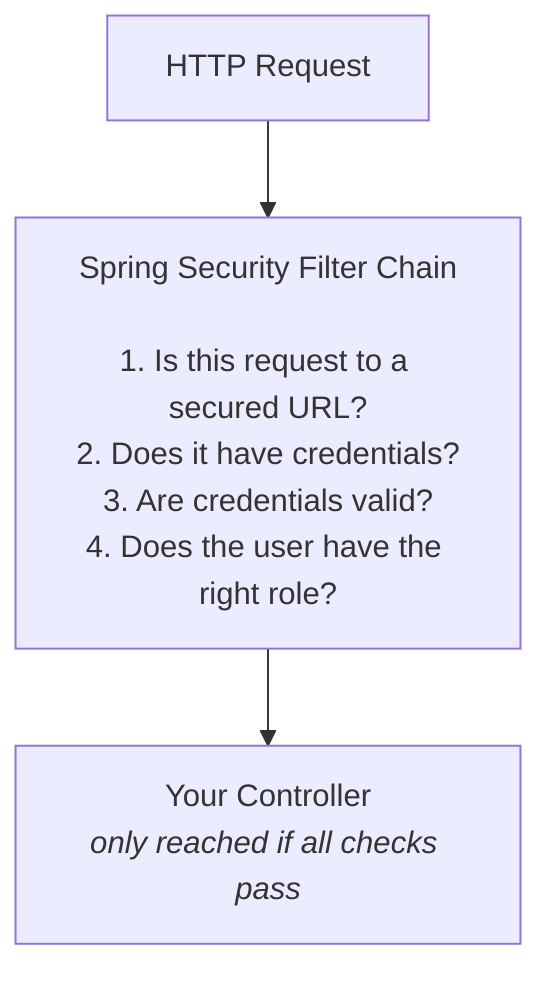

# Chapter 18: Security Basics

> **Pop quiz: What's the difference between a bouncer who checks your ID at the door and the VIP host who decides which rooms you can enter?** If you said "one proves who you are, the other decides what you're allowed to do" -- congratulations, you already understand the two most important concepts in web security. Now let's teach Spring Boot to be both.

> ⏱ Estimated time: 60 minutes

## What You'll Learn

- The difference between authentication and authorization
- How Spring Security works at a high level
- How to add basic authentication to your API
- How to protect specific endpoints (write operations) while leaving others open (read operations)
- What CORS is and why it matters

---

## The Nightclub Analogy (a.k.a. Authentication vs. Authorization, Once and for All)

Imagine you're heading to the hottest nightclub in town. Between you and the dance floor, there are TWO checkpoints.

**Checkpoint 1 -- The Bouncer at the Door (Authentication)**

The bouncer doesn't care if you're cool. The bouncer doesn't care if you're on the VIP list. The bouncer has exactly ONE question: **"Who are you?"** Show your ID. If your face matches your photo, you're in. If you hand the bouncer a crayon drawing of yourself on a napkin, you're out. That's authentication -- proving your identity.

**Checkpoint 2 -- The VIP Host Inside (Authorization)**

Okay, you're through the door. But now the VIP host appears. She knows who you are (the bouncer already handled that), and her question is different: **"What are you allowed to do?"** General admission ticket? You get the main floor. VIP wristband? You get the velvet rope section. Artist pass? You get backstage. That's authorization -- determining your permissions.

| Concept | Question | Nightclub Version | API Version |
|---------|----------|-------------------|-------------|
| **Authentication** | **Who are you?** | "I'm Alice, here's my ID" | "I'm Alice, here's my password" |
| **Authorization** | **What are you allowed to do?** | "Alice has a VIP wristband" | "Alice has the ADMIN role, so she can delete books" |

Authentication ALWAYS comes first. You can't check someone's VIP status if you don't even know who they are. The bouncer checks your ID *before* the VIP host checks your wristband. Always. No exceptions.

```
Request arrives → Is the user authenticated? → NO → 401 Unauthorized
                                             → YES → Is the user authorized? → NO → 403 Forbidden
                                                                              → YES → Process request
```

> **🧠 Brain Power:** Here's a thing that trips up even experienced developers: a `401 Unauthorized` response actually means "unauthenticated" -- you haven't proven who you are. A `403 Forbidden` means "unauthorized" -- we know who you are, but you don't have permission. Yes, the HTTP status code names are confusing. The original naming was a mistake that's now baked into the internet forever. Welcome to software.

---

## 🎤 Fake Interview: Sitting Down with Spring Security

**Interviewer:** Thanks for coming in, Spring Security. You've got quite the reputation. Some developers love you, some... let's say they have complicated feelings.

**Spring Security:** Oh, I know. People add me to their project and suddenly EVERY endpoint returns 401. Then they panic, rip me out, and say "I'll add security later." Spoiler alert: they never do.

**Interviewer:** So what exactly are you?

**Spring Security:** I'm the nightclub bouncer. ID check, guest list check, VIP check -- in that order. Technically, I'm a chain of filters that sit between the internet and your controller. Every HTTP request has to walk past me before it gets anywhere near your code.

**Interviewer:** A chain of filters?

**Spring Security:** Think of it like airport security. You don't just walk through ONE scanner. There's the ticket check, the ID check, the bag X-ray, the metal detector, maybe the random pat-down. Each one is a separate filter. If you fail ANY of them, you don't get to the gate. My filter chain works the same way -- a series of security checks, each with a specific job.

**Interviewer:** What happens if a developer adds you but doesn't configure anything?

**Spring Security:** I lock down EVERYTHING. Every. Single. Endpoint. 401 for everyone. Some people call that aggressive. I call it "secure by default." Would you rather I let everything through and hope you remember to add security later? That's how data breaches happen, my friend.

**Interviewer:** Fair point. One last question -- are you hard to learn?

**Spring Security:** I'm hard to learn if you fight me. I'm easy if you understand what I'm doing and WHY. Today, you're going to learn the basics -- and honestly, for 80% of apps, the basics are all you need.

---

## How the Filter Chain Actually Works

Spring Security works by inserting **filters** into the request pipeline, before your controller is ever reached:



Your controller doesn't know security exists. It never sees the rejected requests. By the time a request reaches your `@RestController`, it has ALREADY passed every security check. Your controller just does its job, blissfully unaware of the bouncer at the door.

> **🎯 Key Point:** This is the beauty of Spring Security's design. Your business logic stays clean. Your controller doesn't have `if (user.isAuthenticated())` checks sprinkled everywhere. Security is handled in ONE place -- the filter chain -- and your controllers just trust that whoever made it through is supposed to be there.

---

## Authentication Methods: Pick Your Weapon

| Method | How It Works | Use Case |
|--------|-------------|----------|
| **Basic Auth** | Username + password in every request (Base64 encoded in header) | Simple APIs, internal tools |
| **Session-based** | Login once, server stores session, client sends session cookie | Traditional web apps |
| **Token-based (JWT)** | Login once, receive a token, send token in every request | Modern APIs, mobile apps |
| **OAuth 2.0** | Delegated auth via a provider (Google, GitHub) | "Sign in with Google" |

We'll use **Basic Auth** for learning (simplest to understand). The concepts apply to all methods.

> **🗣️ Overheard at the coffee shop:** "Why would anyone use Basic Auth in production? Isn't it just sending your password in every request?" "Yes, Base64 encoded, which is NOT encryption -- anyone can decode it. That's why you always use HTTPS with Basic Auth. But for learning the concepts? It's perfect because there's no token management to distract you."

---

## Code Examples

### Step 1: Add Spring Security Dependency

Add to `pom.xml`:

```xml
<dependency>
    <groupId>org.springframework.boot</groupId>
    <artifactId>spring-boot-starter-security</artifactId>
</dependency>
```

> **⚠️ Watch it!** The moment you add this dependency, **ALL endpoints are locked down**. Every request gets a 401 until you configure security. This is Spring Security's "secure by default" philosophy. Don't add this line and then wonder why your entire app stopped working. It's not broken -- it's *locked*.

If you run the app now, check the console for a generated password:
```
Using generated security password: a1b2c3d4-e5f6-7890-abcd-ef1234567890
```
The default username is `user`.

That auto-generated password changes every time you restart the app. It's Spring Security saying, "Look, you didn't configure me, so here's a temporary password. Please set up proper security. Please."

### Step 2: Create Security Configuration

This is where you tell Spring Security the rules of YOUR nightclub. Who gets in free? Who needs a wristband? Who gets bounced?

Create `src/main/java/com/bookshelf/config/SecurityConfig.java`:

```java
package com.bookshelf.config;

import org.springframework.context.annotation.Bean;
import org.springframework.context.annotation.Configuration;
import org.springframework.http.HttpMethod;
import org.springframework.security.config.annotation.web.builders.HttpSecurity;
import org.springframework.security.config.annotation.web.configuration.EnableWebSecurity;
import org.springframework.security.config.http.SessionCreationPolicy;
import org.springframework.security.core.userdetails.User;
import org.springframework.security.core.userdetails.UserDetailsService;
import org.springframework.security.crypto.bcrypt.BCryptPasswordEncoder;
import org.springframework.security.crypto.password.PasswordEncoder;
import org.springframework.security.provisioning.InMemoryUserDetailsManager;
import org.springframework.security.web.SecurityFilterChain;

import static org.springframework.security.config.Customizer.withDefaults;

@Configuration
@EnableWebSecurity
public class SecurityConfig {

    @Bean
    public SecurityFilterChain filterChain(HttpSecurity http) throws Exception {
        http
            // Disable CSRF (not needed for stateless REST APIs)
            .csrf(csrf -> csrf.disable())
            
            // Stateless session (no cookies)
            .sessionManagement(session -> 
                session.sessionCreationPolicy(SessionCreationPolicy.STATELESS))
            
            // Authorization rules
            .authorizeHttpRequests(auth -> auth
                // Public endpoints — no authentication needed
                .requestMatchers(HttpMethod.GET, "/api/books/**").permitAll()
                .requestMatchers(HttpMethod.GET, "/api/authors/**").permitAll()
                .requestMatchers("/actuator/health").permitAll()
                .requestMatchers("/swagger-ui/**", "/v3/api-docs/**").permitAll()
                .requestMatchers("/h2-console/**").permitAll()
                
                // Protected endpoints — authentication required
                .requestMatchers(HttpMethod.POST, "/api/**").authenticated()
                .requestMatchers(HttpMethod.PUT, "/api/**").authenticated()
                .requestMatchers(HttpMethod.DELETE, "/api/**").authenticated()
                
                // Everything else requires authentication
                .anyRequest().authenticated()
            )
            
            // Use HTTP Basic authentication
            .httpBasic(withDefaults())
            
            // Allow H2 console frames
            .headers(headers -> headers.frameOptions(frame -> frame.disable()));
        
        return http.build();
    }

    @Bean
    public UserDetailsService userDetailsService(PasswordEncoder encoder) {
        // In-memory users for learning — in production, use a database
        var admin = User.builder()
                .username("admin")
                .password(encoder.encode("admin123"))
                .roles("ADMIN")
                .build();

        var user = User.builder()
                .username("user")
                .password(encoder.encode("user123"))
                .roles("USER")
                .build();

        return new InMemoryUserDetailsManager(admin, user);
    }

    @Bean
    public PasswordEncoder passwordEncoder() {
        return new BCryptPasswordEncoder();
    }
}
```

### What This Configuration Does

Let's read this like a nightclub's door policy posted on the wall:

```
GET  /api/books          → Public (anyone can read)
GET  /api/books/1        → Public
GET  /api/authors        → Public
POST /api/books          → Requires authentication (must be logged in)
PUT  /api/books/1        → Requires authentication
DELETE /api/books/1      → Requires authentication
GET  /swagger-ui/**      → Public (documentation is open)
GET  /actuator/health    → Public (health check is open)
```

Translation: **Looking at books? Come on in, no ID needed. Want to ADD, CHANGE, or DELETE books? Show me your credentials.**

This is a very common pattern in real APIs. Read operations are public (or at least less restricted), and write operations require authentication. Think about it -- Amazon lets you browse products without logging in, but you need an account to buy something.

> **💡 There are no Dumb Questions:**
>
> **Q: Why disable CSRF?**
> A: CSRF (Cross-Site Request Forgery) protection is designed for browser-based forms where a cookie automatically gets sent. Our REST API is stateless -- no cookies, no sessions. CSRF protection would just get in the way and block legitimate API calls. If you're building a traditional web app with forms and sessions, keep CSRF enabled.
>
> **Q: What does `SessionCreationPolicy.STATELESS` mean?**
> A: It tells Spring, "Don't create HTTP sessions. Don't store anything about the user between requests. Every request must carry its own credentials." This is the standard for REST APIs. Each request is independent -- the server doesn't remember you.
>
> **Q: Why are we storing users in memory? That seems wrong.**
> A: It IS wrong for production. `InMemoryUserDetailsManager` is a learning tool. In a real app, you'd load users from a database. But for understanding HOW security works, in-memory users let us focus on the concepts without the database distraction.

---

### Step 3: Testing Secured Endpoints

Time to see the bouncer in action. Fire up your app and try these:

```bash
# Public endpoint — works without credentials
curl http://localhost:8080/api/books
# Response: [] (200 OK)

# Protected endpoint — without credentials
curl -v -X POST http://localhost:8080/api/books \
  -H "Content-Type: application/json" \
  -d '{"title": "Dune", "authorId": 1, "pages": 412}'
# Response: 401 Unauthorized

# Protected endpoint — with credentials (Basic Auth)
curl -u admin:admin123 -X POST http://localhost:8080/api/books \
  -H "Content-Type: application/json" \
  -d '{"title": "Dune", "authorId": 1, "pages": 412}'
# Response: 201 Created

# Wrong credentials
curl -u admin:wrongpassword -X POST http://localhost:8080/api/books \
  -H "Content-Type: application/json" \
  -d '{"title": "Dune", "authorId": 1, "pages": 412}'
# Response: 401 Unauthorized
```

The `-u username:password` flag in curl sends Basic Auth credentials.

See what happened there? The GET worked for everyone -- no bouncer at the reading room door. But the POST? The bouncer stepped in. No credentials? 401. Wrong credentials? 401. Right credentials? Welcome aboard, here's your 201 Created.

> **🧠 Brain Power:** Try this experiment: what happens if you send a GET request to `/api/books` WITH valid credentials? Does it still work? (Hint: `permitAll()` means "allow everyone" -- including authenticated users. The bouncer lets EVERYONE through, whether they have an ID or not.)

---

### Password Encoding

Here's a question that separates amateur developers from professionals: **How do you store passwords?**

If your answer is "in a database column called `password`," we need to talk.

> **⚠️ Watch it!** **NEVER store plain-text passwords.** Not in development. Not in testing. Not "just temporarily." NEVER. If someone gets access to your database (and breaches happen to the best of us), they should find a wall of unintelligible gibberish, not a list of passwords they can read over coffee.

Always hash them:

```java
BCryptPasswordEncoder encoder = new BCryptPasswordEncoder();
String hashed = encoder.encode("admin123");
// Result: "$2a$10$N9qo8uLOickgx2ZMRZoMyeIjZAgcfl7p92ldGxad68LJZdL17lhWy"
// This is a one-way hash — you cannot reverse it to get "admin123"
```

When a user logs in, Spring Security:
1. Takes the provided password
2. Hashes it with BCrypt
3. Compares the hash with the stored hash
4. If they match → authenticated

---

## 🎤 Fake Interview: A Quiet Word with BCrypt

**Interviewer:** BCrypt, thanks for sitting down. What exactly do you do?

**BCrypt:** I turn your password into gibberish. Beautiful, irreversible gibberish.

**Interviewer:** "Irreversible"? You can't get the original password back?

**BCrypt:** Nope. That's the whole point. When I hash "admin123," I produce a 60-character string of random-looking characters. There is no mathematical way to reverse it. No key. No secret decoder ring. It's a one-way street. Even I can't undo it.

**Interviewer:** So how do you verify a password during login?

**BCrypt:** Easy. When a user types "admin123" to log in, I hash THAT input with the same algorithm. Then I compare the new hash with the stored hash. If they match, the passwords are the same. I never need to know the actual password -- I just need to know if two hashes match.

**Interviewer:** What if two users both use "password123"?

**BCrypt:** They'll get DIFFERENT hashes. I add a random "salt" to each password before hashing. So even identical passwords produce different hashes. An attacker can't look at the database and say "oh, these five users all have the same password." Each hash is unique.

**Interviewer:** That's clever. You must be very popular.

**BCrypt:** I've been around since 1999 and I'm still the recommended default. In security, that's like being a 25-year-old who still gets carded at bars. I'll take it.

---

### CORS (Cross-Origin Resource Sharing)

Okay, picture this: your API lives at `api.bookshelf.com` and your React frontend lives at `www.bookshelf.com`. Your frontend JavaScript tries to call your API and... nothing. The browser blocks it. Your API is fine. Your frontend is fine. The browser is the one saying "nope."

Why? Because browsers have a built-in security rule: **JavaScript on one domain cannot make requests to a different domain.** This is called the Same-Origin Policy, and it exists to prevent malicious websites from secretly calling your bank's API using your logged-in session.

**CORS** is how you tell the browser: "Hey, it's okay. This specific frontend is allowed to call my API. I vouch for it."

Add CORS configuration:

```java
import org.springframework.web.cors.CorsConfiguration;
import org.springframework.web.cors.CorsConfigurationSource;
import org.springframework.web.cors.UrlBasedCorsConfigurationSource;

@Bean
public CorsConfigurationSource corsConfigurationSource() {
    CorsConfiguration configuration = new CorsConfiguration();
    configuration.setAllowedOrigins(List.of("http://localhost:3000"));  // Frontend URL
    configuration.setAllowedMethods(List.of("GET", "POST", "PUT", "DELETE"));
    configuration.setAllowedHeaders(List.of("*"));
    
    UrlBasedCorsConfigurationSource source = new UrlBasedCorsConfigurationSource();
    source.registerCorsConfiguration("/api/**", configuration);
    return source;
}
```

And enable it in the filter chain:
```java
http.cors(withDefaults())  // Add this to your HttpSecurity configuration
```

> **💡 There are no Dumb Questions:**
>
> **Q: If CORS is a browser restriction, can't I just use Postman or curl to bypass it?**
> A: YES. That's exactly right. CORS is enforced by BROWSERS, not servers. Curl, Postman, and other non-browser tools don't care about CORS at all. That's why CORS is a defense against browser-based attacks, not a general-purpose security mechanism.
>
> **Q: Can I just set allowed origins to `*` (everything)?**
> A: You CAN, and for public APIs it might be fine. But for private APIs, that defeats the purpose. It's like putting a lock on your door and then taping the key next to it.
>
> **Q: I'm not building a frontend. Do I need CORS?**
> A: If your API will only be called by other servers (not browsers), you don't need CORS configuration. But if there's ANY chance a browser-based frontend will call your API, add it now. "I'll add CORS later" is the sibling of "I'll add security later" -- and they're both liars.

---

## Exercise: Secure BookShelf (v5)

**Goal**: Add authentication to protect write operations.

### Tasks

1. Add `spring-boot-starter-security` dependency
2. Create `SecurityConfig` with the rules above
3. Define at least two users (admin and regular user)
4. Configure public GET endpoints and protected POST/PUT/DELETE endpoints
5. Test that GET works without credentials
6. Test that POST/PUT/DELETE requires credentials
7. Test that wrong credentials return 401

### Test Matrix

| Endpoint | No Auth | With Auth | Wrong Auth |
|----------|---------|-----------|------------|
| GET /api/books | 200 ✅ | 200 ✅ | 200 ✅ |
| POST /api/books | 401 ❌ | 201 ✅ | 401 ❌ |
| PUT /api/books/1 | 401 ❌ | 200 ✅ | 401 ❌ |
| DELETE /api/books/1 | 401 ❌ | 204 ✅ | 401 ❌ |

> **🧠 Brain Power:** Look at the GET row. Notice that even "Wrong Auth" returns 200 for GET endpoints. Why? Because `permitAll()` doesn't mean "ignore credentials" -- it means "don't REQUIRE credentials." If someone sends bad credentials to a public endpoint, Spring Security still lets them through. The bouncer doesn't even bother checking IDs at the "free admission" door.

---

## Common Mistakes

| Mistake | Reality |
|---------|---------|
| Storing plain-text passwords | ALWAYS hash passwords with BCrypt (or Argon2). Even in development. Build the habit now. |
| Disabling security "because it's annoying" | Instead, configure it properly. Security is part of your application, not an afterthought. |
| Forgetting to disable CSRF for REST APIs | CSRF protection is for browser forms. Stateless REST APIs with token/basic auth don't need it. |
| Not allowing Swagger through the filter | If Swagger UI returns 401, add `.requestMatchers("/swagger-ui/**", "/v3/api-docs/**").permitAll()` |
| `permitAll()` on all endpoints during development | Fix security rules from day one. "I'll add security later" means "I'll forget and ship insecure code." |

> **🗣️ Overheard at the coffee shop:** "I just `permitAll()`-ed everything because security kept getting in the way of my development flow. I'll tighten it up before we ship." *Narrator: They did not tighten it up before they shipped.*

---

### 📝 Practice Exercises

Ready to test your understanding? These exercises from [Appendix E](../../appendices/E-coding-exercises.md) directly apply what you learned in this chapter:

| Exercise | Topic | Difficulty |
|----------|-------|------------|
| [Exercise 49](../../appendices/E-coding-exercises.md#exercise-49) | Public and Protected Endpoints | ⭐⭐ |
| [Exercise 50](../../appendices/E-coding-exercises.md#exercise-50) | SecurityFilterChain with Basic Auth | ⭐⭐⭐ |

Solutions are in [Appendix F](../../appendices/F-exercise-solutions.md).

---

## Key Takeaways

- [ ] Authentication = who are you? Authorization = what can you do?
- [ ] Spring Security uses a filter chain that runs before your controller
- [ ] Adding `spring-boot-starter-security` locks down ALL endpoints by default
- [ ] Configure which endpoints are public (`permitAll()`) and which require auth (`authenticated()`)
- [ ] Always hash passwords -- never store them in plain text
- [ ] CORS is needed when your frontend and backend are on different domains

---

## Quick Quiz

1. What's the difference between a 401 and a 403 response?
2. Why do we disable CSRF for REST APIs?
3. What does `BCryptPasswordEncoder.encode("password")` return?
4. If a user's GET /api/books works but POST /api/books returns 401, what does that tell you about the security configuration?
5. Why is CORS a browser restriction, not a server restriction?

> **💡 There are no Dumb Questions:**
>
> **Q: For question 1 -- I keep mixing up 401 and 403. Any trick to remember?**
> A: Think of it this way: **401 = "Who ARE you?"** (you haven't identified yourself). **403 = "I know who you are, and the answer is NO."** 401 is the bouncer at the door who hasn't seen your ID. 403 is the VIP host who has seen your general admission ticket and is blocking the velvet rope.

---

## Day 6 Summary

```
✓ Unit tests verify services in isolation using mocks
✓ Integration tests verify the full request-response cycle with MockMvc
✓ Good tests verify behavior (output, state), not implementation (method calls)
✓ Logging with SLF4J: ERROR > WARN > INFO > DEBUG levels
✓ Actuator provides /health and monitoring endpoints
✓ springdoc-openapi generates interactive API documentation
✓ Authentication (who?) and Authorization (what?) are different concepts
✓ Spring Security filter chain runs before your controller
✓ Always hash passwords, never store plain text
```

Tomorrow is the final day -- you'll package your application and look at what comes next!

> **🎯 Key Point:** Security isn't a feature you bolt on at the end. It's a foundation you build on from day one. The patterns you learned today -- public reads, protected writes, hashed passwords, filter chains -- these are the same patterns used by every serious API on the internet. You're not learning toy concepts. You're learning the real thing.

---

*Next: `day-7/19-deploying-your-app.md` -- Ship it! →*
