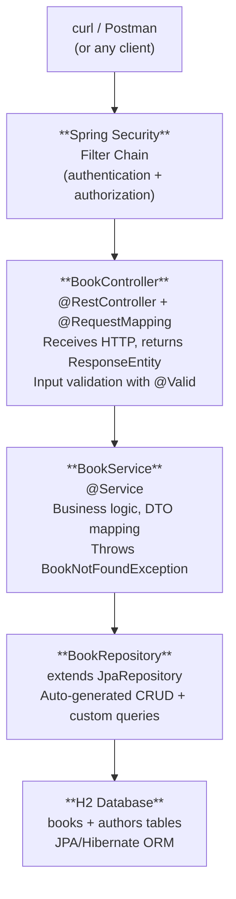

# Chapter 20: What's Next

> :hourglass_flowing_sand: Estimated time: 30 minutes

## You Did It. No, Really. Stop and Take This In.

Take a moment. Seriously. Close your terminal. Put down the coffee. Look at how far you've come in **7 days.**

```
Day 1: "What's HTTP?"
Day 7: You built a fully functional, tested, documented, secured REST API
       with database persistence, layered architecture, and deployment packaging.
```

That's not a small thing. That's the entire backend development stack, from zero to deployed. Most bootcamps take *weeks* to cover what you just did in a single week. You should feel good about this. Really good.

Here's your BookShelf application architecture -- the thing **you built**:



And all the supporting infrastructure you wired up along the way:
- **GlobalExceptionHandler** -- consistent error responses
- **Logging (SLF4J)** -- operational visibility
- **Actuator** -- health monitoring
- **Swagger/OpenAPI** -- API documentation
- **Profiles** -- dev/prod configuration
- **Tests** -- unit + integration

Remember Chapter 1, when you sketched a basic client-server diagram on paper and thought "Okay, I sort of get this"? Look at the diagram above. You now understand **every single box** in that architecture. Every arrow. Every annotation. That's not "sort of getting it." That's *knowing it.*

---

## :brain: Brain Power

> Pull up your Chapter 1 exercise -- the one where you sketched a client-server diagram. Hold it next to the architecture diagram above. How many of those boxes would have been meaningless jargon to you on Day 1? How many feel like old friends now?

---

## Everything You've Mastered (Yes, "Mastered")

Here's the full inventory. Every single one of these concepts lives in your brain now, backed by code you actually wrote.

| Concept | Chapter | What You Know |
|---------|---------|---------------|
| Client-Server | 1 | How computers talk over the internet |
| HTTP | 2 | The protocol (methods, status codes, headers) |
| Backend Role | 3 | The three jobs: receive, process, store |
| JSON & REST | 4 | Data format and API design conventions |
| Frameworks | 5 | Why they exist, IoC, Spring vs Spring Boot |
| Project Setup | 6 | Spring Initializr, Maven, project structure |
| Controllers | 7 | Request handling, routing, annotations |
| DI | 8 | Constructor injection, Spring container, beans |
| Request Lifecycle | 9 | Tomcat -> DispatcherServlet -> Controller -> Response |
| Layered Architecture | 10 | Controller -> Service -> Repository |
| DTOs | 11 | Separating API and database representations |
| JPA | 12 | ORM, entities, JpaRepository, H2 |
| Validation | 13 | Bean Validation, @ControllerAdvice |
| Relationships | 14 | @ManyToOne, @OneToMany, foreign keys |
| Configuration | 15 | Properties, profiles, environment variables |
| Testing | 16 | JUnit, Mockito, MockMvc |
| Logging & Docs | 17 | SLF4J, Actuator, Swagger |
| Security | 18 | Authentication, authorization, Spring Security |
| Deployment | 19 | Fat JAR, running standalone |

That's 19 concepts across 20 chapters. And not a single one of them is abstract theory floating in space -- every one is tied to real code in your BookShelf project.

---

## :speech_balloon: Overheard at the Coffee Shop

> **Junior Dev:** "So I finished this Spring Boot learning track, and now I'm staring at this massive list of things I still need to learn. Kubernetes, microservices, Kafka, reactive programming... I feel like I know nothing."
>
> **Senior Dev:** "You know what I felt after my first week of backend? Exactly the same. But here's the secret: every single one of those 'advanced' topics is just a variation on the patterns you already know. Controllers, services, repositories, request-response, configuration. The shapes change, the dance is the same."
>
> **Junior Dev:** "Really?"
>
> **Senior Dev:** "Really. Switching from H2 to PostgreSQL? You change two lines in a properties file. Docker? You write a 5-line file. JWT? It's a filter that sits in the same security chain you already built. None of it is a whole new world. It's the *same* world with new furniture."

---

## Where to Go from Here: Your Roadmap

Here's the thing about this roadmap: **none of these are mountains.** Each of these is a weekend project, not a mountain. You already have every foundational concept you need. What follows is just applying those concepts to new situations.

### Immediate Next Steps (Week 2-3)

#### 1. Real Database -- PostgreSQL

Swap out H2 for a real, persistent database. And here's the beautiful part -- remember how JPA abstracts away the database? Your *entire application code stays the same*. You literally just change `application.properties`:

```properties
spring.datasource.url=jdbc:postgresql://localhost:5432/bookshelf
spring.datasource.driver-class-name=org.postgresql.Driver
```

Add the PostgreSQL driver to `pom.xml`, remove H2. Done. Your whole application works with a production-grade database. That's the power of the abstractions you've been learning.

#### 2. Database Migrations -- Flyway or Liquibase

You know how `ddl-auto=create-drop` wipes your database every time you restart? That was fine for learning. In production, you use **Flyway** to manage database schema changes with version-controlled SQL scripts. Think of it as "git for your database schema."

#### 3. Docker

Containerize your application so it runs the same way on every machine. The basics are surprisingly approachable:
- Write a `Dockerfile` (it's about 5 lines)
- Build an image: `docker build -t bookshelf .`
- Run a container: `docker run -p 8080:8080 bookshelf`
- Use Docker Compose to run your app + PostgreSQL together

That last one is magic -- one command and your entire stack is running.

#### 4. JWT Authentication

Replace Basic Auth with JSON Web Tokens (JWT). Remember the security filter chain you built in Chapter 18? JWT fits right into that same chain. The flow:
1. Client sends username/password to `/auth/login`
2. Server returns a JWT token
3. Client includes the token in every subsequent request's `Authorization: Bearer <token>` header
4. Server validates the token without a database lookup

Same concepts, fancier tokens.

---

### :bulb: There Are No Dumb Questions

> **Q: Do I need to learn ALL of these?**
>
> A: Nope. Pick the ones that interest you or that your job requires. PostgreSQL and Docker are near-universal -- start there. The rest depends on where your career takes you.
>
> **Q: Should I learn these in order?**
>
> A: Roughly, yes. The "Immediate" ones build on each other naturally. But if you're dying to try Kafka before Docker, go for it. Curiosity is a better teacher than any syllabus.
>
> **Q: How long until I'm "senior"?**
>
> A: That's not a destination, it's a direction. But here's a concrete answer: if you build 2-3 real projects using the topics in this roadmap, you'll be having conversations that most developers with 2+ years can't. The gap between "I've heard of microservices" and "I've built one" is enormous, and you're on the building side now.
>
> **Q: What if I forget things from earlier chapters?**
>
> A: You will. That's normal. The knowledge isn't gone -- it's compressed. When you need it again (and you will), it'll come back fast. That's why we had you *write code*, not just read about it.

---

### Medium-Term (Month 2-3)

#### 5. Pagination and Sorting

Your `GET /api/books` returns ALL books. That worked fine with 5 test books. With 10,000? Your API grinds to a halt and your frontend cries. Spring Data has built-in pagination that's almost embarrassingly easy:

```java
Page<Book> findAll(Pageable pageable);

// Usage: GET /api/books?page=0&size=20&sort=title,asc
```

One method signature change and you've got paginated, sortable results. The framework does the heavy lifting -- sound familiar?

#### 6. File Uploads

Handle file uploads (book covers, user avatars) with `MultipartFile`. It's a new kind of request body, but the controller pattern is exactly what you already know.

#### 7. Caching

Cache frequently accessed data (like "all books" or "book by ID") with Spring Cache + Redis. The idea is simple: why hit the database for data that hasn't changed in the last 5 minutes? This dramatically reduces database load and speeds up responses.

#### 8. Asynchronous Processing

Not everything needs to happen during the request. Send a welcome email after user registration? Process a large CSV upload? Fire it off in the background with `@Async` or a message queue and return immediately. Your user doesn't need to wait.

#### 9. Message Queues -- Kafka / RabbitMQ

Instead of services calling each other directly (and waiting for responses), they drop messages into a queue. The receiving service picks them up when it's ready. This decouples services and gracefully handles traffic spikes. Think of it as a mailbox instead of a phone call.

### Long-Term (Month 3-6)

#### 10. Microservices Architecture

Instead of one big application, split into smaller services:
- Book Service
- Author Service
- User Service
- Notification Service

Each runs independently, communicates via REST or messaging. Spring Cloud provides tools for service discovery, configuration, and circuit breakers. This is where everything you've learned -- controllers, services, REST, configuration, security -- comes together at scale.

#### 11. Reactive Programming -- WebFlux

For high-concurrency scenarios (chat apps, streaming), Spring WebFlux uses non-blocking I/O. Instead of one thread per request (the model you've been using), a small number of threads handle many requests by never sitting idle. This is a different *programming model*, but the Spring patterns (controllers, services, annotations) remain familiar.

#### 12. Cloud Deployment

Deploy to a real cloud provider:
- **Kubernetes** -- container orchestration (managing lots of Docker containers)
- **AWS / Azure / GCP** -- managed services (databases, queues, storage as a service)
- **CI/CD** -- automated build and deploy pipelines (push code, it deploys itself)

This is where your `java -jar bookshelf.jar` from Chapter 19 evolves into a production deployment pipeline.

---

## :dart: Key Point

> The entire roadmap above is built on the same patterns you already know: controllers handle requests, services contain logic, repositories talk to databases, configuration adapts behavior, and tests prove it works. Every "advanced" topic is just a new ingredient in the same recipe. You already know how to cook.

---

## Learning Resources

### Official Documentation
- **Spring Boot Reference**: https://docs.spring.io/spring-boot/docs/current/reference/html/
- **Spring Data JPA**: https://docs.spring.io/spring-data/jpa/docs/current/reference/html/
- **Spring Security**: https://docs.spring.io/spring-security/reference/

### Tutorials
- **Baeldung** (https://www.baeldung.com) -- honestly the single best Spring Boot tutorial site on the internet. Whatever topic you pick from the roadmap, search "baeldung [topic]" first. They've covered everything.
- **Spring Guides** (https://spring.io/guides) -- official step-by-step guides for specific features. Great for weekend projects.

### Books
- *Spring Boot in Action* by Craig Walls -- a natural next step from where you are now
- *Spring in Action* by Craig Walls -- goes deeper into the Spring ecosystem when you're ready for it

### Practice Projects

Build these to solidify your skills. Each one targets specific concepts from the roadmap:

| Project | What You'll Practice |
|---------|---------------------|
| **Todo API** | CRUD basics, validation |
| **Blog API** | Relationships (posts, comments, users), pagination |
| **E-commerce API** | Complex relationships, transactions, business rules |
| **Chat API** | WebSockets, real-time messaging |
| **URL Shortener** | Unique ID generation, redirects, click tracking |

Complete all 50 exercises in [Appendix E](../../appendices/E-coding-exercises.md) to solidify your skills.

---

## :brain: Brain Power

> If you could only build ONE project from the table above as your portfolio piece, which would you pick and why? What would the API endpoints look like? Sketch out the entities and their relationships. You've done this before -- Chapter 14, remember?

---

## Final Exercise: Review Your Journey

### Task

This is your last exercise. Make it count.

1. **Trace a complete request flow.** Open your BookShelf project. Pick `POST /api/books` with a valid body. Trace it all the way from the curl command through Security -> Controller -> Service -> Repository -> Database -> and back. Touch every file in the chain. Read every annotation. You built all of this.

2. **Draw the architecture diagram from memory.** No peeking at the top of this chapter. Then compare. How close did you get?

3. **List three things you'd change for production.** Look at your code with fresh eyes. What would need to change before this goes live? (Hints: the database, the authentication, the pagination...)

4. **Pick your next project.** Choose one from the "Practice Projects" table above and sketch its API design -- endpoints, entities, relationships -- on paper. Don't code it yet. Just design it. You'll be surprised how naturally it flows out of you now.

---

## :speech_balloon: Overheard at the Coffee Shop (One Last Time)

> **New Developer (that's you, a week ago):** "I want to build backend applications but I don't even know where to start."
>
> **You (right now):** "Start with HTTP. Then REST. Then a controller. Then inject a service. Add a database. Validate your inputs. Handle your errors. Write your tests. Secure your endpoints. Package it up. Ship it."
>
> **New Developer:** "That sounds like a lot..."
>
> **You:** "It's 20 chapters. Trust me, you've got this."

---

## Key Takeaways

Check these off. You've *earned* every single one.

- [ ] I built a complete Spring Boot REST API from scratch
- [ ] I understand client-server architecture, HTTP, and REST
- [ ] I can create controllers, services, and repositories with proper layering
- [ ] I can model entities, relationships, and DTOs
- [ ] I can validate input, handle errors, and return meaningful responses
- [ ] I can test my code with unit and integration tests
- [ ] I can configure my application for different environments
- [ ] I can secure endpoints with Spring Security
- [ ] I can package and run my application as a standalone JAR
- [ ] I know what to learn next and have a roadmap

---

## Day 7 Summary -- and the Entire Week

```
Week 1 Complete!

Day 1: Internet fundamentals — HTTP, DNS, client-server
Day 2: JSON, REST API design, first Spring Boot app running
Day 3: Controllers, DI, request lifecycle — BookShelf v1
Day 4: Layered architecture, DTOs, database with JPA — BookShelf v3
Day 5: Validation, error handling, relationships, config — BookShelf v4
Day 6: Testing, logging, Swagger, Spring Security — BookShelf v5
Day 7: Deployment, packaging, and roadmap for the future

You're no longer a beginner. You're a backend developer who knows the fundamentals.
Everything from here builds on what you've learned this week.
```

---

## :dart: Key Point

> Seven days ago, you didn't know what HTTP stood for. Now you've built, tested, secured, documented, and deployed a full REST API. That's not "progress." That's a transformation.

---

*Congratulations. Seriously. Now go build something.*

*And when you get stuck (you will), come back to these chapters. They'll feel different the second time -- shorter, clearer, more like reminders than lessons. That's how you'll know the knowledge is yours.*
